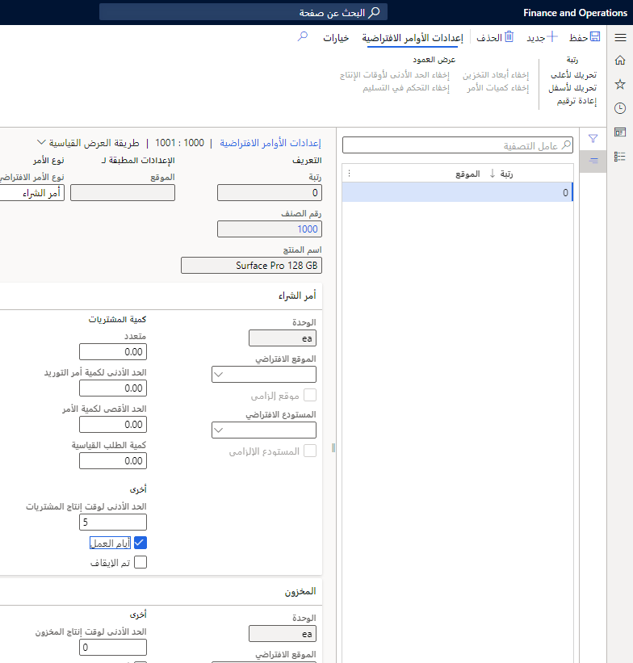

يمكن أن تساعدك إعدادات الأوامر في إعداد الإعدادات الافتراضية لاستخدامها في المبيعات والمشتريات وحركات المخزون. يستخدم التخطيط الرئيسي هذه الإعدادات لإنشاء أوامر المبيعات وأوامر الشراء وأوامر المخزون. 

تُستخدم الإعدادات أيضاً عند إنشاء أمر يدوياً. 

تشمل الإعدادات الرئيسية المجالات التالية:

- تحديد مستودع لاستخدامه لكل وحدة عند إنشاء الأوامر
- تحديد الإعدادات التي تعدل كميات الأمر لكل وحدة عند إنشاء الأوامر

علامة التبويب **إدارة معلومات المنتج > المنتجات > المنتجات الصادرة >  إدارة المخزون**، مجموعة **إعدادات الأوامر**، **إعدادات الأوامر الافتراضية**

يُستخدم خيار **أيام العمل** لاسترداد وقت معالجة الوصول في صفحة **نظرة عامة على الوصول**.

