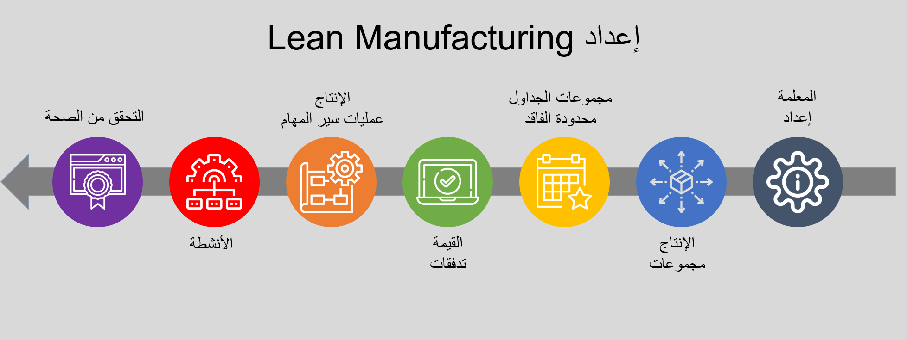
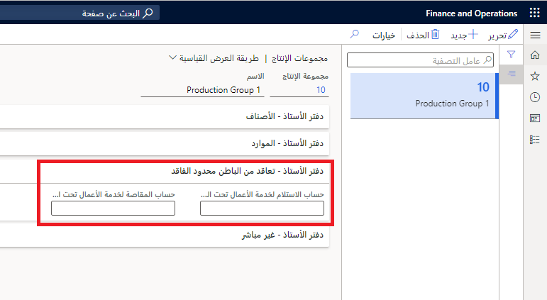
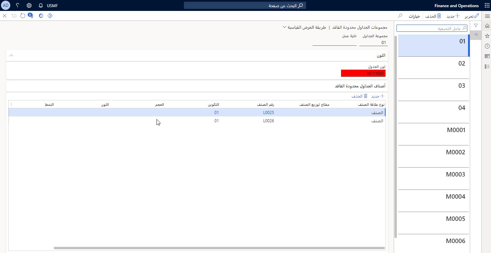

هناك العديد من المكونات التي يجب إعدادها لاستخدام lean manufacturing في Supply Chain Management. ستناقش هذه الوحدة المكونات ووظائفها في lean manufacturing. 

# محددات Lean manufacturing

انتقل إلى **التحكم بالإنتاج > إعداد > محددات التحكم في الإنتاج** وحدد علامة التبويب **Lean manufacturing**.

في الحقل **إرشادات الإنتاج**، يمكنك تحديد نوع المستند المستخدم لإرشادات الإنتاج التي يتم عرضها على لوحة كانبان.
 
## تكلفة تدفق الإنتاج

يعطل Lean manufacturing مفاهيم التكلفة التقليدية لتكلفة الوظيفة لأن سياق أمر الإنتاج غير متوفر.
يستخدم Lean manufacturing لـ Supply Chain Management تدفق الإنتاج كمُراكم للتكلفة.

يتم تعقب تكلفة المواد والمنتجات شبه المنتهية والمنتجات المنتهية لكل صنف ومجموعة تكلفة. يتم تعقب العمل قيد التنفيذ (WIP) لكل تدفق إنتاج.

لإعداد حسابات WIP للتعاقد من الباطن، انتقل إلى **التحكم بالإنتاج > إعداد > الإنتاج > مجموعات الإنتاج**، وقم بتوسيع الخيار **دفتر الأستاذ - تعاقد من الباطن محدود الفاقد**، ثم قم بتعيين حسابات دفتر الأستاذ.

تحدد مجموعة الإنتاج مجموعة الحسابات المستخدمة للترحيلات المالية المرتبطة بتدفق الإنتاج. أهم الحسابات هي حسابات WIP والحسابات المقابلة، والتي تعد أساس حساب الفروق لتدفق الإنتاج.

## مجموعة الجداول محدودة الفاقد

يتم تحديد مجموعات الجداول محدودة الفاقد لتجميع المنتجات وتمييزها في جدولة كانبان. يمكن إجراء التجميع كاقتران عام لكل شركة أو يمكن أن يكون محدداً لخلية عمل. تحتوي كل مجموعة على رمز لون معين للإشارة المرئية في صفحة قائمة جدولة كانبان.

انتقل إلى **إدارة معلومات المنتج > Lean manufacturing > مجموعات الجداول محدودة الفاقد** لإنشاء مجموعة الجداول ثم تعيين لون وإضافة أصناف الجداول محدودة الفاقد لعرض بطاقات كانبان للأصناف المعينة بألوان مختلفة من أجل رؤية أفضل.

