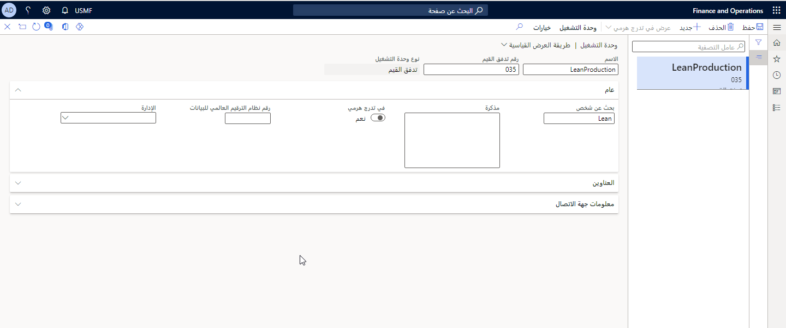
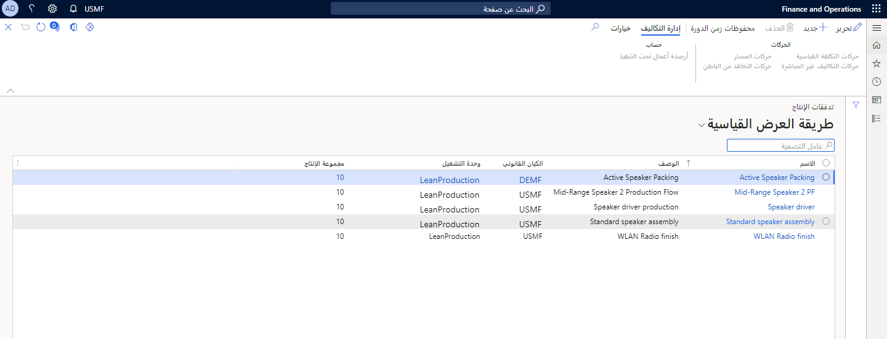

توضح هذه الوحدة كيفية إنشاء تدفقات قيم ونماذج تدفق الإنتاج في Supply Chain Management.

## تدفق القيم

يُعرف تدفق القيم بأنه تسلسل للعمليات بدء من المادة الخام ووصولاً إلى العميل النهائي أو من مفهوم المنتج حتى الطرح في السوق. يجب أن يتضمن دفق القيم سلسلة التوريد الكاملة.

في Supply Chain Management، يتم تمثيل تدفق القيم بواسطة تدفق إنتاج واحد أو عدة تدفقات. كما يتم تمثيله أيضاً كوحدة تشغيل في التدرج الهرمي للمؤسسات الخاص بالمؤسسة. يجب تحليل تدفق القيم لاستبعاد أي أنشطة إضافة بدون قيمة.

**التحكم بالإنتاج > الإعداد > تدفق الإنتاج محدود الفاقد > تدفقات القيم**.

يشير تعيين تدفق القيم إلى عملية تعريف وتخطيط تدفقات المعلومات والعمليات والعناصر الفعلية عبر سلسلة التوريد بالكامل، بدء من مورد المادة الخام وانتهاءً بحيازة العميل.

عند الأخذ في الاعتبار تنفيذ التصنيع محدود الفاقد (lean manufacturing) في Supply Chain Management، يجب بدء العمل الأولي بتعريف تدفقات القيم وتعيينها ثم إعدادها في نهاية المطاف.

ويتم تكوين تدفق القيم كوحدة تشغيل، ما يسمح لك باستخدامها كبُعد مالي. يمكن تواجد العديد من تدفقات الإنتاج لشركة تستخدم وحدة التشغيل هذه لكل شركة.

## تدفقات الإنتاج

يعتبر سيناريو lean manufacturing أكثر من مجرد تراكم لقواعد كانبان أو سياسات توريد المواد غير المرتبطة. يمكن وصف تدفق المواد والمنتجات في جميع أنحاء خلايا العمل والمواقع لسيناريو إنتاج أو توريد معين على أنه تسلسل أو شبكة صغيرة من أنشطة المعالجة أو التحويل تسمى تدفق الإنتاج.

ويمكن بعد ذلك تصميم ناتج عملية التعيين، وتدفق قيم الحالة المستقبلية، في Supply Chain Management كإصدار تدفق إنتاج.

كما يتم تصميم كافة عمليات تدفق القيم كأنشطة معالجة.
ويمكن تصميم الحركات أو التحويلات كأنشطة تحويل إذا كان يجب تسجيل حالة التحويل أو كان من المطلوب تكامل انتقاء المخزون أو الشحنات الموحدة.

يمكن أن تتكون العديد من تدفقات الإنتاج من تدفق القيم. يمكن أن ينتج تدفق الإنتاج منتجات للعملاء أو تدفقات إنتاج أخرى. في الحالة التي يتم فيها استخدام منتجات تدفق إنتاج في تدفق آخر، فإنه يتم تسميته *تدفق التغذية*.

تعتبر تدفقات الإنتاج أساساً لعملية lean manufacturing نظراً لأنها تقوم بتنفيذ المهام التالية:

-   تحديد أنشطة المعالجة والتحويل لتدفق القيم.

-   دعم قواعد كانبان في تعريف الأنشطة التي يمر بها كانبان.

-   توفير سياق مستند إلى نشاط لعمليات التخطيط والإنتاج.

-   إنشاء سياق تكلفة لسيناريوهات متعددة لإنتاج كانبان.

لدعم التحسين المستمر، يتم تنفيذ تدفقات الإنتاج في إصدارات لها وقت سريان معين. يسمح لك هذا التنفيذ بنسخ إصدار تدفق الإنتاج الموجود، بما في ذلك كافة قواعد كانبان المرتبطة، إلى إصدار مسودة من تدفق الإنتاج، ثم تصميم تدفق الإنتاج الخاص بالحالة المستقبلية قبل التحقق من صحة الإنتاج وتنشيطه.

## نموذج تدفق الإنتاج

يحدد نموذج تدفق الإنتاج مسبقاً التقويم واستخدام القدرة لمجموعة من خلايا العمل وللإعدادات التفصيلية في عمليات تدفق الإنتاج. كما يحدد مسبقاً بنية جدول كانبان للخلايا وسلوكه.

يجب تحديد نموذج تدفق إنتاج فريد لفئة من خلايا العمل التي لها سلوك مشابه. يمكن إنشاء نموذج تدفق إنتاج في **التحكم في الإنتاج > الإعداد > تدفق الإنتاج محدود الفاقد > نماذج تدفق الإنتاج**.

يجب مراعاة الأوجه التالية عند إنشاء **نموذج تدفق إنتاج** جديد:

-   يمكن أن يكون حقل **نوع النموذج** إما **إنتاجية العامل** أو **الساعات**.

-   يحدد حقل **دورة EPE بالأيام** الدورة الخاصة بـ Every Product Every (EPE) المستخدمة في التخطيط التلقائي. يتم استخدام القيمة الموجودة في هذا الحقل لحساب الفترة عند جدولة وظيفة كانبان: *تاريخ البدء = التاريخ الاستحقاق - دورة EPE*. بعد إنشاء نموذج تدفق الإنتاج، يمكنك تغيير قيمة هذا الحقل. لا يؤثر التغيير على المهام التي تم إنشاؤها.

-   يمكن تعيين حقل **نوع فترة التخطيط**،إلى.

    -   **يوم** - يتكون جدول كانبان من فترات من أيام التقويم؛ وتعرض لوحة جدول كانبان الأيام لكل عمود.

    -   **أسبوع** - يتكون جدول كانبان من فترات من أسابيع؛ وتعرض لوحة جدول الأسابيع الأيام لكل عمود.

-   يحدد حقل **الحد الزمني للتخطيط** الفترات الزمنية للتخطيط، والتي يمكن أن تكون أما أيام أو أسابيع. تعرض لوحة جدولة كانبان وظائف كانبان المجدولة أثناء الحد الزمني للتخطيط الذي تم تحديده.

-   يمكن تعيين **رد فعل نقص القدرة** إلى أي من القيم التالية:

    -   **تأجيل**

    -   **إلغاء**

    -   **إضافة إلى فترة الطلب**

    -   **توزيع**

## نوع النموذج

الخاصية الأكثر أهمية لنموذج تدفق الإنتاج هي نوع النموذج، والذي يحدد طريقة قياس القدرة لخلية العمل.

يحدد نموذج تدفق الإنتاج إعدادات القدرة الخاصة بخلية العمل ويحتوي على الخيارات التالية:

- **إنتاجية العامل** - تُقاس القدرة الإنتاجية وحمل خلية العمل بكميات المنتج التي يتم إنتاجها.

- **الساعات** - يتم قياس القدرة الإنتاجية لخلية العمل بفترات تتكون من ساعات ودقائق. بعد إنشاء نموذج تدفق الإنتاج، لا يمكنك تغيير قيمة هذا الحقل.

## دورة Every Product Every (EPE) بالأيام

يحدد EPE عدد الأيام داخل دورة EPE التي يتم استخدامها في التخطيط التلقائي. يتم استخدام القيمة الموجودة في حقل EPE لحساب الفترة عند جدولة وظيفة كانبان: `Start date = Due date - EPE cycle`.

بعد إنشاء نموذج تدفق الإنتاج، يمكنك تغيير قيمة هذا الحقل. لا يؤثر التغيير على المهام التي تم إنشاؤها في السابق.

## الاستجابة للعجز في القدرة الإنتاجية

يحدد **رد فعل نقص القدرة** طريقة جدولة كانبان المطلوب استخدامها إذا لم تتوفر القدرة أثناء الفترة المطلوبة.
تُستخدم هذه المعلمة فقط عند استخدام التخطيط التلقائي لكانبان لمهام العملية. والخيارات الخاصة بهذه المعلمة هي كالتالي:

-   **تأجيل** - يتم تأجيل الوظيفة حتى يوم توفر الإنتاجية.

-   **إلغاء** - تم إلغاء التخطيط التلقائي لوظيفة كانبان.

-   **إضافة إلى فترة الطلب** - تتم إضافة الوظيفة إلى الفترة المجدولة للتاريخ المطلوب. وتكون النتيجة هي زيادة تحميل خلية العمل خلال الفترة المجدولة.

-   **توزيع** -يتم توزيع بطاقات كانبان لحدث واحد على فترات الإنتاج المتاحة، بدءاً من أول فترة متاحة.

## نوع فترة التخطيط

تُستخدم فترة التخطيط للتخطيط التلقائي لطرق كانبان واستخدام لوحة جداول كانبان. والخيارات الخاصة بفترة التخطيط هي كالتالي:

-   **يوم** - يتكون جدول كانبان من فترات من أيام التقويم.
    تعرض لوحة جدول كانبان الأيام الخاصة بكل عمود للجدولة.

-   **أسبوع** - يتكون جدول كانبان من فترات من أسابيع. تعرض لوحة جدول كانبان الأسابيع الخاصة بكل عمود للجدولة.

## الحد الزمني للتخطيط

يحدد الحد الزمني للتخطيط عدد فترات التخطيط التي تم تحديدها في نوع فترة التخطيط التي يمكنك استخدامها في الحد الزمني للتخطيط.

يمكن أن تكون فترات التخطيط بالأيام أو الأسابيع. تعرض لوحة جدولة كانبان وظائف كانبان المجدولة أثناء الحد الزمني المحدد للتخطيط. يمكن جدولة بطاقات كانبان فقط في هذا الحد الزمني للتخطيط.

## تدفق الإنتاج البسيط

يُعد النموذج الأكثر بساطة لسيناريو إنتاج للتصنيع بدون فاقد (lean manufacturing) تدفق الإنتاج حيث جميع العمليات مجمّعة في نشاط عملية واحدة في خلية عمل واحدة.

### السيناريو

لقد قمت بإعداد تدفق إنتاج لتصميم عملية تغطية الطلاء. يلتقط متجر طلاء غطاء السماعات الأغطية غير المطلية من المستودع. يتم توريد الأغطية المطلية إلى السوبر ماركت حيث يمكن انتقاؤها لعمليات التصنيع الأخرى أو للمبيعات.

يتم إعداد تدفق الإنتاج للنشاط العام "الطلاء"، بغض النظر عن متغير الصنف أو اللون أو عملية الطلاء الخاصة التي يتم تطبيقها، بشرط أن يحدث في نفس مجموعة الموارد في نفس الموقع الفعلي. يتم أولا تعيين أوقات النشاط وأوقات الدورة لنشاط تدفق الإنتاج لعملية متوسطة.

يتم بعد ذلك إنشاء قاعدة كانبان ذات كمية ثابتة لنشاط عملية "الطلاء"، الذي يدير إشارة كانبان لأغطية السماعات المطلية التي تزود سوبر ماركت أغطية السماعات المطلية.

## تدفق الإنتاج عالي المستوى

يُظهر تدفق الإنتاج عالي المستوى التداخل بين الأنشطة وبطاقات كانبان.

للمساعدة في توضيح تدفق الإنتاج عالي المستوى، يتضمن المثال التالي متطلب أعمال معقد يتكون من سيناريوهات مختلفة في ترتيب تسلسلي.

### السيناريو 1: تزويد المستودع الذي يعالج المهام

قمت بإعداد تدفق إنتاج وقواعد كانبان لشركة **USMF** لتصميم عملية تجميع سماعات السيارات التي سيتم بيعها إلى العميل وتعبئتها.

بدءً من عملية سحب العميل، يتم تقسيم العناصر المتنوعة الخاصة بتدفق الإنتاج إلى نشاط تعبئة ونشاط التحويل إلى المستودع. بالتالي، تقوم شركة **USMF** بتزويد المستودع الذي يتم فيه تعبئة المواد وتحويلها إلى العميل.

يتحكم نشاط العملية في التعبئة بينما يتحكم نشاط التحويل في عملية التحويل إلى المستودع. يتم استخدام كانبان لحدث المبيعات لتشغيل كانبان يستند إلى طلب أمر المبيعات ثم يقوم بسحب البضائع المنتهية من خلال عملية التعبئة إلى المستودع التي تقوم بتشغيل الوظائف.

### السيناريو 2: تزويد مستودع المبيعات

يتحكم نشاط العملية في التعبئة، بينما يتحكم نشاط التحويل في عملية التحويل إلى مستودع المبيعات. يتم استخدام كانبان مجدول لتشغيل كانبان يستند إلى الطلب ثم يقوم بسحب البضائع المنتهية من خلال عملية التعبئة إلى مستودع المبيعات.

### السيناريو 3: تزويد مواد التعبئة

تتطلب عملية التعبئة مواد تعبئة يتم تخزينها في مستودع آخر ليتم استخدامها في العملية. يقوم نشاط النقل بنقل أجزاء التعبئة من مستودع مواد التعبئة إلى خلية عمل التعبئة. يتم استخدام كانبان سحب بكمية ثابتة للتحكم في هذه الحركة.

### السيناريو 4: أنشطة التجميع والتعبئة

يتحكم نشاط العملية في عملية تجميع سماعات السيارات والتي يتم تنفيذها قبل عملية التعبئة. يتم استخدام كانبان لحدث بند المبيعات لتشغيل كانبان يستند إلى طلب المبيعات بالمستوى الأعلى لإجراء التجميع.

### السيناريو 5: تزويد الأجزاء الميكانيكية

تتطلب عملية تجميع سماعة السيارة أجزاء ميكانيكية يتم تخزينها في مستودع آخر ليتم استخدامها في العملية. يقوم نشاط النقل بنقل أجزاء التعبئة من مستودع الأجزاء الميكانيكية إلى خلية عمل تجميع سماعة السيارة. يتم استخدام كانبان سحب بكمية ثابتة للتحكم في هذه الحركة.

### السيناريو 6: تجميع الكهرباء والسماعة

تقوم عملية التجميع الكهربائي بتزويد السوبر ماركت في الأعمال تحت التنفيذ لأجل عملية تجميع سماعة السيارة. لا يتم ترحيل الأجزاء في المخزون. يقوم كانبان تصنيع بكمية ثابتة بتزويد السوبر ماركت بهذه الأجزاء الميكانيكية المجمعة مسبقاً. تقوم عملية تجميع سماعة السيارة بترحيل هذه المادة إلى الأعمال تحت التنفيذ. 
