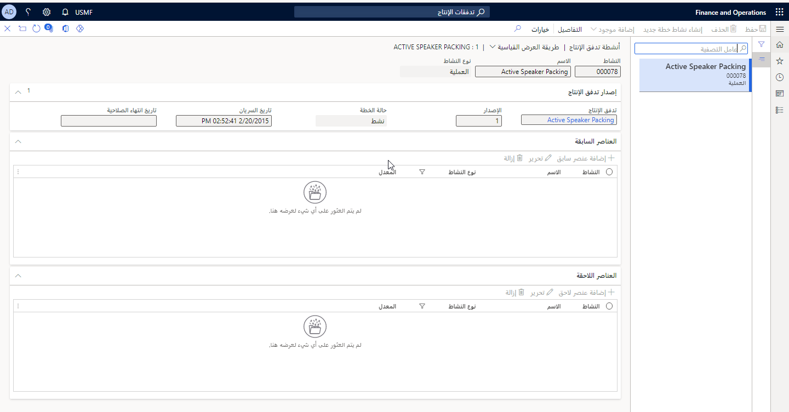
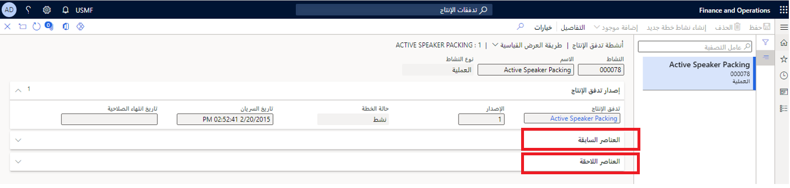

تصف هذه الوحدة المكونات التي يجب إعدادها لتدفقات الإنتاج للتصنيع الخالي من الهدر في Supply Chain Management. 

## الأنشطة

يتكون تدفق الإنتاج من نشاط واحد أو أكثر. سيعرّف النشاط المتطلبات التفصيلية لوظيفة كانبان. تجدر الإشارة إلى أنه يتعين على النشاط أن يصف بدقة شروط الإنتاج الفعلي والحدود الدنيا لوقت الإنتاج. لإعداد الأنشطة على سير إجراءات عمل، افتح صحفة **تدفقات الإنتاج**، وحدد سير عمل موجود أو أنشئ سير عمل جديداً، ثم على علامة التبويب السريعة **الإصدارات**، حدد زر **الأنشطة**. 

### تدفق الإنتاج من نشاط عملية واحدة

يُعد تدفق الإنتاج حيث جميع العمليات مجمّعة في نشاط عملية واحدة في خلية عمل واحدة النموذج الأكثر بساطة لسيناريو إنتاج للتصنيع الخالي من الهدر. تحتوي بيانات العرض التوضيحي لـ Supply Chain Management على مثال عن هذا النوع من تدفق الإنتاج.

### إنشاء نشاط عملية

بعد إنشاء إصدار تدفق الإنتاج، يمكنك تعريف الأنشطة الخاصة بتدفق الإنتاج. وتقترن الأنشطة عادةً بالإصدار الذي تم إنشاؤها له.

تتم عملية إنشاء نشاط تدفق الإنتاج باستخدام معالج النشاط. وتظهر صفحات المعالج المختلفة بالاستناد إلى الإعدادات المحددة.

تُضاف جميع أنواع أوقات الأنشطة لحساب وقت الإنتاجية الخاص بالنشاط. وبالاستناد إلى تاريخ استحقاق وظيفة كانبان، يتم استخدام وقت الإنتاج لتحديد وقت إصدار المواد. تؤخذ في الاعتبار أوقات قوائم الانتظار فقط عند الجدولة، وليس عند حساب التكلفة.

فيما يتعلق بتدفق إنتاج من نشاط واحد، لا حاجة إلى إكمال تفاعلات إضافية. ومع إنشاء النشاط، من الممكن الآن إنشاء قواعد كانبان تستخدم نشاط العملية الواحدة هذا. ومع ذلك، يجب تنشيط إصدار تدفق الإنتاج لإنشاء وظائف كانبان.

### علاقات الأنشطة

إذا كان لدى إصدار تدفق الإنتاج أكثر من نشاط واحد، فيجب تعريف تسلسل الأنشطة في إصدار تدفق الإنتاج وبنيتها قبل تنشيط إصدار تدفق الإنتاج. يتم هذا التعريف من خلال إضافة علاقات الأنشطة.

### الأنشطة السابقة واللاحقة

ترتبط الأنشطة والعمليات والتحويلات ببعضها في تدفق الإنتاج نفسه باستخدام الأنشطة السابقة واللاحقة لتعريف علاقات الأنشطة بينهما.

سيكون لدى تدفقات الإنتاج أنشطة سابقة ولاحقة معرّفة عند وجود نشاط واحد فقط في التدفق. الأنشطة السابقة هي الأنشطة الأولى التي تم تعريفها للنشاط المحدد. وبإمكان علاقات الأنشطة التي تم تكوينها لهذه الأنشطة أن تتضمن قيود تسلسل.

الأنشطة اللاحقة هي الأنشطة النهائية التي تم تعريفها للنشاط المحدد. وبإمكان علاقات الأنشطة التي تم تكوينها لهذه الأنشطة أن تتضمن أيضاً قيود تسلسل.

عند تعريف الأنشطة السابقة واللاحقة، تحتاج فقط إلى تعريف النشاط السابق أو اللاحق. بعد تعريف نشاط سابق لنشاط ما، يتم بشكل تلقائي تعريف النشاط النهائي اللاحق لهذه الخطوة. إذا تم تعريف النشاط اللاحق أولاً، فسيتم تلقائياً تعريف النشاط الأولي السابق.

## عمليات التحقق من الصحة

قبل أن يصبح من الممكن إنشاء وظائف كانبان لأنشطة إصدار تدفق الإنتاج، يجب تنشيط الإصدار. يبدأ التنشيط عملية التحقق من الصحة وينشّط إصدار تدفق الإنتاج إذا لم يتم العثور على أخطاء.

تتحقق عملية التحقق الصحة من تناسق الأنشطة وقواعد كانبان الخاصة بإصدار تدفق الإنتاج. يمكن تنفيذ عملية التحقق من الصحة في أي حالة قبل التنشيط أو بعده. فيما يتعلق بتدفق الإنتاج من نشاط واحد، لا تُعد عملية التحقق من الصحة شديدة الأهمية بسبب وجود نشاط عملية واحدة فقط وعدم وجود أنشطة اتصال للتحقق من صحتها.

مع أي تدفق إنتاج، ستتأكد عملية التحقق من الصحة من تحديد النشاطين الأول والأخير في تدفق الإنتاج كي يتم تنشيط **تحديث المخزون الفعلي** عند الانتقاء أو الاستلام. يحدث هذا التنشيط لأنه يجب ترحيل استهلاك المواد وتوريد المنتجات لتدفق الإنتاج إلى المخزون، كما هو الحال في أمر الإنتاج. وبالتالي، يجب تنشيط **تحديث المخزون الفعلي** في تدفق الإنتاج من نشاط واحد عليهما معاً.

يمكنك إضافة علاقات الأنشطة أو إزالتها فقط على إصدارات تدفق الإنتاج التي لم يتم تنشيطها في وقت سابق.
