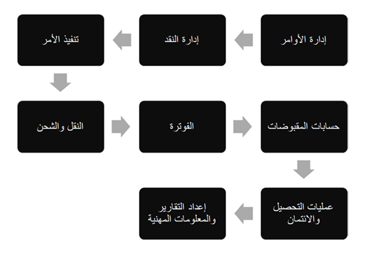

يدير أمر معالجة النقد دورة حياة عملية المبيعات، والتي تتكون من العمليات الفرعية لاستلام مبيعات العملاء ومعالجتها.

 
في أمر معالجة النقد، تتلقى المؤسسة الأوامر من خلال طرق مختلفة، مثل موقع الويب والبريد الإلكتروني وتبادل البيانات الإلكتروني (EDI) والهاتف والمزيد. يتم تنفيذ الأوامر من خلال الخدمات اللوجستية ومن ثم قد يتم حجز العناصر قبل التقاطها وتعبئتها بعد التقاطها وشحنها إلى العملاء.

قد تتطلب بعض المؤسسات اتفاقيات مبيعات تعاقدية لضمان الوفاء بالالتزامات قبل قبول أوامر المبيعات ومعالجتها. لمزيد من المعلومات حول الاتفاقيات، راجع [تكوين الاتفاقيات واستخدامها في Dynamics 365 Supply Chain Management](/training/modules/configure-use-agreements-dyn365-supply-chain-mgmt/?azure-portal=true).

عادةً ما تقوم إدارة الحسابات المدينة بإصدار فاتورة الأمر وإرسالها إلى العميل.

بعد إرسال الفاتورة، تكون إدارات الحسابات المدينة والتحصيل مسؤولة عن ضمان استلام الأموال من العملاء وتسويتها مقابل فواتيرهم المقابلة.

لمزيد من المعلومات حول الحسابات المدينة وعمليات التحصيل، يرجى الرجوع إلى الوحدات النمطية التالية:

-   [تنفيذ الإجراءات اليومية لالحسابات المدينة في Dynamics 365 Finance](/training/modules/accounts-receivable-daily-procedures-dyn365-finance/?azure-portal=true)

-   [تكوين الائتمان والتحصيلات في Dynamics 365 Finance](/training/modules/configure-credit-collections-dyn365-finance/?azure-portal=true)

هناك عملية أخرى تحدث في سيناريو أمر معالجة النقد وهي تنفيذ الأمر. تضمن هذه العملية أن الشركة لديها المنتجات والخدمات التي يمكن شحنها إلى العميل.

في مؤسسة كبيرة، يقوم المخطط بتشغيل التخطيط الرئيسي لإنشاء أوامر الشراء أو التحويل أو الإنتاج المخطط لها لتلبية الطلبات من العملاء.

عند توفر المنتجات، تبدأ عملية التوزيع الفرعية.
هذه العملية مسؤولة عن الشحن والخدمات اللوجستية لضمان انتقاء المنتجات وتعبئتها بشكل صحيح وشحنها على الفور إلى العملاء.

يمكن أن تشارك العمليات الفرعية الأخرى في سيناريو أمر معالجة النقد، مثل التحقق من حد الائتمان للعميل قبل معالجة الأمر. في حالة حدوث أي مشكلات، يمكن لمندوب المبيعات وضع الأمر قيد الانتظار لسبب محدد مثل حد الائتمان والمشكلات المتعلقة بعمليات التحصيل والمزيد.

توضح قائمة المهام التالية الأمر النموذجي للأنشطة النقدية:

-   عروض أسعار المبيعات (اختياري)

-   أوامر المبيعات

-   الخدمات اللوجستية والشحن

-   فاتورة أمر المبيعات

-   التحصيل

-   استلام الأموال

تركز هذه الوحدة النمطية علي المهام التالية:

-   إدخال أمر المبيعات

-   إدارة عمليات تعليق الأمر

-   إدارة العمولات لمندوبي المبيعات

-   بدء عملية الانتقاء

-   التحقق من اكتمال الشحن

-   إنشاء الفواتير

-   عملية تدفق عكسي

    -   إدارة مرتجعات العميل

    -   إصدار إشعارات الدائن

    -   استرداد أموال العميل
