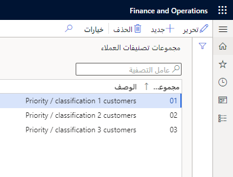
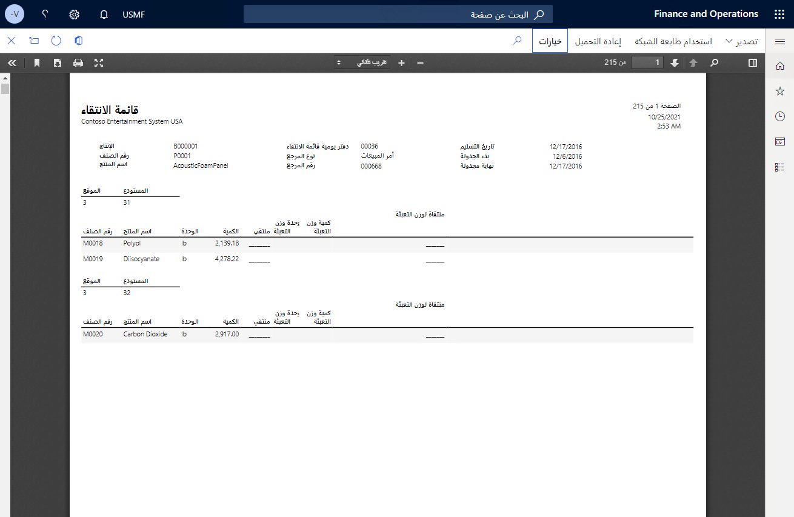

تستند عمليات الانتقاء التي تم تناولها في هذه الوحدة النمطية إلى الإصدار الأبسط من عملية معالجة المستودعات.

فيما يلي الإعدادات التي تؤثر على كيفية تنفيذ عملية الانتقاء: 

-   **مجموعات الأبعاد** - إعداد متطلبات أبعاد المنتجات والتخزين والتعقب للانتقاء.

-   **مجموعة نماذج الصنف** - التحكم في متطلبات التسجيل.

-   **معلمات إعداد الحسابات المدينة** - إعداد الحركات للانتقاء التلقائي.

يمكنك تعيين إعدادات "مجموعة نماذج الصنف" والمحافظة عليها باستخدام الحقول في مجموعة حقول **التحديث الفعلي** لتحديد سير العمل الذي يجب استخدامه عند إرسال الأصناف أو استلامها. باستخدام هذه الحقول، يمكنك تعيين قواعد حول كيفية معالجة أحد الأوامر للاستلام والشحن.

على الرغم من أن تحديد إعدادات هذه الحقول يتم عادةً بواسطة مدراء أقسام آخرين لتعيين سياسات المخزون، إلا أن فهم تأثير هذه الإعدادات يُعد مفيداً لقسم المبيعات.

عند شحن أحد الأصناف، يمكنك استخدام المعلمات التالية في صفحة **مجموعات نماذج الصنف**:

-   **متطلبات الانتقاء** - لتحديد ما إذا كان يجب أن تكون سجلات مخزون الصنف بالحالة **منتقاة‬‏‫‬‏‫** قبل أن يكون تحديث إيصال التعبئة فعلياً أو ترحيل دفتر يومية المخزون ممكناً. عند تحديد هذه المعلمة، يجب ترحيل تسجيل قائمة الانتقاء يدوياً.

-   **متطلبات الخصم** - يشير هذا الخيار إلى وجوب تحديث خصومات الأصناف فعلياً قبل تحديثها مالياً.

يمكن انتقاء أصناف ذات قيم أبعاد معينة على الرغم من مسح خانة الاختيار **متطلبات الانتقاء**.

في صفحة **معلمات الحسابات المدينة‏‎**، يمكنك إعداد حركات للانتقاء التلقائي من وقت الإصدار وصولاً إلى وقت الانتقاء. للوصول إلى صفحة **معلمات الحسابات المدينة**، انتقل إلى **الحسابات المدينة > إعداد**.

تتضمن علامة تبويب **التحديثات** الحقول التالية:

-   **استخدام اللغة الافتراضية** - استخدم كود اللغة الافتراضية من معلومات شركتك الخاصة عندما تطبع قائمة الانتقاء. إذا لم تكن خانة الاختيار هذه محددة، فإن اللغة على قائمة الانتقاء هي لغة العميل. ومع ذلك، يتم استخدام لغة الشركة الافتراضية في حال عدم وجود ترجمة للغة العميل.

-   **خصم تلقائي، قائمة الانتقاء** - حدد هذا الخيار لتقليل الكمية على قائمة الانتقاء بحيث تتطابق مع الكمية المتوفرة إذا لم تكن الكمية الكاملة متوفرة في المخزون. وبهذه الطريقة، لا يتم إنشاء قائمة انتقاء للأصناف غير الموجودة في المخزون. لكي يعمل هذا الأسلوب، يجب إنشاء قائمة الانتقاء من رأس الأمر عن طريق تحديد الزر **ترحيل** بدلاً من إنشاء القائمة مباشرةً من البند. إذا كانت خانة الاختيار **مكتمل‬‬** على بند أمر المبيعات على علامة التبويب السريعة **تفاصيل البند** على علامة التبويب **عام** محددة، فستظهر رسالة خطأ، وستُطالب بإكمال الأمر الكامل بدلاً من جزء منه فقط.

-   **حالة مسار الانتقاء** - حدد **مكتمل** في الحقل **حالة مسار الانتقاء** كي يقوم النظام تلقائياً بتعيين حركات المخزون إلى **منتقاة** عند تحديث قائمة الانتقاء. يمكنك تحديد **مكتمل**، على سبيل المثال، عندما تكون الأصناف المُباعة متوفرة دائماً في المخزون وبالتالي لا تحتاج إلى استجابة لعملية الانتقاء. حدد **منشَّط‬‬‏‫** إذا أردت تحديث قائمة الانتقاء يدوياً.

إذا كان الخيار **متطلبات الانتقاء** محدداً في **مجموعات نماذج الصنف**، والخيار **حالة مسار الانتقاء** معيّناً إلى **مكتمل** في **معلمات الحسابات المدينة**، فإن **معلمات الحسابات المدينة** تُبطل الإعدادات في **مجموعات نماذج الصنف**. تعني هذه النتيجة أن تسجيل قائمة الانتقاء يتم بشكل تلقائي.

فيما يلي مختلف الطرق التي يمكنك استخدامها لإعداد عملية الانتقاء:

-   **تلقائي** - استخدم هذه العملية عندما لا تكون الاستجابة لقائمة الانتقاء ضرورية، على سبيل المثال، عندما تكون الأصناف المباعة موجودة دائماً في المخزون، أو عندما لا يضطر المستخدمون إلى تحديد قيم أبعاد مختلفة عن تلك الموجودة في بند أمر المبيعات أو ما هو محجوز.

-   **يدوي** - يمكنك استخدام هذا الأسلوب في عملية من خطوة واحدة أو خطوتين:

    -   **عملية من خطوة واحدة** - استخدم هذه العملية إذا أردت إدخال الأبعاد وتسجيل الانتقاء من بند أمر المبيعات.

    -   **عملية من خطوتين** - استخدم هذه العملية عندما تريد تعيين مهمة انتقاء ثم إجراء انتقاء فعلي.

## إصدار انتقاء أمر المبيعات‬‏‫

بإمكان وظيفة **إصدار انتقاء أمر المبيعات‬‏‫** أن تساعد موظفي المستودع على الحصول على نظرة عامة حول أوامر المبيعات التي سيتم إصدارها للانتقاء، بالاستناد إلى التوفر الفعلي للأصناف ومع مراعاة أولوية خدمة العملاء.

من خلال استخدام هذه الميزة لعملية الانتقاء، يمكنك أن تتأكد من إنشاء قوائم الانتقاء فقط للأصناف الموجودة في المخزون. الصفحتان المخصصتان لعملية الانتقاء هما: **إصدار انتقاء أمر المبيعات** لأوامر المبيعات و **إصدار انتقاء أمر التحويل** لأوامر التحويل.

يمكنك استخدام **مجموعات تصنيف العملاء** لوضع علامة على العملاء وفقاً لأولوية الخدمة. عند وجود أوامر متأخرة لبنود أمر المبيعات، فإن أحد المعايير التي يمكنك استخدامها لتحديد أوامر المبيعات التي يجب أن تتوفر لها الكمية المتاحة المخصصة لها هو مجموعة تصنيف العملاء التي تقوم بإرفاقها بالعميل لبند الأمر. يمكنك إعداد مجموعات تصنيف العملاء بالانتقال إلى **المبيعات والتسويق > إعداد > العميل > مجموعات تصنيف العملاء**.

### مثال

يجب أن يكون Kevin، مدير المبيعات، قادراً على تحديد أوامر العميل المتأخرة التي يجب أن تكون متاحة في المخزون لتخصيصها أولاً. لإنشاء تصنيف للأولويات، يقوم مدير المستودع بإرفاق إحدى مجموعات تصنيف العملاء بالعملاء. ويقوم مدير المستودع بإنشاء تصنيفات متميزة وقياسية، 1 و2 على التوالي، يتم بعد ذلك إرفاقها بالعملاء.

في وقت لاحق، يجب على مدير المستودع تخصيص المخزون المتاح لبندين في أمر مبيعات لديهما أبعاد المخزون نفسها المحددة لهما على تاريخ الشحن نفسه. يتعلق أحد بندي أمر المبيعات بالعميل من مجموعة التصنيف 1، فيما يتعلق البند الآخر بالعميل من مجموعة التصنيف 2.

ولأن الأولوية تعود للعملاء في مجموعة التصنيف 1، يتم تخصيص كامل الكمية المتاحة لبند العميل من مجموعة التصنيف 1.

عند إرفاق مجموعة تصنيف العملاء بالعميل، يمكنك عرضها على أي بند أمر مبيعات يظهر في صفحة **‏‫إصدار انتقاء أمر المبيعات‬‏‫‬**.

كجزء من العملية التي تتضمن الخطوات "من الأمر إلى الدفع النقدي"، ينشئ البائع عادةً قائمة الانتقاء للأمر ويطبعها لبدء العملية الصادرة التي يتم تنفيذها بواسطة العاملين في المستودع.

لطباعة قائمة الانتقاء على أمر المبيعات، حدد **الانتقاء والتعبئة** في جزء الإجراء، ثم حدد الزر **إنشاء قائمة انتقاء**.

يتكوّن مربع الحوار **ترحيل قائمة الانتقاء** من المعلمات المهمة التالية:

-   **الكمية** - حدد الكميات التي سيتم ترحيل المستند بالاستناد إليها. وتختلف الخيارات المتاحة في الحقل تبعاً لنوع المستند الذي تقوم بترحيله، مثل إيصال تعبئة أو فاتورة:

    -   **التسليم الآن** - حدد كل الكميات التي تم إدخالها في حقل **التسليم الآن**. استخدم هذا الخيار لتأكيد أمر جزئي أو تسليمه.

    -   **منتقاة** - حدد جميع الكميات المنتقاة.

    -   **الكل** - حدد جميع الكميات الموجودة في أمر المبيعات والتي لم يتم تحديثها بعد بواسطة نوع المستند الحالي.

    -   **إيصال التعبئة** - حدد جميع الكميات التي تم تحديثها بواسطة إيصال تعبئة.

    -   **الكمية المنتقاة والمنتجات غير المخزّنة** - حدد جميع الكميات المنتقاة وجميع كميات المنتجات غير المخزّنة.

-   **الترحيل** - حدد هذا الخيار لترحيل أمر المبيعات. يمكنك إلغاء تحديد هذا الخيار لطباعة أمر مبيعات أولي. إذا تم الاتفاق على جدول دفع، فلا يظهر جدول الدفع على أمر المبيعات الأولي. تظهر جداول الدفع فقط على أوامر المبيعات الفعلية.

-   **التحديد لاحقاً** - حدد هذا الخيار لتطبيق الاستعلام المحدد لاحقاً. يُستخدم هذا الخيار للوظائف الدفعية. ويتم تشغيل الاستعلام عند تشغيل الوظيفة الدفعية.

-   **خفض الكمية‬** - حدد هذا الخيار لخفض الكمية التي تم تسليمها تلقائياً عند ترحيل المستند، بحيث تساوي الكمية التي تم تسليمها المخزون المتاح.

-   **طباعة** - حدد وقت طباعة المستندات. يتوفر الحقل **طباعة** فقط إذا حددت الخيار **طباعة الفاتورة** أو **طباعة التأكيد** أو **طباعة قائمة الانتقاء** أو **طباعة إيصال التعبئة**. تتوفر الخيارات التالية في هذا الحقل:

    -   **حالياً** - اطبع المستندات بعد تحديث كل فاتورة.

    -   **بعد‏‎** - اطبع المستندات بعد تحديث جميع الفواتير.

-   **فحص حد الائتمان** - حدد المعلومات التي سيتم تحليلها عند فحص حد الائتمان. تتوفر الخيارات التالية في هذا الحقل:

    -   **بلا** - لا توجد متطلبات تتعلق بفحص حد الائتمان.

    -   **الرصيد** - يتم فحص حد الائتمان في مقابل رصيد العميل.

    -   **الرصيد + إيصال التعبئة أو إيصال استلام المنتجات** - يتم فحص حد الائتمان في مقابل رصيد العميل وعمليات التسليم.

    -   **الرصيد+الكل** - يتم فحص حد الائتمان في مقابل رصيد العميل وعمليات التسليم والأوامر المفتوحة.

-   **تحديث ملخص لـ‬** - حدد الطريقة التي سيتم بها تلخيص أوامر المبيعات المتعددة. تتوفر الخيارات التالية في هذا الحقل:

    -   **بلا** - لا تلخّص أوامر المبيعات‬؛ على سبيل المثال، يتم إنشاء فاتورة منفصلة لكل أمر مبيعات.

    -   **حساب الفاتورة** - لخّص جميع الأوامر المحددة بالاستناد إلى المعايير التي تم إعدادها في صفحة **معلمات تحديث الملخص**.

    -   **الأمر** - لخّص مجموعة محددة من الأوامر في أمر واحد تحدده؛ يتم إعداد المعايير في صفحة **معلمات تحديث الملخص**. إذا حددت هذا الخيار، فيجب عليك تحديد قيمة في حقل **أمر المبيعات**.

    -   **الملخص التلقائي** - لخّص جميع الأوامر المحددة بالاستناد إلى المعايير التي تم إعدادها في صفحة **معلمات تحديث الملخص**، ولكن فقط إذا تم تحديد تحديث الملخص في صفحة **تحديث الملخص**. وإذا لم يتم تحديد تحديث الملخص، فيتم ترحيل الأمر بشكل منفصل.

    -   **إيصال التعبئة** - لخّص مجموعة محددة من الأوامر في فاتورة واحدة لكل إيصال تعبئة. يتوفر هذا الخيار فقط إذا تم تحديد **إيصال التعبئة** في حقل **الكمية**.

عندما تحدد **موافق**، ستتم طباعة قائمة الانتقاء إذا عيّنت قيمة حقل **طباعة قائمة الانتقاء** إلى **نعم**.
 

لمزيد من المعلومات حول الانتقاء وإدارة المستودعات، راجع الوحدات النمطية التالية:

-   [تكوين إدارة المستودعات في Dynamics 365 Supply Chain Management](/training/modules/configure-warehouse-management-dyn365-supply-chain-mgmt/?azure-portal=true)

-   [تكوين إدارة المخزون والتعامل معها في Dynamics 365 Supply Chain Management](/training/modules/configure-inventory-management-dyn365-supply-chain-mgmt/?azure-portal=true)

-   [استخدام تقارير المخزون في Dynamics 365 Supply Chain Management](/training/modules/use-inventory-reports-dyn365-supply-chain-mgmt/?azure-portal=true)

-   [تكوين إدارة النقل والتعامل معها في Dynamics 365 Supply Chain Management](/training/modules/configure-transportation-management-dyn365-supply-chain-mgmt/?azure-portal=true)
