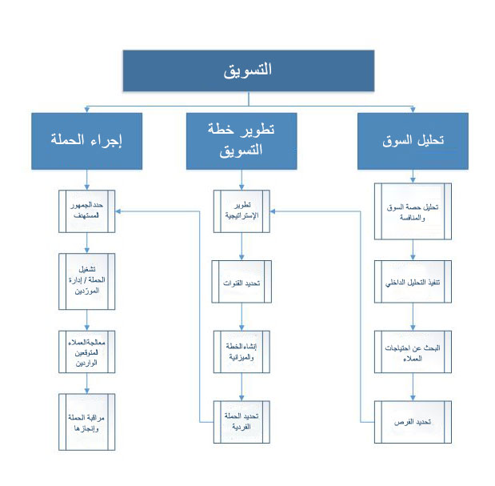
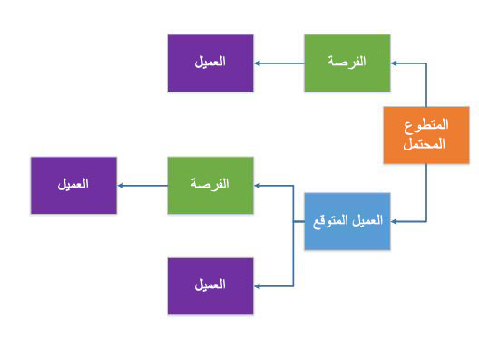
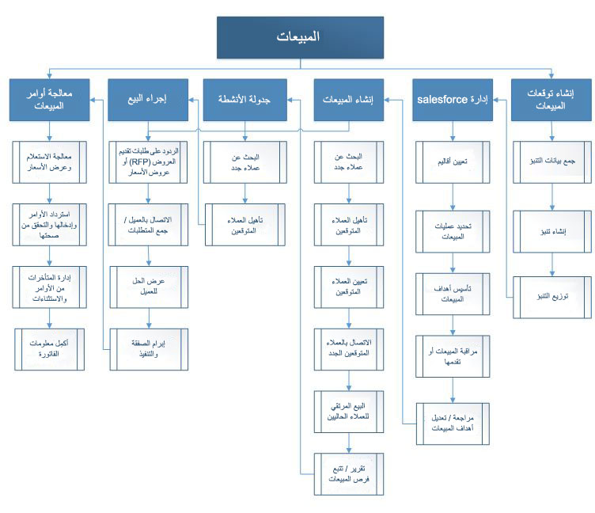

يمكنك استخدام مساحة عمل المبيعات والتسويق للحصول على أنواع مختلفة من البيانات في تدفق المبيعات وتخزين هذه البيانات واستخدامها. وتتضمن هذه البيانات مبادرة المبيعات الأصلية وإجراءات المتابعة المستقبلية والمبيعات الإضافية.

## التسويق
يمكنك استخدام الحملات والأنشطة التسويقية لإيجاد علاقات مع العملاء المحتملين وبناء مثل هذه العلاقات، بحيث يمكن تطوير التفاعلات الأولية وتحويلها إلى علاقات المبيعات. يوضح سير الإجراءات التالي إجراء العمل الخاص بالتسويق.

  

## العلاقات
في مجال المبيعات والتسويق، قد تحدث تفاعلاتك الأولية مع العملاء المحتملين في مواقف متنوعة. على سبيل المثال، قد تلتقي بعميل محتمل أثناء حضور معرض تجاري، أو قد يكون لديك عميل متوقع محتمل مع أحد العملاء بعد أن تقوم مؤسستك بإطلاق حملة تعتمد على مراسلات جماعية. من المهم جداً فهم سير إجراءات كيان أحد الأطراف قبل أن يتحوّل ذلك الطرف إلى عميل. يوضح الرسم التالي سير إجراءات علاقات الكيانات عندما يتحوّل العميل المحتمل إلى عميل فعلي. 

 

## الحملات
تستهدف الحملة جهات الاتصال الخاصة بالعملاء المحتملين والعملاء المتوقعين والفرص المتاحة والعملاء الذين تم تحديدهم للمشاركة في الحملة. في Supply Chain Management، يمكنك إنشاء أنواع متعددة من الحملات، مثل حملات التسويق الهاتفي والحملات البريدية وحملات البريد الإلكتروني، لزيادة العملاء المحتملين إلى أقصى درجة. ومع التقدم الحاصل في حملتك وتلقي ردود إيجابية، يمكنك بدء عملية المبيعات مع المتلقين الذين أبدوا ردود فعل إيجابية بشأن الحملة.

## المبيعات
يمكنك استخدام وظيفة المبيعات لإنشاء عروض الأسعار وإجراء بيع إضافي وبيع متلازم للعملاء الحاليين والجدد وإنشاء أوامر مبيعات وإنشاء فواتير مبيعات للعملاء. يوضح سير الإجراءات التالي إجراء العمل الخاص بالمبيعات.  

 

## عروض أسعار المبيعات
يمكنك إنشاء عروض أسعار المبيعات لتقدم للعملاء عرضاً يتضمن السلع أو الخدمات التي ستوفرها. وقد يطلب العميل الحصول على عرض أسعار، أو قد تقوم بإنشاء عرض أسعار كاستجابة لطلب تلقيته من أحد العملاء المحتملين أو الحاليين. وعندما يوافق العميل على عرض أسعار المبيعات، يمكنك تحويله إلى أمر مبيعات.

## البيع الإضافي/البيع المتلازم
يعد البيع الإضافي والبيع المتلازم من الأساليب المتبعة لبيع المنتجات عند إدخال أمر من قبل أحد العملاء. في البيع الإضافي، يتم اقتراح منتج آخر مختلف بدلاً من المنتج الحالي. أما في البيع المتلازم، فيتم اقتراح منتج بالإضافة إلى المنتج الحالي. وعند إعداد قوائم المنتجات، يمكنك إنشاء قواعد محددة للإشارة إلى الوقت الذي ينبغي فيه اقتراح أحد المنتجات كمنتج بيع متلازم أو منتج بيع إضافي.

## أوامر المبيعات
عندما تقوم بإنشاء أمر مبيعات جديد، يجب عليك تحديد نوع أمر المبيعات المراد إنشاؤه. ولديك خمسة خيارات. 
> [!NOTE]
> بعد إنشاء أمر مبيعات، يمكن تغيير أي نوع أمر، باستثناء نوع متطلبات الأصناف إذا كانت حالة أمر المبيعات **تم التسليم**.

## اتفاقيات البيع
تمثل اتفاقية البيع عقداً يُلزم العميل بشراء منتج ما بكمية محددة أو بمبلغ محدد على مدار فترة من الوقت مقابل أسعار وخصومات خاصة. وتلغي الأسعار والخصومات الواردة في اتفاقية البيع أي أسعار وخصومات محددة في أي اتفاقيات تجارية قائمة. تكون اتفاقية البيع صالحة لفترة محددة. ويجب أن يقع تاريخ الشحن المطلوب والمحدد لعملية بيع في صفحة أمر المبيعات ضمن الفترة الصالحة. بشكل افتراضي، تكون اتفاقية البيع قيد الانتظار. ويمكنك إجراء أمر بموجب اتفاقية البيع فقط عندما يتم تعيينها إلى "سارية".

## المتأخرات من الأوامر
عندما تُدخل الأوامر وتتحقق من صحتها، قد يتعين عليك إدارة الاستثناءات والمتأخرات من الأوامر قبل أن تتمكن من إكمال عملية البيع. وتعد المتأخرات من الأوامر إما أوامر شراء لم يتم تسليمها بعد من قِبل المورّد أو أوامر مبيعات لم يتم تسليمها بعد إلى العميل. ومن الضروري أن تتابع المتأخرات من الأوامر. على سبيل المثال، إذا تم تأخير المنتجات من جانب المورّد، فقد تضطر إلى تغيير تاريخ التسليم إلى العميل، ومن ثمّ إبلاغ العميل بالتأخير. يمكنك عرض المتأخرات من الأوامر حسب الصنف أو العميل أو المورّد.

## عرض المتأخرات من الأوامر حسب الصنف
عند عرض المتأخرات من الأوامر حسب الصنف، يمكنك متابعة التدفق المتوقع في المستقبل لحركات صنف معين. على سبيل المثال، يمكنك التحقق من المعلومات التالية:

- عدد أوامر المبيعات التي تم تقديمها لأحد الأصناف
- ما إذا كان هناك نقص في عمليات تسليم الصنف من المورّدين
- ما إذا كان يجب طلب المزيد من الأصناف، بحيث يمكنك تسليم جميع أوامر المبيعات في الوقت المناسب

من خلال القيام بعملية التحقق هذه، يمكنك الاستجابة لطلبات العملاء حول توقيت تسليم الصنف. بالإضافة إلى ذلك، يمكنك إعطاء الأولوية للمتأخرات من أوامر المبيعات وتقسيم الأصناف المتاحة‬ بين الأوامر.

## عرض المتأخرات من الأوامر حسب العميل
عند عرض المتأخرات من الأوامر حسب العميل، يمكنك عرض حالة أوامر العميل المتبقية. وتصبح عملية التحقق هذه مفيدة عندما يتعين عليك الاستجابة للعملاء الذين ينتظرون الأصناف التي تأخر تسليمها.

##عرض المتأخرات من الأوامر حسب المورّد
عند عرض المتأخرات من الأوامر حسب المورّد، يمكنك متابعة عمليات التسليم الناقصة وتواريخ التسليم المتوقعة. ستساعدك أيضاً عملية التحقق هذه في تحديد أولويات المتأخرات من الأوامر عند وصول المنتجات من المورّدين، ويجب انتقاء أوامر المبيعات لإجراء التسليم.

## الفواتير
يمكنك إنشاء ثلاثة أنواع من الفواتير خلال عملية المبيعات:

- فاتورة العميل
- فاتورة ذات نص حر
- فاتورة مبدئية

## فاتورة العميل
إن فاتورة العميل هي الفاتورة التي تعطيها المؤسسة للعميل فيما يخص عملية البيع. يمكنك إنشاء هذا النوع من فواتير العملاء بالاستناد إلى أمر مبيعات يتضمن عنواناً بالإضافة إلى بند أو أكثر لأصناف أو خدمات. تُكمل فاتورة العميل أمر المبيعات وإيصال التعبئة ودورة فاتورة المبيعات.

يمكنك ترحيل فاتورة عميل واحدة وطباعتها، استناداً إلى أمر مبيعات أو إيصال التعبئة والتاريخ. ويمكنك أيضاً ترحيل وطباعة فواتير متعددة للعملاء معاً، استناداً إلى إيصالات التعبئة والتواريخ. عندما تقوم بترحيل فاتورة عميل واحدة باستخدام أمر المبيعات، يتم تحديث كمية **باقي الفاتورة** لكل صنف بإجمالي الكميات التي تمت فوترتها من أمر المبيعات المحدد.

إذا كانت كمية **باقي الفاتورة** وكمية **باقي التسليم** لجميع الأصناف في أمر المبيعات تساوي 0 (صفر)، تتغير حالة أمر المبيعات إلى **مفوتر**. ولكن إذا لم تكن الكمية في أي من الحقلين مساوية لصفر، فلن تتغير حالة أمر المبيعات، ويمكنك إدخال فواتير إضافية. إذا كنت تخطط لترحيل وطباعة فاتورة أو أكثر من فواتير العملاء استناداً إلى إيصالات التعبئة، يجب أن تكون قد قمت بالفعل بترحيل إيصال تعبئة واحد على الأقل لكل أمر مبيعات. تستند فاتورة العميل إلى إيصالات التعبئة وتعكس الكميات المدرجة فيها.

يمكنك إنشاء فاتورة عميل تستند إلى أصناف بنود إيصالات التعبئة التي تم شحنها حتى تاريخه، حتى إذا لم يتم شحن جميع الأصناف الخاصة بأمر مبيعات معين بعدُ. وقد تفعل ذلك إذا قام، على سبيل المثال، كيانك القانوني بإصدار فاتورة واحدة لكل عميل كل شهر لتغطية جميع عمليات التسليم التي تقوم بشحنها خلال ذلك الشهر. ويمثل كل إيصال تعبئة عملية تسليم جزئية أو كلية للأصناف الموجودة في أمر المبيعات.

عند قيامك بترحيل الفاتورة، يتم تحديث كمية **باقي الفاتورة** لكل صنف من الأصناف بإجمالي الكميات التي تم تسليمها من إيصالات التعبئة المحددة. وإذا كانت كمية **باقي الفاتورة** وكمية **باقي التسليم** لجميع الأصناف في أمر المبيعات تساوي 0 (صفر)، تتغير حالة أمر المبيعات إلى **مفوتر**. ولكن إذا لم تكن الكمية مساوية **لصفر**، فلن تتغير حالة أمر المبيعات، ويمكنك إدخال فواتير إضافية. يتم تحديث حركات المخزون برقم الفاتورة، ويتم تغيير الحالة في بند أمر المبيعات إلى **مفوتر**.

## فاتورة ذات نص حر
إن الفاتورة ذات النص الحر هي فاتورة لا تتعلق بأمر مبيعات. فهي تحتوي على بنود الأوامر التي تتضمن حسابات دفتر الأستاذ وأوصاف النص الحر ومبلغ المبيعات. لا يمكنك إدخال رقم صنف في هذا النوع من الفواتير، ويجب عليك إدخال معلومات ضريبة المبيعات المناسبة. تتم الإشارة إلى حساب رئيسي لعملية البيع في كل بند من بنود الفاتورة. ويتم ترحيل رصيد العميل إلى حساب الملخص من ملف تعريف الترحيل المستخدم للفاتورة ذات النص الحر.

## فاتورة مبدئية
إن الفاتورة المبدئية هي فاتورة يتم إعدادها كتقدير لمبلغ الفاتورة الفعلي قبل ترحيل الفاتورة. ويمكنك طباعة فاتورة مبدئية لفاتورة عميل أو فاتورة ذات نص حر.

 
