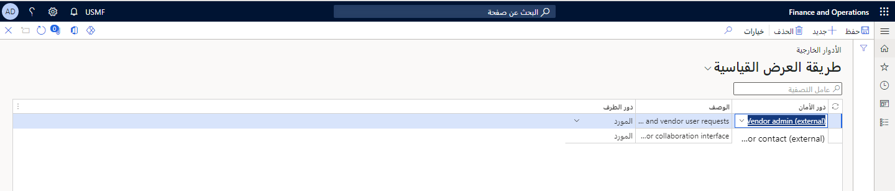

في هذا التدريب، ستقوم بإعداد دور خارجي لمورد لتعاون المورد.

## قبل البدء 

لتحقيق الاستفادة القصوى من هذا التمرين، ننصحك بأن تكون عينة البيانات القياسية متوفرة في Supply Chain Management التي يتم تثبيتها باستخدام Lifecycle Services ‏(LCS).

## لإنشاء دور خارجي، اتبع الخطوات التالية.

1.  في شركة **USMF**، انتقل إلى **إدارة النظام > الأمان > الأدوار الخارجية**.
2.  تحقق من وجود أدوار **المورد (خارجي)** و **مسؤول المورد (خارجي)**.

      

3.  انتقل إلى **التدبير والتوريد > الموردون > كافة الموردين**.
4.  حدد المورد **1001** لفتح الصفحة **عام**.
5.  في الحقل **تنشيط التعاون**، حدد **نشط** (تم تأكيد أمر الشراء تلقائياً).
6.  افتح الصفحة **المورد** ضمن **إعداد** في جزء الإجراء، حدد **جهات الاتصال > إضافة جهات اتصال**.
7.  في حقل الاسم الأول، اكتب **اسمك**. 
8.  حدد **حفظ**.
9.  ضمن **الطلبات** في الجزء الخاص بالإجراء، حدد **توفير المستخدم للمورد**.
10. قم بإعداد الاسم المستعار للبريد الإلكتروني، مثل **someone&#064;microsoft.com**.
11. أدخل **التعاون مع مورد تجريبي** في الحقل **تبريرات الأعمال**.
12. في الكيانات القانونية التي يكون فيها الشخص نموذجاً لجهة اتصال، حدد خانة الاختيار **السماح بوصول تعاون المورد**.
13. في أدوار تعيين المستخدم، حدد خانة الاختيار **تعيين** لكل من وصفي الدور.
14. حدد **إرسال**.
