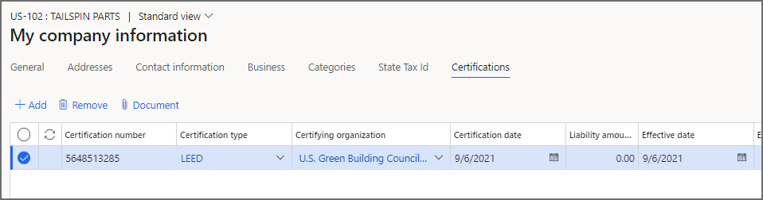
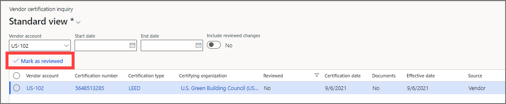

تتناول هذه الوحدة الخطوات التي يمكن لمورديك استخدامها للحفاظ على شهاداتهم باستخدام مساحة عمل **تعاون المورّد**. قد تتضمن أمثلة الشهادات مؤسسة أعمال نسائية (WBE)، أو شركة "القيادة في الطاقة والتصميم البيئي" (LEED). سيحتاج البائعون إلى إدخال معلومات الشهادة في مساحة عمل **معلومات المورّد**. من هناك، سيحدد المورّدون **المزيد من التفاصيل**، ثم يختارون **الشهادات**.

## قم بتشغيل ميزة شهادة المورّد
يجب **تمكين ميزة تمكين إدارة شهادة تعاون المورّد** في نظامك قبل استخدامها. يمكن للمسؤولين التحقق من حالة الميزة وتمكينها إذا لزم الأمر. في مساحة العمل **إدارة الميزات** يتم إدراج الميزة بالطريقة التالية:

- **الوحدة** - الحسابات المدفوعات
- **اسم الميزة** - تمكين إدارة شهادات تعاون المورّد

## إضافة شهادة جديدة
لإضافة شهادة جديدة، حدد الزر **إضافة** أعلى علامة التبويب **الشهادات** في مساحة عمل **معلومات المورّد**. أدخل البيانات التالية:

- رقم الشهادة
- نوع الشهادة
- مؤسسة التصديق
- تاريخ الشهادة
- مبلغ الالتزام (الضريبي)، إن وجد
- تاريخ السريان
- تاريخ انتهاء الصلاحية
- تعليقات اختيارية

 
إذا كانت هناك أي مستندات مطلوبة للحصول على شهادة معينة، فيمكنك إرفاقها بتحديد **المستند**.

سيتم تعيين المورد المصدر للشهادات التي يدخلها **المورّدون** في هذه الصفحة. يمكنك إرسال معلومات الشهادة للحسابات المصرفية للمورّد الخاص بك نيابة عنهم. سيتم عرض البيانات هنا، وسيتم تحديد المصدر على أنه **عميل**. يمكن للمورّدين تحرير شهاداتهم أو حذفها حسب الحاجة.

## أدى تعاون المورّد إلى إنشاء سجلات الشهادات
عندما يضيف المورّد معلومات الشهادة، ستكون مرئية في صفحة **الشهادات التي تم إنشاؤها بواسطة تعاون المورّد**. لفتح الصفحة، انتقل إلى **الحسابات المدفوعات > الاستفسارات > تقارير المورّد > الشهادات الناتجة عن تعاون المورّد**. بشكل افتراضي، يتم عرض جميع سجلات الشهادات التي تم إنشاؤها أو تغييرها حديثاً. يمكن لموظف الدائنين عرض التغييرات والتحقق من صحة البيانات باستخدام عملية التأكيد الخاصة بهم. بعد التحقق من المعلومات، يمكن تحديد سجل شهادة الصفحة وتمييزه كـ "تمت مراجعته". عند وضع علامة على أحد السجلات كـ "تمت مراجعته"، تتم إزالته من القائمة الافتراضية.

تعرض صفحة **الشهادات الناتجة عن تعاون المورّد** جميع تعديلات الشهادات. إذا لم يتم عرض تغيير على الصفحة، فيمكنك الوصول إليه عن طريق ضبط عوامل تصفية حساب المورد، أو نطاق تاريخ السريان، أو ما إذا كنت تريد تضمين معلومات حول تعديلات الشهادات التي تمت مراجعتها.

 

