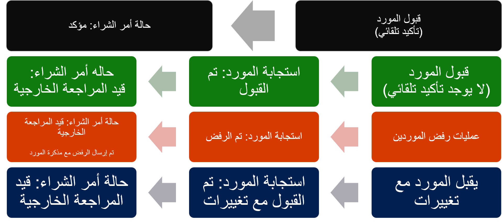

تعرض واجهه تعاون المورد مجموعة محدودة من المعلومات حول أوامر الشراء والفواتير ومخزون الشحن لمستخدمي الموردين الخارجيين. من هذه الواجهة، يمكن للمورد أيضاً الرد على طلبات عروض الأسعار (RFQ) وعرض معلومات الشركة الأساسية وتحريرها. يمكن للمورد أيضاً إعداد معلومات البنك الخاصة به لتبسيط عملية الدفع.

## استجابات المورد

فيما يلي الأنواع الأربعة من الاستجابات التي يمكن أن يقدمها الموردون عند إرسال أمر شراء للتأكيد.

-   **قبول المورد الأمر وتكوين ملف تعريفه لتأكيد أوامر الشراء تلقائياً عند القبول** - يتم تحديث الأمر إلى **تم التأكيد**. إذا حدث شيء يمنع تحديث الأمر، تظل استجابة المورد مسجلة كمقبولة، ولكن تبقى حالة أمر الشراء **قيد المراجعة الخارجية**.
-   **قبول المورد الأمر، وتكوين ملف تعريفه لتأكيد أوامر الشراء تلقائياً عند القبول** - يتم تسجيل استجابة المورد على أنها مقبولة، ولكن تبقى حالة أمر الشراء **قيد المراجعة الخارجية**.
-   **رفض المورد الأمر** - يتم تسجيل استجابة المورد كمرفوضة، وتبقى حالة أمر الشراء **قيد المراجعة الخارجية**. يتم استلام الرفض مع الملاحظة الخاصة بالمورد.
-   **قبول المورد الأمر بالتغييرات** -يتم اقتراح التغييرات على مستوى البند. من الممكن قبول البنود الفردية أو رفضها. وتتضمن التغييرات المحتملة الأخرى تغيير التواريخ أو الكميات أو تقسيم البنود لتواريخ تسليم أو كميات تسليم مختلفة أو استبدال أحد الأصناف. لا يمكن تغيير معلومات السعر والمصاريف بواسطة المورد. يمكن إجراء اقتراحات للتغييرات على هذه التغييرات باستخدام الملاحظات. يتم تسجيل استجابة المورد كمقبولة مع التغييرات، وتبقى حالة أمر الشراء **قيد المراجعة الخارجية**.

يمكنك استخدام مساحة عمل **تحضير أمر الشراء** لمراقبة أوامر الشراء التي قام المورد بالرد عليها.

تحتوي مساحة عمل **تحضير أمر الشراء** على قائمتين تتضمنان أوامر شراء بالحالة **قيد المراجعة الخارجية**: **قيد المراجعة الخارجية وتتطلب إجراء** و **قيد المراجعة الخارجية في انتظار استجابة المورد**.

عند استجابة المورد لأمر الشراء، تظهر له شاشة تمنحه الفرصة لتقديم ملاحظات حول استجابته.
بالإضافة إلى حقل **الملاحظات** يتوفر خيار يزود المورد برسائل معلومات تخص أنواع استجاباته.

ورسائل المعلومات عبارة عن إدخالات نص حر تستند إلى ثلاثة أنواع من الاستجابات: القبول، القبول مع التغييرات، والرفض. يمكنك إعداد نص محدد لكل نوع من أنواع الاستجابة ولكل لغة من اللغات المعينة. تكون الأنواع الشائعة من المعلومات المراد تضمينها عبارة عن البنود والشروط، وإرشادات للمورد وإخلاء المسؤولية ومعلومات الاتصال وعناوين URL.

على سبيل المثال، إذا كان لديك موردون يحتاجون إلى معلومات باللغة الفرنسية أو الإسبانية، فيمكنك إضافة إصدارات من النص لتغطية هذا الاحتياج. ستحدد اللغة المدرجة في صفحة المورد خيار اللغة الذي يظهر في نماذج استجابات أمر الشراء الخاصة بها.

## خيارات إعداد المورد

قبل إنشاء حساب مستخدم لشخص سيستخدم تعاون الموردين، يجب إعداد المورد للسماح له باستخدام تعاون الموردين في صفحة ملف تعريف المورد. يمكنك الوصول إلى ذلك عن طريق فتح **حسابات المدفوعات > الموردون > كافة الموردين** ثم تحديد المورد من القائمة.

يمكنك تعيين حقل **تنشيط التعاون** على **نشط** في علامة التبويب السريعة **عام**.

الخياران اللذان يمكنك تحديدهما هما:

-   **نشط (تأكيد أمر الشراء تلقائياً)** - يتم تأكيد أوامر الشراء تلقائياً عند قبول المورد لها بدون تغييرات.
-   **نشط (عدم تأكيد أمر الشراء تلقائياً)** - يلزم تأكيد أوامر الشراء يدوياً بواسطة مؤسستك بعد قبولها من جانب المورد.

أيضاً، في صفحة **المورد**، إذا كنت ترغب في مشاركة معلومات الأسعار مع المورد، مثل سعر الوحدة والخصومات والمصاريف من خلال واجهة تعاون المورد، فيمكنك تعيين خيار **أسعار/مبلغ أمر الشراء** إلى **نعم** في علامة التبويب السريعة **افتراضات أمر الشراء**.

عند تمكين مورد لتعاون الموردين، يمكن إضافة مستخدمين وتخويلهم للوصول إلى تعاون الموردين. 

## معلومات مصرف تعاون المورد

بعد إعداد تعاون المورد للمورد، يمكنه الوصول إلى معلوماته المصرفية. يمكن للمورد تحرير أو إضافة أو إزالة معلوماته المصرفية داخل الواجهة، لتبسيط عملية الدفع. عند إضافة معلومات المورد، يمكن لمستخدم حسابات المدفوعات مراجعة التغييرات المقترحة والموافقة عليها. 
