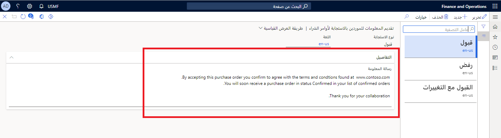

عندما يستجيب الموردون لأمر الشراء الذي ترسله إليهم، فإنهم يرون أحد مربعات الرسائل الثلاثة، حيث يجب عليهم تأكيد ما إذا كانوا يريدون قبول أمر الشراء، أو رفضه، أو قبوله بالتغييرات. نظراً لأن المعلومات التي يجب عرضها للمورد في تلك المرحلة قد تكون خاصة بعملك، يمكنك تحديد النص الذي يظهر في كل رسالة تأكيد.

على سبيل المثال، يمكن للنص إبلاغ المورد بالخطوات التالية في العملية أو فيما يتعلق بالشروط والأحكام.

لتحديد النص الذي يظهر في الاستجابة لأمر الشراء، اتبع الخطوات التالية:

1.  في صفحة  **التدبير والتوريد > الإعداد > تعاون المورد > معلومات للموردين الذين يستجيبون لأوامر الشراء** ، حدد نوع الاستجابة، ثم حدد  **تحرير**.
2.  في  **رسالة المعلومات** ، أدخل المعلومات التي يجب عرضها للموردين في مربع الرسالة.

**التدبير والتوريد > الإعداد > تعاون المورد > معلومات للموردين الذين يستجيبون لأوامر الشراء**

إذا كنت بحاجة إلى إضافة رسائل بأكثر من لغة، فأنشئ رسائل منفصلة وحدد رمز اللغة المناسب لكل منها. ستكون الرسالة التي تظهر لكل مورد باللغة التي يستخدمها المورد.
