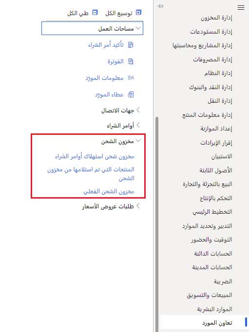

إذا كنت تستخدم مخزون الشحن، فبإمكان المورّدين استخدام واجهة تعاون المورّد لعرض المعلومات في الصفحات التالية. لعرض مخزون الشحن، انتقل إلى **تعاون المورّد > مخزون الشحن**.

-   **أوامر الشراء التي تستهلك مخزون الشحن** - يتم إنشاء أوامر الشراء لمخزون الشحن عندما تتغير ملكية المخزون من المورّد إلى شركتك. يتم ترحيل إيصال استلام المنتج في نفس الوقت. تظهر أوامر شراء الشحنات هذه فقط في صفحة  **أوامر الشراء التي تستهلك مخزون الشحنة** . ولا يتم تضمينها في صفحة  **جميع أوامر الشراء المؤكدة** في وحدة تعاون المورد.
-   **المنتجات الواردة من مخزون الشحنات** - تسرد هذه الصفحة جميع الحركات التي تم فيها نقل ملكية المنتجات من المورد إلى شركتك. يمكن للموردين استخدام هذه المعلومات لفوترة العميل.
-   **مخزون الشحن المتاح** - تعرض هذه الصفحة مخزون الشحن المتاح الذي يملكه المورّد ومخزون الشحن المتاح الذي تم استلامه في مستودعك.

> [!div class="mx-imgBorder"]
> 