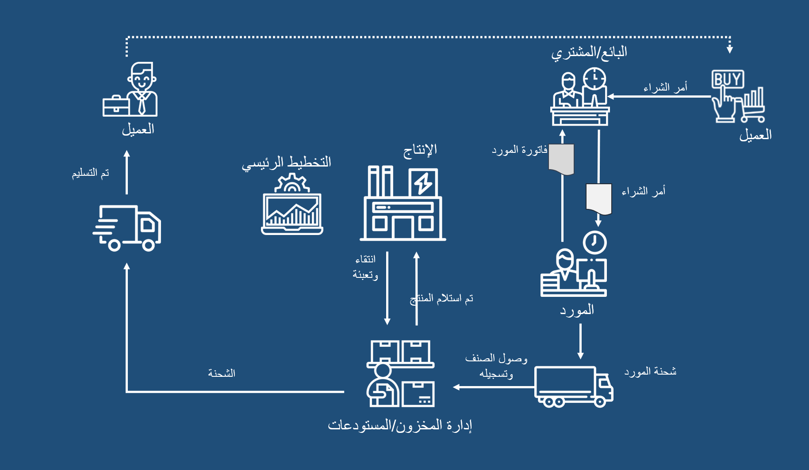

 
في الوحدة النمطية الخاصة بالتدبير والتوريد في Dynamics 365 Supply Chain Management، يمكنك إنشاء سياسات الشراء للتحكم في عملية الشراء. بالإضافة إلى ذلك، يمكنك تحديد الموردين وتدريب الموردين كموردين جدد والاحتفاظ بمعلومات المورد وإنشاء اتفاقيات مع الموردين وأصناف الأوامر والخدمات والاحتفاظ بأوامر الشراء وتأكيد استلام المنتجات. بعد معالجة حركات المورد من خلال حسابات المدفوعات، يمكنك أيضاً تحليل الإنفاق وأداء المورد.

تفحص هذه الوحدة النمطية كل خطوة من خطوات عمليات التدبير‬ والتوريد التي تنطبق علي عملية التدبير إلى الشراء.

تعتمد مؤسسة العمليات في السيناريوهات التالية علي الممارسات الشائعة عبر الصناعات، وينبغي أن تكون العمليات الموجودة في بعض الشركات مختلفة قليلاً.
