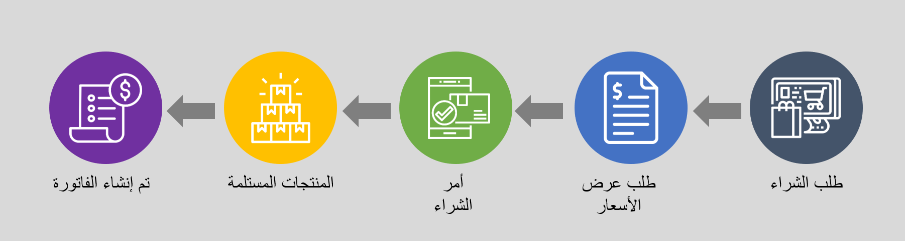

تستهل دورة الشراء بالمنتجات والموردين. يمكنك استخدام وحدة إدارة معلومات المنتجات لتحديد وإنشاء المنتجات ومتغيرات المنتجات التي تشتريها من الموردين. عندما يتم تعريف المنتجات وإنشائها، يمكنك تفويض المنتجات للاستخدام من خلال إصدار المنتجات للكيانات القانونية. 

لمزيد من المعلومات حول كيفية إنشاء المنتجات، راجع [إنشاء المنتجات وأصول المنتجات في Dynamics 365 Supply Chain Management](/training/modules/create-products-product-masters-dyn365-supply-chain-mgmt/?azure-portal=true).

## مساحة عمل المشتريات وتحديد الموارد

يغطي التدبير والتوريد جميع الخطوات من تحديد الحاجة إلى المنتج والخدمات من خلال شراء المنتج والاستلام وإعداد الفواتير ومعالجة الدفع مع الموردين. يمكن تكوين عمليات الشراء باتجاه احتياجات عمل محددة من خلال تحديد سياسات الشراء ومهام سير العمل.

### تحديد مدى الحاجة للمنتج والخدمات
قد تنشأ الحاجة إلى المنتجات أو الخدمات من *الطلبات*، على سبيل المثال، عندما يطلب الموظف منتجاً. يمكن إعداد *كتالوجات المنتجات* لتوجيه مجموعة المنتجات المتاحة للاختيار من بينها، أو يمكن تقديم طلبات للمنتجات التي لم يتم توفيرها بعد في الكتالوج، ما يسمح لقسم المشتريات بالتفكير في كيفية توفير المنتج.

يمكن استخدام *حدود الإنفاق* لتقييد إنفاق الطلب، حيث يضيف سير عمل الشراء خيار طلب الموافقة قبل وضع الطلب. من الممكن أيضاً تحديد تخصيص أموال الميزانية، إذا لزم الأمر.

يحدد قسم المشتريات مزودي المنتجات والخدمات المطلوبة، ويمكن أن يتضمن ذلك *طلب عرض أسعار* يتم إرساله إلى عدة موردين محتملين. من الممكن مشاركة مواصفات المنتج المطلوب، ويمكن للموردين المحتملين عرضها لمعرفة ما إذا كان بإمكانهم تقديم منتج يتوافق معها. يقوم البائعون بإرجاع عروضهم التي تتم مراجعتها بعد ذلك من قِبَل قسم المشتريات قبل اختيار المورّد الذي يريدون الشراء منه.

تتضمن أوامر الشراء خياراً لإرسال استعلام شراء إلى المورد كبديل لطلب أكثر شمولاً لعملية عرض الأسعار. يمكن استخدام استعلام الشراء للمساعدة في تحديد شروط، مثل الأسعار والخصومات وتاريخ التسليم للأمر. إذا تم إعداد المورّدين لاستخدام مدخل **المورّد** فسيتم تعطيل وظيفة استعلام الشراء. وبدلاً من ذلك، تتم مشاركة الأمر على مدخل **المورّد** وعندما يتم إرسال طلب تأكيد، يمكن للمورّد تأكيد الطلب مباشرة.

يمكن استخدام *كتالوجات المورّدين* لجمع المعلومات حول تشكيلة المنتجات التي يمكن للمورّدين توفيرها. يمكن للمورّدين نشر الكتالوج الخاص بهم، حتى يتسنى تحديث الكتالوج. من الممكن إرفاق قائمة المورّدين المعتمدين بمنتج ما، ويمكن أن يساعد ذلك في توجيه اختيار المورّد عند فتح أوامر شراء جديدة، ومنع استخدام المورّدين غير المقصودين.

### التدبير
يمكن إنشاء أوامر الشراء بعدة طرق من بينها:

- كنتيجة للتخطيط الرئيسي الذي حدد طلباً يتطلب الشراء. تنشئ هذه العملية أوامر الشراء المخططة، وعندما يتم تحريرها، يتم إنشاء أوامر الشراء.
- من خلال معالجة طلبات الشراء التي تؤدي إلى الشراء.
- من خلال معالجة اتفاقيات الشراء، حيث يتم إنشاء أوامر الشراء كأوامر محررة من الاتفاقيات. يُستخدم هذا بشكل شائع عند استخدام اتفاقيات الشراء لتمثيل الأوامر الشاملة.
- عندما لا يعتمد أمر الشراء الذي تم إنشاؤه يدوياً على مستند آخر.

تتطلب أوامر الشراء التي تم تكوينها باستخدام مهام *سير عمل الموافقة* على الشراء الموافقة قبل تسجيلها على أنها معتمدة، وهذا مطلوب قبل معالجة الأمر بشكل أكبر.

يتم *تأكيد* أوامر الشراء لتوضيح أنه تم إبرام اتفاقية مع المورّد. سيتقدم أمر الشراء بعد ذلك تدريجياً عبر حالات مختلفة حتى يتم إصدار فاتورة به أو يتم إلغاؤها في النهاية.

عند إنشاء أمر شراء، يتم ملء العديد من الحقول مسبقاً بقيم افتراضية من المعلومات المخزنة حول المورّد في صفحة **الموردين**. هذا يعني أن هناك عدداً محدوداً من الحقول التي تحتاج إلى تعبئتها في أمر الشراء، على الرغم من أنه يمكنك اختيار تجاوز القيَم الافتراضية.

### الأسعار والخصومات
تتضمن الأسعار والخصومات معلومات حول الأسعار والخصومات وشروط الخصم التي يقدمونها. يمكن تمثيل الأسعار والخصومات على أنها *اتفاقيات تجارية*. تمثل الاتفاقيات التجارية قوائم أسعار المورّدين مع الأسعار أو الخصومات، ولها مجموعة محددة من التواريخ التي تكون الاتفاقية صالحة لها. يمكن التفاوض على الأسعار والخصومات وتمثيلها من خلال *اتفاقيات الشراء* بشروط مثل الالتزامات بشراء أحجام معينة أو مبالغ نقدية كشرط مسبق للشروط المتفاوض عليها. يمكن إنشاء *اتفاقيات الخصم* مع المورّدين حيث قد يؤدي شراء منتجات معينة أو مجموعات من المنتجات إلى خصم من البائع اعتماداً على مبلغ الشراء أو الحجم.

### خيارات التسليم
هناك خيارات مختلفة لعملية التسليم المرتبطة بأمر الشراء. يمكن تقسيم المنتجات المطلوبة إلى جداول *تسليم* حيث يمكن تخطيط أجزاء من الكمية المطلوبة للتسليم في تواريخ مختلفة. يمكن أن يشمل التسليم أيضاً *التسليم المباشر* الذي تم بدؤه من أمر المبيعات، والذي يقوم بتنفيذ إنشاء إيصال التعبئة تلقائياً في أمر المبيعات في نفس الوقت الذي يتم فيه تسجيل إيصال استلام المنتج في أمر الشراء. يمكن أن تكون أوامر الشراء أيضاً جزءاً من *سلسلة أوامر* بين الشركات الشقيقة، ويشار إليها أيضاً بأوامر الشراء بين الشركات الشقيقة، حيث يتم طلب المنتجات من أمر مبيعات مطابق بين الشركات. في هذه الحالة، يتم تنفيذ بعض الخطوات عبر الأمرين المرتبطين بين الشركات الشقيقة.

### الأصناف المكملة
يمكن إعداد المنتجات لتشمل *العناصر المكملة*. والغرض من ذلك اقتراح المنتجات المتعلقة بالمنتج الذي يتم طلبه. قد تكون المنتجات الإضافية مطلوبة، أو قد تكون اختيارية. في بعض الحالات، يمكن إضافة عناصر مكملة كمنتجات مجانية مصاحبة لشراء منتجات أخرى.

### تكاليف أمر الشراء
يمكن تعيين الرسوم المخصصة لأمر الشراء. يمكن أن يحدث هذا تلقائياً من خلال إعداد الرسوم التلقائية أو عن طريق إضافة الرسوم يدوياً. يمكن تخصيص الرسوم للأمر على مستوى العنوان أو على مستوى سطر الأمر. يمكن إعداد محاسبة الرسوم بطرق مختلفة. فعلى سبيل المثال، يمكنك إعداد أحد الرسوم ليتم احتسابها على أنها تكلفة المنتج. إذا قمت بذلك، فيجب تعيين الرسوم على مستوى سطر الأوامر قبل تأكيد الأمر. هناك خيار يمكن أن يساعد في تخصيص الرسوم من عنوان الأمر إلى البنود.

### إيصال المنتجات وإعداد الفواتير
تتطلب أوامر الشراء التي تتضمن منتجات فعلية عادةً *تسجيل الوصول* في أحد المستودعات، وبعد ذلك يتم تسجيل *إيصال استلام المنتج* للأمر. قد يتم تكوين أوامر الشراء مع المنتجات التي تفي بطلبات الشراء بحيث يحتاج الموظف الذي طلب المنتجات أيضاً إلى تقديم *تأكيد الاستلام*.

تتضمن بعض أوامر الشراء منتجات تمثل خدمات أو منتجات غير فعلية أخرى لا يلزم فيها الاستلام في المستودع. يمكن إنشاء المنتجات كخدمات أو *فئات تدبير* يمكن استخدامها مباشرة في أمر الشراء لمثل هذه الأوامر. باستخدام هذه الأوامر، يتم أحياناً تخطي محاسبة إيصال استلام المنتج وإصدار فاتورة بالأمر مباشرةً، أو بدلاً من ذلك، يتم تسجيل إيصال استلام المنتج في أمر الشراء دون أي تسجيل وصول مسبق.

قد يؤدي استلام المنتجات إلى الاستهلاك التلقائي لغرض معين. يتضمن ذلك الاستهلاك الضمني مع التسليم المباشر أو الاستهلاك تجاه مشروع ما أو محاسبة المنتج كأصل ثابت.

عند وصول *فواتير المورّدين* من المورّد، قد يتم تسجيلها أولاً في سجل الفواتير بشكل مستقل عن أمر الشراء، ثم الموافقة عليها لاحقاً كسجل مقابل أمر الشراء. يتضمن تسجيل فاتورة المورّد مع أمر الشراء مطابقة إيصال استلام المنتج مع الفاتورة.

يمكن تحديد *التوزيعات المحاسبية* في أمر الشراء لوصف كيفية إجراء المحاسبة داخل دفتر الأستاذ، ويمكن أيضاً تحديد كيفية الحصول على تخصيص أموال الميزانية عندما يتم تضمين ذلك في التكوين الخاص بك.
سوف تسجل أوامر الشراء المفوترة المسؤولية في حساب البائع ضمن حسابات المدفوعات، ومنها يمكن معالجة *مدفوعات المورّد*.

### أداء المورّد
يتم دعم الأداء ومراجعة الشراء من خلال تقارير *المشتريات وحسابات المدفوعات* والتي تشمل تحليل الإنفاق وتحليل أداء المورّدين.

## سير عمل التدبير
تتطلب بعض المؤسسات أن تتم الموافقة على طلبات الشراء وأوامر الشراء من قِبل مستخدم آخر غير الشخص الذي أدخل الحركة. لإعداد عملية الموافقة، يمكنك إنشاء سير عمل.

يمثل سير العمل عملية تجارية. يحدد كيفية تدفق المستند عبر النظام ويشير إلى الشخص الذي يجب عليه إكمال إحدى المهام أو الموافقة على أحد المستندات. هناك العديد من الفوائد لاستخدام نظام سير العمل في مؤسستك:

- **العمليات المتسقة** - يمكنك تحديد عملية الموافقة لوثائق معينة، مثل طلبات الشراء وتقارير المصروفات. يساعد استخدام نظام سير العمل في ضمان معالجة المستندات والموافقة عليها بطريقة متسقة وفعالة.
- **رؤية العملية** - يمكنك تتبع الحالة والمحفوظات ومقاييس الأداء لمثيل سير عمل معين. يساعدك هذا في تحديد مدى ضرورة إجراء تغييرات على سير العمل لتحسين الكفاءة.
- **قائمة العمل المركزية** - يمكن للمستخدمين عرض قائمة عمل مركزية لعرض مهام سير العمل والموافقات المعينة لهم عبر جميع مهام سير العمل التي يشاركون فيها. يتوفر هذا في صفحة **عناصر العمل**.

تتوفر أنواع سير العمل التالية للتدبير والتوريد.

|     النوع                                  |     استخدم هذا النوع لـ                                                                    |
|-------------------------------------------|-------------------------------------------------------------------------------------------|
|     مراجعة طلب الشراء         |     إنشاء عمليات سير عمل المراجعة والموافقة لطلبات الشراء.                     |
|     مراجعة بند طلب الشراء    |     إنشاء عمليات سير عمل المراجعة والموافقة لبنود طلب الشراء.                |
|     سير عمل أمر الشراء             |     إنشاء عمليات سير عمل المراجعة والموافقة لأوامر الشراء.                           |
|     سير عمل بند أمر الشراء        |     إنشاء عمليات سير عمل المراجعة والموافقة لبنود أوامر الشراء.                       |
|     يقوم المورّد بإضافة سير عمل التطبيق     |     قم بإنشاء عمليات سير عمل المراجعة والموافقة لإضافة مورّدين جدد عبر طلبات المورّدين.    |

## عملية الشراء
قد تنشأ الحاجة إلى المنتجات أو الخدمات من الطلبات، كما هو الحال عندما يطلب الموظف منتجاً معيناً لأداء وظيفته. قد يكون هذا جهاز كمبيوتر محمولاً أو لوازم مكتبية على سبيل المثال. فيما يلي عملية الشراء الشاملة.

1. إنشاء طلب شراء من الطالب.
2. طلب عرض الأسعار (RFQ) للمورد أو الموردين.
3. بمجرد تحديد المورد، يتم تحويل طلب عرض الأسعار إلى أمر شراء أو أمر شراء تم إنشاؤه.
4. يتم استلام المنتجات في المخزون.
5. ويتم إنشاء الفاتورة.

يمكن إعداد كتالوجات المنتجات لتوجيه مجموعة المنتجات المتاحة للاختيار من بينها، أو يمكن تقديم طلبات للمنتجات التي لم يتم توفيرها بعد في الكتالوج، ما يسمح لقسم المشتريات بالتفكير في كيفية توفير المنتج.

يمكن استخدام حدود الإنفاق لتقييد إنفاق الطلب، ويضيف سير عمل الشراء خيار طلب الموافقة قبل حدوث الطلب. من الممكن أيضاً تحديد توزيع صندوق الموازنة، إذا لزم الأمر.

يحدد قسم المشتريات مزودي المنتجات والخدمات المطلوبة، ويمكن أن يتضمن ذلك طلب عرض أسعار يتم إرساله إلى عدة موردين محتملين. من الممكن مشاركة مواصفات المنتج المطلوب، ويمكن للموردين المحتملين عرضها لمعرفة ما إذا كان بإمكانهم تقديم منتج يتوافق معها. يقوم الموردون بإرجاع عروضهم، ثم يقوم قسم المشتريات بمراجعة العطاءات قبل اختيار المورد الذي يريدون الشراء منه.

تتضمن أوامر الشراء خياراً لإرسال استعلام شراء إلى المورد كبديل لطلب أكثر شمولاً لعملية عرض الأسعار. يمكن استخدام استعلام الشراء للمساعدة في تحديد شروط، مثل الأسعار والخصومات وتاريخ التسليم للأمر. إذا تم إعداد الموردين لاستخدام تعاون المورد، فسيتم تعطيل وظيفة استعلام الشراء. بدلاً من ذلك، تتم مشاركة الأمر على واجهة تعاون المورد، وعندما يتم إرسال أمر شراء، يمكن للمورد تأكيد الأمر مباشرةً.

## العمل مع طلبات الشراء 

بناءً على إعداد مؤسستك، يمكنك إنشاء طلبات شراء للمنتجات التي تستخدمها مؤسستك.

في نهج الشراء، تقوم بتعريف السلوك الافتراضي لطلب الشراء وتقرر ما إذا كان يمكن للمستخدم تحديد نوع طلب الشراء الذي يمكنه إنشاءه.

يمكن أن يحتوي طلب التزويد فقط على بنود تحتوي على أصناف لأنه يقوم بإعداد بنود للتخطيط الرئيسي لالتقاطها كـ **طلب** لموقع أو مستودع معين. ينشئ التخطيط الرئيسي أوامر الشراء أو التحويل المخططة بناءً على نهج تغطية الأصناف.

لذلك، عند الموافقة على طلب التزويد، تكون الأصناف جاهزة لالتقاطها من خلال التخطيط الرئيسي. وكإجراء بديل، يتم استخدام طلب الشراء للاستهلاك لإنشاء أوامر الشراء مباشرةً.

إذا كانت مؤسستك تحتاج إلى منتجات غير مباشرة (منتجات لا يتطلبها التخطيط الرئيسي)، يمكنك تقديم طلبات شراء لهذه المنتجات. طلب الشراء هو مستند داخلي يخول لقسم المشتريات شراء الأصناف أو الخدمات. ويمكن لقسم المشتريات استخدام طلبات الشراء لإنشاء أوامر الشراء الفعلية للأصناف.

طلبات الشراء هي مستندات داخلية، بينما أوامر الشراء تعادل المستندات الخارجية التي يرسلها قسم المشتريات إلى الموردين.

يمكنك استخدام طلب شراء لتقديم طلب للأصناف أو الخدمات التي تتطلب تنفيذ مهمة الوظيفة لديك. باستخدام طلبات الشراء، يمكنك:

-   اطلب الأصناف والخدمات من كتالوج المشتريات المستضاف أو من كتالوج المورّد الذي تتم استضافته على الموقع الإلكتروني للمورد المعتمد.
-   قدِّم طلباً لصنف خارج الكتالوج إذا كان هذا الإجراء تدعمه نهج الشراء الخاصة بك.
-   أنشيء طلباً نيابة عن شخص آخر إذا تم منحك الأذونات المناسبة لدور المستخدم.

تحتاج طلبات الشراء إلى تحديد سير عمل طلب الشراء. يتحكم سير العمل هذا في عملية الموافقة على طلب الشراء من وقت تقديمه إلى سير العمل حتى تتم الموافقة عليه، وبعد ذلك يتم إنشاء أوامر الشراء وإرسالها إلى الموردين.

## الطلبات التي تضم غرض الاستهلاك 

يعبر الطلب الذي يضم غرض الاستهلاك عن طلب للأصناف أو الخدمات التي ستستخدمها مؤسستك داخلياً. يتم دائماً الوفاء بالطلب الذي تم إنشاؤه بواسطة هذا النوع من الطلبات من خلال أمر الشراء. إذا تم إعداد Supply Chain Management لإنشاء أوامر الشراء تلقائياً، فسيتم إنشاء أوامر الشراء بعد الموافقة على طلب الشراء.

## الطلبات التي تضم غرض التزويد 

ويمثل الطلب، الذي يضم غرض التزويد، الطلب لتزويد المخزون.

على سبيل المثال، يمكنك إنشاء طلب للتزويد بالأصناف بحيث يمكن بيعها في موقع محدد للبيع بالتجزئة في وقت محدد. ويمكن استيفاء الطلب الذي تم إنشاؤه بواسطة هذا النوع من الطلب من خلال أمر شراء أو أمر تحويل أو أمر إنتاج أو كانبان.

عندما يكون غرض الطلب هو التزويد، يتم التعبير عن الطلب ككمية بدلاً من مبلغ نقدي. لذلك، لا تنطبق محاسبة الالتزام والتحكم في الموازنة وقواعد العمل لتحديد الأصول الثابتة (BRAD) ومحاسبة المشروع وأي قواعد أخرى ذات صلة. يمكن فقط للمنتجات التي تم تخزينها وإصدارها للكيان القانوني المحدد تلبية طلب التزويد. لتحديد المنتجات المتوفرة عندما يكون الغرض من الطلب هو التزويد، استخدم صفحة **قاعدة سياسة الوصول لفئة التزويد**.

لاستخدام طلبات الشراء التي تضم غرض التزويد، يجب عليك إعداد جدولة رئيسية لتضمين الطلب. يتم بعد ذلك تحديد أسلوب الاستيفاء للطلب الذي تم إنشاؤه بواسطة هذا النوع من الطلبات تلقائياً، استناداً إلى نُهج التوريد التي تم إعدادها للأصناف في مؤسستك والمخطط لها باستخدام الجدولة الرئيسية.

## إنشاء طلب عرض أسعار وإرساله  

يمكنك إرسال طلب عرض أسعار (RFQ) إلى الموردين لطلب معلومات حول الأسعار وأوقات تسليم المنتجات. تصدر المؤسسات طلب عرض أسعار عندما ترغب في شراء أصناف أو خدمات، وترغب في استلام عروض تنافسية للعديد من الموردين.

في طلب عرض الأسعار، تطلب من الموردين تقديم الأسعار وأوقات التسليم لكميات المنتجات التي تحددها. يمكنك أيضاً أن تطلب من الموردين تحديد ما إذا كانت هناك أي مصاريف عارضة، مثل تكاليف الشحن. قد يمكنك السؤال عما إذا كان المورد يقدم خصومات لأوامر كبيرة أو دفع مبكر لفاتورة المورد.

تغطي عملية طلب عرض الأسعار ما يلي:

-   إنشاء طلب عرض أسعار وإرساله إلى مورد واحد أو أكثر.
-   استلام ردود طلب عرض الأسعار وتسجيلها.
-   تحويل ردود إنشاء عرض الأسعار المقبولة إلى أمر شراء أو اتفاقية شراء أو طلبات شراء استناداً إلى نوع طلب عرض الأسعار.
-   تحويل الرد من مورِّد إلى دفتر يومية الاتفاقية التجارية.

## إنشاء أوامر شراء وإدارتها يدوياً 

أمر الشراء عبارة عن مستند يتم إنشاؤه بواسطة المشتري الذي يخوِّل شراء المنتجات. عندما يتم قبول المستند بواسطة المورد (أو البائع أو المنتجات)، فسيصبح عقداً يربط كلا الطرفين.

يحدد أمر الشراء الأوصاف والكميات والأسعار والخصومات وشروط الدفع وتاريخ التنفيذ أو الشحن والأحكام والشروط الأخرى ذات الصلة، بالإضافة إلى تحديد بائع معين.

يمكن للعديد من الأدوار والمستخدمين استخدام أوامر الشراء لتحديث حالة الأوامر وتعقبها. على سبيل المثال، يستخدم مندوب الشراء أوامر الشراء لإنشاء قائمة بالمنتجات التي سيتم شراؤها من مورد معين.

يتم تسجيل معلومات، مثل السعر ومعلومات التسليم والأصناف في أمر الشراء. بالإضافة إلى ذلك، سينشئ مندوب الشراء مستنداً لتأكيد أمر الشراء، وهو المستند الخارجي المرسل إلى المورد لإخطاره بالشراء. عند استلام الأصناف، يجب استلامها في المخزون، ويمكن إنشاء فاتورة بعد ذلك. 

## العمل مع اتفاقيات الشراء 

اتفاقية الشراء هي عقد يلزم مؤسسة بشراء منتج بكمية معينة أو مبلغ معين على مدار فترة زمنية مقابل أسعار وخصومات مميزة. وتسود أسعار وخصومات اتفاقية الشراء على أي أسعار وخصومات نصت عليها أي اتفاقيات تجارية أخرى موجودة.

توجد فترة صلاحية في كل اتفاقية شراء يحددها الشخص الذي أبرم الاتفاقية. يجب أن يقع تاريخ تسليم الشراء في فترة الصلاحية. بالإضافة إلى ذلك، تعد اتفاقية الشراء قيد الانتظار بشكل افتراضي. يمكنك الطلب من اتفاقية الشراء فقط عند تعيينها إلى القيمة **فعالة**.

تعبر اتفاقيات الشراء عن ميزة اختيارية يمكن إضافتها إلى عملية الشراء. يمكن لاتفاقيات الشراء تعيين الأسعار والخصومات الافتراضية، ويمكن ربطها بطلب شراء. يمكنك أيضاً إنشاء اتفاقية شراء من رد طلبات عروض الأسعار. عند ربط اتفاقية شراء بمستند، يتم نسخ الارتباط إلى الحركات والمستندات الأخرى التي تم إنشاؤها من المستند.

على سبيل المثال، إذا كانت الاتفاقية مرتبطة بطلب شراء، فعند الموافقة على طلب الشراء وإنشاء أمر الشراء، سيحتوي أمر الشراء على ارتباط باتفاقية الشراء تلقائياً.
