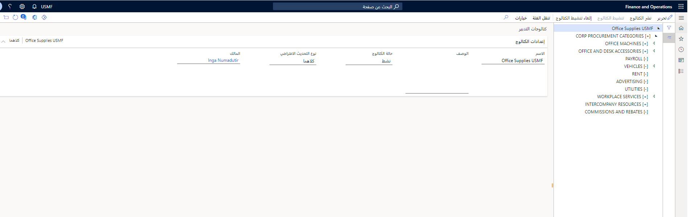

## إنشاء الكتالوجات وإدارتها 

هناك ثلاثة أنواع من الكتالوجات في وحدة التدبير.

- كتالوجات التدبير
- كتالوجات المورد
- الكتالوجات الخارجية

يمكن لمتخصصي الشراء إنشاء والاحتفاظ بكتالوجات للأصناف والخدمات التي يمكن شراؤها للاستخدام الداخلي في مؤسسة من خلال إعداد هذه الكتالوجات.
بعد إنشاء المنتجات، يمكنك إنشاء كتالوجات التدبير لتجميع المنتجات التي يمكن للمستخدمين الداخليين شراؤها، ويمكنك إنشاء كتالوجات الموردين التي تحتوي على المنتجات التي تشتريها من الموردين وإعداد الكتالوجات الخارجية. 

بعد إعداد الكتالوجات في **التدبير والتوريد > الكتالوجات > كتالوجات التدبير**، يمكن لموظفي الشركة إنشاء طلبات شراء لطلبها. يمكن استخدام الكتالوجات لفرض سياسات الشراء بحيث يمكن للموظفين فقط طلب الأصناف والخدمات المسموح بها للكيان القانوني للشراء الخاص بهم.

لإعداد كتالوج وجعله متوفراً للموظفين، يجب القيام بالمهام التالية.

-   قم بتكوين التدرج الهرمي لفئات التدبير قبل إنشاء الكتالوج.
-   حدد المنتجات التي ترغب في أن يتمكن الموظفون من طلبها. يمكنك إظهار منتجات معينة أو إخفائها في عقدة كتالوج، أو يمكنك إظهار كافة المنتجات الموجودة في إحدى العقد أو إخفاؤها.
-   حدد عدد كتالوجات التدبير التي تطلبها. يتم تحديد الوصول إلى كتالوج التدبير بواسطة قاعدة سياسة الكتالوج التي تقوم بتكوينها للكيان القانوني ووحدة التشغيل التي تم تعيين الموظف إليها.
    -   يمكن للموظفين طلب منتج فقط إذا كان موجوداً في كتالوج التدبير النشط لمؤسسك، وإذا كان موجوداً في عقدة ممكّنة وليست مخفية.
    -   كما يجب أن يكون المنتج من فئة يملك الموظف صلاحية الوصول إليها وفقاً لقاعدة سياسة الوصول إلى الفئة.
    -   في حالة عدم تحديد قاعدة سياسة كتالوج، تقوم قاعدة الوصول إلى الفئات وحدها بتحديد المنتجات التي يمكن لأحد الموظفين طلبها في الطلب.
-  حدد كيفية قيام المستخدمين بالتنقل عبر كتالوج المورد باستخدام سياسات التدبير.
-  حدد المنتجات التي يمكن للمستخدمين عرضها وطلبها.
-  أضف حق الوصول إلى مواقع ويب الموردين، وذلك في حالة السماح للمستخدمين بالطلب مباشرة من مورد، مثل طلب تجهيزات مكتبية. هذا يتطلب تكوين **التدبير والتوريد > الكتالوجات > الكتالوجات الخارجية**. وهذا يُعرف أيضاً باسم PunchOut أو eProcurement.
-   قم بتنشيط الكتالوج بحيث يمكن للمستخدمين عرض الكتالوج.
-   قم بتحديث الكتالوج من خلال تغييرات المنتج أو الكتالوج.

## إعداد كتالوج 

بعد استيفاء المتطلبات الأساسية، يمكنك إعداد الكتالوجات. يمكنك إنشاء كتالوج واحد تستخدمه المؤسسة بالكامل أو كتالوجات متعددة تستخدمها الأقسام المختلفة في مؤسستك. إذا قمت بإنشاء كتالوج واحد للمؤسسة بالكامل، يتم التحكم في الوصول إلى الكتالوج بواسطة قواعد نهج الشراء الخاصة بك.

يحدد الكتالوج المنتجات المتوفرة عند إنشاء طلبات الشراء، ولكن يمكنك استخدام قواعد سياسة الوصول إلى الفئة لتطبيق أي قيود إضافية. نظراً لأن العقد الموجودة في الكتالوج تمثل فئات التدبير، فمن الممكن منعها بواسطة قاعدة سياسة الوصول إلى الفئة. في هذه الحالة، لا تتوفر المنتجات الموجودة في هذه الفئة للموظفين لاستخدامها في الطلبات. يمكنك تحديد قواعد سياسة الوصول إلى الفئة في صفحة **نُهج الشراء**.

عندما يقوم وكيل شراء بإنشاء كتالوج، يجب عليه تحديد ما إذا كان يتم تحديث الكتالوج يدوياً أم تلقائياً ويجب تحديد مالك الكتالوج.

يتم نشر التحديثات تلقائياً أو يدوياً وفقا للخيار الذي قمت بتحديده للكتالوج في حقل **نوع التحديث الافتراضي** في صفحة **الكتالوجات**. تتوفر أنواع التحديثات الافتراضية التالية للكتالوجات:

-   **ديناميكي** - يتم تحديث الكتالوج تلقائياً كلما تم تغييره.
-   **ثابت** - يجب تحديث الكتالوجات يدوياً.

نظرا لأن المنتجات موروثة من فئات التدبير، فإنها تظهر جميعاً في عقد الكتالوج المناسبة. ويمكن لوكلاء الشراء التحكم في ما إذا كانت كافة المنتجات الموجودة في إحدى العقد مخفية أو معروضة عند استخدام الكتالوج في طلب شراء. يمكن أيضاً لوكلاء الشراء التحكم في ما إذا كانت المنتجات الفردية في إحدى العُقد مخفية أو معروضة.

قبل أن يتوفر الكتالوج للموظفين لاستخدامه في طلب، يجب تحديد قاعدة سياسة كتالوج للكتالوج، وتعيين حالة الكتالوج إلى **نشط**، ونشر الكتالوج. يمكن لوكلاء الشراء إلغاء تنشيط الكتالوجات التي لم تعد متاحة للمستخدمين.

لمعرفة المزيد حول كيفية استخدام كتالوجات التدبير في Supply Chain Management، شاهد هذا الفيديو.

&nbsp;
 > [!VIDEO https://www.microsoft.com/videoplayer/embed/RE3WCAm]
