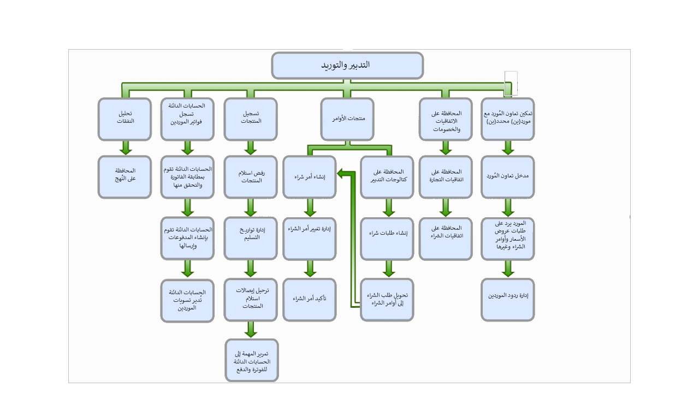

تمت مراجعة أربع خطوات أساسية في هذا السيناريو استنادا إلى هذه الصورة.
 

1.  إنشاء طلب شراء ومعالجته.
2.  إنشاء طلب عرض أسعار ومعالجته.
3.  إنشاء أمر شراء ومعالجته.
4.  استلام المنتجات وفوترتها من أمر شراء.
 
## إنشاء طلب شراء ومعالجته 

تنمو شركة USMF بسرعة وتحتاج إلى شراء بعض الخوادم الجديدة لقسم تكنولوجيا المعلومات. وقام تيم، مدير تكنولوجيا المعلومات، بالبحث عن خادم جديد ويحتاج الآن إلى طلب شرائه.

عثر تيم على خوادم مشابهة للمتطلبات، ولكنها لا تستوفيها كلها. وقرر إنشاء طلب شراء للخادم الجديد، ولكن لمنتج جديد ليس موجوداً حالياً في الكتالوج. أدخل تيم التفاصيل والمواصفات المتعلقة بالخادم. وعثر أيضاً على موقع ويب يوفر المنتج الذي يريده بدقة، لذا قام بإدخال عنوان URL في طلب الشراء. وقام أيضاً بتضمين الملحقات الإضافية الخاصة بالخادم في بنود الطلب.

وبعد ذلك، اقترح تيم مورداً مفضلاً للقيام بالشراء وهو شركة Alpine Electronics. ومع ذلك، لدى Alpine Electronics سجل سابق بعدم الوفاء بمتطلبات تاريخ التسليم. بالتالي، اقترح أيضاً مورداً جديداً، وهو شركة Trey Electronics، في طلب الشراء ثم أرسل طلب الشراء للموافقة.

## إنشاء طلب عرض أسعار ومعالجته 

عندما استلمت أليسيا الإخطار الجديد الخاص بطلب الشراء، قامت بمراجعة كافة المعلومات الموجودة في طلب الشراء وقررت إنشاء طلب عرض الأسعار (RFQ). هذا سوف يسمح للمورد المفضل والمورد الجديد بالمزايدة على توفير الخادم الجديد.

ونظراً لأنه قد تم إعداد شركة Alpine Electronics بالفعل لاستخدام مدخل تعاون المورد، فإن مدير المبيعات يتلقى إخطاراً بوصول طلب عرض أسعار جديد. لذا قامت بتسجيل الدخول إلى مدخل تعاون المورد وتعبئة التسعير وتواريخ التسليم للخادم الجديد والملحقات. وعندما انتهت، قامت بإرسال المعلومات.

في غضون ذلك، نظراً لأنه لم يتم إعداد شركة Trey Electronics لاستخدام مدخل تعاون المورد، فإنها استلمت رسالة فاكس من أليسيا بخصوص طلب عرض الأسعار. يقوم مدير المبيعات في Trey Electronics بملء المعلومات الضرورية ويرسل نسخة بالفاكس مرة أخرى إلى أليسيا.

عندما استلمت أليسيا رسالة الفاكس من Trey Electronics، يجب أن تُدخل التفاصيل يدوياً في الرد على طلب عرض الأسعار. وعند الانتهاء من إدخال تفاصيل رد Trey Electronics، تقوم بمقارنة الرد من Trey Electronics مع الرد من Alpine Electronics. بعد المراجعة، قررت أليسيا تأكيد المزايدة من Trey Electronics.

## إنشاء أمر شراء ومعالجته 

عندما أنشأت أليسيا طلب عرض الأسعار من طلب الشراء، سيعود الرد إلى الطلب. عندئذ تتم الموافقة على الطلب، ويمكن إنشاء أمر الشراء. يتم إرجاع الرد المقبول إلى الطلب، وعندما تقوم بفتح أمر الشراء، ومراجعة المعلومات، ثم إرسال الأمر.

> [!NOTE]
> أمر الشراء الذي يتم إنشاؤه من طلبات الشراء أو طلب عرض الأسعار لا ينتقل إلى مسودة.

تتطلب شركة USMF توجيه كافة عمليات الشراء غير المباشرة إلى قسم المحاسبة حتى يمكن التحقق من صحة الأبعاد المالية وتوزيعها. بالإضافة إلى ذلك، يجب أن يقوم مدير الموازنة بإكمال فحص الموازنة والموافقة على كافة مشتريات تكنولوجيا المعلومات.

استلمت أبرل، منسقة الحسابات المدينة، إخطاراً بمراجعة أمر الشراء الذي أرسلته أليسيا. تقوم أبرل بمراجعة أوامر الشراء وتعين الأبعاد المالية المناسبة لبنود الأوامر وتوزيع المبالغ بالتساوي على كافة أقسام الشركة.

وعندما تستلم أبرل إخطاراً لمراجعة أمر **قيد المراجعة**، فإن الاخطار في العادة يكون مهمة، ويتم تعيين عنصر العمل إلى أبرل. وعندما تنتهي، فإنها تكمل مراجعة الأمر، ويستلم ألكس، مدير الموازنة إخطاراً للموافقة على أمر الشراء.

يفتح ألكس أمر الشراء ويجري التحقق من الموازنة. عند اجتياز التحقق من الموازنة، يقوم بالموافقة على أوامر الشراء ويخطر النظام أليسيا بأنه تمت الموافقة على أمر الشراء. بعد ذلك تؤكد أليسيا أمر الشراء وترسل نسخة من التأكيد إلى Trey Electronics.

## استلام المنتجات وفوترتها من أمر شراء 

تستلم Trey Electronics الإخطار وتوفر المنتجات في وقت لاحق. يتم تسليم الخادم إلى المستودع لأنه كبير جداً لدرجة أنه لا يمكن استلامه في مكتب تيم. يتم تسليم ملحقات الخادم مباشرة إلى مكتب تيم.

عند وصول الخادم إلى المستودع، يقوم سامي، الذي يعمل في الشحن والاستلام، بمعالجة إيصال استلام المنتج للخادم وينقل الخادم إلى منطقة خاصة في المستودع تم تعيينها لمشتريات المكتب الأمامي. في غضون ذلك، يستلم تيم ملحقات الخادم في المكتب.

يقوم سامي بترحيل إيصال استلام المنتج الخاص بالملحقات، ثم إحضار الخادم إلى مكتب تيم، على العنوان المشار إليه في أمر الشراء.

بعد ذلك، تقوم آنيا، مسؤولة الدفاتر، باستلام الفاتورة لأمر الشراء ومعالجتها. وفي وقت لاحق من الأسبوع، تقوم أبرل، منسقة الحسابات المدينة، بإنشاء مقترح دفع وطباعة شيك لـ Trey Electronics.

> [!NOTE] 
> لا توفر هذه الوحدة معرفة دقيقة لعملية الاستلام والفوترة؛ وتتم فقط مناقشة العمليات الإجمالية من التدبير إلى الشراء. لمزيد من المعلومات، راجع [تكوين إدارة المخزون والتعامل معها في Dynamics 365 Supply Chain Management](/learn/modules/configure-inventory-management-dyn365-supply-chain-mgmt/?azure-portal=true)و[تنفيذ الإجراءات اليومية للحسابات المدينة في Dynamics 365 Finance .](/learn/modules/accounts-payable-daily-procedures-dyn365-finance/?azure-portal=true)
