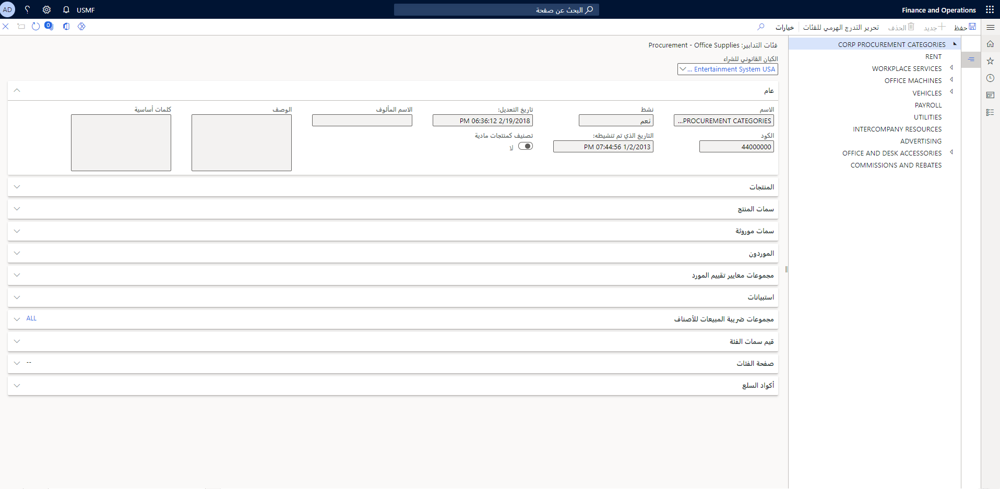

عند شراء أصناف من مورّد، قد يُطلب منك تقييمه.

يمكنك استخدام صفحة **معيار تقييم الموردين** لإنشاء مجموعة لمعايير تقييم الموردين المشابهة أو ذات الصلة.

لإنشاء مجموعات معايير تقييم مورّد جديدة، اتّبع الخطوات التالية.

1.  افتح **‏‫التدبير والتوريد‬ > الإعداد > الموردون > مجموعات معايير تقييم المورد**.
2.  حدد **جديد** لإنشاء سجل جديد.
3.  أدخِل معرّفاً فريداً في حقل **الاسم**.
4.  أدخِل وصفاً مختصراً في حقل **الوصف**.
5.  حدد **إغلاق** عند الانتهاء.

    

 
لإنشاء معيار جديد لتقييم المورّد، اتّبع الخطوات التالية.

1.  افتح **‏‫التدبير والتوريد‬ > الإعداد > الموردون > معيار تقييم الموردين**.
2.  حدد **جديد** لإنشاء سجل جديد.
3.  أدخِل معرّفاً فريداً في حقل **الاسم**.
4.  أدخِل وصفاً مختصراً في حقل **الوصف**.
5.  حدد مجموعة في حقل **مجموعة معايير تقييم المورد**.
6.  حدد **إغلاق** عند الانتهاء.

لتعريف مجموعات معايير لتقييم المورد لفئة تدبير، اتّبع الخطوات التالية.

1.  افتح **‏‫التدبير والتوريد‬ > ‏‫فئات التدبير‬**.
2.  حدد العقدة التي تريدها في التدرج الهرمي لفئات التدبير على اليمين لإضافة مجموعات معايير تقييم المورّد إليها، ثم حدد علامة التبويب **مجموعات معايير تقييم المورد**.

    
3.  حدد **إضافة**.
4.  في صفحة **إضافة مجموعات معايير تقييم الموردين**، حدد خانة الاختيار بجانب كل مجموعة معايير تقييم موردين تريدها في الشبكة اليُمنى. سيتم تحديد جميع معايير تقييم المورّد بشكل افتراضي في الشبكة اليُسرى. يمكنك اختيارياً تحديد معايير أو مسحها من أيٍ من الشبكتَين.
5.  استخدم الزر **تحديد** لنقل مجموعات المعايير أو المعايير المحددة إلى الشبكة السفلية.
6.  عند الانتهاء من تحديد المنتجات، حدد **موافق**.
7.  يمكنك بشكل اختياري تحديد خانة الاختيار **استيراد مجموعات معايير تقييم موردين من الفئات الأصلية**. عند تحديد هذا الخيار، سيتم عرض المجموعات التي تم استيرادها في الشبكة.

بعد تعيين مجموعات معايير تقييم المورد لفئة تدبير، يمكنك البدء في تقييم المورّدين المعينين لفئة التدبير المحددة.

لتقييم مورّد، اتّبع الخطوات التالية.

1.  افتح **‏‫التدبير والتوريد‬ > ‏‫فئات التدبير‬**.
2.  حدد العقدة التي تريدها في التدرج الهرمي لفئات التدبير على اليمين لإضافة سمات المنتج إليها، ثم حدد علامة التبويب **الموردون**.
3.  حدد المورّد الذي تريده ثم حدد **التقييم**.
4.  في قسم **التصنيف على أساس معايير تقييم المورّد**، حدد خيار **التقييم** لأداء المورّد في المجال المحدد.

5.  أغلِق الصفحة عند الانتهاء.

أثناء تحديث حقل **التقييم** لكل معيار لتقييم المورّد، سيتم تحديث حقل **متوسط التصنيف** تلقائياً.

استخدم الحقول **الكيان القانوني للشراء** و **حساب المورّد** و **الفئة** في الجزء العلوي من الصفحة لتصفية معلومات التقييم وتحديثها لمورّدين إضافيين أو فئات إضافية.

يتم دعم الأداء ومراجعة الشراء من خلال تقارير التدبير وحسابات المدفوعات، والتي تشمل تحليل الإنفاق وتحليل أداء المورّدين.

## وضع مورّد قيد الانتظار

تقترن مهام متعددة بالمورّدين. تُستخدم مهام المورّد هذه في الحركات اليومية والفواصل الزمنية الدورية. ويتم استخدامها أيضاً من أجل التحكم في سير العمل والتحقق من صحته.

تحدد حالة الانتظار لأي مورّد أنواع الحركات التي تسمح بها مؤسستك مع المورّد. على سبيل المثال، قد يمنع انتظار المورّد الموظفين من إنشاء أمر شراء لأحد المورّدين.

لوضع المورّد قيد الانتظار في العميل الثري، اتّبع الخطوات التالية.

1.  انتقل إلى **التدبير والتوريد > الموردون > كافة الموردين**.
2.  حدد حساب مورّد.
3.  في جزء الإجراء، حدد **قيد الانتظار**.

    
4.  في الصفحة التي يتم عرضها، حدد خياراً في حقل **تعليق المورّد**:
    -   **لا** - يشير إلى أن المورّد ليس قيد الانتظار ويمكن إكمال الحركات للمورّد.
    -   **الفاتورة** - تشير إلى تعذُّر معالجة فواتير المورّد الجديدة للمورّد المحدد.
    -   **الكل** - يشير إلى أنه لا توجد حركات جديدة يمكن معالجتها للمورّد المحدد.
    -   **الدفع** - يشير إلى تعذُّر معالجة دفاتر يومية المدفوعات الجديدة للمورّد المحدد.
    -   **الطلب** - يشير إلى تعذُّر معالجة طلبات الشراء الجديدة للمورّد المحدد.
    -   **أبداً** - يشير إلى أن المورّد المحدد لا يكون قيد الانتظار أبداً.
5.  في حقل **تعليق المورد لتاريخ الإصدار**، أدخل التاريخ الذي يجب أن ينتهي فيه تعليق الدفع وموعد إجراء المدفوعات للمورّد مرة أخرى. إذا لم تُدخل تاريخاً، يظل التعليق بشكل غير محدود.

    
6.  يمكن اختيارياً تمكين خيار **تطبيق التعليق في كافة الكيانات القانونية** لتطبيق التعليق على المورّد في جميع الكيانات القانونية.
7.  حدد **موافق**.
