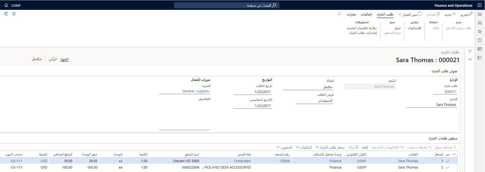
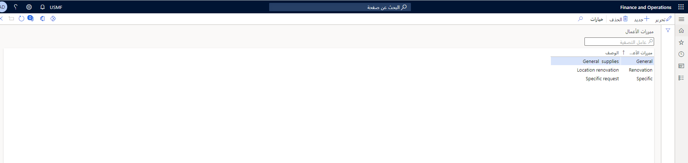

إذا كانت مؤسستك تتطلب أصناف غير مباشرة (أصناف غير مطلوبة بواسطة التخطيط الرئيسي)، فيمكنك إرسال طلبات شراء لهذه الأصناف. يمكنك أيضاً استخدام طلبات الشراء للمواد المباشرة.

طلبات الشراء هي مستندات داخلية، بينما أوامر الشراء تعادل المستندات الخارجية التي يرسلها قسم المشتريات إلى الموردين.

يمكنك تحديد الأصناف من كتالوجات التدبير التي تحتوي فقط على الأصناف ذات الصلة بطلبات الشراء.

### السيناريو
 
تعمل بروك كمساعدة للموارد البشرية (HR) وتحتاج أحياناً إلى شراء لوازم مكتبية لقسمها. لأنها مندوب غير مشتريات وليس لديها الصلاحية للوصول إلى صفحة **أوامر الشراء**، يمكنها استخدام صفحة **طلب الشراء** لتقديم طلبات الشراء والحصول على إذن لشراء الأصناف التي تحتاج إليها.

يمكن أن تختلف عملية طلب الشراء من شركة إلى أخرى وتتضمن عادةً ثلاثة أدوار رئيسية:

-   **الطالب** - المستخدم الذي طلب العنصر وسيتسلمه في بند طلب الشراء، حتى إذا لم يقم هذا المستخدم بالفعل بإنشاء طلب الشراء. يمكن أن يكون العديد من المتقدمين المختلفين في نفس طلب الشراء. تُستخدم إعدادات الطالب (مثل التوظيف والقسم ومركز التكلفة) لبند طلب الشراء، وفي عملية سير العمل، يمكن استخدام معلومات الطالب (مثل حدود الإنفاق وعلاقات إعداد التقارير) لتوجيه بند طلب الشراء من خلال عملية المراجعة.

    > [!NOTE]
    > يتم تحديد القواعد والسياسات من قِبل الكيان القانوني أو المؤسسة التي يعمل بها الطالب.
    
-   **المعد** - المستخدم الذي يقوم بإنشاء طلب الشراء وإرساله. اعتماداً على كيفية إعداد النظام، يمكن للمستخدمين إنشاء طلبات شراء نيابة عن مستخدمين آخرين. في هذه الحالة، لا يكون الطالب هو نفسه الذي ينشئ طلب الشراء ويرسله. المُعد هو الشخص المناسب للطلب. على سبيل المثال، إذا تم رفض طلب شراء في سير العمل، فسيتم إرساله مرة أخرى إلى المُعد؛ أو، إذا احتاج الأمر إلى الاستدعاء، فيمكن للمُعد تنفيذ هذا الإجراء، لكن لا يستطيع مقدم الطلب ذلك.
-   **الموافق** - الموافق هو المستخدم الذي يجب أن يوافق على طلب الشراء. في بعض الحالات، قد يكون هناك أكثر من جهة موافقة لبند واحد أو جهة موافقة مختلفة لكل بند في طلب الشراء. بالاضافه إلى ذلك، قد يكون لدى **المراجع** مهمة في سير العمل.

## حالات طلبات الشراء 

بناءً على تقدم طلب الشراء، يمكن أن يكون له حالات مختلفة. يتم عرض حالة طلب الشراء في رأس طلب الشراء في صفحة **طلبات الشراء** وعلى صفحات قائمة طلبات الشراء المختلفة.

يمكن أن يكون لطلبات الشراء الحالات التالية:

-   **مسودة** - تم إنشاء طلب الشراء وبند طلب الشراء، لكن لم يتم إرسالهما للمراجعة.
    يمكن تعديل طلبات الشراء وبنود طلبات الشراء التي لها حالة مسودة. يكون لطلب الشراء أو بند طلب الشراء أيضاً حالة "مسودة" إذا تم استدعاؤه ولكن لم تتم إعادة تقديمه للمراجعة. يمكنك إرسال أو استدعاء طلب شراء على مستوى المستند. ومع ذلك، لا يمكنك إرسال أو استدعاء بند طلب شراء واحد.
-   **قيد المراجعة** - تم إرسال بنود طلب الشراء للمراجعة. عند اكتمال عملية سير العمل لبند طلب الشراء، تظل حالة هذا البند قيد المراجعة حتى تتم مراجعة جميع بنود طلب الشراء المتبقية.
-   **مرفوض** - تم رفض طلب الشراء وجميع بنود طلب الشراء. يمكن إعادة تقديم طلبات الشراء وبنود طلبات الشراء التي تم رفضها.
-   **موافق عليه** - يصل طلب الشراء إلى حالة موافق عليه عند اكتمال الخطوة الأخيرة في سير العمل بنجاح. عند الموافقة على طلب الشراء، يمكن إنشاء أمر الشراء من بنود طلب الشراء.
-   **ملغى** - تم إلغاء طلب الشراء وجميع بنود طلب الشراء. ملاحظة: إذا لم تعد بحاجة إلى صنف موجود في بند طلب الشراء، فيجب عليك إلغاء بند طلب الشراء إذا تمت الموافقة عليه بالفعل. يمكن إلغاء بنود طلب الشراء التي تمت الموافقة عليها فقط.
    إذا كان أي بند من بنود طلب الشراء قيد المراجعة، فستكون حالة طلب الشراء قيد المراجعة. في هذه الحالة، يمكنك استدعاء طلب الشراء وحذف بند طلب الشراء المناسب.
-   **مغلق** - عند إنشاء أمر الشراء، يكون طلب الشراء مغلقاً.

## صفحات قوائم طلبات الشراء 

في Supply Chain Management، يتم تنفيذ مهام الشراء في وحدة التدبير والتوريد.

تتوفر العديد من صفحات القوائم التي يمكنك استخدامها لعرض طلبات الشراء وإدارتها. يتمتع بعض المستخدمين بامتياز الأمان للوصول إلى جميع طلبات الشراء، بينما يمكن للمستخدمين الآخرين فقط عرض بعض طلبات الشراء.

بشكل افتراضي، يسمح دور مندوب الشراء ومدير المشتريات للمستخدم بعرض جميع طلبات الشراء.

يتمتع معظم المستخدمين افتراضياً فقط بالوصول إلى طلبات الشراء التي قاموا بإنشائها أو الطلبات التي تم إنشاؤها لهم أو تلك التي تم تعيينها لهم للمراجعة. يمكن للمديرين أيضاً الوصول إلى طلبات الشراء الخاصة بالمستخدمين الذين يقدمون تقاريرهم إليهم.

توضح القائمة التالية صفحات قائمة طلبات الشراء المتوفرة في Supply Chain Management:

-   **التدبير والتوريد > طلبات الشراء > جميع طلبات الشراء** - استخدم صفحة القائمة هذه لعرض جميع طلبات الشراء. يمكنك إضافة طلب عرض أسعار، وعرض إجمالي المبلغ الملخص لجميع البنود في طلب الشراء المحدد، ومقارنة إصدارات طلب الشراء أثناء معالجته، وعرض بيانات الميزانية الخاصة بطلب الشراء وإدارتها.
-   **التدبير والتوريد > طلبات الشراء > طلبات الشراء التي قمت بإعدادها** - تشبه صفحة القائمة هذه صفحة قائمة **جميع طلبات الشراء**، فيما عدا أنه يقوم بتصفية العرض لعرض طلبات الشراء التي تم إنشاؤها بواسطة المستخدم الحالي فقط. يتضمن هذا أيضاً طلبات الشراء التي تم إنشاؤها لمستخدم آخر نيابة عن شخص آخر. هذه هي صفحة القائمة الرئيسية التي يستخدمها الموظفون الذين ينشئون طلبات الشراء لأنفسهم ولموظفين آخرين.
-   **التدبير والتوريد > طلبات الشراء > طلبات الشراء التي تتطلب إجراء مني > طلبات الشراء المعينة لي** - صفحة القائمة هذه عبارة عن ملحق لصفحة قائمة **جميع طلبات الشراء** يقوم بتصفية العرض لعرض طلبات الشراء التي تم تعيينها للمستخدم الحالي فقط.
-   **التدبير والتوريد > طلبات الشراء > طلبات الشراء التي تتطلب إجراء مني > طلبات الشراء المعينة لقوائم الانتظار الخاصة بي** - صفحة القائمة هذه عبارة عن ملحق لصفحة قائمة **جميع طلبات الشراء** يقوم بتصفية العرض لعرض طلبات الشراء التي تم تعيينها لأي قوائم انتظار تم تعيين المستخدم الحالي إليها فقط.
-   **التدبير والتوريد > طلبات الشراء > طلبات الشراء التي تتطلب إجراء مني > لم يتم تسجيل طلبات الشراء** - تعرض صفحة القائمة طلبات الشراء مع ظهور أخطاء وتحذيرات، مثل الالتزام المسبق أو معالجة الميزانية.
-   **التدبير والتوريد > طلبات الشراء > مراجعة طلبات الشراء > طلبات الشراء المطلوبة لي** - صفحة القائمة هذه عبارة عن ملحق لصفحة قائمة ‬‏‫**جميع طلبات الشراء** يقوم بتصفية العرض لعرض طلبات الشراء التي تحتوي على الأصناف المطلوبة للمستخدم الحالي فقط. يتضمن هذا طلبات الشراء التي تم إنشاؤها للمستخدم الحالي بواسطة شخص آخر.
-   **التدبير والتوريد > طلبات الشراء > مراجعة طلبات الشراء > طلبات الشراء لتقاريري المباشرة** - صفحة القائمة هذه عبارة عن ملحق لصفحة قائمة ‬‏‫**جميع طلبات الشراء** يقوم بتصفية العرض لعرض طلبات الشراء التي تحتوي على الأصناف المطلوبة للمستخدمين الذين يقدمون تقارير مباشرة إلى المستخدم الذي يقوم بتسجيل الدخول حالياً.
-   **التدبير والتوريد > طلبات الشراء > مراجعة طلبات الشراء > طلبات الشراء لجميع تقاريري** - صفحة القائمة هذه عبارة عن ملحق لصفحة قائمة ‬‏‫**جميع طلبات الشراء** يقوم بتصفية العرض لعرض طلبات الشراء التي تحتوي على الأصناف المطلوبة للمستخدمين الذين يقدمون تقارير مباشرة إلى المستخدم الذي يقوم بتسجيل الدخول حالياً بطريقة مباشرة أو غير مباشرة.
-   **التدبير والتوريد > طلبات الشراء > تمت الموافقة على معالجة طلبات الشراء > تحرير طلبات الشراء الموافق عليها** - يتم استخدام صفحة القائمة هذه بواسطة مندوب الشراء لإجراء توحيد الطلبات، إذا كان ذلك مناسباً، ولإنشاء أوامر شراء لبنود طلبات الشراء الموافق عليها.

## صفحة طلبات الشراء

صفحة **طلبات الشراء** في **التدبير والتوريد > طلبات الشراء > جميع طلبات الشراء** هي المكان الذي يمكنك فيه إنشاء طلب شراء أو تعديله ثم إرسال طلب الشراء للمراجعة. يمكنك إنشاء طلبات شراء لعدة مستخدمين في كيانات قانونية أو مؤسسات متعددة.

في صفحة **طلبات الشراء**، يمكنك نسخ طلب شراء موجود وبنود طلب شراء لإنشاء طلب شراء جديد. يمكنك أيضاً الموافقة على طلبات الشراء التي تم تعيينها لك أو رفضها أو إكمالها. إذا كانت لديك الأذونات اللازمة، فيمكنك أيضاً إنشاء طلب عرض أسعار مباشرةً من طلب شراء.

> [!NOTE]
> يمكنك إكمال طلب الشراء إذا كانت مهمة المراجعة موجودة في سير عمل طلب الشراء وعندما يكون لديك مهمة موافقة يمكنك الموافقة عليها أو رفضها أو تفويضها أو طلب تغيير لها.

يمكنك أيضاً إدخال طلبات شراء نيابةً عن مستخدم آخر إذا كان لديك أذونات لطلب منتجات لعامل آخر.

انتقل إلى **التدبير والتوريد > طلبات الشراء > جميع طلبات الشراء** لإنشاء طلب شراء.

عند إضافة بند جديد في صفحة **طلب الشراء**، يمكنك تحديد صنف أو فئة، أو يمكنك استخدام زر **إضافة المنتجات** لإضافة أصناف من قائمة الفئات.

بدلاً من إضافة بند أو فئة، يمكنك تحديد أصناف من كتالوج خارجي. يسمح لك هذا بالانتقال إلى موقع ويب المورد واختيار الأصناف الخاصة بك، وعند تسجيل الخروج، يسمح لك بالعودة إلى صفحة **طلب الشراء**. يُعرف هذا باسم **PunchOut** أو **eProcurement** للمورد.

باستخدام طلبات الشراء، يمكنك القيام بالمهام التالية:

-   طلب الأصناف والخدمات من كتالوج المشتريات. يمكنك أيضاً طلب أصناف وخدمات غير مدرجة في كتالوج إذا كان هذا الإجراء مدعوماً بواسطة سياسات الشراء الخاصة بك.
-   اطلب أصناف أو خدمات نيابة عن شخص آخر، أو في كيان قانوني أو وحدة تشغيل غير تلك التي تشغل فيها منصباً أساسياً.
-   اقترح مورداً لطلب صنف أو خدمة منه.
-   قم بتوزيع مبلغ في بند طلب الشراء على عدة أبعاد وحسابات مالية.
-   قم بإجراء فحص الميزانية على طلب الشراء إذا كانت مؤسستك تستخدم فحص الميزانية.
-   قدم طلب الشراء للمراجعة والموافقة.

## طلب تغييرات على طلب الشراء 

عندما يتم تعيين طلب شراء لك ومراجعته بواسطتك، فقد تحتاج إلى طلب تغييرات من مُعد طلب الشراء قبل الموافقة عليه.

على سبيل المثال، قد يتطلب تبرير الأعمال مزيداً من التفاصيل للموافقة على طلب الشراء، أو أن تاريخ التسليم المطلوب مبكر جداً وسيؤدي إلى تجاوز الميزانية في الشهر الحالي.

كما يمكنك استخدام إجراء **طلب التغيير** لإرسال طلب الشراء إلى شخص آخر غير المُعد عندما يتعين عليك الحصول على إدخال من شخص لم يتم تكوينه كمراجع أو موافق في سير العمل.

على سبيل المثال، لا تريد أن يغير المستخدم شيئاً ما، لكنك تحتاج فقط إلى أن يكتب المستخدم تعليقاً.

عندما تستخدم خيار **طلب التغيير**، سيتم استئناف سير العمل من حيث توقف. في المقابل، عندما ترفض طلب شراء، فسوف يمر عبر سير العمل بأكمله مرة أخرى. ولذلك، يجب ألا تطلب التغييرات التي تبطل الموافقات التي تم توفيرها بالفعل من قِبل الموافقين السابقين؛ في هذه الحالة، يكون إجراء الرفض هو الخيار الأفضل.

## تحويل طلبات الشراء إلى أوامر الشراء 

يمكنك تحديد سياسات الشراء لإنشاء القواعد التي تحدد ما إذا كان يتم إنشاء أمر الشراء تلقائياً من طلب الشراء عند اكتماله أو لا. تتحكم إعدادات أمر الشراء وقاعدة دمج الطلبات في كيفية إنشاء أوامر الشراء عند الموافقة على طلب الشراء.

بشكل افتراضي، يجب إنشاء جميع أوامر الشراء يدوياً من صفحة قائمة **إصدار طلبات اشلراء الموافق عليها** ما لم تحدد قاعدة سياسة محددة إجراءات مختلفة.

عندما يصل طلب الشراء إلى حالة "موافق عليه"، يمكنك إنشاء أمر (أوامر) الشراء تلقائياً، باستخدام وظيفة دفعية أو دونها، أو يدوياً.

## دمج الطلبات

يمكن أن يساعدك دمج الطلبات على تقليل تكاليف الشراء والتأثير على قدرتك التفاوضية مع الموردين. ومن خلال تجميع الطلب للسلع والخدمات، يمكنك تحقيق أسعار أفضل وخفض تكاليف الشحن والمناولة وتقليل التكاليف العامة.

وعند الموافقة على طلبات الشراء، يتم تقييمها وفقاً لقواعد الشراء التي تحددها وتتم إما معالجتها تلقائياً في أوامر الشراء أو الاحتفاظ بها للمعالجة اليدوية. من طلبات الشراء التي يتم الاحتفاظ بها للمعالجة اليدوية، قد يكون عدد قليل محدد مؤهلاً لدمج الطلبات.

لدمج بنود طلب الشراء، اتبع الخطوات التالية:

1.  تقييم بنود طلب الشراء وتجميعها في فرص الدمج.
2.  تحديث بنود طلب الشراء بالتغييرات التي تم إجراؤها على المورد أو السعر أو التاريخ المطلوب أو بيانات عرض الأسعار.
3.  إنشاء أوامر شراء لبنود الطلب المدمج.

## نظره عامة على دمج الطلبات

بنود طلب الشراء مؤهلة لفرصة الدمج، فقط إذا تمت الموافقة على طلب الشراء واستيفاء إنشاء أمر الشراء ومعايير قاعدة دمج الطلبات للمعالجة اليدوية ودمج الطلبات.

فرصة الدمج هي مجموعة من بنود طلبات الشراء التي يتم تجميعها معاً بحيث يمكن لمحترف الشراء التفاوض بشأن أفضل صفقة مع الموردين.

تتم معالجة طلبات الشراء المعتمدة التي لا تستوفي معايير دمج الطلبات إما تلقائياً أو يدوياً في أوامر الشراء، استناداً إلى إعدادات القاعدة.

عندما تريد دمج بنود طلب الشراء، فأنت بحاجة إلى إنشاء فرصة دمج وإضافة بنود من قائمة **إصدار طلبات الشراء الموافق عليها**. يمكنك تعديل بنود الطلب إذا لزم الأمر، على سبيل المثال، عن طريق تغيير المورد أو تواريخ التسليم لأصناف البنود.

بعد إضافة بنود الطلب إلى فرصة الدمج وإجراء أي تغييرات ضرورية، يمكنك إنشاء أمر شراء لبنود طلب الشراء المدمج. يجب معالجة بنود طلب الشراء غير المؤهلة لدمج الطلبات أو التي لم يتم تحديدها لفرصة الدمج يدوياً لإنشاء أمر شراء.

لدمج بنود طلب الشراء الموافق عليها، اتبع الخطوات التالية:

1.  مراجعة بنود الطلب الموافق عليها المؤهلة للدمج.
2.  تحديد أصناف البنود التي تريد إضافتها إلى فرصة دمج.
3.  إتاحة فرصة دمج جديدة أو إضافة أصناف بنود طلب إلى فرصة دمج طلبات موجودة.
4.  قم بتطبيق أي تغييرات تريد إجراؤها على أصناف بنود الطلب وإزالة أصناف بنود الطلب التي لم تعد ترغب في تضمينها في فرصة الدمج.
5.  إنشاء أوامر شراء لبنود الطلبات المدمجة أو فرصة دمج الطلبات المحددة.

شاهد هذا العرض التوضيحي لمعرفة كيفية إنشاء طلب شراء في Supply Chain Management. 

 > [!VIDEO https://www.microsoft.com/videoplayer/embed/RE3WhKN]

## إعداد رموز تبرير الأعمال 

إذا كانت لديك الأذونات الصحيحة، فيمكنك تحديد رموز أسباب تبرير العمل لتصنيف وتعقب أنواع معينة من عمليات الشراء.

على سبيل المثال، يمكنك إنشاء رموز للإشارة إلى إجراء عملية شراء لاستئجار جديد أو استبدال مجدول أو فشل في المعدات أو حدث تسويقي أو سبب آخر محدد.

نظراً لظهور رموز تبرير الأعمال في طلبات الشراء، يكون سبب الشراء مرئياً على الفور لأي شخص يقوم بمراجعة طلب الشراء.

انتقل إلى **التدبير والتوريد > الإعدادات > السياسات > تبريرات الأعمال** لإنشاء التبريرات.

