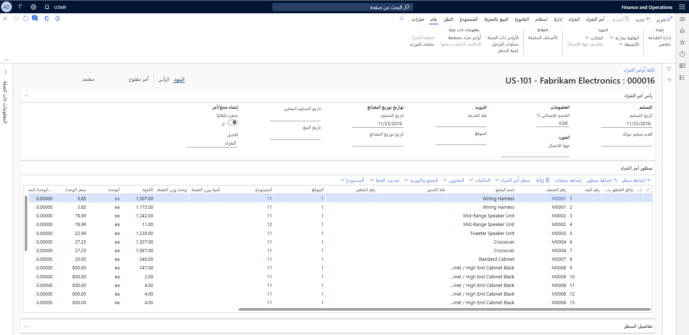
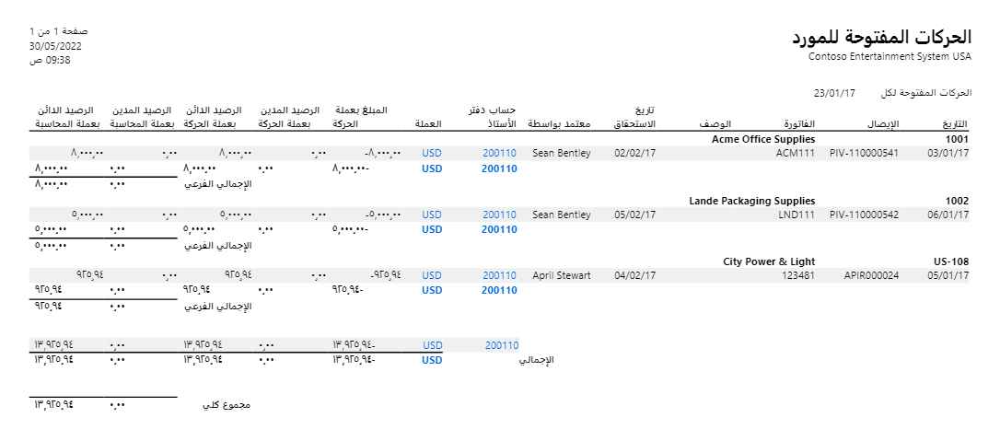

عند الموافقة على طلب الشراء وتحديد مورّد، يمكنك إنشاء أمر الشراء لشراء الأصناف. 

## أوامر الشراء
يمكن لأوامر الشراء أن تساعد الأشخاص في مختلف الأدوار على تحديث وتعقب حالات الأوامر. على سبيل المثال، يستخدم مندوب الشراء أوامر الشراء لتعقب قائمة المنتجات التي يتم شراؤها من مورد معين. يتم تسجيل معلومات، مثل السعر ومعلومات التسليم والأصناف في أمر الشراء. بالإضافة إلى ذلك، سيقوم مندوب الشراء بإنشاء مستند تأكيد أمر الشراء. هذا مستند خارجي يتم إرساله إلى المورد لإخطاره بالشراء.

**التدبير والتوريد > أوامر الشراء > جميع أوامر الشراء**

عند إنشاء أمر شراء، يجب الإشارة إلى نوع الأمر. يمكنك تحديد أحد أنواع الأوامر التالية. 

- **دفتر اليومية** - استخدم هذا كمسودة أو قالب. لا يمكنك معالجة دفتر يومية لأنه لا توجد حركات مخزون له.
- **أمر الشراء** – استخدمه عندما يؤكد المورد على أمر. 
- **الأمر الذي تم إرجاعه** – استخدمه عند إرجاع البضائع إلى المورد. يجب إدخال رقم الصنف المرتجع أو رقم ترخيص البضائع المرتجعة (رقم RMA) الذي يمنحك إياه المورد في علامة التبويب أخرى. 

يمكن أن يحتوي أمر الشراء على عدة حالات تشير إلى مكان الأمر المحدد في عملية أمر الشراء. كجزء من عملية تنشيط إدارة سير العمل والتغيير، يتم تنفيذ حالة الموافقة على أمر الشراء في رأس أمر الشراء، ويمكن أن يكون أياً مما يلي. 

- أمر مفتوح 
- تم الاستلام 
- مفوتر 
- مُلغى‬

بالإضافة إلى ذلك، يكون لكل أمر شراء حالة مستند تشير إلى حالة أحدث مستند تم إكماله للأمر. تشمل هذه الحالات ما يلي. 

- **لا شيء** – لم تتم معالجة أي مستندات للأمر بعد. 
- **استعلام الشراء** – تم إنشاء استعلام شراء، وكان الأمر في انتظار التعليقات من المورد.
- **أمر الشراء** - تمت معالجة التأكيد على الأمر.
- **إيصال استلام المنتجات** - تمت معالجة إيصال استلام المنتجات في الأمر. 
- **الفاتورة** – تم حساب فاتورة بالأمر.

نظراً لأنه يتم حساب الحالة وحالة المستند بشكل منفصل، يمكن أن تساعد مجموعات مختلفة من الحالات وحالة المستند بشكل إضافي في تحديد حالة الأمر. على سبيل المثال، إذا كانت حالة الأمر هي **أمر مفتوح** وكانت حالة المستند هي **الفاتورة**، يمكنك استنتاج أن الأمر قد تم استلامه وفوترته جزئياً.

لتعقب أوامر الشراء المفتوحة والحركات الأخرى أثناء حدوثها، يمكنك تشغيل تقرير في Finance يظهر الحركات المفتوحة للموردين. انتقل إلى تقرير **حسابات المدفوعات > الاستعلامات والتقارير > الحركات المفتوحة للمورد**. يمكنك هنا تحديد نطاق من التواريخ وعامل التصفية على الموردين. تعرض لقطة الشاشة التالية مثالاً لتقرير **الحركات المفتوحة للمورد** للمورّد **1001** الذي يعد جزءاً من شركة العروض التوضيحية **Contoso Retail USA**.  

> [!NOTE] 
> لاستخدام تقرير **الحركات المفتوحة للمورد** يجب تمكين الميزة في مساحة العمل **إدارة الميزات**. 

شاهد هذا العرض التوضيحي لمعرفة كيفية إنشاء أمر شراء ومعالجته في Dynamics 365 Supply Chain Management. 

 > [!VIDEO https://www.microsoft.com/videoplayer/embed/RE3VwYz]
