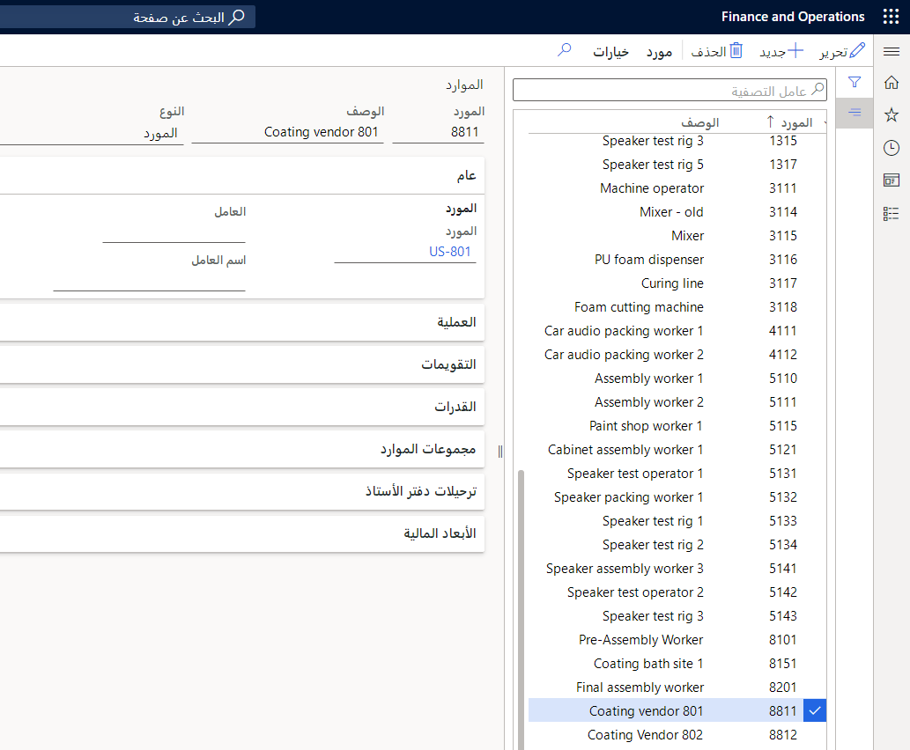

في Supply Chain Management، يمكنك إنشاء اتفاقيات شراء وإقرانها بتدفقات الإنتاج. تحتوي اتفاقية الشراء على جميع معلومات التسعير الخاصة بالخدمة المرتبطة، والتي يوفرها المقاول الفرعي.

سيتم إنشاء أوامر التحرير من اتفاقية الشراء للإشارة إلى الطلبات وإدارة التأكيدات والإبلاغ عن الإيصالات والدفع مقابل خدمة التعاقد من الباطن.

لحساب تكلفة المنتجات، يجب تحديد التكلفة القياسية للخدمة. يمكنك تحديد التكلفة عن طريق الاختيار **التكاليف القياسية** في **نموذج المخزون** مجال مجموعات نماذج الصنف التي سيتم تخصيص المنتجات المصنعة لها.

ويجب أن يكون لديك اتفاقية شراء مع المورد قبل أن يتاح له التعاقد من الباطن على أساس النشاط.

لمزيد من المعلومات حول اتفاقيات الشراء وعملية الشراء حتى الشراء، راجع الروابط الموجودة في وحدة الملخص في نهاية هذه الوحدة.

## تعمل مجموعة الموارد كخلية عمل

لتكوين خلية عمل على أنها متعاقد عليها من الباطن، يجب إنشاء مَورد نوع **المُورّد** وربطه بخلية العمل (مجموعة الموارد). يجب أن يكون المورد المحدد في اتفاقية الشراء هو أيضاً البائع المتصل بخلية العمل.

**مراقبة الإنتاج> إعدادات> الموردين> الموردين**

 

يجب تعيين فئة تكلفة وقت التشغيل مع نوع مجموعة تكلفة "الاستعانة بمصادر خارجية مباشرة" إلى خلية العمل. لا نحتاج إلى فئات التكلفة للإعداد والكمية.

Supply Chain Management، يمكن تصميم المواقع وخلايا العمل على أنها مورد من خلال تعيين حساب المورّد إلى مستودع أو إلى مورد لمجموعة موارد.
