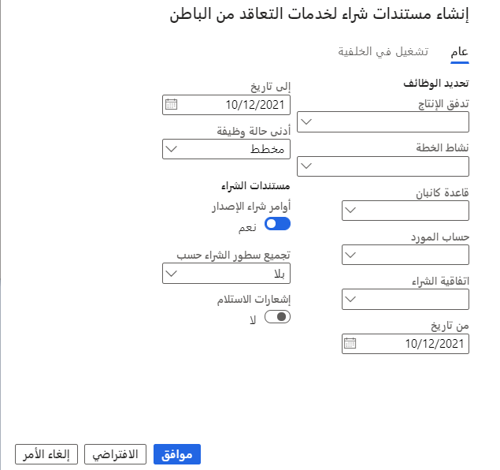

يتم تعيين خدمة التعاقد من الباطن لنشاط تدفق الإنتاج باستخدام اتفاقيات الشراء. تحتوي اتفاقية الشراء على الخدمة ومعلومات التسعير الخاصة بالخدمة المرتبطة.

عند تعيين خدمة التعاقد من الباطن بنشاط فرعي خلال تدفق الإنتاج، يمكنك ضبط شروط الخدمة لتحديد أساس الدفع للمورد.

انتقل إلى **التحكم في الإنتاج > المهام الدورية > معالجة وظيفة كانبان الدُفعية >مستندات التعاقد من الباطن**.

 

-   **تدفق الإنتاج** - يسمح لك بتحديد تدفق الإنتاج لإنشاء مستندات التعاقد من الباطن.

-   **نشاط الخطة** - يسمح لك بتحديد اسم النشاط لإنشاء مستندات التعاقد من الباطن.

-   **قاعدة كانبان** - تسمح لك بتحديد قاعدة كانبان لإنشاء مستندات التعاقد من الباطن.

-   **حساب المورد** - يسمح لك بتحديد البائع لإنشاء مستندات التعاقد من الباطن.

-   **من تاريخ** - حدد فقط الوظائف التي لها تاريخ وظيفي يساوي هذا التاريخ أو بعده.

-   **إلى تاريخ** - حدد الوظائف ذات تاريخ الوظيفة الذي يساوي أو قبل هذا التاريخ. بالنسبة للوظائف المخططة، يتم استخدام تاريخ الفترة المخططة. بالنسبة للوظائف المكتملة، يتم استخدام تاريخ الاكتمال الفعلي.

-   **الحد الأدنى من حالة الوظيفة** - يسمح لك الحد الأدنى من حالة الوظيفة باختيار وظائف كانبان التي تريد إنشاء مستندات شراء لها.

    -   **غير مخطط**

    -   **مخطط** (موصى به لإنشاء أمر الشراء)

    -   **مُعد** (مُوصى به لإنشاء أمر الشراء)

    -   **قيد التنفيذ** (موصى به لإنشاء أمر الشراء)

    -   **مكتمل** (موصى به لإيصال طلب الشراء)

-   **إصدار أوامر الشراء** - عند تحديده، ستنشئ الأداة المساعدة أوامر إصدار الشراء من اتفاقية الشراء لوحدات كانبان التي لم يتم إنشاؤها بالفعل لمعايير التحديد.

-   **تجميع بنود الشراء حسب** - Dynamics 365 for Finance and Operations يوفر تحديدات متنوعة لتجميع الطلب:

    -   **بلا** - إنشاء أمر شراء لكل كانبان.

    -   **يوم** - يُنشئ أمر شراء واحداً لكل مورد لجميع وظائف كانبان المجدولة ليوم واحد.

    -   **شهر** - إنشاء أمر شراء واحد لكل مورد للشهر المحدد.

    -   **الكل** - يُنشئ أمر شراء لكل مورد لكانبان.

-   **إشعارات الاستلام** - عند تحديده، ستنشئ الأداة إيصالات شراء لأوامر الشراء الحالية. هذا الخيار متاح فقط لوظائف كانبان المكتملة.

تتيح لك Supply Chain Management شراء أصناف الخدمة المستخدمة في عملية التعاقد من الباطن ودفعها وجدولتها واستلامها.

يتم تشغيل إنشاء مستند الشراء بشكل فردي أو وضعه في قائمة انتظار دُفعات للدفع وجدولة واستلام العملية. تقوم الأداة المساعدة بإنشاء إصدارات أوامر الشراء من اتفاقية الشراء وترحيل الإيصالات بناءً على الوظائف الفرعية المكتملة والتي تم إنشاؤها مسبقاً كتحرير لاتفاقية الشراء. يمكنك تحديد الإجراء باستخدام معايير الاختيار على الصفحة.

## تعيين شروط خدمة متعددة

تتيح لك Supply Chain Management الحصول على أصناف خدمة متعددة لكل نشاط من أنشطة تدفق الإنتاج.

لتعيين أصناف خدمة متعددة لتدفق واحد، حدد الزر **إضافة** في علامة التبويب السريعة **شروط الخدمة** واتبع المعالج. بعد ذلك، يمكنك تعيين منتجات مُخرجة لشروط الخدمة. المنتج المُخرج هو الصنف الذي أُنتج بواسطة المقاول من الباطن. قد يكون مصطلح خدمة مختلفة إما نتاج خدمة مختلفة أو نسبة حساب / معدل مختلف.
