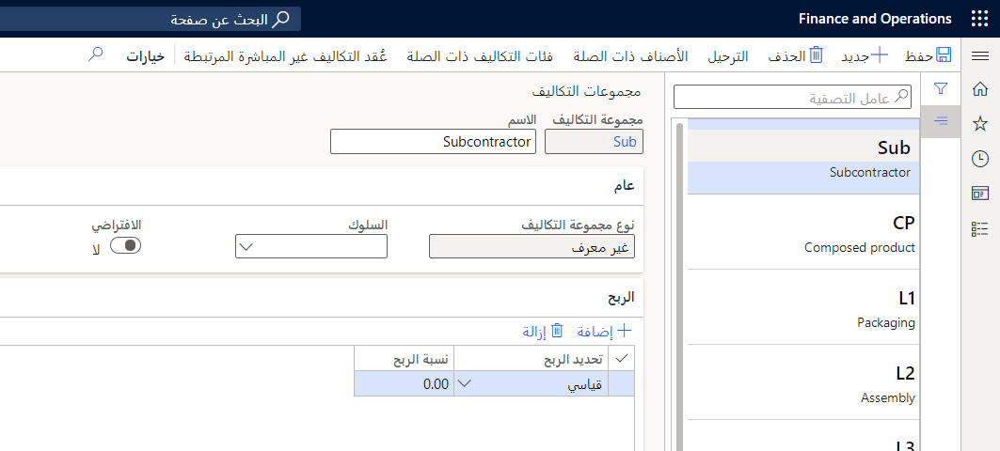

يستخدم التعاقد من الباطن المستند إلى النشاط في Supply Chain Management أنشطة العملية كجزء من حساب التكلفة للمنتج النهائي، بناءً على تدفق الإنتاج باستخدام نوع مجموعة التكاليف **للإسناد المباشر إلى جهة أخرى**.

تساهم إيصالات خدمات المقاول من الباطن وفواتيره بشكل مباشر في تكلفة تدفق الإنتاج. تتم تسوية إيصالات استلام المنتجات المُخرجة وفواتير المورّد مقابل حسابات العمل الجاري (WIP). يتم احتساب الفروق في عملية تحديد تكاليف الإصدار التلقائي.

## نوع مجموعة تكاليف الإسناد المباشر إلى جهة أخرى

يتم تعيين نوع مجموعة التكاليف الخاصة **بالإسناد المباشر إلى جهة أخرى** لجميع الأعمال التي يتم توفيرها بواسطة خلايا عمل التعاقد من الباطن.

**إدارة التكلفة > إعدادات سياسات محاسبة المخزون > مجموعات التكلفة**

 

لحساب تكلفة الصنف للتعاقد من الباطن بصورة صحيحة، يجب إعداد بعض المتطلبات الأساسية:

-   يتم تعيين نوع مجموعة تكاليف خاصة **بالإسناد المباشر إلى جهة أخرى** لجميع خلايا عمل التعاقد من الباطن.

-   يجب تنشيط التعاقد من الباطن في كشف التكاليف، مع مجموعات التكاليف الخاصة بالإسناد المباشر إلى جهة أخرى المرتبطة بها.

-   يتم إنشاء قواعد كانبان من خلال أنشطة التعاقد من الباطن في تدفق الإنتاج.

عند حساب تكلفة الصنف بناءً على تدفق الإنتاج، تستخدم Finance and Operations إعدادات نشاط خدمة التعاقد من الباطن لتحديد تكلفة الصنف. يعرض تصنيف التكاليف صنف الخدمة بدلاً من خلية العمل كمورد.
