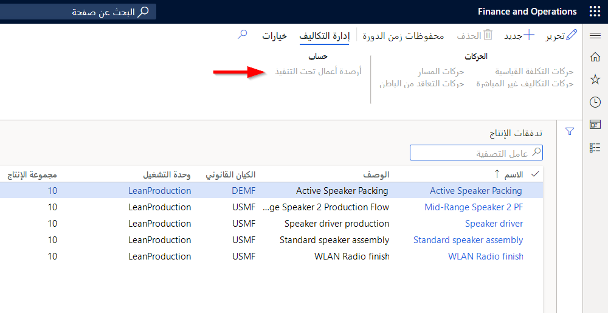

يمكن أن يؤدي تقليل أحجام الدفعات وصولاً إلى الحالة المثالية لتدفق قطعة واحدة في lean manufacturing إلى زيادة كبيرة في المعاملات إذا تسببت كل عملية انتقاء، أو تسجيل كانبان، في حركات للأصناف المستهلكة.

تمكن بنية تدفق الإنتاج من نقل المواد إلى تدفق الإنتاج باستخدام بطاقات كانبان السحب في أحجام وحدات التخزين أو معالجة المواد. تتم إضافة قيمة المواد المصدرة إلى حساب الأعمال تحت التنفيذ المرتبط بتدفق الإنتاج، على غرار المواد التي يتم إصدارها لأمر إنتاج.

يمكن تطبيق نفس المبدأ على المنتجات والمنتجات شبه النهائية، ما لم يتم إنشاؤها أو نقلها أو استهلاكها في تدفق الإنتاج. حركات المخزون اختيارية. عند ترحيل المنتجات إلى المخزون، يتم خصم حساب الأعمال تحت التنفيذ لتدفق الإنتاج من التكلفة المعيارية ذات الصلة.

تتيح لك تكاليف الإصدار التلقائي لتدفق الإنتاج حساب نسب الفرق في الإنتاج إلى التكلفة المعيارية لتدفق الإنتاج والفترة أثناء إنشاء إدخالات دفتر الأستاذ لحساب الكميات غير المستخدمة والكميات قيد المعالجة التي لا تزال في تدفق الإنتاج في نهاية الفترة.

## قيمه الأعمال تحت التنفيذ لتدفق الإنتاج

يمكن عرض القيمة الحالية للأعمال تحت التنفيذ لتدفق إنتاج معين في صفحة **أرصدة الأعمال تحت التنفيذ الحالية**.

اتبع الخطوات التالية لعرض قيمة الأعمال تحت التنفيذ لتدفق الإنتاج:

1.  انتقل إلى **التحكم بالإنتاج > الإعداد > تدفق الإنتاج محدود الفاقد > تدفقات الإنتاج**.

2.  حدد زر القائمة **حساب > أرصدة الأعمال تحت التنفيذ**.

    

## حساب صافي الاستخدام المحقق لتدفق الإنتاج خلال فترة

يتم حساب صافي الاستخدام المحقق خلال الفترة لكل بعد صنف وصنف. يمثل صافي الاستخدام المحقق الفرق بين إجمالي الكميات لكل صنف، والتي تم تجميعها خلال الفترة في الأعمال تحت التنفيذ الخاصة بتدفق الإنتاج بالتكلفة القياسية، مطروحاً منه مجموع الكميات غير المستخدمة التي لا تزال في تدفق الإنتاج في تاريخ نهاية الفترة، والتي تقدر قيمتها بالتكلفة القياسية لتلك الأصناف.

تتوافق الأعمال تحت التنفيذ التي لا تزال في تدفق الإنتاج مع كميات بعد الصنف والصنف في حركة مخزون قائمة انتقاء الإنتاج في حالة تحديثها فعلياً لتدفق الإنتاج.

## مسح عمل تدفق الإنتاج الجاري للفترة

بالنسبة للمكونات المستهلكة للفترة، يتم تحديث صافي الكميات المحققة من المواد التي يستهلكها تدفق الإنتاج خلال الفترة مالياً. تتم معالجة هذه الحركات وفق ترتيب ‏‫الوارد أولاً يُصرف أولاً‬ (FIFO) إلى أن تصل إلى صافي الكميات المحققة للفترة. يتم تقسيم حركات المخزون للسماح بتحديث الكميات غير المستخدمة في الأعمال تحت التنفيذ لتدفق الإنتاج بشكل فعلي.

كما تسمح بنية تدفق الإنتاج بتحديث صافي كميات الاستخدام المحققة مالياً. بالنسبة لكميات الإنتاج المكتملة للفترة، يتم تحديث حركات المخزون للكميات المكتملة للفترة مالياً. يتم تحديث حركات تكلفة التحويل المطبقة المسجلة للفترة مالياً لكافة تكاليف التصنيع المباشرة وجميع التكاليف غير المباشرة مطروحاً منها التكاليف غير المباشرة الناتجة عن الكميات غير المستخدمة.
