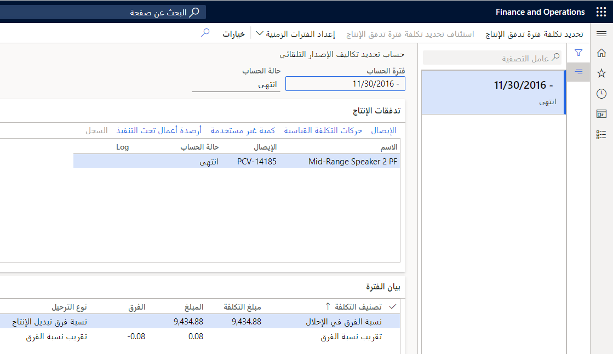

تحسب تكاليف الإصدار التلقائي الكميات غير المستخدمة من المواد التي لا تزال ضمن تدفق الإنتاج في تاريخ انتهاء الفترة. ولإنجاز هذه المهمة، يتم حساب كميات مكافئة من المواد للمنتجات غير المكتملة التي لا تزال قيد المعالجة.

**إدارة التكاليف > محاسبة التصنيع**

يتم التعبير عن استخدام المواد المحسوبة وفقاً لتدفق الإنتاج الساري المفعول في ذلك الوقت وما إذا كان المخزون الفعلي يتم الاحتفاظ به أم لا. يتم تحويل الكميات الفرعية والمنتجات شبه النهائية التي يتم إنتاجها في تدفق الإنتاج والتي يخضع تدفقها المادي للأنشطة التي لا يتم التحكم في مخزونها بكميات مكافئة من مكوناتها.

على سبيل المثال، إذا تم إنتاج المنتج L0002 في تدفق إنتاج، ولكن الأنشطة التي تحكم تدفقه المادي لا يتم التحكم فيها من قِبل المخزون، ثم كان هناك حاجة إلى 20 وحدة من L0002 ويتم تحويلها في وحدات مكافئة من مكوناته. و هذا النهج هو توفير قائمة بوحدات مكافئة من المنتجات التي يمكن أن تتطابق مع مساهمات كمية المنتج المسجلة في عمل تدفق الإنتاج الجاري ومقارنتها.

### الإصدار إلى الإنتاج

بشكل أساسي، تتم معاملة الأصناف غير المتحكم فيها بالمخزون على أنها أصناف وهمية.
ويتم تصحيح الكميات المكافئة المحتسبة من المواد وفقاً لما إذا كان قد تم إصدار كميات المكونات إلى الإنتاج أم لا.

على سبيل المثال، إذا لم يتم تحرير مكون من المخزون إلى تدفق الإنتاج بشكل فعال، فلا ينبغي اعتبار مكوناته كميات غير مستخدمة متبقية (لأنها لا تزال قيد الجرد وليست في الأعمال تحت التنفيذ الخاصة بتدفق الإنتاج).

يؤدي التحديث المالي لحركات المخزون للكميات المكتملة إلى عكس ترحيلات دفتر الأستاذ الفعلي وإعادة ترحيلها على أنها محدثة مالياً.
يتم تحديث حالة استلام حركات المخزون إلى **‏‫تم الشراء‬**.

يعكس التحديث المالي لحركات المخزون للمنتجات المستهلكة ترحيلات دفتر الأستاذ الفعلية وإعادة ترحيلها على أنها محدثة مالياً، ثم يتم تحديث حالة استلام حركات المخزون إلى **مُباع**.

يؤدي إلغاء الأعمال تحت التنفيذ لتكاليف تحويل التصنيع المباشرة لتدفق الإنتاج إلى عكس ترحيلات دفتر الأستاذ الفعلية وإعادة ترحيلها على أنها محدثة مالياً. يتم تحديث حركة تكلفة التحويل إلى **تكلفة محسوبة**.

يتم إلغاء تكاليف التصنيع غير المباشرة، والتي يتم تكديسها عبر الفترة من الأعمال تحت التنفيذ. وسيتعين إعادة التكلفة غير المباشرة للمواد غير المستخدمة.

لإعادة تعيين تكاليف التصنيع غير المباشرة للكميات غير المستخدمة التي لا تزال قيد التنفيذ في أعمال تدفق الإنتاج التي تم مسحها من الأعمال تحت التنفيذ:

-   حساب التكلفة غير المباشرة للكميات غير المستخدمة المُبلغ عنها في تدفق الإنتاج في نهاية الفترة استناداً إلى إعداد كشف التكاليف.

-   إدراج حركة تكلفة تحويل جديدة (من نوع التكلفة غير المباشرة) في المرحلة المحدثة فعلياً للتكلفة غير المباشرة المحسوبة.

-   إدراج حركة تكلفة تحويل سالبة جديدة (من نوع التكلفة غير المباشرة) للتكلفة غير المباشرة المحسوبة في المرحلة المحدثة مالياً.
