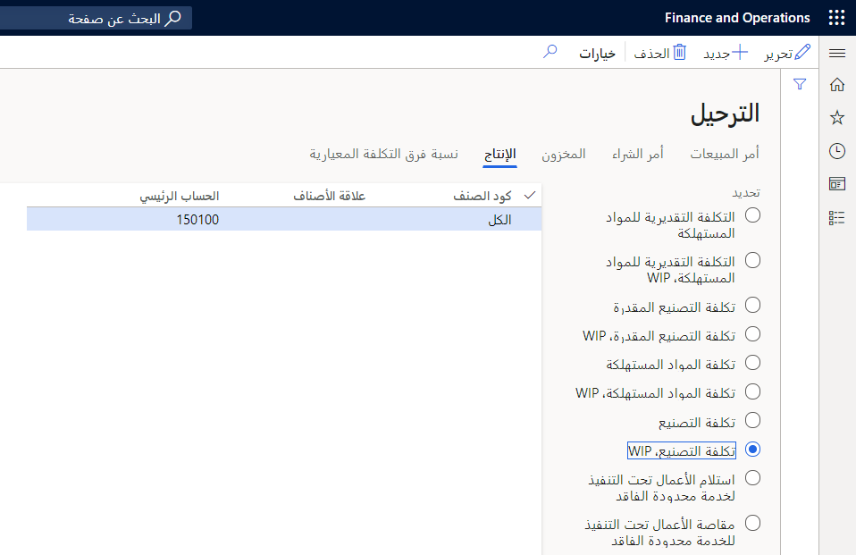

يمكن الوصول إلى صفحة **مجموعات الإنتاج** من **إدارة التكلفة > إعداد نهج تكامل دفتر الأستاذ > مجموعات الإنتاج**.

تحدد مجموعة الإنتاج المرتبطة بتدفق الإنتاج العمل الجاري والمرتبط بحسابات دفتر الأستاذ. يمكنك استخدام إعداد مجموعة الإنتاج لحل حسابات دفتر الأستاذ التي تنشأ من تدفق الإنتاج لأنواع الترحيل التالية في دفتر الأستاذ العام:

-   دفتر الأستاذ - الأصناف
-   دفتر الأستاذ - الموارد
-   دفتر الأستاذ - تعاقد من الباطن محدود الفاقد
-   دفتر الأستاذ - غير مباشر

## ملف تعريف ترحيل المخزون

يمكنك الوصول إلى ملفات تعريف الترحيل من **إدارة المخزون > إعداد > الترحيل > الترحيل**.

إذا لم يتم تحديد الحسابات لمجموعة إنتاج تم تسميتها لتدفق الإنتاج، فإن النظام يعود إلى ملف تعريف الترحيل لحل حسابات دفتر الأستاذ لنوع ترحيل معين.

## الإبلاغ عن أنشطة تدفق الإنتاج

يشمل الإبلاغ عن أنشطة تدفق الإنتاج بدء وانتقاء واستكمال كانبان لمعالجة السحب والمعالجة. يصف هذا القسم إدخالات دفتر الأستاذ التي تحدث أثناء ترحيل المواد والموارد داخل تدفق إنتاج.

يصف الجدول التالي السيناريوهات النموذجية ونتائجها فيما يتعلق بالإدخالات المحاسبية التي تحدث للمعاملات النموذجية أثناء معالجة كانبان.

| السيناريو | النتيجة|
 | ------------- | ------------- |
 | أبلغ William عن وظيفة تحويل كانبان وتسجيل حركات المواد والأجزاء التي تغذي تدفق الإنتاج و/أو تخزين السلع المنتجة.| يتم ترحيل حركة إصدار ومعاملة استلام، مع الخصم والائتمان لحسابات تكلفة المخزون التي تتضمن تكاليف العمالة والتكاليف غير المباشرة. لا يتم ترحيل أي تكاليف إلى الأعمال تحت التنفيذ في هذا السيناريو.|
 | أبلغ Shannon عن مهمة عملية كانبان، حيث تقوم بتسجيل كميات المواد التي تم انتقاؤها لأحد الأنشطة.| يتم ترحيل الائتمان إلى حساب تكلفة مخزون المنتجات ويتم ترحيل المدين إلى حساب الأعمال تحت التنفيذ لتدفق الإنتاج.|
| أبلغ William عن حركة فارغة للمسح الضوئي، وكذلك تفريغ صندوق أو حاوية. نوع الموقع هو **كانبان سوبر ماركت** للموقع الذي يتم تفريغه.| يتم ترحيل الائتمان إلى حساب تكلفة مخزون المنتجات ويتم ترحيل المدين إلى حساب الأعمال تحت التنفيذ لتدفق الإنتاج.|
| أبلغ Shannon عن وظيفة كانبان من النوع "معالجة" (الاستلام)، وتسجيل كميات المنتج الناتجة من أحد الأنشطة.| يتم ترحيل الرصيد إلى حساب الأعمال تحت التنفيذ لتدفق الإنتاج ويتم ترحيل الخصم إلى حساب تكلفة المخزون للمنتج.|
| لا يتحكم المخزون في **التحديث الفعلي عند الانتقاء** و **التحديث الفعلي عند الاستلام**.| لا يتم تسجيل حركات المخزون، ولا يكلف النظام الحساب الحركة.|
| لا يتحكم المخزون في **التحديث الفعلي عند الانتقاء** ولكنه يتحكم في **التحديث الفعلي عند الاستلام**.| تعتمد إدارة سلسلة التوريد حساب تكلفة الأعمال تحت التنفيذ لتدفق الإنتاج وتدين حساب تكلفة مخزون المنتج.|
| يتحكم المخزون في **التحديث الفعلي عند الانتقاء** ولكنه لا يتحكم في **التحديث الفعلي عند الاستلام**.| تعتمد إدارة سلسلة التوريد حساب تكلفة مخزون المنتج وتدين حساب تكلفة الأعمال تحت التنفيذ الخاصة بتدفق الإنتاج.|
| يتحكم المخزون في **التحديث الفعلي عند الانتقاء** و **التحديث الفعلي عند الاستلام**.| تحسب تكلفة إدارة سلسلة التوريد قيمة التحويل، وتضيف حساب تكلفة مخزون المنتج الوجهة وتسجله. وفقاً لملف تعريف الترحيل، يمكن أن تكون هذه الإدخالات إلى حساب GL نفسه، أو إذا كان حساب التكلفة الوجهة مختلفاً، يمكن أن يكون الإدخال إلى حساب GL آخر. |
| وتُعد الحركة هي التكلفة المحسوبة كقائمة انتقاء، ويتم تعيين كشف التكاليف لتطبيقه على تدفق الإنتاج.| تقوم إدارة سلسلة التوريد باستدعاء كشف التكاليف لقائمة الانتقاء وحساب التكاليف غير المباشرة. ونتيجة لذلك، فإن النظام ينسب حساب تكلفة استيعاب التكاليف غير المباشرة ويسحب حساب تكلفة تدفق الإنتاج الجاري.|
| تستخدم أنشطة تدفق الإنتاج موارد العملية التي تشتمل على فئات التكلفة.| تقوم إدارة سلسلة التوريد بحساب تكاليف التحويل وتسجيلها وترحيلها على أساس التكلفة القياسية للمنتج الناشئ من تكلفة التصنيع المباشر لكل فئة تكلفة. ونتيجة لذلك، فإن النظام ينسب حساب تكلفة استيعاب فئة التكاليف ويسحب حساب تكلفة تدفق الإنتاج الجاري.|

قم بتفريغ وحدات معالجة كانبان لأي نوع آخر من المواقع ولكن كانبان سوبر ماركت لن يكون لها حركة المخزون ولا إنشاء الحركة. سيؤدي إفراغ وحدات معالجة المواد على بطاقات كانبان التي يتم ترحيلها إلى الأعمال تحت التنفيذ، وهو الوقت الذي يكون فيه **التحديث الفعلي عند الاستلام** هو **لا**، إلى تحديد تكاليف الإصدار التلقائي للنظر في المواد المستهلكة من الأعمال تحت التنفيذ. سيتم اعتبار بطاقات كانبان غير الفارغة كما هو متبقي في الأعمال تحت التنفيذ في تحديد تكاليف الإصدار التلقائي.

## حركات التكلفة القياسية لتدفق الإنتاج

عند ترحيل الحركات لتدفق إنتاج، يمكنك عرضها من الصفحة **حركات التكلفة القياسية**، التي يمكنك الوصول إليها من **التحكم في الإنتاج > إعداد > إعداد تدفق الإنتاج البسيط > تدفقات الإنتاج**. حدد صنف بند **الإنتاج**، ثم ضمن القائمة الفرعية **الحركات**، حدد **حركات التكلفة القياسية**. يمكن عرض حركات الإيصال للحركات الموجودة في هذه الصفحة من خلال تحديد زر **دفتر الأستاذ > قائمة الإيصال**.
