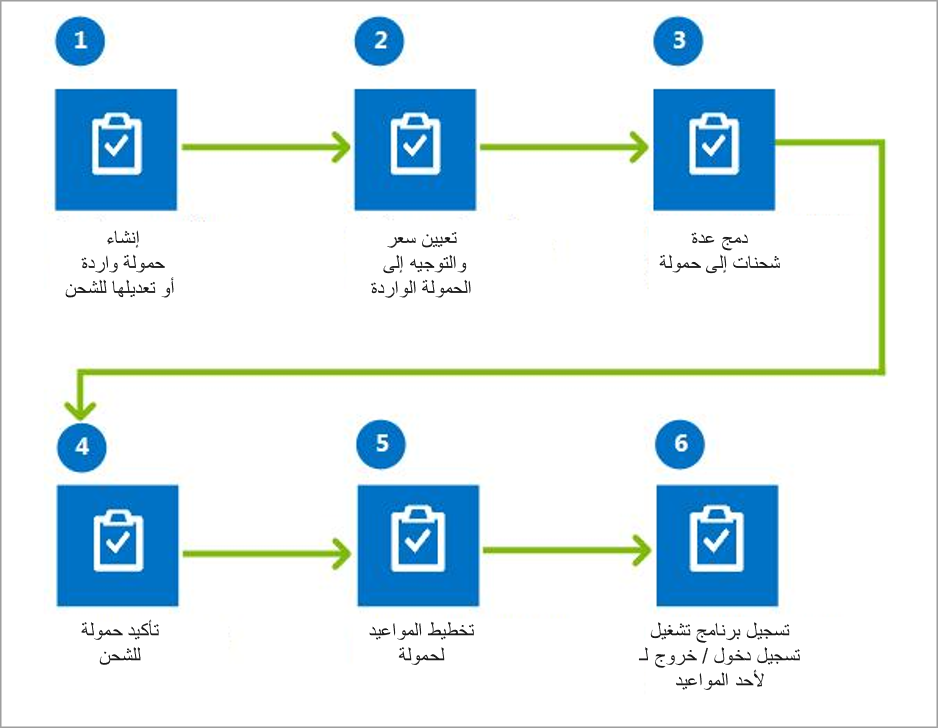
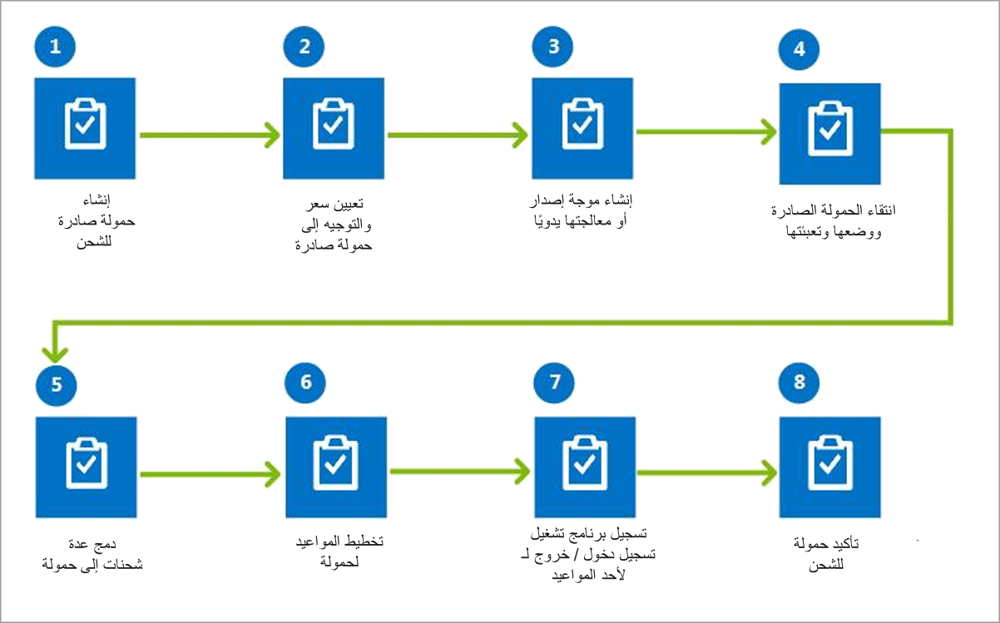

تتيح لك إدارة النقل استخدام وسائل النقل الخاصة بشركتك وتساعدك على تحديد الموردين وحلول التوجيه للأوامر الواردة والصادرة.

على سبيل المثال، يمكنك تحديد أسرع مسار أو أقل سعر لشحنة ما.

تعريفة النقل هي نظام تسعير وأسعار وخصومات يتم تحديدها عادةً من خلال العقود المبرمة بين شركة النقل وعملائها.

تحدد التعريفات المبلغ الذي سيتم دفعه مقابل نقل معين. في الولايات المتحدة، تطلب وزارة النقل (DOT) من شركات النقل بين الولايات أن تجعل أسعارها ورسومها عامة في تعريفة تفصيلية عن الخدمات المقدمة، والشروط التي يتم بموجبها تقديم الخدمات، والأسعار التي يتم تحصيلها. تحدد كل شركة نقل أسعارها ورسومها وتنشر تعريفة خاصة بها.

لتتمكن من استخدام أنشطة إدارة النقل في أحد المستودعات، يجب أن تأخذها في الاعتبار عند إنشاء مستودع. في علامة التبويب السريعة **مستودع**، قم بتعيين **استخدام عمليات إدارة المستودعات** على **نعم**.

تتضمن وظائف النقل النموذجية ما يلي:

-   التحليلات:
    -   تحليلات الإنفاق
    -   تحليلات الأداء
    -   تحليلات الإنتاجية
-   الفوترة:
    -   إدارة فاتورة الشحن
    -   تسوية عمليات الشحن
    -   النزاعات
    -   التعديلات
    -   تسوية الفاتورة
    -   التدقيق
-   ‏‏التنفيذ:
    -   الجدولة
    -   إدارة الإرساء/الفناء
    -   عمليات المستودعات
    -   وثائق النقل
    -   تعقب الحالة
-   إدارة الأوامر:
    -   طلبات/أوامر النقل
    -   تخطيط الحِمل
    -   تحسين الحِمل
    -   تخطيط المسار
    -   تحميل التسعير/عروض الأسعار
    -   إدارة أوامر شراء النقل
-   التعاقد:
    -   توظيف شركة النقل
    -   إدارة خدمة شركة النقل
    -   إدارة مسارات شركة النقل
    -   إدارة تسعير شركة النقل
    -   إدارة عقد شركة النقل
-   التخطيط:
    -   تخطيط القدرة الإنتاجية
    -   خطط المصادر

تم تصميم الوحدة النمطية لإدارة النقل في Dynamics 365 Supply Chain Management للشركات التي تتعاون مع موفري الخدمات اللوجستية لنقل سلعها وخدماتها. يمكن استخدامها في سيناريوهات عمليات النقل بين الشركات الشقيقة ومع الشركات التي تستخدم مركباتها الخاصة في النقل. الميزات ليست مناسبة بشكل مثالي لمقدمي الخدمات اللوجستية أو شركات النقل، على الرغم من أن الميزات الأخرى للنظام قد تكون مناسبة لهذه الأنواع من المؤسسات.

| السيناريو | كيف يمكن لإدارة النقل أن تساعد|
 | ------------- | ------------- |
 | الاستعانة بموفري الخدمات اللوجستية الخارجيين لأنشطة النقل.| استخدم إدارة النقل للنقل الوارد و/أو الصادر.|
 | سيارات الشركة الخاصة متاحة للتسليم/الاستلام، ويتم تمرير رسوم التوصيل للعملاء.| بالنسبة للعمليات الصادرة، يمكنك استخدام إدارة النقل لتحديد رسوم النقل وتمريرها إلى العملاء. مع ذلك، فإن عملية تسوية فاتورة شركة النقل غير مطلوبة.|
| تتوفر سيارات الشركة الخاصة للتسليم/الاستلام، ولكن لا يتم تمرير رسوم التوصيل إلى العملاء لأن أسعار المنتجات تشمل النقل.| الكثير من وظائف إدارة النقل غير مطلوبة. مع ذلك، يمكنك استخدام إدارة النقل لتحديد أسعار النقل وضبط سعر المبيعات وفقاً لذلك.|
 | يتم تقديم الخدمة اللوجستية من قبل كيان قانوني آخر في نفس الشركة.| يمكنك استخدام إدارة النقل من خلال معاملة الكيان القانوني الآخر مثل أي شركة شحن أخرى. لا يمكنك أتمتة الحركات الاقتصادية بين الكيانات القانونية. لذلك، يجب عليك معالجة هذه الحركات يدوياً (على سبيل المثال، من خلال إنشاء أمر شراء). في الكيان القانوني الذي يقدم الخدمات اللوجستية، يمكن استخدام إدارة النقل لتحديد أسعار النقل.|

## النقل الوارد 

عندما تطلب أصنافاً من مورد، ويجب تسليم الأصناف إلى المستودع الخاص بك، فقد ترغب في ترتيب نقل الأصناف بنفسك. يمكنك تخطيط النقل واستلام حمل عمل وارد. يوضح الرسم التوضيحي التالي سير إجراءات العمل لتخطيط النقل لحمل عمل وارد.

## النقل الصادر 

يمكنك تخطيط ومعالجة حمل عمل صادر لشحن أصناف معينة من مستودع الشركة إلى العميل. يمكنك التخطيط لنقل وشحن حمول عمل صادر. يوضح الرسم التوضيحي التالي سير إجراءات العمل لتخطيط ومعالجة أحمال العمل الصادرة للشحن.

