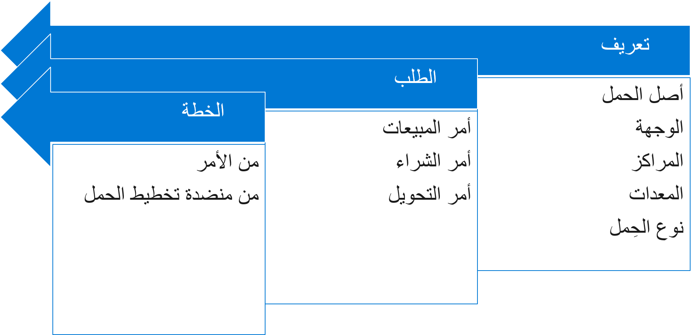
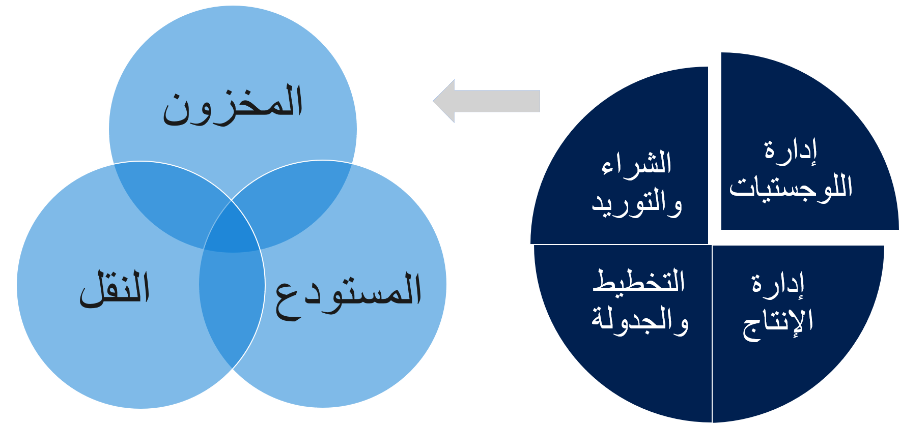

يمكن أن يستند تخطيط النقل إلى الطلبات أو الشحنات التي تم إنشاؤها بناءً على تلك الطلبات.

يشتمل أحد أهم أجزاء إعداد إدارة النقل في Supply Chain Management على جمع المتطلبات. لجمع المتطلبات، اطرح على العميل أسئلة، مثل الأسئلة المطروحة في الأقسام التالية.

**ما نوع الشاحنات والمعدات التي سيتم استخدامها؟** 

تتضمن نماذج الأسئلة التي يمكنك طرحها ما يلي:
-   هل تستخدم أسطولك الخاص أو طرفاً آخر؟
-   هل هناك متطلبات قدرة للمعدات؟
-   هل هناك متطلبات خاصة مثل البضائع المجمدة أو المبردة لعناصر معينة؟
-   هل هناك متطلبات خاصة لعملاء بعينهم؟

**هل تحتاج إلى جدولة الشحنات الواردة والصادرة؟** 

تتضمن نماذج الأسئلة التي يمكنك طرحها ما يلي:
-   كم عدد أبواب الرصيف لديك؟
-   هل أبواب الرصيف مخصصة للوارد أو الصادر؟
-   هل تطلب من الشركات الاتصال؟
-   هل تتوفر لدى شركات النقل أوقات أبواب رصيف قياسية؟ على سبيل المثال، هل تصل في تمام الساعة 3:00 م يومياً؟
-   هل عادةً ما تكون لديك أبواب رصيف مفتوحة في أي وقت، وهل لديك موظفون لتحميل الشاحنات أو تفريغها؟

**ما شركات النقل التي تستعين بها، وهل تضم أي متطلبات خاصة؟**

تتضمن نماذج الأسئلة التي يمكنك طرحها ما يلي:
-   هل غير مسموح بالمواد الخطرة أو ما شابهها؟
-   هل تقتصر بعض شركات النقل على بلدان و/ أو مناطق معينة؟
-   هل بعض شركات النقل أكثر تكلفة؟

**كيف ستُضاف مصاريف الشحن إلى الطلبات؟** 

تتضمن نماذج الأسئلة التي يمكنك طرحها ما يلي:
-   هل سيتم تمرير المصاريف إلى طلبات العملاء؟
-   هل يجب إضافة مصاريف إلى تكلفة التفريغ للأمر الوارد؟
-   هل يتم إرجاع الرسوم إليك من قبل شركة شحن خارجية؟
-   هل يلزم تسوية المصاريف المقدرة في ضوء الفاتورة النهائية؟

ستساعدك الإجابات عن هذه الأسئلة وغيرها الكثير في تحديد ما يجب تكوينه في النظام. ستخبرك الإجابات بالمعلومات الهامة مثل:

-   الوقت الذي ستحتاج فيه المعدات إلى التكوين.
-   القوالب والمتطلبات الخاصة بحمل العمل التي تحتاجها.
-   عدد شركات الشحن وأنواع الخدمات التي تحتاج إليها.
-   إذا كانت أنواع المواعيد والأسباب مطلوبة.
-   المصاريف ومصاريف الوقود الإضافية وغيرها من المصاريف التي يجب تكوينها.
-   ما إذا كانت الأكواد الخاصة بحاجة إلى التكوين أم لا.

الشحنات غير مطلوبة لتخطيط النقل.

تعد إدارة النقل جزءاً من Supply Chain Management التي تتولى تخطيط وتنفيذ ومراقبة التدفق الأمامي والعكسي بفعالية وكفاءة، وتخزين السلع والخدمات والمعلومات ذات الصلة بين نقطة المنشأ ونقطة الاستهلاك لتلبية متطلبات العملاء.

تعبر إدارة النقل عن مجموعة فرعية لوحدة إدارة اللوجستيات التي تركز على التدفق المادي للسلع والخدمات والمعلومات المقترنة بها بين نقطة المصدر ونقطة الاستهلاك.

يوضح الشكل التالي تكامل إدارة النقل في Supply Chain Management.

تدمج إدارة النقل وحدات إدارة العرض والطلب، بما في ذلك تخطيط وإدارة جميع الأنشطة التي تشارك في التدبير والتوريد والتحويل وجميع أنشطة الإدارة اللوجستية.
