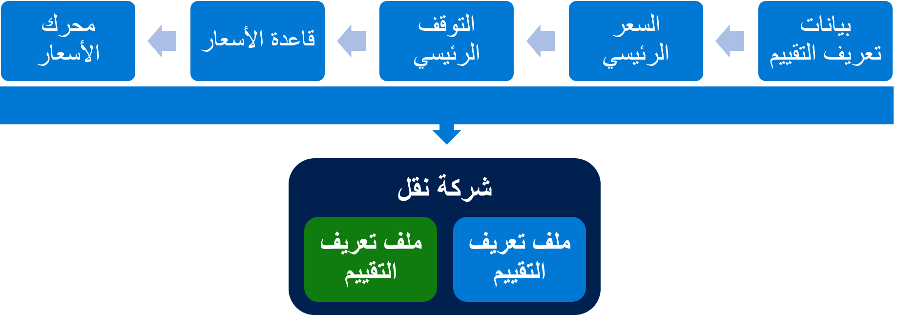
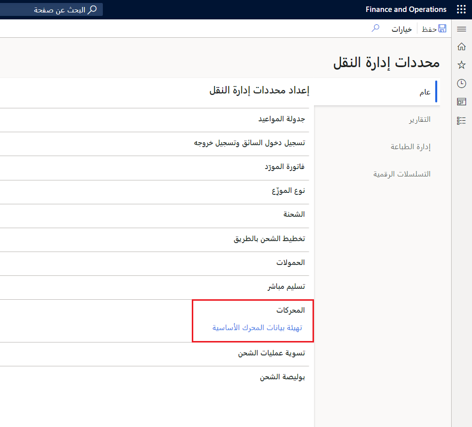

## أصول السعر 

تعد أصول السعر جزءاً رئيسياً من إعداد التصنيف لشركة الشحن. يمكنك استخدام أصول السعر لتحديد الأسعار المتوفرة لشركة الشحن ولتحديد ما إذا كانت الأسعار تبرر مراعاة شركة الشحن لتعيينٍ ما. يقترن أصل السعر بشركة شحن في ملف تعريف تصنيف شركة النقل. بالنسبة لكل أصل سعر، يجب تحديد بيانات تعريف التصنيف وأساس سعر.

قبل إعداد أصل سعر، يجب إعداد مجموعة واحدة على الأقل من بيانات تعريف التصنيف. يمكن تطبيق بيانات تعريف التصنيف على أي أصل سعر،، وتحدد معايير البحث المستخدمة لتحديد أسعار شركة الشحن.

يتطلب إعداد بيانات تعريف التصنيف إجراء المهام التالية:

-   إعداد بيانات تعريف التصنيف بمعايير البحث، مثل الرمز البريدي وخدمة شركة النقل.
-   إقران أصل السعر ببيانات تعريف التصنيف، وفي أصل السعر، قم بتوفير قيم المعايير، مثل الرمز البريدي وخدمة شركة النقل. يقترن أصل سعر واحد أو أكثر بشركة شحن في علامة التبويب السريعة **ملف تعريف التصنيف**. يمكنك استخدام أصول السعر لتحديد الأسعار المتوفرة لشركة الشحن ولتحديد ما إذا كانت الأسعار تبرر مراعاة شركة الشحن لتعيينٍ ما.

يحدد الفاصل الرئيسي قيم الفاصل التي يجب ربطها بأساس السعر.

على سبيل المثال، يتم تنظيم المسافات إلى نقاط التوقف من 50 و100 و150 ميلاً. يتم فرض رسوم بمبلغ 10.00 دولارات أمريكية على ما يصل إلى 50 ميلاً لكل تعيين، ويتم فرض رسوم بمبلغ 18.00 دولار أمريكي على ما يتراوح بين 50 و100 ميل، و20.00 دولاراً أمريكياً على ما يتراوح بين 100 و150 ميلاً.

إذا كنت تريد إعداد بنية تعريفة لأصل السعر، فيمكنك إنشاء أساس سعر. سيقوم أساس السعر بهيكلة الأسعار في نقاط توقف.

ولحساب الأسعار، يجب إنشاء محرك واحد أو أكثر أو تهيئة بيانات المحرك الأساسي تلقائياً. يمكنك البحث عن أسعار الشحن المتوفرة استناداً إلى معلومات مثل مسافة السفر أو المناطق في منطقة ما. يتم تفسير معايير البحث بواسطة محركات إدارة النقل التي تحسب الأسعار المتوفرة.

وأخيراً، سيمكنك القيام بربط جميع معلومات التصنيف بشركة نقل من خلال إنشاء ملف تعريف تصنيف ثم تحديد ملف تعريف تصنيف واحد أو أكثر في علامة التبويب السريعة **ملفات تعريف التصنيف** بالصفحة **شركات الشحن**.

## بيانات تعريف التصنيف 

تشير بيانات تعريف التصنيف إلى مجموعة فريدة من المحددات أو الحقول التي تستخدمها شركات النقل والخدمات لتحديد تعريفة النقل. تحتوي كل مجموعة من بيانات التعريف على تعيينات الأسعار، والتي هي الحد الأدنى من مجموعة السمات المطلوبة لحساب التعريفة لشحنة محددة.

على سبيل المثال، قد تتضمن السمات دولة أو منطقة الأصل والرمز البريدي إلى جانب الدولة أو المنطقة الوجهة للشحنة والرمز البريدي. يتم تعيين بيانات التعيينات إلى نوع بحث، وهو حقل بيانات رئيسية مقابل في النظام مثل رمز أقل من حمولة شاحنة (LTL) ورمز سلعة النقل القياسي (STCC) والرمز البريدي وما إلى ذلك.

اتبع الخطوات الواردة في هذا الإجراء لإعداد أصل سعر لشركة نقل جوي:

1.  انتقل إلى **إدارة النقل > إعداد > تصنيف > أصل السعر**.
2.  حدد **جديد**.
3.  في حقل **أصل السعر**، أدخل قيمة.
4.  في حقل **الاسم**، أدخل قيمة.
5.  في حقل **معرف بيانات تعريف التصنيف**، حدد زر القائمة المنسدلة لفتح البحث. 
    سيحدد معرف بيانات تعريف التصنيف البيانات المطلوبة لأصل السعر لأنه يحدد بيانات التعريف المتوقعة بواسطة محرك ‬‏‫إدارة النقل (TMS) الذي يستخدم أصل السعر هذا.
6.  حدد الخيار **P2P** (على سبيل المثال).
7.  حدد **حفظ**.
8.  لإعداد أساس السعر، حدد **أساس السعر** في القائمة الموجودة أعلى الصفحة.
9.  حدد **جديد**،
10. في حقل **أساس السعر**، أدخل قيمة.
11. في حقل **الاسم**، أدخل قيمة.
12. في حقل **الفاصل الرئيسي**، حدد زر القائمة المنسدلة لفتح البحث.
13. بالنسبة لهذا المثال، حدد **الوزن**.
14. قم بتوسيع قسم **التفاصيل**.
15. حدد **جديد**.
16. في حقل **الرمز البريدي للتسليم من**، أدخل **30301**.
17. في حقل **الرمز البريدي للتسليم إلى**، أدخل **30318**.
18. في حقل **بلد/منطقة التسليم**، أدخل **الولايات المتحدة الأمريكية**.
19. في حقل **<1.00 رطل**، أدخل **100**. قم بإدراج السعر لكل رطل. إذا كان الوزن الإجمالي للحمل أقل من 1 رطل.
20. في حقل **<5.00 أرطال**، أدخل **300**. قم بإدراج السعر لكل رطل. إذا كان الوزن الإجمالي للحمل أقل من 5 أرطال.
21. في حقل **<20.00 رطلاً**، أدخل **500**. قم بإدراج السعر لكل رطل. إذا كان الوزن الإجمالي للحمل أقل من 20 رطلاً.
22. في حقل **<100.00 رطل**، أدخل **1000**. قم بإدراج السعر لكل رطل. إذا كان الوزن الإجمالي للحمل أقل من 100 رطل.
23. في حقل **<1,000.00 رطل**، أدخل **3000**. قم بإدراج السعر لكل رطل. إذا كان الوزن الإجمالي للحمل أقل من 1000 رطل.
24. حدد **حفظ**.
25. أغلق الصفحة.
26. لتعيين أساس السعر، قم بتوسيع قسم **تعيينات أسس الأسعار**.
27. حدد **جديد**. يمكن أن يكون لديك العديد من تعيينات أسس الأسعار لكل أصل سعر. يسمح لك وجود تعيينات متعددة بإنشاء عدة نقاط أسعار مختلفة لكل شركة نقل اعتماداً على الوجهات أو الخدمات أو أسس الأسعار المختلفة. ستقوم في هذا الإجراء بإنشاء تعيين أساس سعر واحد فقط.
28. في حقل **الاسم**، أدخل قيمة.
29. في حقل **أساس السعر**، حدد زر القائمة المنسدلة لفتح البحث.
30. في القائمة، ابحث عن السجل المطلوب وحدده.
31. في حقل **الخدمة**، حدد زر القائمة المنسدلة لفتح البحث.
32. في القائمة، ابحث عن السجل المطلوب وحدده.
33. في حقل **الرمز البريدي لمكان الانتقاء**، أدخل **98052**. حدد الرمز البريدي الذي يجب أن يكون تعيين أسس الأسعار صالحاً بداية منه.
34. في حقل **بلد/منطقة الانتقاء**، أدخل **الولايات المتحدة الأمريكية**.
35. حدد **حفظ**.

بيانات تعريف التصنيف خاصة بالمحرك. يجب إعداد بيانات تعريف التصنيف قبل إعداد محرك أسعار.

يتم إنشاء بيانات تعريف التصنيف المطلوبة للمحركات التي يتم شحنها مع إدارة سلاسل التوريدات مع المحركات عند تحديد الزر **تهيئة بيانات المحرك الأساسي** في الصفحة **إدارة النقل > إعداد > معلمات أداره النقل**.

 

لا نوصي بإنشاء بيانات تعريف التصنيف الخاصة بك للمحركات الموجودة؛ فهذه الطريقة معرضة للأخطاء لأنها يمكن أن تتسبب في فشل المحرك ما لم تتوافق بيانات تعريف التصنيف بدقة مع قواعد المحرك.

1.  افتح **إدارة النقل > إعداد > تصنيف > بيانات تعريف التصنيف**.
2.  حدد **جديد** لإنشاء بيانات تعريف تصنيف جديدة.
3.  أدخل معرفاً واسماً فريدين لنوع أساس السعر.

في هذا المثال، ستقوم بإعداد أساسين للسعر وإعداد تعيين، ثم جعلها كلها إلزامية.

1.  في حقل **نوع البيانات الموصوفة**، حدد **أساس السعر** لإعداد حقول المعايير.
2.  في علامة التبويب السريعة **بيانات تعريف نوع أساس السعر**، حدد **جديد**.
3.  في حقل **نوع البيانات**، حدد **عدداً صحيحاً** لنوع إدخال البيانات.
4.  في حقل **نوع البحث**، حدد **الرمز البريدي**.
5.  حدد خانة الاختيار **إلزامي**.
6.  في حقل **نوع البيانات الموصوفة**، حدد **أساس السعر** لإعداد حقول المعايير.
7.  في علامة التبويب السريعة **بيانات تعريف نوع أساس السعر**، حدد **جديد**.
8.  في حقل **نوع البيانات**، حدد **سلسلة** لنوع إدخال البيانات.
9.  في حقل **نوع البحث**، حدد **المنطقة**.
10. حدد خانة الاختيار **إلزامي**.
11. في حقل **نوع البيانات الموصوفة**، حدد **التعيين** لإعداد حقول المعايير.
12. في علامة التبويب السريعة **بيانات تعريف نوع أساس السعر**، حدد **جديد**.
13. في حقل **نوع البيانات**، حدد **حقيقي** لنوع إدخال البيانات.
14. في حقل **نوع البحث**، حدد النوع.
15. اختيارياً، حدد خانة الاختيار **إلزامي**.
16. أغلق الصفحة.

إذا كنت تقوم بإنشاء نوع أساس سعر بثلاثة أسس أسعار وأربعة تعيينات، فيمكنك تحديد أحد الخيارات التالية:

-   فئة رمز سلعة النقل القياسية (STCC) - سلسلة
-   ‬‏‫المسافة بالميل - عدد صحيح أو حقيقي
-   الوزن - حقيقي

الخيارات الخاصة بأسس الأسعار هي:

-   بلد/منطقه الأصل - سلسلة
-   الرمز البريدي للأصل - عدد صحيح
-   بلد/منطقه الوجهة - سلسلة
-   الرمز البريدي للوجهة - عدد صحيح

رمز سلعة النقل القياسي (STCC) هو منشور يحتوي على معلومات منتج محددة يتم استخدامها في بيانات الشحن ومستندات الشحن الأخرى. رمز سلعة النقل القياسي (STCC) هو رمز رقمي مكون من سبعة أرقام يمثل سلعة.

يرتبط تعيين رمز سلعة النقل القياسي بوصف السلعة الذي تم تطويره ليتوافق مع الأوصاف الدقيقة في تصنيفات نقل الشحن للسكك الحديدية وشركات نقل السيارات. ويرافق رمز سلعة النقل القياسي رمزان مقابلان هما: نظام الترميز المنسق لوصف السلع، أو الرمز المنسق، وفئة التصنيف القياسي للبضائع المنقولة (SCTG).

تشير فئة أقل من حمولة شاحنة (LTL) إلى رمز التصنيف الوطني للشحن بالمحركات (NMFC) وهي فئة من فئات شحن LTL الخاصة بك. تحدد فئة الشحن رسوم الشحن الخاصة بشركة النقل من خلال تحديد حجم الشحن طويل الأمد وقيمته وصعوبة نقله.

### إعداد فئة أقل من حمولة شاحنة (LTL) جديدة

لإعداد فئة أقل من حمولة شاحنة (LTL) جديدة، اتبع الخطوات التالية:

1.  افتح **إدارة النقل > إعداد > معايير النقل > فئات ‬‏‫أقل من حمولة شاحنة (LTL)**.
2.  حدد **جديد** وقم بإنشاء رموز فئات أقل من حمولة شاحنة (LTL) (أو تحرير الموجودة).
3.  أدخل قيمة في حقل **فئة أقل من حمولة شاحنة (LTL)**.
4.  أدخل قيمة في حقل **الاسم**.
5.  أدخل قيمة في حقل **الفئة**.
6.  أغلق الصفحة.

### إنشاء رمز ‏‫ سلعة نقل قياسي (STCC)

لإنشاء ‏‫رمز سلعة النقل القياسي (STCC)، اتبع الخطوات التالية.

1.  افتح **إدارة النقل > إعداد > معايير النقل > رموز سلع النقل القياسية (STCC)**.
2.  حدد **جديد** لإنشاء ‏‫رمز سلعة نقل قياسي (STCC) جديد.
3.  أدخل معرفاً واسماً وصفياً فريدين ل‏‫رمز سلعة النقل القياسي (STCC) .
4.  أغلق الصفحة.

يحدد رمز التصنيف الوطني للشحن بالمحركات (NMFC) كيفية تصنيف الصنف لشركات نقل معينة. من المهم أيضاً تحديد رمز بوليصة الشحن.  

بعد إنشاء رموز LTL، يمكنك إنشاء رموز NMFC في إدارة سلاسل التوريدات. في معظم الحالات، ستكون الفئة هي نفسها لفئة NMFC وLTL. ومع ذلك، في بعض الحالات، قد تتسبب شحنة LTL في وجود نفس المنتج في فئة مختلفة. بعد إنشاء رمز NMFC، يمكنك ربطه بالمنتجات.

### إنشاء رمز تصنيف وطني للشحن بالمحركات (NMFC)

لإنشاء رمز التصنيف الوطني للشحن بالمحركات (NMFC)، اتبع الخطوات التالية:

1.  افتح **إدارة النقل > إعداد > معايير النقل > رموز التصنيف الوطني للشحن بالمحركات (NMFC)**.
2.  حدد **جديد** لإنشاء ‏‫رمز تصنيف وطني للشحن بالمحركات (NMFC) جديد.
3.  أدخل معرفاً واسماً وصفياً فريدين ‏لرمز التصنيف الوطني للشحن بالمحركات (NMFC).
4.  اختياري: ادخل فئة أقل من حمولة شاحنة (LTL) الذي يقابلها رمز التصنيف الوطني للشحن بالمحركات (NMFC).
5.  اختياري: أدخل نوع بوليصة الشحن لرمز التصنيف الوطني للشحن بالمحركات (NMFC).
6.  أغلق الصفحة.

الرمز المنسق هو نظام موحد دولًيا مكون من أسماء وأرقام لتصنيف المنتجات المتداولة التي تم تطويرها من قبل منظمة الجمارك العالمية، وهو يرافق ‏‫رمز سلعة النقل القياسي (STCC).

### إعداد رمز جدول تعريفة منسق

لإعداد رمز جدول تعريفة منسق، اتبع الخطوات التالية:

1.  افتح **إدارة النقل > إعداد > معايير النقل > جداول التعريفة المنسقة**.
2.  حدد **جديد**.
3.  أدخل قيمه في حقل **جدول التعريفة المنسق**.
4.  أدخل اسماً في حقل **الاسم**.
5.  أغلق الصفحة.

### ربط رمز التصنيف الوطني للشحن بالمحركات (NMFC) ورمز سلعة النقل القياسي (STCC) والرمز المنسق بمنتج

لربط رمز التصنيف الوطني للشحن بالمحركات (NMFC) ورمز سلعة النقل القياسي (STCC) والرمز المنسق بمنتج، اتبع الخطوات التالية:

1.  افتح **إدارة معلومات المنتج > المنتجات > المنتجات**.
2.  حدد منتجاً من القائمة.
3.  حدد **تحرير** في جزء الإجراء.
4.  افتح علامة التبويب السريعة **المستودع**.
5.  أدخل رمزاً في حقل ‏‫**رمز التصنيف الوطني للشحن بالمحركات (NMFC)**.
6.  أدخل رمزاً في حقل ‏‫**‏‫رمز سلعة النقل القياسي (STCC)**.
7.  أدخل رمزاً في حقل ‏‫**النظام المنسق**.
8.  قم بإغلاق الصفحات.

## شركة الشحن 

شركة الشحن هي إحدى الإعدادات الأساسية المطلوبة لإدارة النقل. شركة النقل هي إدخال أساسي للأوامر والأحمال التي يتم إنشاؤها.

استخدم صفحة **شركه الشحن** لإعداد خدمة نقل ووضع الشحن وطريقة نقل الشحن وملف تعريف التصنيف لشركة الشحن.

### إنشاء شركه شحن

لإنشاء إنشاء شركه شحن، اتبع الخطوات التالية:

1.  افتح **إدارة النقل > إعداد > شركات النقل > شركات الشحن**.
2.  حدد **جديد** لإنشاء شركة شحن جديدة.
3.  في حقل **شركة الشحن**، أدخل نوع شركة الشحن.
4.  في حقل **الاسم**، أدخِل اسماً لشركة الشحن.
5.  في حقل **الوضع**، حدد نوع وضع الشحن.
6.  في علامة التبويب السريعة **النظرة العامة**، حدد تفاصيل شركة الشحن باستخدام الحقول التالية:  
    - **تنشيط شركة الشحن** - قم بتعيين شريط التمرير هذا إلى **نعم** لاستخدام شركة الشحن المحددة للشحن.
    - **المورد** - حدد حساب المورد الذي تريد تعيين شركة الشحن إليه.
    - **SCAC** - أدخل معرفاً لكود ألفا القياسي لشركات النقل (SCAC).
    - **تنشيط تصنيف شركة النقل** - قم بتعيين مربع التمرير هذا إلى **نعم** لتمكين التصنيف التلقائي لشركة الشحن.
7.  اختياري: في حقل **نوع طريقة الدفع للنقل**، حدد أحدي الطرق التالية لتحديث تفاصيل طريقه الدفع للنقل:
    - **يدوي** - تحديث تفاصيل طريقه الدفع للنقل يدوياً باستخدام صفحة **طرق الدفع للنقل**.
    - **EDI** - تحديث تفاصيل طريقة الدفع للنقل تلقائياً باستخدام تبادل البيانات الإلكتروني (EDI) في صفحة **طريقة الدفع للنقل**.
8.  اختياري: في حقل **تسلسل الرقم المبدئي**، يمكنك تحديد تسلسل رقمي مرتبط بمحرك عام، إن وجد.
9.  في علامة التبويب السريعة **العناوين**، حدد **جديد**، ثم ادخل عنوان شركه الشحن وغرضها.
10. حدد **موافق** لحفظ العناوين.
11. أغلق الصفحة.

## وضع النقل

يمثل وضع النقل نوع النقل الذي تستخدمه شركة النقل للتسليم الشحنات، مثل أقل من حمولة الشاحنة (LTL) أو حمولة الشاحنة (TL) أو الطرود. إن طريقة النقل تمثل شكل النقل الذي تستخدمه شركة النقل لتسليم الشحنات، مثل الجو أو الأرض أو المحيط أو السكك الحديدية.

### إنشاء وضع نقل

لإنشاء وضع نقل، اتبع الخطوات التالية:

1.  افتح **إدارة النقل > إعداد > شركات النقل > الوضع**.
2.  حدد **جديد** لإنشاء ‏‫وضع جديد.
3.  أدخل معرفاً واسماً وصفياً فريدين للوضع.
4.  أغلق الصفحة.

### إقران شركة شحن بوضع نقل

لإقران شركة شحن بوضع نقل، اتبع الخطوات التالية:

1.  افتح **إدارة النقل > إعداد > شركات النقل > شركات الشحن**.
2.  حدد **تحرير**.
3.  حدد شركة شحن.
4.  في الحقل **الوضع**، حدد وضع نقل.
5.  أغلق الصفحة.

### إنشاء طريقة نقل

لإنشاء طريقة نقل، اتبع الخطوات التالية:

1.  افتح **إدارة النقل > إعداد > معايير النقل > طرق النقل**.
2.  حدد **جديد** لإنشاء طريقة نقل جديدة.
3.  أدخل معرفاً واسماً وصفياً فريدين لطريقة النقل.
4.  أغلق الصفحة.

## خدمات شركة النقل 

يجب تكوين خدمة شركة نقل واحدة أو أكثر لشركة النقل. تحدد خدمة شركة النقل الخدمات التي تقدمها شركة النقل. ومن الأمثلة على خدمات شركات النقل، الهواء في اليوم التالي أو الهواء في اليوم الثاني أو الأرض.‬

### إنشاء خدمة شركة نقل

لإنشاء خدمة شركة نقل، اتبع الخطوات التالية:

1.  افتح **إدارة النقل > إعداد > شركات النقل > شركات الشحن**.
2.  حدد **أقل من حمولة شاحنة (LTL)** في الجزء الأيسر.
3.  قم بتوسيع علامة التبويب السريعة **الخدمات**.
4.  حدد **جديد**.
5.  أدخِل معرفاً فريداً في حقل **خدمة شركة النقل**.
6.  أدخل **اسماً** لخدمة شركة النقل.
7.  اختياري: حدد **معرف قالب حمل**.
8.  حدد **طريقة نقل**.
9.  أدخل **وضع تسليم**.
10. اختياري: أدخل **رمزاً خارجياً**.
11. حدد **معرف مجموعة فوترة**.
12. أغلق الصفحة.

## مجموعات شركات النقل 

يتم استخدام مجموعات شركات النقل لتجميع شركات الشحن بخدمات الشحن المقابلة لها.

### إنشاء مجموعة شركات نقل

لإنشاء مجموعة شركات نقل، اتبع الخطوات التالية:

1.  افتح **إدارة النقل > إعداد > شركات النقل > مجموعة شركات النقل**.
2.  حدد **جديد**.
3.  أدخل **معرف مجموعة شركات النقل** واسماً لها.
4.  في علامة التبويب السريعة **التفاصيل**، حدد **جديد**.
5.  حدد **شركة شحن**.
6.  حدد **خدة شركة نقل**.
7.  أغلق الصفحة.

## حالة النقل 

يمكنك إعداد الرموز الرئيسية لحالات النقل لتفسير الرموز التي توفرها شركات الشحن الخاصة بك. يتم استخدام هذه الطريقة لتكامل تبادل البيانات الإلكتروني (EDI) مع شركات الشحن لتوفير حالة. يمكن أن تساعدك حالة النقل التي توفرها لرمز حالة السجل الرئيسي للنقل في تتبع حالة حمل أو شحنة أو حاوية.

### إنشاء حالة نقل
لإنشاء حالة نقل، اتبع الخطوات التالية:

1.  افتح **إدارة النقل > إعداد > معايير النقل > السجلات الرئيسية لحالة النقل**.
2.  حدد **جديد** لإنشاء سجل رئيسي جديد لحالة النقل.
3.  في حقل **السجل الرئيسي لحالة النقل**، أدخل رمزاً فريداً لحالة النقل.
4.  في حقل **نوع النقل**، حدد إما **شركة الشحن** أو **المركز** كنوع النقل.
5.  أدخل اسماً وحالة نقل.
6.  أغلق الصفحة.

### تعيين حالة النقل إلى حالة شركة النقل

لتعيين حالة النقل إلى حالة شركة النقل، اتبع الخطوات التالية:

1.  افتح **إدارة النقل > إعداد > معايير النقل > حالة نقل شركة النقل**.
2.  حدد **جديد** لتعيين رمز من شركة شحن إلى رمز سجل رئيسي لحالة نقل.
3.  حدد المعرف الفريد لشركة الشحن وخدمة شركة النقل.
4.  حدد رمز حالة النقل الذي تريد تعيينه إلى رمز شركة الشحن المحدد.
5.  أدخل الرمز الخارجي الذي تستخدمه شركة الشحن.
6.  أغلق الصفحة.

## التسلسل الرقمي 

تتيح لك صفحة **التسلسلات الرقمية** الموجودة في الوحدة النمطية لإدارة النقل إعداد أرقام أولية متنوعة لكي تستخدمها شركات نقل أقل من حمولة الشاحنة (LTL) أو حمولة الشاحنة (TL).

### إنشاء تسلسل رقمي للرقم المبدئي

لإنشاء تسلسل رقمي للرقم المبدئي، اتبع الخطوات التالية:

1.  افتح **إدارة النقل > إعداد > شركات النقل > التسلسلات الرقمية**.
2.  حدد **جديد** لإنشاء تسلسل رقمي جديد.
3.  أدخل معرفاً واسماً وصفياً فريدين للتسلسل الرقمي.
4.  في حقل **نوع التسلسل الرقمي**، يُعد **الرقم المبدئي** هو الخيار الوحيد.
5.  في حقل **التحقق من الرقم**، يُعد **التحقق من الرقم** هو الخيار الوحيد الذي تم إعداده كمحرك عام.
6.  في علامة التبويب السريعة **التسلسل**، قم بتقديم معلومات حول التسلسل.
7.  أغلق الصفحة.

### ربط تسلسل رقمي بشركة نقل

لربط تسلسل رقمي بشركة نقل، اتبع الخطوات التالية:

1.  افتح **إدارة النقل > إعداد > شركات النقل > شركات الشحن**.
2.  حدد شركة شحن.
3.  حدد **تحرير**.
4.  في علامة التبويب السريعة **النظرة العامة**، حدد خياراً في حقل **التسلسل الرقمي المبدئي**.
5.  أغلق الصفحة.

## قوالب حمل العمل 

يتم استخدام قوالب حمل العمل في منضدة عمل تخطيط الحمل للسماح بالإعدادات الافتراضية لقيود الوزن و/أو قيود المعدات للحمل. على سبيل المثال، إذا كان الحمل عبارة عن بضائع مجمدة، فسيتم إعداد قالب حمل يحدد شاحنة مبردة والوزن الذي تقتصر عليه المعدات المحددة.

### إنشاء قالب حمل

لإنشاء قالب حمل، اتبع الخطوات التالية:

1.  افتح **إدارة النقل > إعداد > إنشاء حِمل > قوالب الأحمال**.
2.  حدد **جديد** لإنشاء قالب حمل جديد.
3.  أدخل معرفاً واسماً وصفياً فريدين لقالب الحمل.
4.  أدخل **ارتفاع الحمل** و **عرض الحمل** و **عمق الحمل**.
5.  أدخل **الحد الأقصى لحجم الحمل المسموح به**.
6.  أدخل **الحد الأقصى لوزن الحمل المسموح به**.
7.  أدخل **الحد الأقصى للوزن الإجمالي للحمل المسموح به**.
8.  أدخل **الحد الأقصى لعدد قطع الشحن المسموح بها**. ويمكن أن يرتبط هذا الاختيار بعدد منصات النقل والصناديق الملفوفة وما إلى ذلك.
9.  أغلق الصفحة.

## طريقة الدفع للنقل 

طريقه الدفع للنقل هي مستند شحن يحتوي على تعيين لحمل أو مسار أو جزء من مسار. يمكنك استخدام طريقة الدفع للنقل هذه لتعقب التواريخ والأسعار المعتمدة بين العميل وشركة الشحن.

يمكنك إنشاء طريقة دفع للنقل من مسار أو مقطع مسار أو من حمل في مقطع مسار. يمكنك أيضاً إنشاء هذه المستندات وتحديثها في صفحة **طريقة الدفع للنقل**.

بعد الانتهاء من إنشاء طريقة الدفع للنقل، يمكنك إرسالها، مما ستنتج عنه تحديث حالة سير العمل من **معلق** إلى **تم الإرسال**. عند استلام تأكيد من شركة النقل، يمكنك تأكيده وإدخال التفاصيل المؤكدة مثل السعر وتاريخ الالتقاط.

يمكنك أيضاً إنشاء هذه المستندات وتحديثها في صفحة **طريقة الدفع للنقل**.

**لإنشاء طريقة دفع للنقل، اتبع الخطوات التالية:**

1.  افتح **إدارة النقل > التخطيط > إرساء جدولة المواعيد > طرق الدفع للنقل**.
2.  في حقل **تصفية حسب**، حدد أحد الخيارات التالية للإشارة إلى نوع التعيين المطلوب.
    - **الحمل** - يشير إلى التقاط حمل محدد.
    - **المسار** - يشير إلى حمل سيتم نقله باستخدام مسار.
    - **مقطع المسار** - يشير إلى حمل سيتم نقله باستخدام جزء من مسار.
    - **مقطع المسار للحمل** - يشير إلى حمل محدد سيتم نقله باستخدام جزء من مسار.
3.  حدد **جديد** لإنشاء طريقة دفع للنقل جديدة. يعرض مستند طريقة الدفع تلقائياً معرفاً في حقل **طريقة الدفع للنقل**.
4.  في علامة التبويب السريعة **المراجع**، في حقل **معرف المرجع**، حدد معرفاً فريداً للحمل. تتم تصفية الأحمال وفقاً لتحديدك في حقل **تصفية حسب**.
5.  في علامة التبويب السريعة **عام**، وفي حقل **شركة الشحن**، حدد شركة الشحن التي يجب أن تقوم بالتقاط الحمل.
6.  في حقل **خدمة شركة النقل**، حدد خدمة تقدمها شركة النقل.
7.  أدخل المعلومات المتبقية في مجموعة حقول **الشحن**.
8.  في مجموعة حقول **الأسعار**، أدخل التاريخ وطلب السعر لشركة النقل. حقل **تاريخ الالتقاط المطلوب ووقته** وحقل **الأسعار المطلوبة** مخصصان لطلب العميل. إذا أرادت شركة النقل تحديث المعلومات قبل التأكيد، فيجب إدخال هذه المعلومات في الحقلين **تاريخ الالتقاط المؤكد ووقته** و **الأسعار المؤكدة**. يمكنك عرض تبادل المعلومات بين العميل وشركة النقل في علامة التبويب السريعة **المحفوظات**.
9.  أغلق الصفحة.

شاهد الفيديو التالي للاطلاع على إنشاء طريقة دفع للنقل. 

 > [!VIDEO https://www.microsoft.com/videoplayer/embed/RE47Zz5]

**لإرسال طريقه دفع للنقل وتأكيدها وقبولها، اتبع الخطوات التالية:**

1.  افتح **إدارة النقل > التخطيط > إرساء جدولة المواعيد > طرق الدفع للنقل**.
2.  حدد **حالة التحديث**.
3.  حدد **إرسال**.
4.  حدد **تأكيد**.
5.  أدخل **السعر والتاريخ**.
6.  اضغط على **موافق**.
7.  حدد **حالة التحديث**.
8.  حدد **قبول**.
9.  أغلق الصفحة.

## معلمات إدارة النقل 

لمراجعه معلمات أدارة النقل، اتبع الخطوات التالية:

1.  افتح **إدارة النقل > إعداد > معلمات إدارة النقل**.
2.  من علامة التبويب **عام**، راجع علامات التبويب السريعة التالية:
    -  **جدولة المواعيد** - تعيين المدة الافتراضية لموعد مجدول للتسليم أو التقاط الشحن.
    - **‏‫تسجيل دخول السائق وتسجيل خروجه** - إدخال فاصل تنبيه لتسجيل دخول السائق أو تسجيل خروجه.
    - **فاتورة المورد** - تحديد خيارات لفواتير المورّدين.
    - **نوع المركز** تحديد نوع مركز منافذ.
    - **الشحن** - يشير إلى ما إذا كانت الشحنات قد تم تخطيطها بواسطة الشحنات.
    - **تخطيط الشحن بالطريق** - الإشارة إلى ما إذا كان يتم استخدام تخطيط الشحن بالطريق أم لا.
    - **الأحمال** - تحديد ما إذا كنت تريد:
        - إنشاء تلقائي لإدخال أمر مبيعات
        - إنشاء تلقائي عند إدخال أمر الشراء
        - إنشاء تلقائي عند إدخال أمر النقل
        - تجاوز تاريخ تأكيد الشحن الصادر
        - تمكين تأكيد تقسيم شحن أمر التحويل وترحيل تحويل الشحنة
    - **التسليم المباشر** - إنشاء رسوم للعميل للتسليم المباشر.
    - **المحركات** - تهيئة بيانات المحرك الأساسي.
    - **تسوية الشحن** - الإشارة إلى ما إذا كان سيتم تمكين تسوية الشحن أم لا. في حالة تعطيل هذا الخيار، لن يتم إنشاء أي فواتير شحن.
    - **بوليصة الشحن** - الإشارة إلى ما إذا كان سيتم إنشاء بوليصة شحن رئيسية عند وجود أكثر من شحن واحد في الحمل.
3.  من علامة التبويب **التقارير**، راجع علامات التبويب السريعة التالية:
    - **تقرير الحمل** - تحديد نوع ملاحظة تقرير الحمل.
    -  **بوليصة الشحن** - تحديد غرض شركة نقل.

في علامة التبويب **إدارة الطباعة**، يتم سرد المستندات المتنوعة في إدارة النقل المُدارة بواسطة إدارة الطباعة.

في علامة التبويب **التسلسلات الرقمية**، يتم سرد التسلسلات الرقمية القياسية في إدارة النقل.

