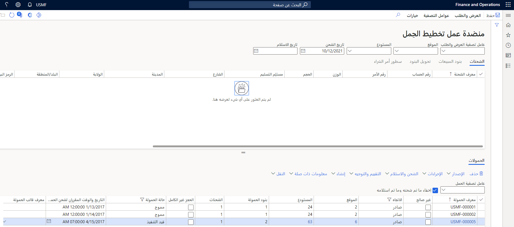
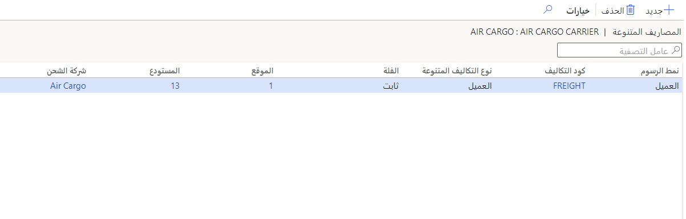

بوليصة الشحن هي وثيقة قانونية بين الشركة التي تقوم بشحن الأصناف وشركة النقل. يرافق المستند العناصر المشحونة، وهو بمثابة إيصال شحن عند تسليم العناصر إلى الوجهة. إذا كنت تستخدم إدارة المستودعات، فيمكنك إنشاء بوليصة شحن بطريقتين:

- قم بإنشاء التقرير يدوياً باستخدام صفحة  **بوليصة الشحن** الموجودة في **المبيعات والتسويق > أوامر المبيعات > طلب الشحن** أو **إدارة المستودعات > الاستعلامات والتقارير > بوليصة الشحن**.
- أنشئ التقرير من  **منضدة عمل تخطيط الحمل** في **إدارة المستودعات > الأحمال**.

إذا قمت بإنشاء بوليصة الشحن من  **منضدة عمل تخطيط الحمل**، فيجب أن تكون حالة الحمل  **مشحون**.في حالة وجود أكثر من شحنة في الحمل، يتم إنشاء بوليصة شحن لكل شحنة. بعد إنشاء بوليصة الشحن، يمكنك إجراء تغييرات عليها في صفحة  **بوليصة الشحن** .

## بوليصة الشحن الرئيسية 

في حالة وجود أكثر من شحنة في الحمل، يمكنك إنشاء بوليصة شحن رئيسية. بوليصة الشحن الرئيسية لها نفس التصميم والمعلومات مثل بوليصة الشحن ولكنها تحتوي على المحتوى الملخص لجميع الشحنات.

في حالة تعيين  **إنشاء بوليصة شحن رئيسية عندما يكون هناك أكثر من شحنة في الحمل** إلى  **نعم** في صفحة  **معلمات إدارة النقل** ، يتم إنشاء بوليصة شحن رئيسية تلقائياً إذا قمت بإنشاء بوليصة شحن من  **منضدة عمل تخطيط الحمل** وهناك أكثر من شحنة.

يمكنك أيضاً الحصول على قائمة بوالص الشحن عن طريق تحديد  **المعلومات ذات الصلة > بوليصة الشحن**. إذا كنت تقوم بإنشاء بوالص شحن يدوياً، فيمكنك إنشاء بوليصة شحن رئيسية في صفحة  **بوليصة الشحن** .

## شحن طرد صغير

تضيف هذه الميزة وظائف لإعداد بيانات اعتماد تسجيل الدخول إلى مشغل شبكة الجوال إذا كان لديك واجهة مع شركة النقل هذه. من هذه الميزة، يمكن طباعة الملصقات التي يتم استلامها مرة أخرى من خدمة الويب الخاصة بشركة النقل. يمكن استرداد رسوم وشروط الشحن وإضافتها إلى أمر المبيعات المرتبط كتكلفة متنوعة. تم تعيين هذه الرسوم في **إدارة النقل > الإعداد > شركات النقل > شركات الشحن**.

