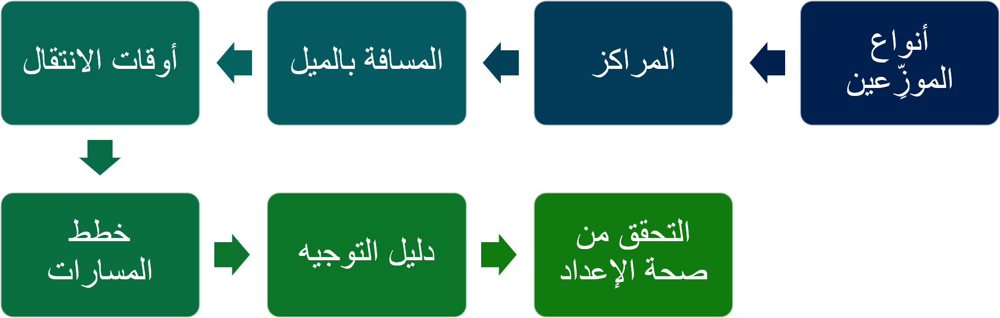
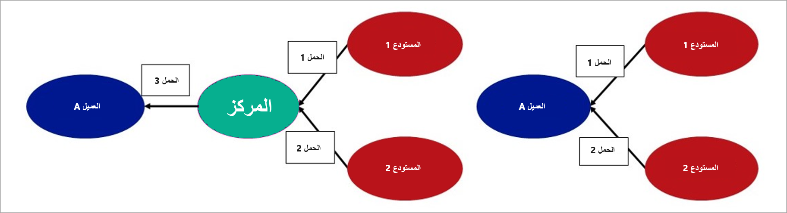

يمكنك استخدام خطط المسارات وأدلة المسارات لمسارات النقل المعقدة التي بها محطات توقف متعددة. إذا تم استخدام نفس المسار على أساس منتظم، فيمكنك إعداد مسار مجدول.

## خطط المسارات 

تحتوي خطة المسار على أجزاء المسار التي توفر معلومات حول نقاط التوقف التي تمت زيارتها على المسار وشركات النقل المستخدمة لكل جزء.

يجب تحديد المحطات على الطريق كمراكز. يمكن أن يكون المركز مورداً أو مستودعاً أو عميلاً أو حتى مجرد مكان لإعادة التحميل حيث تقوم بتغيير الناقل. لكل شريحة، يمكنك تحديد "الأسعار الفورية" للرسوم المختلفة، على سبيل المثال:

-   تكاليف السفر للشرائح المحددة
-   تكاليف استلام البضائع
-   تكاليف تسليم البضائع

يجب أن ترتبط كل خطة مسار بدليل مسار.

## أدلة المسارات 

يحدد دليل المسار معايير مطابقة حمولة لخطة مسار محددة. على سبيل المثال، يمكنك تحديد مركز أصل ومركز وجهة، وحدود لحجم الحاوية أو وزنها، وشركة شحن أو خدمة أو مجموعة.

تتوفر أدلة المسارات في صفحة  **منضدة عمل الأسعار والمسارات** ، حيث يمكن مطابقة الأحمال مع المسارات إما يدوياً أو تلقائياً. إذا كان دليل المسار لمسار مجدول، فإنه يتوفر أيضاً في صفحة  **منضدة عمل إنشاء الأحمال** .

## المسارات المجدولة 

المسار المجدول هو خطة مسار محددة مسبقاً لها جدول زمني لتواريخ الشحن. تختلف المسارات المجدولة والمسارات غير المجدولة في طريقة تعيين الأحمال لها. إذا قمت بتعيين مسار غير مجدول باستخدام صفحة **منضدة عمل الأسعار والمسارات**، يتم التحقق من صحة الحمل ودليل المسار فقط.

إذا قمت بتعيين مسار مجدول، فسيتم أيضاً مراعاة التواريخ والعناوين من الطلبات والمراكز والتاريخ على خطة المسار. لا يتعين عليك استخدام صفحة **منضدة عمل الأسعار والمسارات** لتعيين الأحمال يدوياً إلى مسار مجدول. وبدلاً من ذلكن يمكنك استخدام **منضدة عمل إنشاء الأحمال** لاقتراح إنشاء الأحمال بناءً على عناوين العملاء وتواريخ التسليم من أوامر المبيعات لمسار مجدول معين.

بالنسبة للمسارات المجدولة، سيكون لخطة المسار مراكز أصل ووجهة ثابتة. عادةً ما تكون شركة الشحن والخدمة هي نفسها لجميع الشرائح، ولكن يمكن أن تختلف. يتم إنشاء مراكز الوجهة باستخدام الرموز البريدية للعملاء الذين تمت زيارتهم على المسار. يمكن تحديد عدة جداول مسارات لخطة مسار واحدة.

يجب أن ترتبط خطة المسار بدليل مسار. ومع ذلك، بالنسبة للمسارات المجدولة، يمكن ربط الخطة بدليل مسار واحد فقط.
يتم استخدام جدول المسار فقط لإنشاء المسارات الفعلية في صفحة  **جدول المسار** . يمكنك استخدام نموذج الحمل الافتراضي عند اقتراح الأحمال على **منضدة عمل إنشاء الأحمال**.

## منضدة عمل إنشاء الأحمال 

تستخدم **منضدة عمل إنشء الأحمال** عناوين العملاء وتواريخ التسليم من أوامر المبيعات والمسارات المجدولة المتوفرة لاقتراح الحمل. بشكل افتراضي، يتم إدخال القيم من المسار في منضدة العمل. ومع ذلك، يمكنك تحديد تاريخ أقدم من تاريخ البدء على المسار.

عند اقتراح حمل، يتم التحقق من عنوان التسليم وتاريخ التسليم لجميع أوامر المبيعات المفتوحة. إذا كان الرمز البريدي لعنوان التسليم يطابق الرمز البريدي للمركز في خطة المسار، وإذا كان تاريخ التسليم ضمن النطاق المحدد في المعايير، فسيتم اقتراح أمر المبيعات للحمل. تتم أيضاً مراعاة سعة قالب الحمل.

بالنسبة للمسارات المجدولة، يتم اقتراح حمل واحد فقط في كل مرة. ومع ذلك، عندما لا تستخدم مسارات الجدول الزمني، يمكن اقتراح أحمال متعددة. إذا كان لديك أمر مبيعات غير مضمن، فقد تضطر إلى استخدام قالب حمل مختلف (على سبيل المثال، قالب حمل لشاحنة أو حاوية أكبر) أو التخطيط لتسليم إضافي.

## تخطيط الأحمال باستخدام دمج المراكز 

قد يكون من المفيد دمج الشحنات في مركز عندما تقوم بتسليم البضائع من مستودعات مختلفة إلى نفس العميل، أو عندما يتم تسليم البضائع من موردين متعددين إلى نفس المستودع.

## إنشاء الأحمال 

قبل أن تتمكن من استخدام دمج المراكز، يجب تمكين خيار  **التخطيط أثناء النقل** في صفحة  **معلمات إدارة النقل** .
يجب عليك أيضاً إنشاء المراكز حيث سيحدث الدمج. يوضح الرسم التخطيطي التالي مثالاً على دمج المراكز.

في هذه الحالة، يتم إرسال أوامر المبيعات من مستودعات مختلفة إلى العميل نفسه. يتم إنشاء الأحمال الأساسية بناءً على أوامر المبيعات بالطريقة المعتادة باستخدام صفحة  **منضدة عمل تخطيط الأحمال** .

لدمج الحملين في المركز قبل تسليمهما إلى العميل، في صفحة  **منضدة عمل تخطيط الأحمال** ، في حقل  **النقل** ، حدد  **دمج المراكز**. عند تحديد المركز الصحيح لكل حمل، سيكون للأحمال المركز كوجهة تسليم. سيكون لديك أيضاً بندان لطلب النقل في قسم  **التوريد والطلب** في صفحة  **منضدة عمل تخطيط الأحمال** .

يمكنك بعد ذلك إضافة هذين البندين إلى حمل جديد. سيحتوي هذا الحمل الجديد على بنود أوامر المبيعات وسيحتوي أيضاً على المركز كعنوان الاستلام والعميل أ كوجهة تسليم. ثم تصبح الأحمال الثلاثة جاهزة للتصنيف وتوجيهها مثل أي حمل آخر. يمكنك تحديد أي شركة شحن يقترحها النظام لكل حمل. 

يمكنك أيضاً استخدام نفس الطريقة لدمج الأحمال لأوامر نقل متعددة. في هذه الحالة، يكون العميل "أ" في الرسم البياني عبارة عن مستودع.
بدلاً من ذلك، يمكنك دمج الأحمال لأوامر شراء متعددة، حيث يتم تسليم الأحمال من بائعين مختلفين إلى نفس المستودع.

يمكن أن يكون لديك أكثر من مركز دمج واحد ويمكنك الدمج في مراكز متعددة لمزيد من الأحمال التي تأتي من مستودعات مختلفة. بعد إنشاء الأحمال الأساسية الخاصة بك واستخدام خيار دمج المراكز، يمكنك إنشاء الأحمال الجديدة باستخدام خطوط طلب النقل المدمجة. بعد ذلك، يمكنك تقييم وتوجيه الأحمال الخاصة بك.

## يتضمن وزن الحاوية والحجم عند التحميل 

توفر وظيفة تضمين وزن الحاوية وحجمها في الحمولة تمثيلاً واضحاً للوزن الكلي وحجم الحاويات والأصناف التي يتم تحميلها.

يحتوي الحمل على شحنة واحدة أو شحنات متعددة، وتحتوي هذه الشحنات على أصناف مميزة تنتمي إلى أمر مبيعات واحد أو أوامر مبيعات متعددة. يتم تخزين الأصناف داخل حاوية، ويتم تحميل الحاويات على حمل. يمكن أيضاً أن تكون الأصناف الموجودة خارج الحاوية جزءاً من الحمل. بناءً على هذه الشروط، يحسب النظام قيم الوزن والحجم على الحمل من خلال مراعاة وزن وحجم كل من الحاويات والأصناف.

إذا لم تكن القيم المحسوبة دقيقة، يمكنك تعديلها عن طريق إدخال القيم الفعلية للوزن والحجم في الحمل. يتم استخدام قيم الوزن والحجم في عمليات إدارة النقل.
على سبيل المثال، تُستخدم القيم في منضدة عمل الأسعار والمسارات، حيث تساعد في تحديد معدل ومسار الأحمال، كما تُستخدم أيضاً في مناقصات النقل وتسجيل وصول السائق.

تنطبق الوظيفة الخاصة بتضمين وزن الحاوية وحجمها على الحمل في عمليات إدارة النقل، مثل منضدة عمل الأسعار والمسارات وعطاءات النقل وتسجيل وصول السائق.

يتم حساب عدد الحاويات التي يجب أخذها في الاعتبار للحمل بناءً على وزن وحجم الحاوية وعلى النسبة المئوية للحاوية المستخدمة.

لضبط الوزن والحجم للحاوية، حدد  **إدارة المستودعات > الإعداد > الحاويات > أنواع الحاويات**.

لتعيين النسبة المئوية لاستخدام الحاوية، حدد  **إدارة المستودعات > الإعداد > الحاويات > مجموعات الحاويات**، ثم أدخل قيمة في حقل  **نالنسبة المئوية لاستخدام الحاوية** .

## جدولة مواعيد الرصيف

بعد إعداد جميع الشحنات الواردة والصادرة، يأتي وقت تحدد فيه شركات النقل مواعيد لالتقاط الأحمال أو تسليمها. شاهد الفيديو التالي لمعرفة كيفية تحديد موعد. 

 > [!VIDEO https://www.microsoft.com/videoplayer/embed/RE47Zz4]
