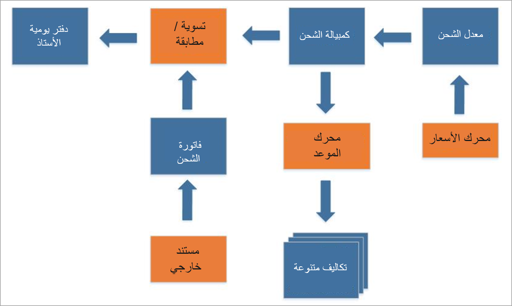

يمكن إجراء تسوية الشحن يدوياً، أو يمكن إعدادها لتحدث تلقائياً. لاستخدام تسوية الشحن التلقائية، يجب عليك إعداد مدير تدقيق حيث يمكنك تحديد المعايير التي تحدد فواتير الشحن التي تتم مطابقتها تلقائياً.

يتم حساب أسعار الشحن من خلال محرك السعر المرتبط بشركة الشحن ذات الصلة. عندما يتم تأكيد الحمولة، يتم إنشاء فاتورة الشحن، ويتم نقل أسعار الشحن إليها. يتم تقسيم أسعار الشحن كرسوم متنوعة على مستند المصدر ذي الصلة (أمر الشراء و/أو أمر المبيعات و/أو أمر النقل)، اعتماداً على الإعداد المستخدم لعملية الفوترة المنتظمة.

يمكن أن تبدأ عملية تسوية الشحن (والتي تُعرف أيضاً باسم عملية المطابقة) بمجرد وصول فاتورة الشحن من شركة الشحن. يمكن استلام الفاتورة إلكترونياً أو على الورق. إذا تم استلام الفاتورة على الورق، يمكنك إنشاء فاتورة إلكترونية باستخدام فاتورة الشحن كقالب.

## التسوية اليدوية 

إذا كنت تقوم بتسوية الشحن يدوياً، فتأكد من مطابقة كل بند فاتورة مع سطر فاتورة الشحن أو خطوط الحمولة التي يتم تحرير فواتير بها. يمكنك إكمال هذه المطابقة في صفحة  **مطابقة فاتورة الشحن والفاتورة** . إذا كان المبلغ الموجود في سطر الفاتورة لا يتطابق مع مبلغ فاتورة الشحن، فيجب عليك تحديد سبب تسوية الفرق.

في حالة وجود عدة أسباب للتسوية، يمكنك تقسيم المبلغ غير المتطابق بينها. يحدد سبب التسوية كيفية ترحيل فروق المبلغ في دفتر الأستاذ العام. عند حساب تسوية مبلغ الفاتورة بالكامل، يتم إرساله للموافقة عليه ثم ترحيل دفتر اليومية.

## التسوية التلقائية 

لاستخدام التسوية التلقائية، يجب تحديد جدول التسوية والفواتير وشركات الشحن لاستخدامها. تتم مطابقة سطور الفاتورة وفواتير الشحن وفقاً لإعداد مدير التدقيق ونوع فاتورة الشحن.

بعد تشغيل التسوية التلقائية، يجب أن تتعامل مع أي فواتير لا يمكن للنظام مطابقتها. يجب عليك بعد ذلك معالجة هذه الفواتير يدوياً قبل أن تتمكن من ترحيل جميع الفواتير للدفع.
