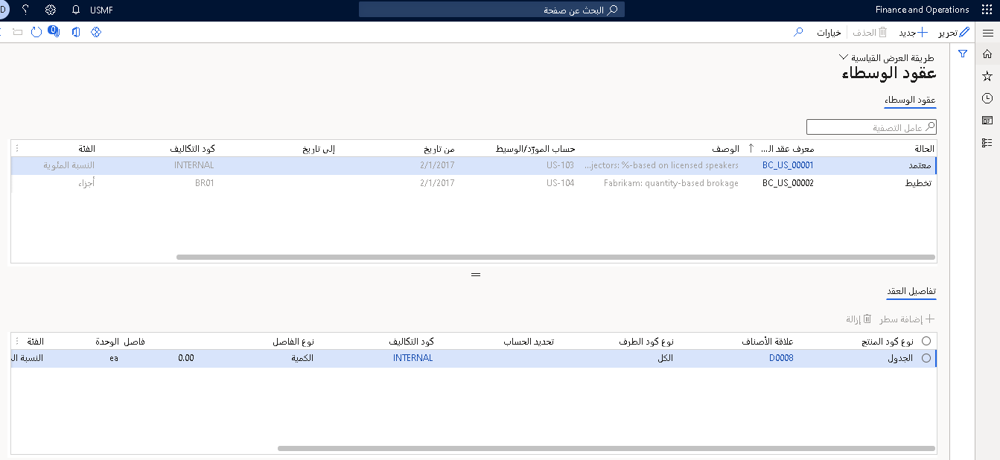

تساعد إدارة عقود الوسيط الشركات على إدارة اتفاقيات الوساطة بشكل أفضل عن طريق التنفيذ التلقائي للمهام التي تشارك في إدارة وتتبع ودفع الرسوم المستحقة للوسطاء.

تقدم هذه الوحدة نظرة عامة على العملية النموذجية للتعامل مع رسوم الوسيط، والتي تشمل:

-   تسجيل تفاصيل عقد الوسيط المتفاوض عليه.
-   تشغيل العقود المتفاوض عليها من خلال المبيعات الجارية وإنشاء مطالبات الوسيط.
-   الموافقة على المطالبات التي تم إنشاؤها بحيث يمكن تحويلها إلى الحسابات الدائنة للدفع.
-   معالجة حالات الموافقة الجزئية على المطالبات ومحاسبة الفوارق.

## عقد الوسيط

**الحسابات المدينة > الوسيط والعوائد > عقود الوسطاء**
 عقد الوسيط هو سجل لاتفاق مع وسيط. إنه يحدد الشروط والأحكام التي تم التفاوض عليها والتي بموجبها تتأهل شركة الوساطة للحصول على مكافأة مالية مقابل تحقيق أهداف المبيعات المحددة مسبقاً.

يتم تسجيل عقود الوسطاء في صفحة  **عقود الوسطاء** ، التي يمكنك فتحها عن طريق تحديد  **الحسابات الدائنة > الوسيط والعوائد > عقود الوسطاء**.

يتضمن العقد شرطاً تفاوضياً حول من سيتحمل أتعاب الوسيط (العميل الذي يشتري المنتج أو الشركة البائعة).
يتم إعداد هذا الشرط في صفحة  **أكواد المصاريف** ذات الصلة.

يعرض قسم  **تفاصيل العقد** الشروط والصنف المؤهل للوساطة. يتم عرض المكافأة المالية التي سيحصل عليها الوسيط لتحقيق هدف المبيعات ضمن قسم  **الفاصل**.

يشير إعداد تكلفة **رسوم الوسيط** إلى أن العميل لن يتحمل رسوم خدمات الوسيط. وبدلاً من ذلك، ستتحمل الشركة البائعة رسوم الوسيط كمصروفات مبيعات.

إذا نص العقد على أن العميل سيتحمل رسوم خدمات الوسيط، فيجب إعداد الرسوم ذات الصلة بحيث يتم تعيين حقل  **النوع** في قسم **الخصم** إلى  **العميل/المورد**. في هذه الحالة، تتلقى الشركة أولاً دفع الرسوم من العميل ثم تدفع التزامها إلى الوسيط. إذا كانت الشركة البائعة هي التي ستتحمل رسوم الوسيط كمصروفات مبيعات، فيجب إعداد الرسوم المرتبطة بحيث يتم تعيين حقل  **النوع** في كلٍّ من قسمي  **الخصم** و **الائتمان** إلى  **حساب دفتر الأستاذ**.

يتلقى حساب الخصم مصاريف الوسيط في بيان الدخل. حساب الائتمان هو حساب التزام مؤقت يستضيف مبلغ المصاريف (الرسوم) من وقت ترحيل المصاريف إلى الوقت الذي تمت فيه الموافقة على مطالبة الوسيط ونقلها إلى المبلغ الحقيقي المستحق الدفع نتيجة ترحيل الفاتورة.

يعرض قسم  **تفاصيل العقد** في عقد الوسيط الشروط والصنف المؤهل للوساطة. يتم عرض المكافأة المالية التي سيحصل عليها الوسيط لتحقيق هدف المبيعات ضمن قسم **الفاصل**.

يجب أن تكون  **حالة** العقد  **موافق عليه** ليتم تطبيقه على أوامر المبيعات التي تفي بشروطه.

## بيع المنتجات المؤهلة للحصول على عمولة وسيط وإنشاء مطالبة 

عند إنشاء أمر مبيعات يتضمن بنوداً تستوفي متطلبات عقد الوسيط، يمكنك عرض المعلومات ذات الصلحة على صفحة  **أمر المبيعات** عن طريق تحديد  **بند أمر المبيعات > طريقة العرض > عمولات الوسيط**.

نظراً لأنه يتم التعامل مع مستحقات رسوم الوسيط كرسوم، يمكنك أيضاً الوصول إلى عمولة الوسيط عن طريق فتح صفحة **التكاليف القياسية** من أمر المبيعات. حدد بند الأمر، ثم حدد  **بند أمر المبيعات > الأمور المالية > إدارة التكاليف**.

عند ترحيل فاتورة أمر المبيعات، بالإضافة إلى حركات فواتير المبيعات العادية، تحدث الترحيلات التالية:

-   يتم إنشاء مطالبة الوسيط لبند الفاتورة.
-   يتم ترحيل الرسوم المستحقة التي تمثل رسوم الوسيط إلى حسابات الالتزامات والمصروفات المؤقتة، حسب الاقتضاء.

يمكن عرض ترحيل رسوم الوسيط المستحقة على حركات الإيصال المرتبطة بدفتر يومية فاتورة المبيعات.

## مراجعة المطالبات ومعالجتها 

بعد الموافقة على المطالبات إما كلياً أو جزئياً، يتم إنشاء فاتورة المورد وترحيلها، إذا كان الترحيل مدعوماً بسياسة الحسابات الدائنة. وبهذه الطريقة، يتم تمرير ائتمان المورد إلى معالجة المدفوعات العادية.

يمكنك عرض كل المطالبات الموجودة في صفحة  **مطالبات الوسطاء** . بالنسبة لكل رسم، يحدد حقل  **تم التأهيل** ، مبلغ الرسم الذي سيتم دفعه لمورد خدمات الوساطة بعد الموافقة عليه.

لاعتماد مطالبة، في عمود  **وضع العلامة** ، حدد مربع الاختيار للبند. وبعد ذلك، في جزء الإجراء، حدد  **الموافقة**.

ونتيجة للموافقة، ستحدث الأحداث التالية:

-   أدى ترحيل دفتر يومية المصاريف إلى عكس المبلغ المؤقت السابق في كل من حساب الالتزام المستحق وحساب المصروفات المستحقة.
-   تم إنشاء فاتورة مطالبة الوسيط (المورد) لمبلغ رسوم الوسيط المعتمد.
    يمكن ترحيل فاتورة مطالبة الوسيط إما تلقائياً كجزء من عملية الموافقة على المطالبة أو يدوياً. يحدد حقل  **الترحيل اليدوي** في علامة التبويب  **الوسيط والعائد** في صفحة  **معلمات الحسابات الدائنة** السياسة التي تتحكم في سلوك الترحيل.
-   نتيجة لترحيل فاتورة مطالبة الوسيط، تم الخصم من حساب المصروفات وتم قيد حساب المورد الدائن. يتم تحديد **رقم حساب المصروفات** لفئة التدبير عند إعداد مصروفات الشراء لترحيل المصروفات لأوامر الشراء. يتم تحديد فئة التدبير في علامة التبويب  **الوسيط والعائد** في صفحة  **معلمات الحسابات الدائنة** .

في صفحة  **مطالبات الوسطاء** ، يمكنك مراجعة الترحيلات والمستندات المرتبطة بالمطالبة ورقم فاتورة المورد التي تم إنشاؤها للوسيط. إذا تم ترحيل فاتورة المورد (تلقائياً أو يدوياً)، في علامة التبويب  **الفواتير** ، يحتوي حقلا  **التاريخ** و **المبلغ بعملة الحركة** على القيم المناسبة. إذا كانت الفاتورة لا تزال معلقة، فإن هذه الحقول تكون فارغة.

إذا كان حقل  **تمت الموافقة عليه** لبند المطالبة يحتوي على المبلغ نفسه مثل حقل  **تم التأهيل** ، ولكن حقل  **الفرق** يحتوي على 0، فهذا يعني أن المطالبة ليس بها مشكلات لم يتم حلها ويمكن الآن إغلاقها.

## معالجة المطالبات جزئياً 

إذا قام أحد العملاء بإرجاع بعض وحدات أمر المبيعات، فقد لا يكون الوسيط مؤهلاً للرسوم المرتبطة بالكمية المرتجعة. في هذه الحالة، يجب الموافقة على المطالبة الثانية بالمبلغ الجزئي.
حدد  **الحسابات الدائنة > الوسيط والعوائد > مطالبات الوسائط** وحدد المطالبة. في حقل  **جارٍ الموافقة** ، أدخل الكمية الإجمالية مطروحاً منها الوحدات المرتجعة. وبعد ذلك، في جزء الإجراء، حدد  **الموافقة**.

إذا كان هناك فرق بين القيمة في حقل  **موافق عليها** والقيمة في حقل  **تم التأهيل** ، فإنه يتم تسجيلها في حقل  **الفرق** . تشير هذه القيم إلى أن المطالبة لا تزال معلقة وأنه يجب معالجة الفرق قبل اعتبار المطالبة مغلقة.

للتعامل مع الفرق، حدد بند المطالبة الذي لم تتم تسويته، ثم في جزء الإجراء، حدد  **إغلاق**.

يحدد النظام أن المطالبة لا تزال تحتوي على عدد معلّق من الوحدات ويطالب المستخدم بإدخال رمز السبب الذي يشرح الفرق.

بعد إغلاق المطالبة، تقع الأحداث التالية:

-   أدى ترحيل دفتر اليومية للمصروفات إلى عكس المبلغ المؤقت السابق في حساب مصروفات الاستحقاق.
-   عكس الترحيل نفسه المبلغ المؤقت السابق على حساب الالتزام التراكمي.

يحدد البند الموجود ضمن علامة التبويب  **الفوارق** مبلغ رسوم الوسيط الذي تم رفضه للدفع.

في السيناريو الذي تقوم فيه شركتك، وليس العميل، بدفع رسوم الوسيط أو الربح أو الخسارة المرتبط بالدفع الزائد أو الدفع الناقص لرسوم لا يجب احتسابه في بيان الدخل. في هذه الحالة، لن يتم ربط دفتر يومية الفوارق ببند الفوارق.

إذا كنت تتعامل مع الفوارق في سيناريو الرسوم حيث يدفع العميل رسوم الوسيط، فستلاحظ أن النظام ينشر دفتر يومية فوارق عند إغلاق المطالبة. يخصم/يضيف دفتر اليومية هذا حساب شطب رسوم الوسيط ويضيف/يخصم حساب الالتزام المؤقت.

> [!NOTE]
> تم تحديد رقم حساب المصاريف المشطوبة في حقل  **الحساب الرئيسي** لرمز سبب محدد في صفحة  **أسباب الفوارق** .
