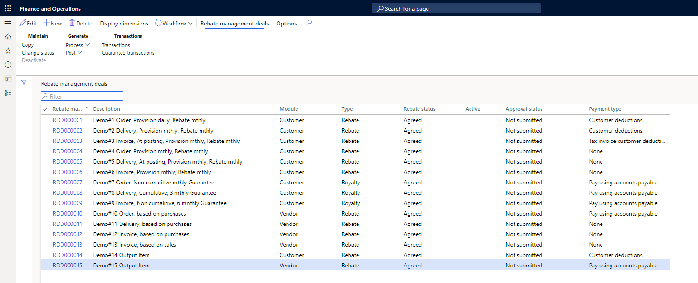

تُستخدم وحدة إدارة الخصومات لإنشاء العقود أو العروض أو الاتفاقيات بين شركتك والعملاء والموردين لتسهيل العمليات الحسابية. تتعقب وحدة إدارة الخصومات التخفيضات والخصومات في مكان واحد حيث يمكن لجميع المستخدمين المعنيين إنشاؤها وتقييمها ومعالجتها بسرعة.

- **الخصومات** - إرجاع جزء من سعر الشراء من قِبل البائع أو المشتري، عادةً ما يكون ذلك عند شراء كمية معينة أو قيمة سلع خلال فترة محددة. تتم هذه المرتجعات، على عكس الخصومات، بعد الفاتورة الكاملة لمبلغ الشراء.
- **الخصم** - تعويض أو مقابل أو رسوم مدفوعة للحصول على ترخيص أو امتياز لاستخدام الملكية الفكرية مثل العلامة التجارية أو حقوق النشر أو براءة الاختراع أو استخدام مورد طبيعي مثل صيد الأسماك أو الصيد أو التعدين. وعادةً ما يتم احتساب الخصومات كنسبة مئوية من الإيرادات أو الربح من الاستخدام المحقق. كلما زاد الاستخدام، زاد الخصم المحقق.
- **العوائد** - عوائد العملاء هي دفعات يدفعها طرف واحد إلى المرخص له أو صاحب الامتياز مقابل حق استخدام الأصل. يتم دعم جميع الخصومات والعوائد والتخفيضات من خلال وحدة الخصومات والتخفيضات الجديدة.
 
> [!div class="mx-imgBorder"]
> 

للمساعدة على تبسيط معالجة الخصم، تحتوي وحدة إدارة الخصومات على منضدة عمل مركزية للخصم.  للسماح لك بمعالجة الخصومات كخصم من العملاء، يتكامل أيضًا مع طاولة العمل الخاصة بالخصم.

تسمح العناصر التالية لـ Supply Chain Management بتبسيط عملية الخصم:

- **منضدة عمل الخصم** - تتيح لك طاولة العمل عرض جميع الأحكام والخصومات ومعاملات الشطب ومعالجتها في مكان مركزي، بدلاً من مطالبتك بفتح كل برنامج خصم على حدة. من طاولة عمل الخصم، يمكنك الوصول بسرعة إلى جميع الأحكام ومطالبات الخصم ومعالجة المعاملات أو مسحها.
- **فئة التدبير** - هذه الفئة، التي تحتوي على نوع **الدفع باستخدام الحسابات الدائنة**، موجودة في ملف تعريف ترحيل إدارة الخصومات. يمكنك استخدام هذه الفئة لإنشاء دفتر يومية فاتورة المورد المستهدف.
- **تفاصيل إدارة الخصم لبنود أوامر الشراء والمبيعات** - تمكّنك هذه التفاصيل من عرض الخصومات المؤهلة أثناء عملية إدخال الأمر.
- **تحسينات طاولة الاستقطاع** - تضيف هذه الميزة دعمًا لسيناريوهات الدفع القصيرة من خلال تمكين المستخدمين من تحويل الخصومات إلى خصم.

راجع [نظرة عامة على وحدة إدارة الخصم](/dynamics365/supply-chain/rebate-management/rebate-management-overview/?azure-portal=true) لمعرفة المزيد حول وحدة إدارة الخصم. 
