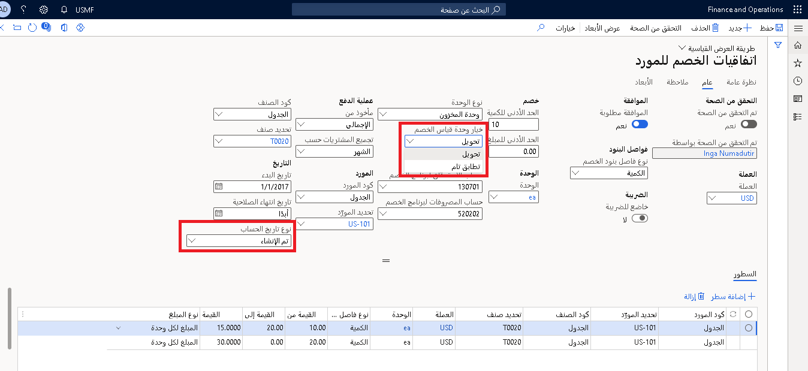

تساعد خصومات الموردين الشركات على إدارة برامج خصومات الموردين بشكل أفضل عن طريق التنفيذ التلقائي للمهام المطلوبة لإدارة الخصومات التي يتم الحصول عليها وتتبعها والمطالبة بها.

اتفاقية خصم المورد هي سجل لعقد مع مورد يحدد الشروط والأحكام التي تم التفاوض عليها والتي بموجبها تتأهل الشركة لمكافأة مالية مقابل تحقيق أهداف الشراء المحددة مسبقاً. يتم تسجيل اتفاقيات خصومات الموردين في صفحة **اتفاقيات الخصومات**.

لفتح صفحة **اتفاقيات خصومات الموردين**، حدد **التدبير والتوريد > خصومات الموردين > اتفاقيات الخصومات.**

يحدد عنوان الاتفاقية الشروط العامة التي تؤهل الشركة للخصومات. في الواقع، تحدد معلومات العنوان أن المورد يمنح خصماً عند شراء منتج محدد بكمية معينة. في العنوان، يمكنك أيضاً تحديد خيار خصم وحدة القياس ونوع تاريخ الحساب.

في علامة التبويب **عام**، في حقل خيار **خصم وحدة القياس**، يمكنك تحديد ما إذا كانت وحدة القياس يجب أن تكون شرطاً لبند أمر الشراء للتأهل لمطالبة بالخصم.

-   **تحويل** - يتأهل بند أمر الشراء لخصم المورد وفقاً لاتفاقية الخصم. سوف تتلقى خصماً بغض النظر عن وحدة القياس المطبقة على البند.
-   **التطابق التام** - للتأهل للحصول على خصم، يجب أن يحتوي بند الشراء على نفس وحدة القياس المحددة في الاتفاقية.

في علامة التبويب **عام**، في حقل عنوان **تاريخ الحساب**، حدد التاريخ الذي يتم استخدامه لتحديد ما إذا كان الشراء يحدث في فترة صلاحية اتفاقية الخصم.

-   **تم الإنشاء** - استخدم تاريخ إنشاء أمر الشراء.
-   **التسليم المطلوب‬** - استخدم تاريخ التسليم المطلوب.

في بنود الاتفاقية، يمكنك تحديد اتفاقية خصم المورد بمزيد من التفاصيل.

في حقل **تجميع الشراء حسب**، يمكنك تعيين حساب المطالبة بالخصم. يمكن تعيين المبلغ للاعتماد على فترة (أسبوع أو شهر أو سنة أو مدى الحياة أو فترة مخصصة). تشير قيمة الفاتورة إلى أنه سيتم تحديد مطالبة بالخصم في كل مرة يتم فيها فوترة بند أمر الشراء.

في الحقل **مأخوذ من**، يمكنك تحديد الأساس لحساب الخصم.

-   **الإجمالي** - يتم احتساب الخصم بناءً على السعر الإجمالي للصنف.
-   **الصافي** - يتم احتساب الخصم بناءً على صافي سعر الصنف (أي السعر بعد تطبيق الخصومات الأخرى).

يحدد الحقلان **حساب استحقاق برنامج الخصومات** و **حساب مصروفات برنامج الخصومات** أرقام الحسابات التي ستتلقى مبالغ الخصومات المستحقة أثناء المرحلة الوسيطة بين الموافقة والمعالجة.

عند تعيين خيار **‏‫مطلوب الموافقة‬** إلى **نعم**، يجب الموافقة على المطالبة بالخصم قبل استحقاقه أو دفعه.

يحدد الحقل **نوع فاصل بند الخصم** الأساس للخصومات.

-   **الكمية** - الخصومات تعتمد على الحجم.
-   **المبلغ** - الخصومات تعتمد على المبلغ.

في علامة التبويب السريعة **بنود**، لاحظ كيف يمكن إعداد مستويات كميات مختلفة لمنح خصومات مختلفة. على سبيل المثال، في الحقلين **من القيمة** و **إلى القيمة**، يمكنك الإشارة إلى أن كمية المنتج بين 10 و19 وحدة مؤهلة للحصول على خصم قدره 15.00 دولاراً أمريكياً لكل وحدة.

ويكون الحقل **من القيمة** شاملاً، بينما يكون الحقل **إلى القيمة** حصرياً.
على سبيل المثال، يتم تعيين الحقل **نوع فاصل بند الخصم** إلى **الكمية**، وتقوم بإدخال **1** في الحقل **من القيمة** و **3** في الحقل **إلى القيمة**. في هذه الحالة، يتم تطبيق مبلغ الخصم عند شراء صنف أو صنفين، ولكن ليس عند شراء ثلاثة أصناف.

في حقل **حالة الموافقة على سير العمل**، تشير القيمة **الموافق عليها** إلى أنه يمكن تطبيق الاتفاقية على أوامر الشراء التي تلبي شروط الاتفاقية.

## وحدة إدارة الخصومات
تُستخدم وحدة إدارة الخصومات لإنشاء العقود أو العروض أو الاتفاقيات بين شركتك والعملاء والموردين لتسهيل العمليات الحسابية. تتعقب وحدة إدارة الخصومات التخفيضات والخصومات في مكان واحد حيث يمكن لجميع المستخدمين المعنيين إنشاؤها وتقييمها ومعالجتها بسرعة.

- **الخصومات** - إرجاع جزء من سعر الشراء من قِبل البائع أو المشتري، عادةً ما يكون ذلك عند شراء كمية معينة أو قيمة سلع خلال فترة محددة. تتم هذه المرتجعات، على عكس الخصومات، بعد الفاتورة الكاملة لمبلغ الشراء.
- **الخصم** - تعويض أو مقابل أو رسوم مدفوعة للحصول على ترخيص أو امتياز لاستخدام الملكية الفكرية مثل العلامة التجارية أو حقوق النشر أو براءة الاختراع أو استخدام مورد طبيعي مثل صيد الأسماك أو الصيد أو التعدين. وعادةً ما يتم احتساب الخصومات كنسبة مئوية من الإيرادات أو الربح من الاستخدام المحقق. كلما زاد الاستخدام، زاد الخصم المحقق.
- **العوائد** - عوائد العملاء هي دفعات يدفعها طرف واحد إلى المرخص له أو صاحب الامتياز مقابل حق استخدام الأصل. يتم دعم جميع الخصومات والعوائد والتخفيضات من خلال وحدة الخصومات والتخفيضات الجديدة.
 
> [!div class="mx-imgBorder"]
> 

## تحديد الأوامر المؤهلة للحصول على الخصومات وإنشاء المطالبات بالخصومات 

عند إصدار أوامر الشراء مع مورد لدى الشركة اتفاقية خصومات معه، تحدد Supply Chain Management أي دفعات ائتمان للمورد في المستقبل. إذا كانت أوامر الشراء مؤهلة للحصول على خصم، فسيتم إنشاء مطالبة بالخصم لكل بند أمر بمجرد ترحيل فاتورة الشراء. هذه العملية تلقائية. في وقت لاحق، يمكنك مراجعة الخصومات المتوقعة ومعرفة تأثير تلك الخصومات على تكلفة المنتج وهامش الربح.

عرض تفاصيل الخصومات التي يتم تطبيقها على بند أمر الشراء وفقاً لاتفاقية خصومات الموردين:

1.  في صفحة **أمر الشراء**، حدد بند أمر ثم حدد **بند أمر الشراء > طريقة العرض > تفاصيل الأسعار**.
2.  في صفحة **تفاصيل الأسعار**، حدد علامة التبويب السريعة **الخصومات**.

كما يتم عرض معلومات الخصم في حقل **خصم المورد** في قسم **تقدير الهامش** في صفحة **تفاصيل الأسعار**.

في صفحة **معلمات التدبير والتوريد**، في علامة التبويب **الأسعار**، تحقق من تعيين خيار **تمكين تفاصيل الأسعار** إلى **نعم**.
في حالة تعيين هذا الخيار إلى **نعم**، فلن تتمكن من عرض الخصومات.

## مراجعة المطالبات والموافقة عليها 

تمثل المطالبات بالخصومات المُنشأة الدفعات المستقبلية التي يمكن توقعها من المورد. قبل إصدار إشعار دائن إلى المورد، يحتاج مالك الاتفاقية عادةً إلى مراجعة المطالبات والموافقة عليها. ومع ذلك، لاحظ أن حالة المطالبة تحدد ما إذا كانت المطالبة جاهزة للمرور بعملية الموافقة أو لا.

## حالة المطالبات وتأثيرها على عملية الموافقة 

عندما يتم إنشاء مطالبة، يتم تعيين حالتها على أنها **سيتم احتسابها** إذا تم منح الخصم على أساس تراكمي أو **تم احتسابها** إذا تم منح الخصم لكل فاتورة. إذا كانت حالة المطالبة هي **سيتم احتسابها**، يجب أن تمر المطالبة بعملية حسابية تتم معالجتها بواسطة وظيفة **التجميع**. يمكن تضمين فقط المطالبات التي تكون حالتها **تم احتسابها** في عملية الموافقة.

في حالة تعيين خيار **مطلوب الموافقة** في اتفاقية خصم مورد إلى **لا**، فإن أي مطالبات يتم إنشاؤها ستكون بحالة **موافق عليها**. الموافقة إلزامية للمطالبات التي يتم منحها على أساس تراكمي.

## الموافقة على المطالبات وعرض الترحيلات وتفاصيل الفاتورة 

عندما تتم الموافقة على المطالبات، يمكن معالجتها من خلال حسابات المدفوعات. يتم إنشاء مذكرة ائتمان (فاتورة المورد) لمبلغ المطالبة بالخصم تلقائياً. ويمكن بعد ذلك إضافة الائتمان إلى رصيد المورد، ويمكن لموظف حسابات المدفوعات إدراجه في عملية التسوية العادية.

1.  حدد **التدبير والتوريد > خصومات الموردين > المطالبات بالخصومات** لفتح مطالبة بخصم.
2.  أغلق المطالبة بالخصم.
3.  حدد المطالبة، ثم في جزء الإجراء، حدد **الموافقة**.
4.  في صفحة الطلب، في حقل **المورد**، حدد المورد الذي تم التصريح لك بتلقي خصم منه، ثم حدد **موافق**.

    يتم ترحيل دفتر يومية استحقاق الخصم لمبلغ المطالبة. يقوم هذا الترحيل بخصم حساب المقبوضات لخصومات الموردين المستحقة لائتمان المورد المتوقع، ثم يضيفه إلى حساب خصومات الموردين المستحقة المؤقتة المقبوضة للربح المتوقع.
5.  في قائمة **الخصم**، حدد البند، ثم في جزء الإجراء، حدد **حركات الخصومات** لعرض رقم دفعة دفتر اليومية والانتقال إليه لترحيل استحقاق الخصم هذا.

    لنقل المطالبات إلى عملية حسابات المدفوعات العادية، يجب على كاتب حسابات المدفوعات الآن إكمال معالجة المطالبة بالخصم عن طريق تشغيل وظيفة **المعالجة**.
6.  في جزء الإجراء، حدد **معالجة**، ثم حدد **عامل تصفية**.
    في حقل **المعايير** الخاص بحقل **حساب المورد**، حدد المورّد المراد معالجة المطالبات بالخصومات له، وحدد عوامل التصفية الأخرى ذات الصلة، ثم حدد **موافق**.

تشير أشرطة الرسائل وحقيقة تغيير الحالة إلى **مكتملة** إلى حدوث الأحداث التالية:

-   أدى ترحيل دفتر يومية استحقاق الخصم إلى عكس المبالغ المؤقتة السابقة في الحسابات المدينة وحسابات المصروفات المستحقة.

-   تم إنشاء فاتورة مورد (إشعار دائن) لمبلغ الخصم.

    يحدد إعداد خيار **ترحيل الفواتير يدوياً** في علامة التبويب **برنامج الخصومات** في صفحة **معلمات التدبير والتوريد** ما إذا كان يتم ترحيل فاتورة المورد يدوياً أو تلقائياً كجزء من معالجة المطالبات.
-   عندما يتم ترحيل فاتورة المورد، إما تلقائياً أو يدوياً، يكون تم الخصم من الحساب الدائن للمورد، وتم قيد حساب الخصومات والبدلات المقبوضة.

    يتم تحديد رقم حساب الخصومات والبدلات المقبوضة لفئة التدبير المستخدمة في بند فاتورة الشراء للخصم. يتم تعيين فئة التدبير، بدورها، في علامة التبويب **برنامج الخصومات** في صفحة **معلمات التدبير والتوريد**.

7.  في قائمة **الخصم**، حدد البند، ثم في جزء الإجراء، حدد **حركات الخصومات** لعرض رقم دفعة دفتر اليومية والانتقال إليه لترحيل استحقاق الخصم هذا ورقم فاتورة المورد أيضاً.

8.  حدد بند حركة فاتورة المورد، ثم في جزء الإجراء، حدد **فاتورة المورد**. إذا تم ترحيل فاتورة المورد، فسترى دفتر يومية الفاتورة. وبخلاف ذلك، سترى فاتورة المورد كفاتورة مورد معلقة تتطلب الترحيل اليدوي. 
    يحدد بند الفاتورة تفاصيل فاتورة المورد لفئة تدبير العمولات والخصومات.

10. في صفحة **جميع الموردين**، حدد المورد الذي تتلقى خصماً منه، ثم في جزء الإجراء، حدد **الحركات**.
    ابحث عن بند الفاتورة. تمت الآن إضافة مبلغ الخصم إلى رصيد المورد.
