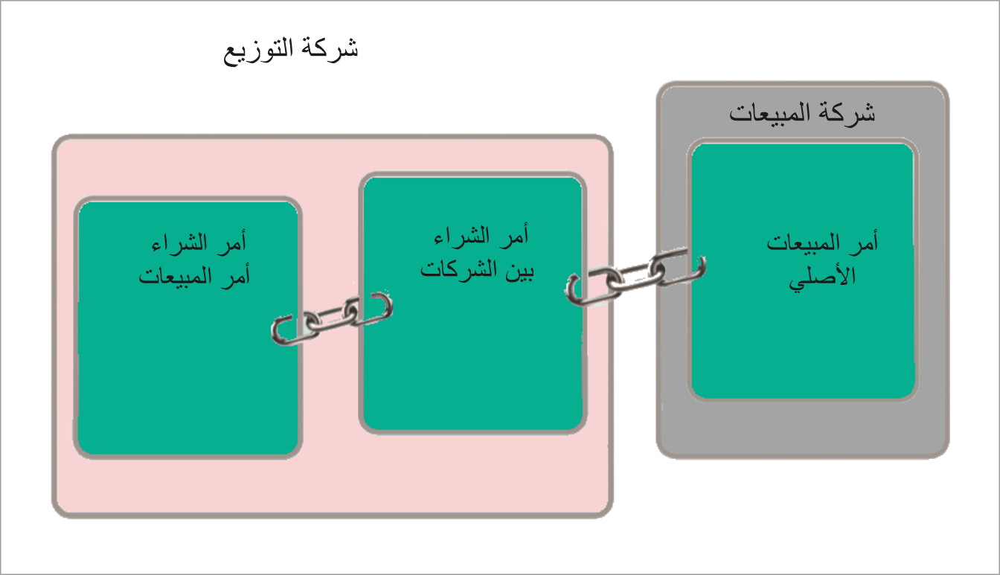

عند قيامك بإنشاء سلسلة أوامر بين الشركات الشقيقة، يتعقب Supply Chain Management جميع أوامر الشراء ذات الصلة وأوامر المبيعات المشتركة بين الشركات الشقيقة. 

تعد هذه الميزة مفيدة إذا كنت تريد، على سبيل المثال، عرض حالة المبيعات المتوافقة أو أمر الشراء المقابل إذا تم انتقاؤه أو تسليمه أو استلامه بالفعل.
 
فيما يلي أنواع مختلفة من أوامر السلسلة بين الشركات الشقيقة:

-   **سلسلة بين الشركات الشقيقة مبدوءة بأمر شراء (ثنائية الطرف)** - سلسلة بين الشركات الشقيقة يكون فيها أمر البدء هو أمر شراء.

-   **سلسلة بين الشركات الشقيقة مبدوءة بأمر مبيعات (ثنائية الطرف)** - سلسلة بين الشركات الشقيقة يكون فيها أمر البدء هو أمر مبيعات.

-   **سلسلة بين الشركات الشقيقة مبدوءة بأمر مبيعات مع عميل خارجي يواجه أمر مبيعات** - يُطلق عليه أيضاً "أمر المبيعات الأصلي" (ثلاثي الأطراف).

عند إنشاء أمر مبيعات بين الشركات الشقيقة، يقوم Supply Chain Management تلقائياً بإنشاء أمر شراء مقابل في الكيان القانوني المناسب.

وبالمثل، عندما إنشاء أمر شراء بين الشركات الشقيقة، فإنه يقوم بتشغيل الإنشاء التلقائي لأمر مبيعات مقابل بين الشركات الشقيقة.

في المثال أعلاه، يعمل **DEMF‎** كشركه موردة. وهي بحاجة إلى شراء سلع لتلبية طلبات عملائها. تعد شركة **USMF** هي الشركة التي تقوم **DEMF** بشراء هذه السلع منها. ويتم تصميم هذا المفهوم في العلاقة بين الشركات الشقيقة، حيث تقوم **USMF‎** بالبيع إلى **DEMF‎**، وتقوم **DEMF‎** بالشراء من **USMF‎**.

في العلاقة بين الشركات الشقيقة في إدارة سلسلة التوريد، تعتبر USMF هي شركة البيع.

عندما تنشئ DEMF أمر شراء ويكون المورد هي شركة USMF، يتم تلقائياً إنشاء أمر مبيعات بين الشركات الشقيقة مبدوء بأمر شراء في USMF.

عندما تنشئ USMF أمر مبيعات ويكون العميل هي شركة DEMF، يتم تلقائياً إنشاء أمر شراء بين الشركات الشقيقة مبدوء بأمر مبيعات في USMF.

تنشئ شركة DEMF أمر شراء لأن لديها طلباً من عملائها. لذلك، تعد شركة DEMF هي شركة البيع الفعلية التي تبيع للعملاء الخارجيين. ومع ذلك، تحتاج DEMF إلى شراء البضائع لبيعها وتسليمها خارجياً من USMF.

لذلك، تعد شركة DEMF هي شركة بيع لعملائها الخارجيين. من خلال التجارة بين الشركات الشقيقة، ستقوم DEMF بالشراء من USMF بحيث تبيع USMF إلى DEMF.

في علاقات العمل، مثل التجارة بين الشركات الشقيقة، يجب أن يجد الشركاء التجاريون قاعدة عامة لبيانات الشركة الخاصة بهم. يجب أن يقوم الكيانان القانونيان في العلاقة بين الشركات الشقيقة بإعداد لغة مشتركة للتواصل مع بعضهما البعض ولضمان مشاركة البيانات بشكل متسق بين الكيانات القانونية.

لإعداد لغة عامة، يجب عليك إعداد معلمات تعيين القيمة بين الشركات الشقيقة.
يسمح تعيين القيمة بين الشركات الشقيقة للكيانات القانونية المختلفة بمشاركة البيانات الرئيسية بشكل منطقي لدعم العمليات بين الشركات الشقيقة.

تعيين القيمة مطلوب للبيانات التي لا تتم مشاركتها. تتم مشاركة المنتجات؛ لذلك، لا يلزم تعيين القيمة. ومع ذلك، لا تتم مشاركة المعلومات الأخرى، مثل أوضاع التسليم، وبالتالي يلزم تعيين القيمة.

بعد إعداد تعيين القيمة للبيانات غير المشتركة، يمكن مزامنتها بين الكيانات القانونية.

تعد إدارة البيانات المشتركة جزءاً لا يتجزأ من العمليات التي تتضمن الحركات بين الشركات الشقيقة. تتم مزامنة هذه البيانات المشتركة بين أوامر المبيعات بين الشركات الشقيقة وأوامر الشراء بين الشركات الشقيقة.

في سلسلة بين الشركات الشقيقة، يجب نقل معلومات معينة، على سبيل المثال، معلومات العميل أو الأسعار والخصومات.

يمكنك أيضاً تحديد ما إذا كان العميل أو المورد أو كلاهما في السلسلة بين الشركات الشقيقة يمكنه تحديث الأسعار والخصومات.

## بضاعة بالطريق بين الشركات الشقيقة

يمكن تعقب المنتجات، التي تم إرسالها من موقع شحن تابع لكيان قانوني، ولكنها لم تصل بعد إلى موقع التسليم، من خلال إعداد التقارير بين الشركات الشقيقة.

تعتمد التقارير بين الشركات الشقيقة على الافتراضات التالية:

-   البضائع الواردة بالطريق مملوكة للشركة المشترية.

-   يمكن فقط إصدار إيصالات التعبئة على جانب الشحن أثناء النقل.

-   يتم استبعاد بنود الأوامر التي تمثل حركات إرجاع. وهذا يعني أن بنود أوامر المبيعات وبنود أوامر الشراء ذات الكميات السالبة لا يتم احتسابها على أنها قيد النقل.

-   يمكن خصم إيصالات استلام المنتجات فقط أثناء النقل.

يعرض التقرير الذي يمكن الوصول إليه من خلال **إدارة المخزون > الاستعلامات والتقارير > تقارير قيمة المخزون >إجماليات بضاعة بالطريق بين شركات شقيقة** رصيد بداية الفترة ورصيد نهاية الفترة وصافي التغيير خلال الفترة.

سيتم تجميع الأرصدة وصافي التغيير حسب المورد، مما يسمح للمستخدمين بالإدخال اليدوي لإدخال بيانات دفتر الأستاذ العام مباشرةً من إجماليات التقرير. يعرض التقرير أيضاً قيمة المخزون، والالتزام، والفرق في التكلفة القياسية.

يعرض التقرير، الذي يتم الوصول إليه من خلال **إدارة المخزون > الاستعلامات والتقارير > تقارير قيمة المخزون > حركات بضاعة بالطريق بين شركات شقيقة**، كافة الشحنات وعمليات الاستلام من عملية النقل في فترة محددة. ويعرض التقرير أيضاً قيمة المخزون المحسوبة، والالتزام، والفرق في التكلفة القياسية. يمكنك تسوية كل تقرير إجمالي.

الفوترة والمدفوعات بين الشركات الشقيقة
---------------------------------

بعد معالجة الأوامر بين الشركات الشقيقة، يمكنك استخدام المحاسبة بين الشركات الشقيقة، والتي يمكن الوصول إليها من خلال **دفتر الأستاذ العام > إعداد الترحيل** للشركات التابعة أو مكاتب الفروع. باستخدام المحاسبة بين الشركات الشقيقة، يمكنك إنشاء إدخال واحد يتم ترحيله إلى شركات متعددة.

يقدم Supply Chain Management ميزات تساعدك في إعداد الحسابات المالية بين الشركات الشقيقة، والتي يمكن استخدامها مع الأوامر بين الشركات الشقيقة.
توفر المحاسبة بين الشركات الشقيقة حركات دفتر الأستاذ للشركات التي تتعامل مع بعضها البعض، بما في ذلك الحركات المناسبة المستحقة من والمستحقة إلى.

لمزيد من المعلومات فيما يتعلق بالمحاسبة بين الشركات الشقيقة، راجع [المحاسبة بين الشركات الشقيقة في Dynamics 365 Finance](/learn/modules/intercompany-accounting-dyn365-finance/?azure-portal=true). 
