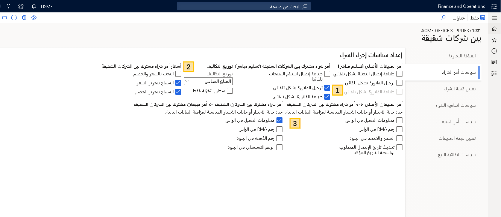
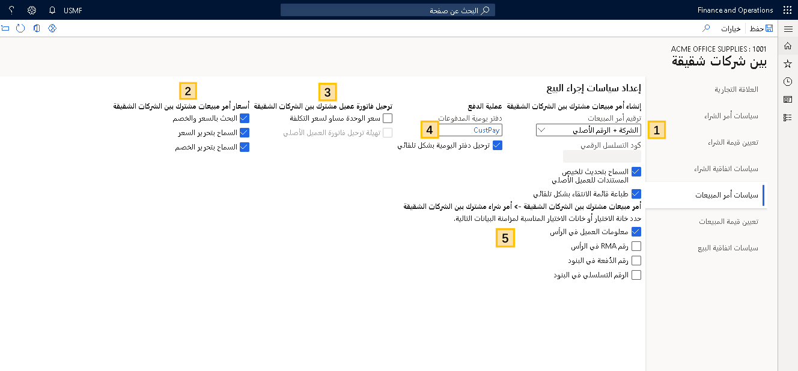
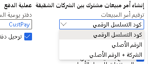
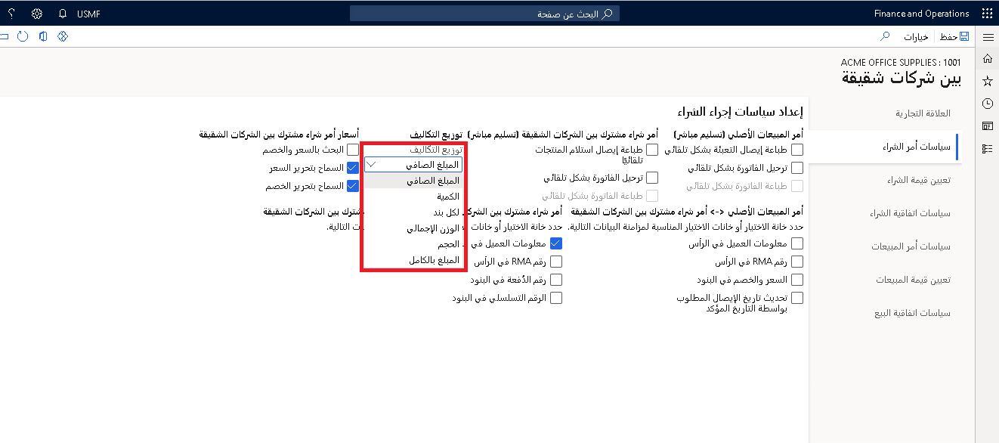
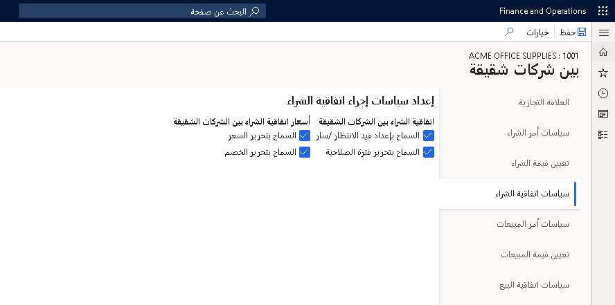
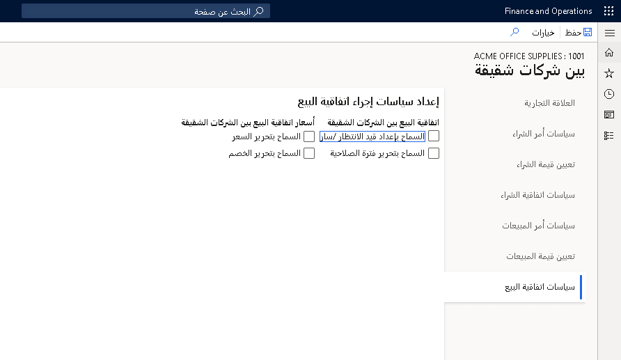
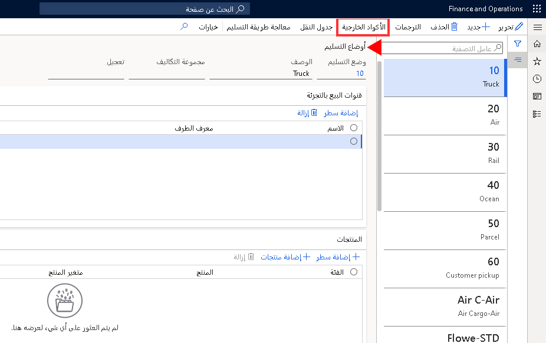
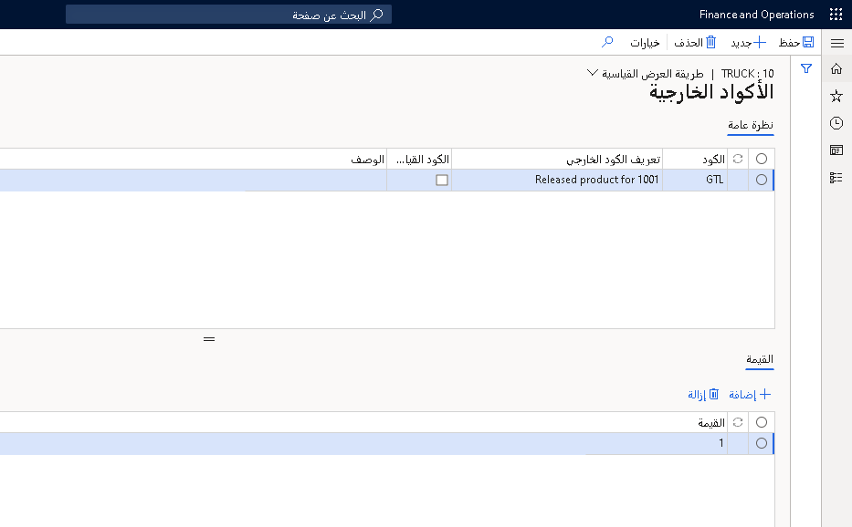
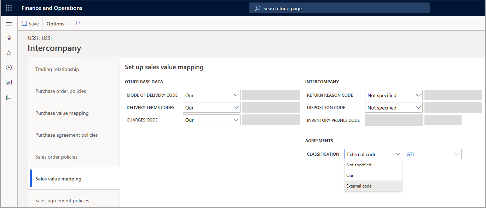

توضح الفيديوهات التالية كيفية إعداد علاقات تجارية بين كيانين قانونيين ضمن الشركات الشقيقة. 

> [!VIDEO https://www.microsoft.com/videoplayer/embed/RE4sban]  

> [!VIDEO https://www.microsoft.com/videoplayer/embed/RE4s3kA]  

## سياسات الإجراءات
 
تعتبر سياسات الإجراءات عناصر تحكم عمل داخلية يتم إنشاؤها لفرض قواعد العمل المخصصة لأعمالك. قبل إنشاء نُهج شراء بين الشركات الشقيقة، يجب إعداد معلمات نهج الشراء بين الشركات الشقيقة. ولكل نوع سياسة معلمات السياسة الخاصة به.

## تنشيط العلاقات التجارية
 

لإعداد سياسات إجراءات أوامر الشراء، قم بإعداد العلاقات التجارية بين الشركات الشقيقة للمورد عن طريق الانتقال إلى **التدبير والتوريد > الموردون > كافة الموردين > عام > بين الشركات الشقيقة**.

يمكنك أيضاً إعداد علاقة سياسة مبيعات مشتركة بين الشركات الشقيقة من العميل. افتح **المبيعات والتسويق > العملاء > كافة العملاء**، وحدد علامة التبويب **عام**، ثم حدد **بين الشركات الشقيقة** في جزء الإجراء.

ليس من الضروري الانتقال إلى كلا الجانبين (المورد والعميل) لإعداد العلاقة. بدلاً من ذلك، يمكنك تنفيذ التكوين الكامل من جانب واحد، وسوف تتمكن من الوصول إليه من المورد والعميل في كل شركة.

في قسم **علاقة المبيعات** من صفحة **علاقة تجارية**، حدد حقل **شركة العميل** وحدد الشركة التي ترغب في استخدامها للحركات بين الشركات الشقيقة في حقل **الحساب الخاص بي**.

قم بتمكين الخيار **نشط** لتنشيط العلاقة بين الشركتين. بعد ذلك تصبح العلاقة التجارية الكاملة (في كلا الاتجاهين) نشطة، ما يتيح إنشاء العلاقة في **شركة العميل** المعينة.

سيتم تطبيق سياسات أوامر الشراء وتعيين قيمة الشراء وسياسات اتفاقيات الشراء على المورد، بينما سيتم تطبيق سياسات أوامر المبيعات وتعيين قيمة المبيعات وسياسات اتفاقية البيع على العميل.

ويمكنك إلغاء تنشيط العلاقة من خلال تعيين الحقل **نشط** إلى **لا**، والذي يقوم بحفظ التكوين. إذا كنت تفضل حذف العلاقة بالكامل، التي ستقوم بتعيين كافة المعلمات إلى فارغة، فيجب تحديد الزر **إزالة العلاقة**.

## سياسات أوامر الشراء - إعداد سياسات إجراءات الشراء 
 

يمكنك تحديد سياسات إجراءات أوامر الشراء التي تتحكم في التفاعل (قواعد الأعمال) بين كيانات الأعمال. تنقسم المعلمات الموجودة في صفحة **إعداد سياسات إجراءات الشراء** إلى ثلاث فئات:

1. **معلمات العملية** - تُحدد كيفية تحديث إيصالات التعبئة والفواتير وكيفية تنفيذ عمليات طباعة المستندات لأمر المبيعات الأصلي وأمر الشراء المشترك بين الشركات الشقيقة.

2. **معلمات سعر أمر الشراء** - تُحدد إمكانية تحرير الأسعار والخصومات.

3. **معلمات التزامن** - تحدد البيانات التي تتم مزامنتها.

تتحكم معلمة **معلومات العميل** الموجودة في مجموعة **الرأس** الخاصة بأمر الشراء المشترك بين الشركات الشقيقة وأمر المبيعات المشترك بين الشركات الشقيقة في مزامنة معلومات العميل. عند تمكين خيار **معلومات العميل**، تتم مزامنة معلومات الرأس من أمر الشراء المشترك بين الشركات الشقيقة إلى أمر المبيعات المشترك بين الشركات الشقيقة والعكس صحيح.
 

## إعداد سياسات إجراءات المبيعات
 

في صفحة **إعداد سياسات إجراءات المبيعات**، تقع معلمات سياسات أمر المبيعات ضمن الفئات التالية:

-   **معلمات العملية** - إنشاء أمر مبيعات مشترك بين الشركات الشقيقة وبدء قائمة الانتقاء.

-   **معلمات التحكم في السعر والخصم** - تتحكم في التسعير بين أمر المبيعات وأمر الشراء المشترك بين الشركات الشقيقة.

-   **ترحيل فاتورة أمر المبيعات المشترك بين الشركات الشقيقة** - ترحيل أمر المبيعات والسعر المستخدم للترحيل.

-   **دفتر يومية المدفوعات** - إعدادات دفتر يومية المدفوعات.

-   **المزامنة** - التحكم في مزامنة البيانات بين أمر المبيعات وأمر الشراء المشترك بين الشركات الشقيقة.

إذا قمت بتنشيط **سعر الوحدة يساوي سعر التكلفة**، فلن تتمكن من استخدام الاتفاقيات بين الشركات الشقيقة.

يعمل تحديد معلمة **ترقيم أمر المبيعات المشترك بين الشركات الشقيقة** مع إعداد معلمة أمر المبيعات في الحسابات المدينة.

تتضمن الخيارات المتاحة لمعلمة **ترقيم أمر المبيعات المشترك بين الشركات الشقيقة** ما يلي:

-   **كود التسلسل الرقمي** - يتم إنشاء رقم أمر مبيعات وفقاً للتسلسل الرقمي. يتم إعداد التسلسل في **الحسابات المدينة > الإعداد > معلمات الحسابات المدينة > التسلسلات الرقمية > أمر المبيعات**.

-   **الرقم الأصلي** - إذا كان موجوداً، فسوف يتم استخدام الرقم الموجود في أمر المبيعات الأصلي. خلاف ذلك، يتم استخدام التسلسل الرقمي المحدد لأمر المبيعات.

-   **الشركة + الرقم الأصلي** - يتم استخدام معرف الشركة وأمر المبيعات الأصلي. خلاف ذلك، يتم استخدام التسلسل الرقمي.

عند تحديد **التسلسل الرقمي** في حقل **ترقيم أمر المبيعات**، يمكن استخدام هذا التسلسل الرقمي بدلاً من التسلسل الرقمي لأمر المبيعات القياسي الذي تم إعداده في صفحة **معلمات الحسابات المدينة**. إذا كان الحقل فارغاً، فسيتم استخدام التسلسل الرقمي القياسي لأمر المبيعات.

تتحكم معلمة **معلومات العميل** الموجودة في مجموعة حقل **الرأس** الخاصة بأمر الشراء المشترك بين الشركات الشقيقة وأمر المبيعات المشترك بين الشركات الشقيقة في مزامنة معلومات العميل عبر سلسلة الشركات الشقيقة.

### معالجة توزيعات المصاريف بين الشركات الشقيقة

كما هو الحال مع الأسعار والخصوم، تتم مزامنة المصاريف المتنوعة بين أمر المبيعات المشترك بين الشركات الشقيقة وأمر الشراء المشترك بين الشركات الشقيقة، وفقاً لما إذا كان العميل/المورد مديناً/دائناً، على التوالي.

**السيناريو**

يقوم مورد الشركات الشقيقة بإضافة رسوم معالجة كمصاريف متنوعة إلى أمر المبيعات المشترك بين الشركات الشقيقة. تتم مزامنة هذا المصاريف المتنوعة تلقائياً مع أمر الشراء المشترك بين الشركات الشقيقة.

عند استخدام التسليمات المباشرة، يمكنك تحديد أسلوب توزيع لتطبيقه على أمر الشراء المشترك بين الشركات الشقيقة.
 

لاستخدام خيار **المصاريف**، اتبع الخطوات التالية:

1.  افتح **المبيعات والتسويق > العملاء > كافة العملاء** ثم حدد عميلاً.
2.  حدد **عام** ثم **بين الشركات الشقيقة** في جزء الإجراء.
3.  حدد **سياسات أوامر الشراء**.
4.  حدد من بين خيارات **توزيع المصاريف** التالية:
    -   **المبلغ الصافي** - يتم توزيع المصاريف وفقا لكل مبلغ بند، بالتناسب مع إجمالي المبلغ الصافي لأمر الشراء أو الفاتورة.
    -   **الكمية** - يتم توزيع المصاريف وفقاً لعدد الوحدات لكل بند، بالتناسب مع إجمالي عدد الوحدات لأمر الشراء أو الفاتورة.
    -   **لكل بند** - يتم توزيع المصاريف بالتساوي، وفقاً لإجمالي عدد البنود.
    -   **الوزن الإجمالي**
    -   **الحجم**
    -   **المبلغ بالكامل**
5.  حدد ما إذا كانت المصاريف تنطبق على كافة الأصناف أو على الأصناف المخزنة من خلال تحديد المعلمة **البنود المخزنة فقط**.

### المصاريف: سعر التكلفة

في بعض علاقات الشركات الشقيقة، يتم توجيه المورد بين الشركات الشقيقة لبيع الأصناف إلى عميل بين الشركات الشقيقة بسعر مساوٍ لسعر التكلفة بدلاً من تطبيق اتفاقيات تجارية أو أسعار شراء قياسية.

**السيناريو**

ويقوم المورد بين الشركات الشقيقة ببيع الأصناف إلى شركة التوزيع باستخدام سعر التكلفة كسعر وحدة. وبدلاً من الهامش، يضيف المورد مصاريف متنوعة كنسبة مئوية من سعر الوحدة في أمر المبيعات الأصلي.

**مثال** 

سعر الوحدة في أمر المبيعات الأصلي في شركة **DEMF** هو 300.00 دولار أمريكي (USD). وسعر التكلفة للصنف في شركة USMF هو 125.00 دولار أمريكي. بالتالي، يتم تعيين سعر المبيعات في أمر المبيعات المشترك بين الشركات الشقيقة على قيمة مساوية للتكلفة 125.00 دولار أمريكي. تتم مزامنة سعر المبيعات هذا كسعر شراء لأمر الشراء المشترك بين الشركات الشقيقة في شركة **DEMF**.

إذا تم تعيين المصاريف المتنوعة في بند أمر المبيعات لأمر المبيعات المشترك بين الشركات الشقيقة إلى **النسبة المئوية بين الشركات الشقيقة** في حقل **الفئة**، وتم إعداد **قيمة المصاريف** على **10**، ستتم إضافة 10 بالمائة من سعر الوحدة الخاص بأمر المبيعات الأصلي. في هذا المثال، تكون هذه هي نسبة 10 بالمائة من 300.00 دولار أو 30.00 دولار.

### الإجراء - إعداد سعر وحدة يساوي سعر التكلفة

لاستخدام وظيفة **سعر التكلفة يساوي سعر الوحدة**، اتبع الخطوات التالية:

1.  افتح **المبيعات والتسويق > العملاء > كافة العملاء** وحدد عميلاً بين الشركات الشقيقة.

2.  حدد **عام** ثم **بين الشركات الشقيقة** في جزء الإجراء.

3.  حدد **سياسات أوامر المبيعات**.

4.  حدد **سعر الوحدة يساوي سعر التكلفة** لاستخدام سعر التكلفة بدلاً من الاتفاقيات التجارية أو سعر المبيعات المحدد في الصنف.

5.  في حالة تحديد معلمة **سعر الوحدة يساوي سعر التكلفة**، يمكنك تحديد معلمة **بدء ترحيل فاتورة العميل الأصلية**. وهذا يعني أنه إذا توقف ترحيل الفاتورة في أمر المبيعات المشترك بين الشركات الشقيقة بسبب حدوث خطأ، فسيتم ترحيل الفاتورة الموجودة في أمر المبيعات الأصلي على أي حال.

### الإجراء - إضافة مصاريف بين الشركات الشقيقة

في حالة استخدام سعر الوحدة الموجود في أمر الشراء باعتباره يساوي سعر التكلفة، فلن يتلقى المورد أي هامش ربح. لتعويض خسارة هامش الربح، يمكن للمورد إضافة مصاريف.

يمكن إعداد فئة المصاريف الخاصة التي تسمي **‬‏‫النسبة المئوية بين الشركات الشقيقة** بين الشركات الشقيقة في بنود أمر المبيعات الأصلي. القيمة التي يتم إدخالها في هذه البنود هي النسبة المئوية لسعر الوحدة في أمر المبيعات الأصلي.

لإضافة مصاريف بين الشركات الشقيقة، اتبع الخطوات التالية:

1.  افتح **المبيعات والتسويق > أوامر المبيعات > كافة أوامر المبيعات**.
2.  حدد أمر مبيعات تم استخدامه في سلسلة بين الشركات الشقيقة.
3.  حدد **بيع** ثم **المصاريف** في جزء الإجراء.
4.  أدخل **كود المصاريف** ثم حدد **النسبة المئوية بين الشركات الشقيقة** في حقل **الفئة**.
5.  أدخل رقماً كأساس لـ **النسبة المئوية بين الشركات الشقيقة** في حقل **القيمة**.
6.  أغلق الصفحة.

## اتفاقيات البيع والشراء
 

اتفاقية البيع هي عقد يُلزم العميل بشراء منتج بكمية محددة أو مبلغ معين على مدار فترة من الوقت مقابل أسعار وخصومات خاصة. وتسود أسعار وخصومات اتفاقية البيع على أي أسعار وخصومات نصت عليها أي اتفاقيات تجارية قد تكون موجودة. في صفحة **اتفاقيات المبيعات**، يمكنك إنشاء وتطبيق ومتابعة اتفاقيات المبيعات الموجودة بين المؤسسة والعميل الخاص بها. على سبيل المثال، بعد إنشاء اتفاقية بيع، يمكنك الطلب مباشرة منها.

تسري اتفاقية البيع حسب الفترة التي حددها الشخص الذي أنشأ اتفاقية البيع. يجب أن يقع **تاريخ الشحن المطلوب** للبيع الذي تم تحديده في صفحة **أمر المبيعات** ضمن فترة الصلاحية. افتراضياً، تكون اتفاقية البيع **قيد الانتظار**. يمكنك الطلب من اتفاقية البيع فقط عندما تكون معينة إلى **فعال**.

لمزيد من المعلومات حول الاتفاقيات، راجع [تكوين الاتفاقيات واستخدامها في Dynamics 365 Supply Chain Management](/learn/modules/configure-use-agreements-dyn365-supply-chain-mgmt/?azure-portal=true).

تتضمن الشركات الشقيقة معلمات خاصة باتفاقيات المبيعات وأوامر الشراء.

## إعداد سياسات إجراءات اتفاقية الشراء
 

في علامة تبويب **سياسات اتفاقيات الشراء**، في صفحة **بين الشركات الشقيقية** يمكنك إعداد سياسة إجراء يتحكم في ما إذا كان يمكن لجزء الشراء في إحدى العلاقات التجارية بين الشركات الشقيقة تعديل شروط معينة في اتفاقية الشراء، مثل السعر والخصومات وفترة الصلاحية.

## إعداد سياسات إجراءات اتفاقية البيع
 

في علامة تبويب **سياسات اتفاقيات البيع**، في صفحة **بين الشركات الشقيقية** يمكنك إعداد سياسة إجراء يتحكم في ما إذا كان يمكن لجزء البيع في إحدى العلاقات التجارية بين الشركات الشقيقة تعديل شروط معينة في اتفاقية البيع، مثل السعر والخصومات وفترة الصلاحية.

## تعيين القيمة
 

في علاقات العمل، مثل التجارة بين الشركات الشقيقة، يجب أن يجد الشركاء التجاريون قاعدة عامة لبيانات الشركة الخاصة بهم.

يمكن لشركتين في السيناريو بين الشركات الشقيقة مرتبطتين بعلاقة مورد أو عميل، التواصل مع بعضهما البعض نظراً لأن لديهما نفس معلمات تعيين القيمة.

يعتبر تعيين القيمة ضرورياً لإنشاء فهم مشترك في لغات الشركات بين شريكين تجاريين أو أكثر.

في بعض الحالات، قد تستخدم الكود من **الشركة أ** أو تستخدم دائماً الكود من **الشركة ب**. وعندما لا يمكنك استخدام الكود من إحدى الشركات في سلسلة بين الشركات الشقيقة، فيمكنك تحديد كود خارجي ليتم استخدامه، ثم تحديد الكود الخارجي في تعيين القيمة.

على سبيل المثال، قد تمثل معالجة أساليب تسليم أو أكواد تسليم مختلفة مشكلة:

-   قد يكون لدى **الشركة أ** **كود تسليم** يستخدم الرمز "D" لشركة نقل ألمانية.

-   وتقوم **الشركة ب** بمعالجة **كود التسليم** لنفس شركة النقل الألمانية بالكود "DE".

بالتالي، يجب تحديد قيمة تعيين عمومية واحدة للتجارة بين هاتين الشركتين لكي تعمل بشكل صحيح.

## الأكواد الخارجية
 

يمكن الوصول إلى صفحة **الأكواد الخارجية** من عدة صفحات. تختلف الحقول تبعاً لكيفية فتح الصفحة.

على سبيل المثال، إذا قمت بفتح صفحة **الأكواد الخارجية** من صفحة **التدبير والتوريد > الإعداد > التوزيع > أوضاع التسليم**، فيمكنك تحديد أكواد خارجية لوضع التسليم الخاص بالشركة.

إذا قمت بفتح صفحة **الأكواد الخارجية** من صفحة **العملاء**، فيمكنك تحديد أكواد خارجية لأرقام حسابات عملاء الشركة.

## إعداد تعيين القيمة للشراء والمبيعات
 

فيما يلي الخيارات المتوفرة لقيم الحقول في صفحتي **إعداد تعيين قيمة الشراء** و **إعداد تعيين قيمة المبيعات**:

-   **غير محددة** - حدد الكود

    لاحظ أن كافة تعيينات القيم للشركات الشقيقة يجب أن تكون مختلفة عن **غير محددة**. بهذا التحديد، ستفشل مزامنة البيانات بين الحركات. نوصي بعدم تعيين أي أكواد **غير محددة** لعلاقة نشطة.

-   **خاصتنا** يتم استخدام رقم العميل/المورد لحساب الشركة التي تتواجد فيها

-   **الكود الخارجي** - الكود الخارجي لتعيين القيمة

    
    

تحتوي **صفحات إعداد تعيين قيمة المشتريات والمبيعات** على الأقسام التالية:

-   **البيانات الأساسية الأخرى** - استخدم هذه الإعدادات لتحديد كود وضع التسليم وأكواد شروط التسليم وأكواد المصاريف. يحدد نوع الكود الخارجي هذا كيفية وصف أكواد التسليم والشحن في المستند وما إذا كان يتم مزامنتها أم لا.

-   **الشركات الشقيقة** - حدد نوع الكود الخارجي لتحويل أكواد سبب الإرجاع والتنظيم. يحدد نوع الكود الخارجي هذا كيفية وصف أكواد سبب الإرجاع والتنظيم بين الشركات الشقيقة في المستند وما إذا كان يتم مزامنتها أم لا.

-   **الاتفاقيات** - حدد نوع الكود الخارجي لتحويل التصنيف بين الشركات الشقيقة. يحدد نوع الكود الخارجي هذا كيفية وصف التصنيفات بين الشركات الشقيقة في المستند وما إذا كان يتم مزامنتها أم لا.
