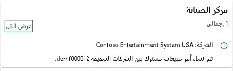

## أوامر سلسلة بين شركات شقيقة بدأها أمر شراء
 

تتكوّن سلسلة أوامر مشتركة بين شركات شقيقة بدأها أمر شراء من أمرين:

-   أمر شراء في شركة المبيعات
-   أمر مبيعات في شركة المورّد 
   
عند الإشارة إلى أمر مبيعات أو أمر شراء في الشركة ذات الصلة، استخدم البادئة "بين شركات شقيقة". وعند الإشارة إلى أمر مبيعات أو أمر شراء في الشركة الموجود أنت فيها حالياً، لا تُستخدم أي بادئة.

العملية الأساسية في السلسلة بين الشركات الشقيقة هي السلسلة بين الشركات الشقيقة التي تستند إلى أمر الشراء. وفي هذه العملية، ينشئ أمر الشراء في الشركة **DEMF** أمر مبيعات مشترك بين الشركات الشقيقة في الشركة **USMF** ثم ينشئ سلسلة أوامر شراء داخلية بين الشركات الشقيقية.

قبل أن تتم الموافقة على أمر شراء مشترك بين الشركات الشقيقة أو تأكيده، يمكنك عرض الكمية المتاحة من المنتج في الشركات الأخرى. استخدم الصفحة **الكمية الحالية بين الشركات الشقيقة** لتعريف المخزون المتاح وتحديد كميته لأمر الشراء المشترك بين الشركات الشقيقة.

بعد إنشاء أمر الشراء، يتم إنشاء أمر المبيعات المشترك بين الشركات الشقيقة بشكل تلقائي في شركة المورّد إذا كانت العلاقة التجارية بين الشركات الشقيقة نشطة.

لعرض أمر الشراء الأصلي، حدد علامة التبويب **إدارة**، ثم حدد **أمر مبيعات مشترك بين الشركات الشقيقة** في جزء الإجراء.

لعرض جميع أوامر الشراء المقترنة بأمر المبيعات هذا، حدد علامة التبويب **عام**، ثم حدد **الأوامر ذات الصلة**  في جزء الإجراء.
يمكن القيام بذلك أيضاً من صفحة **أمر الشراء**.

يُعد تأكيد أمر المبيعات اختيارياً وليس لديه أي تأثير على سلسلة الأوامر بين الشركات الشقيقة.

## إنشاء إيصالات التعبئة وإيصالات استلام المنتجات
 

عندما يصبح الصنف في سلسلة الأوامر بين الشركات الشقيقة جاهزاً للشحن، ستقوم بترحيل إيصال تعبئة. وعند ترحيل إيصال التعبئة، يكتشف النظام أنه قد تم استيفاء أمر المبيعات ويقلل المخزون المتاح. 

تقضي الخطوة التالية بإنشاء إيصال استلام المنتجات للتحقق من استلام صنف بين الشركات الشقيقة في الشركة المشترية. بعد ترحيل الفاتورة في شركة المبيعات، افتح الشركة المشترية وقم بترحيل إيصال استلام المنتجات لاستكمال الاستلام.

إذا كانت الكميات على تحديث إيصال استلام المنتجات تساوي الكميات المطلوبة، فستتغيّر القيمة في حقل **حالة** أمر الشراء إلى **مُستلَم**.

يأتي **معرف إيصال التعبئة** المُضاف إلى إيصال استلام المنتجات من إيصال تعبئة المبيعات. يمكنك أيضاً إنشاء إيصال استلام المنتجات من خلال الانتقال من أمر الشراء إلى إيصال تعبئة أمر المبيعات وإنشاء إيصال استلام المنتجات مباشرةً من إيصال تعبئة أمر المبيعات.

**السيناريو‏‎:**

قامت شركة منافذ بيع بالتجزئة بشراء أصناف من شركة الإنتاج الخاصة بها. وقامت شركة الإنتاج بشحن البضائع إلى شركة البيع بالتجزئة ثم قامت بترحيل إيصال التعبئة. عندما تستلم شركة البيع بالتجزئة الشحنة، تقوم بترحيل إيصال استلام المنتجات للأصناف التي تم استلامها.

## إنشاء الفواتير
 

بعد شحن الصنف واستلامه، قم بترحيل الفاتورة لاستكمال العملية بين الشركات الشقيقة. يأتي **معرف الفاتورة** المُضاف من فاتورة المورّد من إيصال تعبئة المبيعات.

يمكنك أيضاً إنشاء فاتورة المورّد من خلال الانتقال من أمر الشراء إلى فاتورة أمر المبيعات وإنشاء فاتورة المورّد مباشرةً من أمر المبيعات.

تتم مقارنة الإجماليات الموجودة في فاتورة المورّد بالإجماليات الموجودة في فاتورة العميل المشار إليها. وإذا لم تكن الإجماليات متطابقة، فلا يمكنك ترحيل فاتورة المورّد.

## أوامر سلسلة بين شركات شقيقة بدأها أمر مبيعات

بالإضافة إلى إنشاء سلسلة بين الشركات الشقيقة بين أوامر الشراء المشتركة بين الشركات الشقيقة وأوامر المبيعات المشتركة بين الشركات الشقيقة، يمكنك أيضاً بدء سلسلة بين الشركات الشقيقة من أمر المبيعات الأصلي الذي تقوم بإنشائه لعميل خارجي.

تتمثل الميزة الرئيسية لهذه العملية بوجود سلسلة كاملة مشتركة بين الشركات الشقيقة تتضمن جميع أوامر المبيعات وأوامر الشراء المرتبطة ببعضها البعض.
يمكن استخدام العملية، على سبيل المثال، إذا كان لدى شركة المبيعات مخزون متاح غير كافٍ لتلبية طلب أمر مبيعات معين.

السلسلة بين الشركات الشقيقة هي سلسله توريد تمتد بين الكيانات القانونية.

ويعني ذلك أنه، بالاستناد إلى أمر مبيعات أصلي من عميل خارجي، يتم إنشاء أمر شراء مشترك بين الشركات الشقيقة يؤدي إلى إنشاء أمر مبيعات مشترك بين الشركات الشقيقة في شركة المورّد مثل مصنع الإنتاج.

**السيناريو‏‎:**

قامت شركة Southridge Video DE-016 بطلب أصناف من **DEMF**. لسوء الحظ، لا يتوفر مخزون فعلي. لذلك، يجب طلب هذه الأصناف من **USMF**.

يتم إنشاء أمر مبيعات أصلي لعميل خارجي. يقوم مندوب المبيعات بإنشاء أمر شراء مباشرة من صفحة **أمر المبيعات**. بسبب إعداد مورّد بين الشركات الشقيقية كمورّد قياسي للصنف المطلوب، يتم إنشاء أمر مبيعات مشترك بين الشركات الشقيقة في حساب شركة **USMF**.

## معالجة أمر الشراء المشترك بين الشركات الشقيقة

عندما تقوم بمعالجة أمر الشراء المشترك بين الشركات الشقيقية، ينشئ أمر المبيعات في الشركة **USMF** أمر شراء مشترك بين الشركات الشقيقة في الشركة **DEMF** ثم ينشئ سلسلة أوامر شراء داخلية بين الشركات الشقيقية.

## الحجوزات بين الشركات الشقيقة

عند إنشاء بند أمر شراء مشترك بين الشركات الشقيقة مباشرةً من بند أمر مبيعات أصلي، يتم وضع علامة على البندين مقابل بعضهما البعض.
تتحكم هذه العلامة في الحجز والتكلفة والسلسلة بين الشركات الشقيقة. يمكنك عرض العلامة على بند أمر المبيعات عن طريق تحديد **المخزون > علامة**.

في بعض الأحيان، قد ترغب في حذف أمر الشراء وأمر المبيعات المشترك بين الشركات الشقيقة فقط وليس أمر المبيعات الأصلي. قد يحدث هذا إذا كان العميل لا يزال يريد الأصناف واكتشفت أن المخزون المتاح يكفي فقط للوفاء بالمتطلبات. في هذه الحالة، لم تعد بحاجة إلى شراء الأصناف.

**السيناريو‏‎:**

يتصل أحد العملاء ويطلب ثلاث قطع من الصنف 1100. ونظراً لعدم وجود مخزون متوفر في الشركة لتنفيذ الأمر، يمكنك إنشاء أمر مشترك بين الشركات الشقيقة باستخدام أمر مبيعات تسليم غير مباشر بحيث تمر المنتجات عبر المستودع. سيتم إنشاء أمر شراء وأمر مبيعات مشترك بين الشركات الشقيقة باستخدام شركة المورّد.
ومع ذلك، بعد إنشاء الأمر المشترك بين الشركات الشقيقة، تقوم بفحص المستودع وتعثر على بالتة اصنف 1100، وهي أصناف مرتجعة من أمر غير صحيح.  

يجب عليك الآن إيقاف الأمر بين الشركات الشقيقة. في هذا السيناريو، ستقوم بإزالة الارتباط بين بند أمر المبيعات الأصلي ثم انتقاء الشحنة وتعبئتها لبند أمر المبيعات الأصلي.  

لإزالة العلامة، حدد **المخزون > إزالة الارتباط** على بند أمر المبيعات الأصلي.

من خلال إزالة العلامة، ستقوم بإزالة سلسلة الأوامر بين الشركات الشقيقة وبالتالي سيتعذر عليك استعادة السلسلة.

> [!NOTE] 
> لا يُسمح بوضع علامة يدوياً على الحركات بين الشركات الشقيقة وهو بالتالي معطّل.

## الأصناف المرقمة بواسطة أرقام تسلسلية وأرقام الدُفعات

يجب على الشركات التي تستخدم الأرقام التسلسلية أو أرقام الدُفعات لتتبع أصنافها أن تتعقب أيضاً الأرقام التسلسلية وأرقام الدُفعات للأصناف المنتقاة. تعمل الوظيفة بين الشركات الشقيقة على أتمتة دفع/سحب الأرقام التسلسلية وأرقام الدُفعات من شركة إلى أخرى.

عند تسجيل أرقام الدُفعات والأرقام التسلسلية للأصناف في أمر مبيعات مشترك بين الشركات الشقيقة، يمكنك إعداد البرنامج لدفع هذه الأرقام تلقائياً إلى أمر الشراء المشترك بين الشركات الشقيقة وأمر المبيعات الأصلي.

يمكنك إعداد المعلمات ذات الصلة في الصفحة **بين الشركات الشقيقة** لأمر المبيعات:

-   إذا حددت حقل **رقم الدُفعة** في صفحة **سياسات أوامر المبيعات**، فستتم مزامنة رقم الدُفعة مع حركات المخزون على بنود أمر الشراء المشترك بين الشركات الشقيقة عندما تقوم بترحيل إيصال التعبئة لأمر المبيعات المشترك بين الشركات الشقيقة.

-   إذا حددت حقل **الرقم التسلسلي**، فستتم مزامنة الأرقام التسلسلية مع حركات المخزون على بنود أمر الشراء المشترك بين الشركات الشقيقة عندما تقوم بترحيل إيصال التعبئة لأمر المبيعات المشترك بين الشركات الشقيقة

بطريقة مماثلة، يمكنك سحب أرقام الدُفعات والأرقام التسلسلية من أمر الشراء المشترك بين الشركات الشقيقة. وعند تسجيل أرقام الدُفعات والأرقام التسلسلية للأصناف في أمر شراء مشترك بين الشركات الشقيقة، يمكنك إعداد البرنامج لسحب هذه الأرقام تلقائياً من أمر المبيعات المشترك بين الشركات الشقيقة.

إذا كنت تتعامل مع التسليم المباشر، فيتم دائماً إنشاء إيصال التعبئة تلقائياً على أمر الشراء المشترك بين الشركات الشقيقة وأمر المبيعات الأصلي عندما تنشئ إيصال التعبئة في أمر المبيعات المشترك بين الشركات الشقيقة.

إذا حددت في المعلمات أنه يجب مزامنة رقم الدُفعة والرقم التسلسلي ومعلومات الشركة عند ترحيل دفتر اليومية، فسيتم تحديث هذه القيم تلقائياً في أمر الشراء المشترك بين الشركات الشقيقة. إذا اخترت عدم مزامنة هذه القيم، فيجب مزامنتها يدوياً.

لا يُطبع إيصال التعبئة عندما تستخدم **دفتر يومية إيصال التعبئة بين الشركات الشقيقة** لتحديث أمر الشراء المشترك بين الشركات الشقيقة. تتغيّر حالة أمر الشراء إلى **مُستلَم**.

استخدم وظيفة **مزامنة الأرقام التسلسلية/أرقام الدُفعات** إذا تم مسح معلمات **رقم الدُفعة** و **الرقم التسلسلي** في مجموعة حقول **المزامنة** لسياسات الإجراءات.

لا يمكن تحديث أوامر الشراء المشتركة بين الشركات الشقيقة بواسطة الفاتورة حتى يتم تحديث عنصر واحد على الأقل من أمر المبيعات المشترك بين الشركات الشقيقة. يأخذ أمر الشراء المشترك بين الشركات الشقيقة رقم مرجع فاتورة من أمر المبيعات المشترك بين الشركات الشقيقة. وعلى الرغم من أنه يمكنك ترحيل إيصال استلام المنتجات في الشركة البائعة قبل ترحيل إيصال التعبئة في الشركة المشترية، فإننا ننصح بإنشاء إيصال استلام المنتجات فقط بعد إنشاء إيصالات تعبئة المبيعات.

## الإنشاء التلقائي للأوامر المشتركة بين الشركات الشقيقة

هناك أساليب متعددة لإنشاء أوامر مبيعات مشتركة بين الشركات الشقيقة. لإنشاء أوامر مشتركة بين الشركات الشقيقة بشكل تلقائي، حدد المعلمة **إنشاء تلقائي للأوامر بين الشركات الشقيقة** على علامة التبويب السريعة **الإعدادات بين الشركات الشقيقة** لرأس أمر مبيعات.

الشرطان المسبقان المطلوبان للإنشاء التلقائي للأوامر المشتركة بين الشركات الشقيقة هما:

-   يحتاج الصنف إلى وجود مورّد مقترن به - يتم إعداد المورّد على علامة التبويب السريعة **الشراء** في صفحة تفاصيل **المنتجات الصادرة**. بعد ذلك، يتم تحديد هذا المورّد بشكل تلقائي على أمر الشراء الذي تم إنشاؤه.

-   يجب إعداد المورّد الرئيسي للصنف للتجارة بين الشركات الشقيقة.

عندما تحدد المعلمة **إنشاء تلقائي للأوامر بين الشركات الشقيقة** على عميل، ستقوم بنقل إعداد المعلمة إلى أي أمر شراء تم إنشاؤه لهذا العميل. وبهذه الطريقة، يتم إنشاء سلاسل الأوامر المشتركة بين الشركات الشقيقة بشكل تلقائي للعميل المحدد في كل مرة تقوم فيها بإنشاء أمر مبيعات لصنف تم إعداده للتجارة بين الشركات الشقيقة.

## سلسلة بين الشركات الشقيقة مع الإنشاء التلقائي لقائمة انتقاء
 

يمكنك إعداد Supply Chain Management لإنشاء قوائم انتقاء تلقائياً لدى المورّد بين الشركات الشقيقة عندما تنشئ أمر مبيعات أصلياً جديداً يبدأ بسلسلة أوامر مشتركة بين الشركات الشقيقة.

## تدفق المعلومات بين الشركات الشقيقة

بعد إنشاء سلسلة بين الشركات الشقيقة، تتيح لك Supply Chain Management تتبع جميع أوامر الشراء ذات الصلة وأوامر المبيعات المشتركة بين الشركات الشقيقة.
يكون هذا مفيداً إذا أردت، على سبيل المثال، الاطلاع على حالة أمر المبيعات أو الشراء المناظر وتم انتقاؤه أو تسليمه/استلامه بالفعل.

فيما يلي طريقتان لعرض الأوامر ذات الصلة:

-   على أمر المبيعات، حدد علامة التبويب **إدارة**، ثم حدد **أمر شراء** أو **أمر مبيعات بين الشركات الشقيقة**.

-   استعرض الأوامر ذات الصلة بأمر الشراء المشترك بين الشركات الشقيقة وأمر المبيعات المشترك بين الشركات الشقيقة على أمر المبيعات الأصلي عن طريق تحديد علامة التبويب **عام** ثم تحديد **الأوامر ذات الصلة‬‏‫**.

## سلسة أوامر إرجاع مشتركة بين شركات شقيقة

**السيناريو‏‎:**

تقوم الشركة المشترية، **DEMF**، بإرجاع أصناف إلى **USMF**، مستودع الشركة البائعة. في مستودع **USMF**، يتخذ عامل المستودع الذي يدير المرتجعات قراراً بإجراء معالجة إضافية للأصناف المرتجعة. قد يعود سبب ذلك إلى تخريد الأصناف أو صلاحها أو استبدالها أو تخزينها في المستودع أو ربما إرجاعها إلى شركة الإنتاج التي تعتبر مورّداً خارجياً لشركة **USMF**.

لإجراء عملية إرجاع بين الشركات الشقيقة، في الشركة البائعة **USMF**، يفتح موظف المبيعات **المبيعات والتسويق > عمليات إرجاع المبيعات > جميع أوامر الإرجاع** وينشئ أمر مبيعات بالاستناد إلى الأمر الأصلي المشترك بين الشركات الشقيقة. يتم إنشاء أمر شراء من النوع **أمر مرتجع** بشكل تلقائي في **DEMF**.

عند معالجة أمر إرجاع، يمكنك تحديد رمز سبب الإرجاع لتحديد سبب إرجاع المنتج. يجب أيضاً تحديد رمز تخلص وإجراء تخلص لتحديد ما يجب القيام به مع المنتج المرتجع.

يمكن تطبيق رمز التخلص عند إنشاء أمر الإرجاع، وتسجيل وصول الصنف أو إيصال التعبئة، وتحديث وصول الصنف، وإنهاء أمر عزل.

يمكنك تحديد رموز التخلص التي تحتاج إليها لدعم دورات العمل. 

## أوامر إرجاع التسليم المباشر

عندما يقوم عميل خارجي بإرجاع الأصناف مباشرةً إلى مصنع الإنتاج بدلاً من إرسال الأصناف إلى شركة المبيعات، يسمى ذلك أمر إرجاع مباشر.

في Supply Chain Management، يتم إجراء المزامنة والتحديث بين الأوامر في سلسلة بين الشركات الشقيقة بشكل تلقائي ويمكن التحكم فيها من موقع واحد. على سبيل المثال، إذا قمت بتحديث إيصال التعبئة لأمر المبيعات بين الشركات الشقيقة، فسيتم تنفيذ جميع عمليات تحديث إيصالات التعبئة الأخرى في السلسلة بين الشركات الشقيقة بشكل تلقائي.

عند إنشاء بنود أمر إرجاع، استخدم وظيفة **البحث عن أمر مبيعات** كي تتمكن من أن تعيد للعميل المبلغ الذي دفعه بالضبط مقابل الحصول على الأصناف. يمكنك أيضاً استخدام سعر تكلفة الإرجاع الصحيح. إذا أدخلت البند يدوياً بدلاً من استخدام وظيفة **البحث عن أمر مبيعات**، فمن المحتمل أن تكون الأسعار والخصومات مختلفة عن تلك التي تم تحميلها في الأصل للعميل.

## رموز التخلص

لدعم المرتجعات بين الشركات الشقيقة، تسمح لك Supply Chain Management بتعيين رموز التخلص إلى رموز التخلص الداخلية المناظرة.
عند إعداد سلسلة بين الشركات الشقيقة، يجب أن تشير رموز التخلص في الشركتين التي تم تعيينها لبعضها البعض إلى إجراء التخلص نفسه. إذا كانت مختلفة، فلن تتم عملية المزامنة بنجاح.

## التسليم المباشر ورموز التخلص

تنطبق القواعد العامة التالية على أوامر الإرجاع الأصلية في السيناريوهات التي تتضمن عمليات تسليم مباشر بين الشركات الشقيقة:

-   إذا كان إجراء التخلص الأساسي على بند أمر المبيعات الأصلي **ائتمان أو خردة** أو **ائتمان** أو **إرجاع إلى العميل‬**، فسيتم تطبيق إجراء التخلص من الائتمان. ومع ذلك، فإن رمز الإجراء **إرجاع إلى العميل** يعيّن صافي المبلغ إلى 0 (صفر) على البند الموجود وعلى البند الذي تمت مزامنته حديثاً من أمر المبيعات بين الشركات الشقيقة. علاوة على ذلك، لا تتم مزامنة بنود الخردة إطلاقاً. عند إضافة بند إلى أمر مبيعات مشترك بين الشركات الشقيقة، لا تتم مزامنته إطلاقاً لأمر مبيعات يحتوي على كمية موجبة وإجراء التخلص من الخردة (على سبيل المثال، **ائتمان وخردة** أو **استبدال وخردة**).

-   بند الخردة هو بند أمر إرجاع مؤقت ومخفي يتم إنشاؤه استجابةً لبند أمر إرجاع يتلقى إجراء تخلص يشتمل على الخردة. سيتم إنشاء بند الخردة بنفس كمية بند أمر الإرجاع، ولكن مع علامة موجبة. وسيتم حجز البندين مقابل بعضهما البعض مما يمنع حجز الأصناف المرتجعة أو استخدامها لأوامر أخرى. سيُزال بند الخردة مرة أخرى عند معالجة أمر الإرجاع بالكامل (عند فوترته).

-   لا يتم إلغاء إجراء التخلص الأساسي **ائتمان واستبدال** أو **خردة واستبدال**. تتم معاملته كإجراء تخلص **ائتمان واستبدال** أو **خردة واستبدال**. تنطبق هذه القاعدة حتى لو لم يتم إنشاء بند خردة في الشركة البائعة ولم يتم إنشاء أمر استبدال في شركة الإنتاج (الشركة التي استلمت الصنف المرتجع). ويتم إنشاء أمر استبدال في الشركة البائعة فقط عند إجراء تحديث لإيصال التعبئة.

## مزامنة رموز التخلص

في سلسلة تسليم مباشر بدأها أمر إرجاع، يتم دعم جميع إجراءات التخلص على بند أمر الإرجاع بين الشركات الشقيقة. ومع ذلك، إذا تم إرجاع أحد المنتجات إلى العميل، فيجب أن تتأكد من أن عنوان التسليم في أمر الإرجاع يتطابق مع عنوان التسليم الخاص بالعميل المحدد في الأمر الأصلي.

عند تعيين رمز تخلص إلى بند أمر الإرجاع المشترك بين الشركات الشقيقة أثناء وصول الصنف أو فحصه، ستتم مزامنة رمز التخلص من بند أمر المبيعات المشترك بين الشركات الشقيقة إلى بند أمر الإرجاع الأصلي.

لا توجد رموز تخلص لأوامر الشراء. وبالتالي، يجب إجراء مزامنة رموز التخلص من أمر المبيعات المشترك بين الشركات الشقيقة إلى أمر الإرجاع الأصلي من أمر مبيعات إلى أمر مبيعات.

## استبدال الأصناف المرتجعة

إذا تم استبدال صنف مرتجع، وتم إنشاء أمر استبدال بالفعل، فلا يمكن تحديد رمز التخلص ولا يتم إنشاء أمر استبدال إضافي في الشركة البائعة.

يمكنك تحديد ما إذا كانت مزامنة أرقام تفويض إرجاع البضائع (RMA) ستتم تلقائياً بين أوامر المبيعات المشتركة بين الشركات الشقيقة وأوامر الشراء المشتركة بين الشركات الشقيقة.

## أوامر الاستبدال

إذا قام العميل بإرجاع صنف معيب أو غير صحيح، فيمكنك إنشاء أمر استبدال لاستخدامه لإرسال الأصناف الجديدة إلى العميل.
يتم عادةً إنشاء أوامر الاستبدال بعد إرجاع المنتج وفحصه.

ومع ذلك، عندما يجب استبدال أحد الأصناف قبل إرجاعه، أو إذا كان الصنف الأصلي لن يُرتجع، يمكنك إنشاء أمر استبدال مسبق مباشرةً بعد إنشاء أمر إرجاع.

يمكن إنشاء أمر الاستبدال المسبق فقط لأوامر الإرجاع ذات الحالة **مُنشأ**. يمكنك استخدام أمر استبدال لدعم الشحن الفوري لصنف بديل للعميل. ومع ذلك، تتوفر لدى أمر الاستبدال الوظائف نفسها المقترنة بأمر المبيعات ويمكن استخدامه في السلسلة بين الشركات الشقيقة. 
