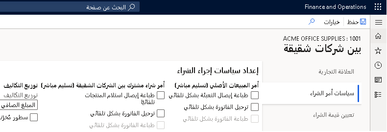
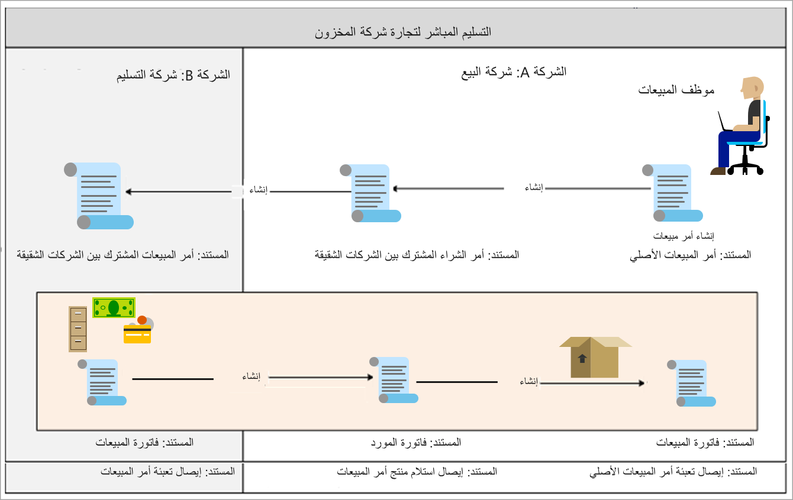

## الاتفاقيات بين الشركات الشقيقة
 

اتفاقية البيع هي عقد يُلزم العميل بشراء منتج بكمية محددة أو مبلغ معين على مدار فترة من الوقت مقابل أسعار وخصومات خاصة. وتسود أسعار وخصومات اتفاقية البيع على أي أسعار وخصومات نصت عليها أي اتفاقيات تجارية قد تكون موجودة.

كثيراً ما تُستخدم اتفاقيات الشراء عند شراء كميات كبيرة من مورّد وعند الحصول على خصومات خاصة. يمكن أن تتضمن اتفاقية شراء العديد من الالتزامات في عقد الاتفاقية. يتم تمثيل كل التزام ببند ضمن صفحة **اتفاقيات الشراء**.
عند تعيين نوع التزام لأحد الالتزامات، يمكنك تعريف كيفية إكمال اتفاقيات الشراء.

يمكن إنشاء اتفاقيات المبيعات أو الشراء لعلاقة تجارية بين الشركات الشقيقة لسلسلة أوامر مبيعات وأوامر شراء. سيقوم الكيان البائع بتوثيق حدث الاتفاقية باستخدام اتفاقية بيع بين شركات شقيقة وسيقوم الكيان المشتري بتوثيق حدث الاتفاقية كاتفاقية شراء.

## اتفاقيات البيع بين الشركات الشقيقة

في صفحة **اتفاقيات المبيعات**، يمكنك إنشاء وتطبيق ومتابعة اتفاقيات المبيعات الموجودة بين المؤسسة والعميل الخاص بها.
على سبيل المثال، بعد إنشاء اتفاقية بيع، يمكنك الطلب مباشرة منها.

تسري اتفاقية البيع حسب الفترة التي حددها الشخص الذي أنشأ اتفاقية البيع. اتفاقية البيع التي تم إنشاؤها لعلاقة تجارية بين شركات شقيقة يجب أن تتضمن **‏‏تاريخ الاستلام المطلوب** المحدد في صفحة **أمر المبيعات** ضمن فترة الصلاحية.
في اتفاقية الشراء بين الشركات الشقيقة المقابلة، يجب أن يقع **تاريخ التسليم** ضمن فترة الصلاحية.

افتراضياً، تكون اتفاقية البيع قيد الانتظار. يمكنك الطلب من اتفاقية البيع فقط عندما تكون معينة إلى **فعال**.

## عمليات التسليم المباشرة

تتيح عمليات التسليم المباشر للمستخدمين إنشاء أمر شراء من أمر المبيعات مباشرةً. يتم بعد ذلك شحن الأمر مباشرةً إلى العميل من المورّد بدون معالجة الشركة التي تبيع للبضائع الفعلية.

في الاتفاقيات بين الشركات الشقيقة، تحدث عمليات التسليم المباشر بين الشركة التي تورّد الصنف والشركة التي يتم شحن الأصناف إليها.

يؤدي التسليم المباشر بين الشركات الشقيقة إلى توسيع نطاق الوظيفة العادية للتسليم المباشر بالتحكم في العملية اللوجستية من شركة التسليم، بمعنى الشركة التي تشتري منها الأصناف.

في ما يلي بعض ميزات التسليم المباشر بين الشركات الشقيقة:

-   تتم مزامنة عنوان التسليم مع أمر الشراء وأمر المبيعات المشترك بين الشركات الشقيقة. إذا كنت تريد تحديث العنوان في مرحلة لاحقة، يمكنك فقط تنفيذ ذلك في أمر المبيعات الأصلي، وليس أمر الشراء أو أمر المبيعات المشترك بين الشركات الشقيقة.

-   تتم مزامنة النسب المئوية للتسليم بالزيادة والتسليم بالنقص من أمر المبيعات الأصلي إلى أمر الشراء وأمر المبيعات المشترك بين الشركات الشقيقة. لا يمكن تحديث النسبة المئوية للتسليم بالزيادة والتسليم بالنقص إلا في أمر المبيعات الأصلي.

-   لا يمكنك تعيين تاريخ استلام أو شحن مؤكد لأمر المبيعات الأصلي لأن المورّد المشترك بين الشركات الشقيقة فقط يمكنه تحديد تاريخ الاستلام أو الشحن المؤكد. عند تحديد الشركة لتاريخ شحن أو استلام مؤكد، يتم تحديثه أيضاً في أمر المبيعات الأصلي وأمر الشراء المشترك بين الشركات الشقيقة.

يتم إنشاء أمر التسليم المباشر بين الشركات الشقيقة تلقائياً في حالة تحديد معلمة **التسليم المباشر** في أمر المبيعات. يتم اشتقاق الحالة الافتراضية لهذه المعلمة من حالة تحديد معلمة **التسليم المباشر** للعميل المحدد لأمر المبيعات.

لتبسيط معالجة عمليات التسليم المباشر، يمكنك برمجة ترحيل وطباعة إيصال التعبئة والفاتورة في أمر الشراء المشترك بين الشركات الشقيقة، أو أمر المبيعات المشترك بين الشركات الشقيقة، أو كليهما.

## معلمات التسليم المباشر

معلمات التسليم المباشر هي:

-   **طباعة إيصال التعبئة بشكل تلقائي** - حدد هذه المعلمة لطباعة إيصال التعبئة لأمر المبيعات الأصلي تلقائياً عند ترحيل إيصال التعبئة لأمر المبيعات المشترك بين الشركات الشقيقة.

-   **ترحيل الفاتورة بشكل تلقائي** - حدد هذه المعلمة لترحيل الفاتورة تلقائياً لأمر المبيعات الأصلي عند ترحيل أمر المبيعات المشترك بين الشركات الشقيقة.

-   **طباعة الفاتورة بشكل تلقائي** - حدد هذه المعلمة لطباعة الفاتورة تلقائياً لأمر المبيعات الأصلي عند ترحيل الفاتورة لأمر المبيعات المشترك بين الشركات الشقيقة.

    

**السيناريو 1:**

تريد شركة التسليم **USMF** تعبئة إيصال التعبئة مع الأصناف من أمر المبيعات الأصلي في شركة **DEMF**. يحتوي إيصال التعبئة على جميع المعلومات (على سبيل المثال: الأمر المرتبط بأمر المبيعات الأصلي) الذي يحتاج إليه العميل عند استلام الأصناف.

لهذا السيناريو، عليك تحديد **طباعة إيصال التعبئة بشكل تلقائي**.

**السيناريو 2:**

تريد شركة المبيعات إرسال فاتورة الأمر إلى العميل الخارجي بعد ترحيل الشركة المصنعة للفاتورة مباشرةً.

لهذا السيناريو، عليك تحديد **ترحيل الفاتورة بشكل تلقائي**.

**السيناريو 3:**

تريد شركة المبيعات إرسال فاتورة الأمر إلى العميل الخارجي بعد ترحيل الشركة المصنعة للفاتورة مباشرةً. إذا كنت تريد إرسال الفاتورة إلى العميل الخارجي، يجب طباعتها.

لهذا السيناريو، عليك تحديد **طباعة الفاتورة بشكل تلقائي**.

توضّح القائمة التالية مجموعة حقول **أمر شراء مشترك بين الشركات الشقيقة (تسليم مباشر)**:

-   **طباعة إيصال استلام المنتجات تلقائياً** - حدد هذه المعلمة لطباعة إيصال استلام المنتجات لأمر الشراء المشترك بين الشركات الشقيقة تلقائياً عند ترحيل إيصال التعبئة لأمر المبيعات المشترك بين الشركات الشقيقة.

-   **ترحيل الفاتورة بشكل تلقائي** - حدد هذه المعلمة لترحيل الفاتورة لأمر الشراء المشترك بين الشركات الشقيقة تلقائياً عند ترحيل الفاتورة لأمر المبيعات المشترك بين الشركات الشقيقة.

-   **طباعة الفاتورة بشكل تلقائي** - حدد هذه المعلمة لطباعة الفاتورة لأمر الشراء المشترك بين الشركات الشقيقة تلقائياً عند ترحيل الفاتورة لأمر المبيعات المشترك بين الشركات الشقيقة.

