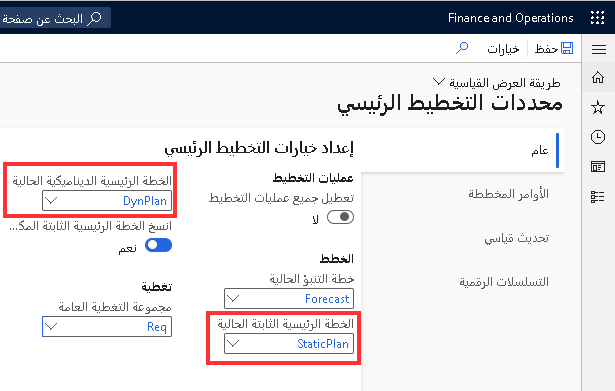
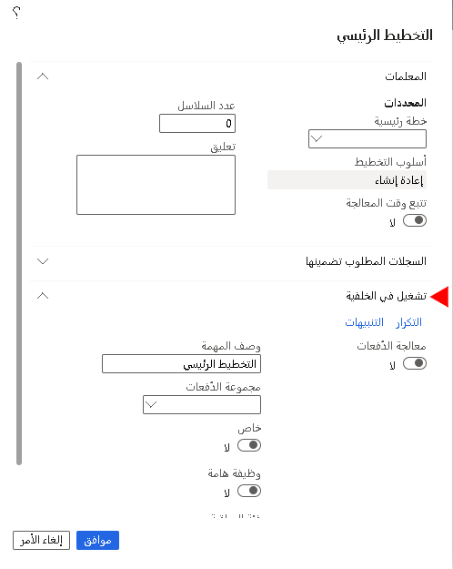

يسمح التخطيط الرئيسي للشركات بتحديد وموازنة الحاجة المستقبلية للمواد الخام والقدرة الإنتاجية على تحقيق أهداف الشركة. تعمل ميزة التخطيط الرئيسي على تقييم المعلومات التالية:

-   المتطلبات اللازمة لإكمال عملية (عمليات) الإنتاج

-   التوافر الحالي للمواد

-   الأشياء المطلوبة لتلبية أهداف الشركة، مثل المواد التي يتعين تصنيعها أو شرائها أو نقلها أو تخصيصها كمخزون احتياطي

يستخدم التخطيط الرئيسي المعلومات من العديد من النقاط المختلفة في النظام لتحديد كمية الصنف التي يتعين شراؤها والتاريخ الذي يتعين فيه شراء المخزون (استنادا إلى فترات الإنتاج في Dynamics 365 بالنسبة لبرنامج Supply Chain Management) لاستيفاء متطلبات الصنف في الوقت المحدد.

باستخدام التخطيط الرئيسي، يمكنك:

-   **الطلب من أوامر المبيعات الحالية** - تعتبر أوامر المبيعات أحدي مصادر المعلومات الرئيسية لاستخراج متطلبات الشراء.
    ووفقاً لنوع الأعمال لديك، فان ذلك قد يؤدي ذلك إلى إنشاء عمليات شراء مباشرة للبضائع الموزعة أو عمليات المشتريات المباشرة للمواد الخام المطلوبة لتجميع صنف آخر أو إنتاجه.

-   **الطلب من عروض أسعار المبيعات الموجودة** - يمكنك بشكل اختياري تحديد تضمين معلومات عرض أسعار المبيعات في التقديرات التي تم تشكيلها لأوامر الشراء المخططة في إخراج التخطيط الرئيسي. وقد يكون هذا الأمر مفيداً بشكل خاص في سيناريوهات حسب الطلب أو السيناريوهات التي يكون للمنتجات فيها فترات أطول للإنتاج.

-   **تقدير عمليات التوقع** - يمكنك استخدام الطلب أو التنبؤ بالتوريد في إدارة Supply Chain Management لتقدير الكم المطلوب من أي منتج ستحتاجه خلال فترة زمنية محددة.
    ويمكن للتخطيط الرئيسي بعد ذلك استخدام هذه المعلومات لاستخراج عمليات المشتريات المخططة للحصول على سيناريوهات الإنتاج أو التوزيع المباشر.

-   **طلب الإنتاج المرتقب** - عند استخدام التخطيط الرئيسي لتخطيط الإنتاج لديك، ستحدد فاتورة المواد (BOM) المنتجات المطلوبة لإنتاج منتج مكتمل. يمكن ان تقوم هذه المتطلبات باستخراج طلب لك لشراء مواد خام إضافية لاستيفاء متطلبات الإنتاج.

-   **طلب الوفاء بمستويات المخزون الاحتياطي** - يمكنك بشكل اختياري تكوين المخزون الاحتياطي للأصناف الرئيسية في مستودعك لضمان امتلاكك دائماً لكم محدد تحت تصرفك. عند هبوط مستويات المخزون لديك أو وجود توقعات بهبوطه أدنى من مستوى المخزون الاحتياطي الذي قمت بتحديده، سيقوم التخطيط الرئيسي بإنشاء عمليات شراء لهذه الأصناف لجعل المستوى الفعلي في مستودعك يعود لمكانه.

-   **طلب الوفاء بالحد الأدنى من مستويات المخزون** - يمكنك اختيارياً تحديد مستويات الحد الأدنى والحد الأقصى للأصناف الموجودة في مستودعك، والتي ستقوم بدفع المتطلبات للاحتفاظ بمقدار معين من الصنف في المستودع لديك.
 

يعمل التخطيط الرئيسي على حساب المتطلبات والنتائج في إنشاء الأوامر المخططة. وفيما يلي عمليات التخطيط الرئيسية الثلاث:

-   **الخطة الرئيسية** - تعمل الخطة الرئيسية على حساب صافي المتطلبات.
    كما أنها تستند إلى الأوامر الحالية الفعلية وتمكن الشركات من التحكم في تجديد المخزون بشكل قصير المدى على أساس يومي.
    وهناك مصطلح آخر يمكن وصفها به وهو "خطة صافي المتطلبات".

-   **خطة التوقع** - تعمل خطه التوقع على حساب إجمالي المتطلبات.
    وهي تستند إلى المشروعات المستقبلية (أو التوقعات) وتعمل على تمكين الشركات من إجراء التخطيط الرئيسي طويل الأمد للمواد والقدرة الإنتاجية.

-   **التخطيط الرئيسي بين الشركات** - يعمل التخطيط الرئيسي بين الشركات على حساب صافي المتطلبات عبر الكيانات القانونية. كما أنه يعمل على ربط العرض والطلب بين الشركات ليس فقط من أجل حركة العرض والطلب المؤكدة قصيرة المدى، ولكن أيضاً لحركات العرض والطلب طويلة الأجل والمخطط لها (التي لم يتم تأكيدها بعد).

يمكن للشركات تغيير ناتج الخطة. يمكنهم إجراء التغيير التجديدي أو صافي التغيير أو كليهما. تعمل الخطط التجديدية على تحديث كل المتطلبات، بينما يعمل صافي التغيير على تحديث فقط الخطة المتعلقة بالأصناف المزودة بمتطلبات جديدة وردت منذ آخر إجراء للتخطيط الرئيسي.

الهدف الأساسي من إجراء التخطيط الرئيسي هو حساب كيف يمكن أن تفي الشركة بمتطلبات امتلاك المواد الصحيحة في الوقت الصحيح وباستخدام الموارد الصحيحة في المكان الصحيح.
يمكنك القيام بذلك عن طريق اكتشاف الطلب وحساب صافي المتطلبات الخاصة بالمنتجات والموارد. وللقيام بذلك، يعمل التخطيط الرئيسي على تجميع كل المعلومات المتعلقة المستندة لإعدادات معلمات الخطة الرئيسية التي تم تجميعها من الوحدات النمطية الأخرى في Supply Chain Management، مثل حركات المخزون من أمر المبيعات أو أمر الشراء، سواءً لتضمين احتمالية عرض أسعار المبيعات أم لا، وغير ذلك المزيد.

## الخطط الثابتة والخطط الديناميكية

يمكنك أيضا تشغيل الخطط الثابتة أو الحيوية أو كليهما. تظل الخطة الثابتة كما هي ولا تتغير حتى يتم تجديدها، بينما يتم تحديث الخطة الديناميكية بشكل منتظم. يمكن تشغيل هذه الخطط في مجموعات متنوعة لتتلاءم مع احتياجات العمل في الشركة بشكل أفضل.

-   **الخطة الثابتة** - يستخدم حساب التخطيط الرئيسي البيانات الحالية لإنشاء خطة صافية للمتطلبات. وتكون هذه هي الخطة التي يتم فيها اعتماد الأوامر المخططة بشكل عادي وتأكيدها لإنشاء أوامر توريد. تظل هذه الخطة دون تغيير إلى المرة التالية التي تقوم فيها بتشغيل "التخطيط الرئيسي".

-   **الخطة الديناميكية** - تبدأ هذه الخطة بنفس خطة صافي المتطلبات التي تم إنشاؤها بواسطة التخطيط الرئيسي. ومع ذلك، يمكنك تحديث الخطة الديناميكية في كل مره تتغير فيها بيانات الحركات، على سبيل المثال، عند إنشاء أمر مبيعات جديد. ويعمل ذلك على تمكينك من مراقبة شبكة أمر التغيير وتوافر الصنف دون المساس بالخطة الثابتة التي يستخدمها الآخرون في العمليات المتعلقة بعملهم.

قد تختار إحدى الشركات العمل باستخدام خطة ديناميكية فقط، أو يمكن استخدام كل من الخطط الثابتة والديناميكية. بالإضافة إلى ذلك، يمكنك تكوين إيه خطة رئيسيه لإظهار استراتيجية أو معالجة مشكلة.

### مثال

-   بالنسبة للتخطيط القصير المدى، سواءً كان على أساس يومي أو أسبوعي أو حتى شهري، سيكون من المفيد استخدام خطة ديناميكية للبقاء على إطلاع بأحدث التغييرات في العمليات اليومية، مثل متطلبات الحد الأدنى/الحد الأقصى لضمان تغطيه دفاتر يومية المخزون الاحتياطي التي تم إنشاؤها للمتطلبات الخاصة بالأصناف المتاحة.

-   وبالنسبة للخطط طويلة الأجل، والتي عادةً ما تكون على أساس سنوي، ستحتاج إلى تعيين هوامش أمان أطول للحماية من الظروف غير المتوقعة، مثل التعامل مع الموردين الذين لا يقومون بتسليم السلع بالشكل المتفق عليه.

بناء على المعلمات التي تقوم بتعيينها، يقوم التخطيط الرئيسي بفحص المخزون الفعلي والعوامل في كافة أوامر المبيعات (بما في ذلك عروض أسعار المبيعات، وذلك في حاله تضمينها في إعداد الخطط الرئيسية) وحركات المخزونات وأوامر الشراء وأوامر الإنتاج المخططة سابقا. بعد ذلك، سيقوم التخطيط الرئيسي بإنشاء أمر مخطط جديد، إذا قمت بتحديد إعادة الإنشاء بينما تقوم بإجراء إحدى الخطط. كما يمكنه أيضاً تحديث الخطة الموجودة مع **الإجراءات** و **التأخيرات المحسوبة**.

يمكنك أيضاً إعداد الخطة الديناميكية لبدء التشغيل بحيث يتم تحديثها بخطة المتطلبات الجديدة في كل مرة تقوم فيها بإجراء التخطيط الرئيسي. يمكنك تحديد هذه الإعدادات في صفحة **معايير التخطيط الرئيسي** .

**التخطيط الرئيسي > الإعداد > معايير التخطيط الرئيسي**

## الاحتفاظ بالأوامر المخططة

يمكنك إدارة الأوامر المخططة من مساحة عمل **التخطيط الرئيسي** أو قائمة **الأمر المخطط** أو **أوامر الإنتاج المخططة** أو **أوامر الشراء المخططة** و **قوائم التحويل المخططة**. يمكنك استخدام حقل **الحالة** للمساعدة على تتبع تقدمك. تتوفر القيم الآتية:

-   عندما يقوم التخطيط الرئيسي بإنشاء أوامر مخططة، تكون حالة الأوامر المخططة هي حالة **غير معالجة**.

-   إذا قررت عدم تأكيد أمر مخطط، يمكنك منحه حالة **مكتملة**.

-   وإذا قررت تأكيد أمر مخطط، يمكنك منحه حالة **معتمدة**. تشير هذه الحالة إلى أنك تعتمد تأكيد الأمر المخطط، ولكنه لم يتم تأكيده بعد.

> [!NOTE] 
> يتم تحويل الأمر المخطط المعتمد، في حالته الحالية، إلى حساب التخطيط الرئيسي التالي.

يمكنك تأكيد الطلبات المخططة عن طريق تحديد **تأكيد**. يمكنك تأكيد الأوامر المخططة التالية:

-   الأمر المخطط الذي تم تحديده

-   أوامر متعددة مخططة

-   الأوامر المخططة التي تم إنشاؤها بواسطة عملية تحديد جمالي المكونات المطلوبة من صفحة **تحديد إجمالي المكونات المطلوبة**. حدد **الأوامر المخططة**، واختر الأمر المخطط، ثم قم بتحديد **مؤكد**.

عند تأكيد الأمر المخطط، يتم إنشاء الأوامر استناداً إلى نوع المرجع لكل أمر، مثل الشراء والإنتاج والكانبان والتحويل.

## تخطيط التوقع 

للتخطيط، يجب أن يكون للشركات رؤية تقديرية جيدة لبعض المطالبات المستقبلية. في معظم الشركات، يتم إجراء هذا التقدير أو التنبؤ بواسطة تقنية التوقع.

يوفر التوقع في Supply Chain Management نقطة بدء لتقدير متطلبات المنتج القادمة (إجمالي المتطلبات) ويساعد الشركات على اتخاذ خطوات تفي بالمتطلبات الحقيقية بمرور الوقت.

كما تساعد خطط التنبؤ على تحديد طلبات المواد وقدرة الموارد التي ستؤثر على المستقبل المالي للشركة. وتقدم خاصية التوقع تقديراً للمبيعات المحتملة للبضائع المنتهية والبضائع التجارية.

## تخطيط رئيسي مشترك بين الشركات الشقيقة 

يتم تنظيم عمليه التخطيط الرئيسي بين الشركات في Supply Chain Management باستخدام العلاقات بين الشركات والخطط الرئيسية الخاصة بها. يمكن أن يقوم المخططون بالحساب بين كل من موارد التوريد والطلب التي يتم توفيرها عبر العديد من الشركات.

تتضمن بعض الميزات الهامة في التخطيط الرئيسي بين الشركات ما يلي:

-   القدرة على تحديد متطلبات المنتج عبر مجموعة من الشركات في سلسلة من التخطيطات الرئيسية.

-   المرونة لإنشاء ربط العرض والطلب بين الشركات ليس فقط من أجل الطلب (الملتزم به) من جانب الشركة للفترة قصيرة المدى، ولكن أيضاً لحركات العرض والطلب طويلة الأجل والمخطط لها.

-   القدرة على إنشاء أوامر شراء ومبيعات على أساس الطلب عبر الشركة.

-   القدرة على مجموعات التخطيط بين الشركات على المشاركة في تكامل الخطة الرئيسية. وهذا يسمح بالتخطيط الرئيسي بين الشركات بالنسبة لبعض، الشركات الموجودة في أحد المثيلات وليس جميعها.

-   القدرة على عرض صفحة جدول التوريد الشامل لزيادة الرؤية في سلسله التوريد.

شاهد الفيديو التالي لرؤية عرض توضيحي لصفحة **جدول التوريد** والطرق المتنوعة التي يمكنك الوصول إليها.

> [!VIDEO https://www.microsoft.com/videoplayer/embed/RE47HEj]

## التخطيط الرئيسي التجديدي 

يراعي التخطيط الرئيسي على أساس تجديدي كل المعلمات الخاصة بالنموذج بشكل كامل في كل مره يتم تشغيله فيها. يراعي التخطيط الرئيسي على أساس صافي التغيير فقط صنف من نوع واحد أو جزء أو خط إنتاج تم تغييره منذ آخر مرة تم تشغيله فيها.

عندما تقوم بتشغيل التخطيط الرئيسي التجديدي، فسيقوم بتحديث الخطة ومراعاة كل تبعية بين الموارد أو إعادة النظر فيها. يتضمن ذلك فواتير المواد (Bom) والأصناف في كافة المستويات.
قد تستغرق هذه الحسابات بعض الوقت. لذلك، يتم عادةً تشغيل التخطيط الرئيسي التجديدي في مهام المجموعة الليلية.

يعرض الشكل التالي صفحة **التخطيط الرئيسي**. لاحظ أنه يحتوي على علامة التبويب السريعة **تشغيل في الخلفية** لإعداد دفعة مجدولة.

 

## صافي التغيير في التخطيط الرئيسي 

يساعد التخطيط الرئيسي لصافي التغيير في الحصول على صورة تأثير التغييرات الحالية في نقاط معينة مثل الكمية أو المستودع أو تواريخ التسليم. ونظراً لأنه يتم اعتبار التغييرات الفورية فقط، فان ذلك سيستغرق وقتاً أقل لمعالجته مقارنةً بتشغيل الخطة التجديدية.

على سبيل المثال، إذا قامت إحدى الشركات بتشغيل تحديث التخطيط الرئيسي لخط أوامر المبيعات لأحد الأصناف المحددة، وسيتم تحديث التواريخ الموجودة في بند أمر المبيعات، ولكن لن يتم النظر إلى جميع التبعيات.
يتم تشغيل تخطيط صافي المتطلبات باستخدام صفحة **صافي المتطلبات** ومن خلال تحديد القائمة **تحديث**.

> [!NOTE] 
> يمكن تشغيل صافي التغيير أيضاً لإجراء تخطيط رئيسي في خطة ديناميكية.

افتح **المبيعات والتسويق > أوامر المبيعات > كافة أوامر المبيعات**. حدد أمر مبيعات. في جزء المنطقة، ضمن مجموعة **الصيانة**، حدد **تحرير**. ضمن علامة التبويب السريعة **بنود أمر المبيعات**، انتقل إلى **المنتج والتوريد > المتطلبات > صافي المتطلبات**.

عند تحديد **تحديث** من الإجراء الموجود في صفحة **صافي المتطلبات**، يمكنك تحديث الخطة الرئيسية فقط للتغييرات التي أجريت لتأكيد أمر المبيعات الفردي. وعلى نحو مماثل، يمكنك تحديث بنود أمر الشراء وأوامر الإنتاج من هذه الصفحة.
