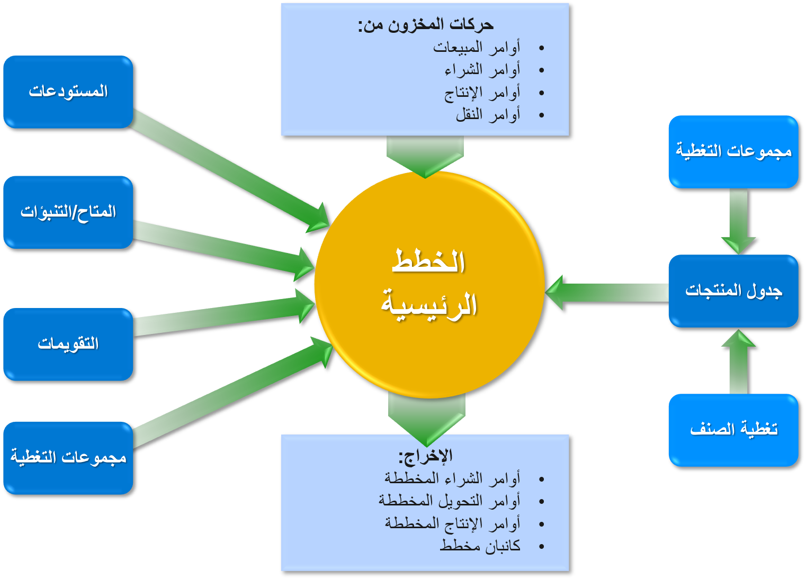
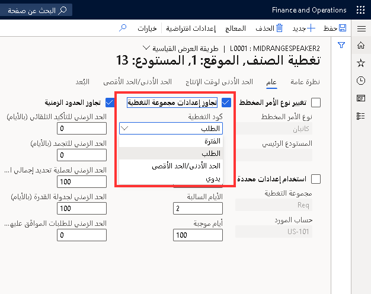
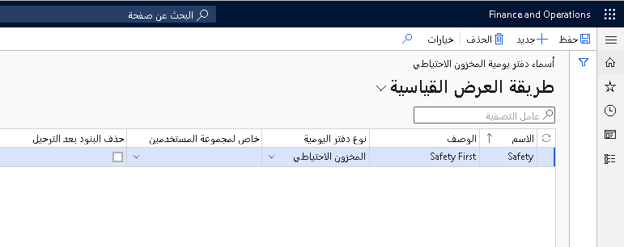

توفر هذه الوحدة نظرة عامة على الاعتبارات الرئيسية والمتطلبات الأساسية والإعدادات اللازمة لاستخدام وحدة التخطيط الرئيسي. يحتوي أيضاً على ملخص للطرق التي يتم بها معالجة نتائج التخطيط الرئيسي.

يوضح الشكل التالي تفاعل المعلومات التي تؤثر على التخطيط الرئيسي في Supply Chain Management ويقدم قائمة مختصرة بالمخرجات الناتجة.

## استخدام التخطيط التنبؤي

أحد الاعتبارات الأولى التي يجب على الشركة اتخاذها هو تقييم ما إذا كان يجب استخدام التخطيط التنبؤي، لأن التخطيط التنبؤي يتم تشغيله قبل تشغيل التخطيط الرئيسي. بدلاً من ذلك، يمكن أن تشتمل الخطة الرئيسية على خطة تنبؤ.

لتضمين خطة تنبؤ، يجب على الشركة مراعاة المدى الذي يمكنها من خلاله توقع الطلبات المستقبلية. إذا كان من الممكن التنبؤ بالأوامر بدقة نسبية، فيمكن لعملية التخطيط التنبؤي أن تتأكد من شراء جميع الأصناف وإنتاجها عند الضرورة، والتأكد من توفر قدرة إنتاجية كافية في الوقت المناسب للوفاء بمواعيد التسليم.

كما يمكن أن تساعد القدرة على التنبؤ الدقيق باحتياجات المواد والقدرة الإنتاجية في مفاوضات الأسعار والشروط (الاتفاقيات التجارية) مع الموردين.

## استراتيجية خطة رئيسية أحادية أو ثنائية

يمكن للشركات إعداد تخطيط رئيسي للعمل باستراتيجية خطة رئيسية أحادية أو ثنائية. تستخدم استراتيجية الخطة الرئيسية الثنائية خطتين مستقلتين: الخطة الرئيسية الثابتة والخطة الرئيسية الديناميكية.
يعتمد ما إذا كانت الشركة تعمل باستراتيجية واحدة أو اثنتين من استراتيجيات الخطة الرئيسية على كيفية تعاملها مع محاكاة الأوامر فيما يتعلق بعملياتها اليومية.

ونظراً لتمتعها بالقدرة على تشغيل خطط ديناميكية سريعة، يمكن للشركات الاستجابة بسرعة لظروف السوق.

## إعدادات تغطية الصنف

عند إعداد التخطيط الرئيسي، يجب على الشركة أيضاً مراعاة كيفية تعاملها مع مستوى المخزون الذي تحتفظ به. تؤثر كيفية معالجة المخزون على الخيارات المتعلقة بمعلمات تخطيط التغطية لعملية التخطيط الرئيسية.

بالإضافة إلى ذلك، عند إعداد التخطيط الرئيسي، يمكن للشركات النظر في مستويات المخزون لكل صنف على حدة، بناءً على خصائص الأصناف المهمة لأعمالهم. على سبيل المثال، يمكنك إدارة المخزون عن طريق تخزين أصناف معينة أو تغيير الأمر الافتراضي إلى أوامر الإنتاج أو النقل أو كانبان.

يستخدم التخطيط الرئيسي إعدادات تغطية الصنف لحساب متطلبات الصنف.

## مجموعة التغطية

يمكنك إنشاء مجموعة تغطية تحتوي على إعدادات لجميع المنتجات المرتبطة بمجموعة التغطية. حدد **التخطيط الرئيسي > الإعداد > التغطية > إعداد التغطية** لإنشاء مجموعة تغطية.

يمكنك ربط مجموعة تغطية بمنتج. إذا كان الارتباط خاصاً بموقع أو مستودع أو بُعد منتج، فاستخدم حقل **مجموعة التغطية** في صفحة **تغطية الصنف**‏‎. إذا كان الرابط عاماً، بغض النظر عن أبعاد المنتج، فاستخدم **مجموعة التغطية** في علامة التبويب السريعة **الخطة‬** من صفحة **تفاصيل المنتج**.

إذا لم تقم بربط مجموعة تغطية بمنتج، فإن التخطيط الرئيسي يستخدم مجموعة ‎التغطية العامة المحددة في صفحة **معلمات التخطيط الرئيسي** بشكل افتراضي.

## تحديد إعدادات التغطية للمنتج

يمكنك إنشاء إعدادات التغطية لمنتج معين. حدد **إدارة معلومات المنتج > المنتجات > المنتجات الصادرة** ثم حدد المنتج، ثم في جزء الإجراء، في **الخطة**، في مجموعة التغطية، حدد **تغطية الصنف** لفتح صفحة **تغطية الصنف**.

 

إذا كان المنتج مرتبطاً بالفعل بمجموعة تغطية، فيمكنك تجاوز إعدادات مجموعة التغطية باستخدام الحقل **تجاوز إعدادات مجموعة التغطية**. إعدادات التغطية في صفحة **تغطية الصنف** لها الأسبقية على الإعدادات في صفحة **مجموعة التغطية**‏‎. 

يمكنك تحديد إعدادات التغطية لما يلي:

-   منتج، باستخدام معالج. المعالج عبارة عن دليل مفصل خطوة بخطوة لمساعدتك على إعداد معلمات تغطية الصنف الأساسية. في صفحة **تغطية الصنف**، حدد **المعالج** لفتح **معالج تغطية الصنف**. يمكنك معرفة المزيد حول المعالج في [معالج إعداد التخطيط الرئيسي](/dynamics365/supply-chain/master-planning/master-planning-setup-wizard/?azure-portal=true).

-   مجموعة أبعاد. حدد **إدارة معلومات المنتجات > عام‬ > المنتجات الصادرة**.
    في صفحة **تفاصيل المنتج الصادر** في علامة التبويب **عام**، في مجموعة **‎الإدارة**، حدد الرابط **مجموعة أبعاد التخزين**. في صفحة **مجموعة أبعاد التخزين**، حدد الحقل‏‫ **خطة التغطية حسب البُعد** ‬لإنشاء إعدادات التغطية لأحد الأبعاد في مجموعة أبعاد التخزين‬. يجب أن يتم تحديد الحقل **‏‫خطة التغطية حسب البُعد‬** لجميع أبعاد المنتج، مثل التكوين واللون والحجم والنمط.

## الحد الأدنى للمفاتيح

يمكنك استخدام الحد الأدنى للمفاتيح للتعامل مع التقلبات الموسمية في الطلب.

على سبيل المثال، إذا كنت تريد إعداد مفتاح الحد الأدنى الذي يراعي زيادة الطلب الموسمي خلال فصلي الربيع والصيف، فانتقل إلى **التخطيط الرئيسي> الإعداد> التغطية> مفاتيح الحد الأدنى / الحد الأقصى** واتبع الخطوات التالية:

1.  أنشئ 12 سطراً وقم بتعيين رقم من 1 إلى 12 إلى السطور الموجودة في الحقل **تغيير**.

2.  في الحقل **الوحدة**، حدد **شهور**.

3.  في الحقل **العامل**، أدخل القيم الموضحة في الجدول التالي.
 
  
|  سطر   |  أدخل هذه القيمة | النتيجة|
| ------------- | ------------- | ------------- |
| 1-3 | 1 | يعتمد الحد الأدنى للمخزون على الإعداد من يناير إلى مارس في صفحة **تغطية الصنف‏‎**.|
| 4-5 | 2 | يتم ضرب الحد الأدنى للمخزون بمعامل 2 في الفترة من أبريل إلى مايو.|
| 6-8 | 2.5 | يتم ضرب الحد الأدنى للمخزون بمعامل 2.5 في الفترة من يونيو إلى أغسطس.|
| 9-12 | 1 | يعود الحد الأدنى للمخزون إلى الإعداد من سبتمبر إلى ديسمبر في صفحة **تغطية الصنف‏‎**.|

## الحد الأدنى/الحد الأقصى من كود التغطية

إذا كان رمز التغطية هو **الحد الأدنى/الحد الأقصى**، يمكنك أيضاً تحديد **الحد الأقصى** لكمية المخزون التي تريد الاحتفاظ بها للصنف.
ويتم التعبير عن القيمة أيضاً بوحدات المخزون. إذا كان المخزون المتوفر المرتقب أقل من الحد الأدنى للكمية، فإن التخطيط الرئيسي ينشئ أمراً مخططاً للوفاء بجميع المتطلبات المفتوحة ورفع المخزون المتاح إلى الحد الأقصى للكمية المحددة. مثلما هو الحال في **الحد الأدنى**، يجب عليك تحديد جميع أبعاد التغطية الأخرى المخططة قبل تحديد الحقل **الحد الأقصى**.

على سبيل المثال، الحد الأدنى للكمية هو 10، والحد الأقصى للكمية هو 15.
المخزون المتاح الحالي هو 4. مما يعني أن الحد الأدنى من متطلبات الكمية 6. ومع ذلك، نظراً لأن الحد الأقصى للكمية هو 15، فإن التخطيط الرئيسي يقوم بإنشاء أمر مخطط لـ 11 صنفاً.

بالنسبة للأصناف التي تتبع المطالب الموسمية، قد تحتاج إلى الحفاظ على مستويات مختلفة للحد الأقصى. للقيام بذلك، تحتاج إلى تحديد **الحد الأقصى للمفاتيح** بالانتقال إلى **التخطيط الرئيسي > الإعداد > التغطية > الحد الأدنى/الحد الأقصى للمفاتيح**. املأ الحقل **الحد الأقصى للمفتاح** في صفحة **تغطية الصنف**. يمكنك عرض المعلومات حول مستويات المخزون الآمن، التي تم تحديدها بواسطة مفاتيح الحد الأدنى في علامة التبويب **الحد الأدنى/الحد الأقصى** في الصفحة **تغطية الصنف**. تحتاج إلى التأكد، لفترة معينة، من مزامنة الحد الأدنى والحد الأقصى للقيم.

## استيفاء المخزون الاحتياطي للأصناف

يشير المخزون الاحتياطي إلى أنه يتم الاحتفاظ بكمية إضافية من صنف ما في المخزون لتقليل مخاطر نفاد الصنف. يتم استخدام المخزون الاحتياطي كمخزون يخزن مؤقتاً في حالة ورود أوامر المبيعات وتعذر على المورّد تسليم الأصناف الإضافية للوفاء بتاريخ الشحن المطلوب بواسطة العميل. عند استخدام المخزون الاحتياطي لتنفيذ أمر المبيعات، سيتم تقليل المخزون الاحتياطي. يمكنك استخدام التخطيط الرئيسي لإعادة المخزون تلقائياً إلى المستوى الاحتياطي.

يتم إعداد المخزون الاحتياطي كجزء من تغطية الصنف في **صفحة تغطية الصنف** ضمن **المنتجات الصادرة > الخطة > التغطية**.

في الحقل **الحد الأدنى**، أدخل مستوى المخزون الاحتياطي الذي تريد الاحتفاظ به للصنف. ويتم التعبير عن القيمة بوحدات المخزون. إذا تركت الحقل فارغاً، تكون القيمة الافتراضية صفر. يتوفر هذا الحقل عند تحديد **الفترة**، **المتطلبات‬**، أو **‏‫الحد الأدنى/الحد الأقصى** في القائمة **كود التغطية**. ينطبق حد مستوى المخزون الاحتياطي على المخزون المتاح، مما يعني أن عمليات الحجز والعلامات قد تؤدي إلى تزويد المخزون الاحتياطي قبل أن تقل الكمية المادية عن المستوى الأدنى المحدد.

> [!NOTE]
> يجب تحديد جميع أبعاد التغطية المخططة الأخرى قبل أن تتمكن من تحديد الحقل **الحد الأدنى**. هذا يمنع استخدام سجل غير صالح أثناء التخطيط الرئيسي. يمكن أن يحدث هذا الموقف، على سبيل المثال، إذا تم توسيع مجموعة أبعاد بأبعاد تغطية إضافية مخططة لم يتم بعد تحديد الحد الأدنى والحد الأقصى لكميات المخزون.

## تحقيق الحد الأدنى 

تتيح لك المعلمة **تنفيذ الحد الأدنى** تحديد التاريخ أو الفترة التي يجب أن يفي خلالها مستوى المخزون بالكمية التي حددتها في الحد الأدنى **الحد الأدنى**. يتوفر هذا الحقل عند تحديد **الفترة**، **المتطلبات‬**، أو **‏‫الحد الأدنى/الحد الأقصى** في القائمة **كود التغطية**.

إذا تم استخدام مفاتيح الحد الأدنى، فحدد خانة الاختيار **الحد الأدنى للفترات** للوفاء بالحد الأدنى لمستوى المخزون لجميع الفترات التي تم إعدادها في مفتاح الحد الأدنى. إذا قمت بإلغاء تحديد خانة الاختيار، فسيتم استيفاء الحد الأدنى للمخزون للفترة الحالية فقط.

يمكن أن تحتوي المعلمة **‏‫تحقيق الحد الأدنى‬** على القيم التالية:

-   **تاريخ اليوم** - يتم استيفاء الحد الأدنى للكمية المحددة في التاريخ الذي يتم فيه تشغيل التخطيط الرئيسي. يحاول النظام تلبية حد المخزون الاحتياطي في أسرع وقت ممكن، على الرغم من أنه قد يكون غير واقعي بسبب المهلة الزمنية. عند استخدام كود التغطية **المتطلبات**، يتم إنشاء عدة أوامر مخططة. من الأفضل دائماً استخدام تغطية **الفترة**‎ أو **‏‫الحد الأدنى/الحد الأقصى** للأصناف والمواد التي يتم طلبها بشكل متكرر لتجميع عمليات التزويد. 

-   **تاريخ اليوم + وقت الشراء** - يتم الوفاء بالحد الأدنى من الكمية المحددة في التاريخ الذي يتم فيه تشغيل التخطيط الرئيسي، بالإضافة إلى وقت الشراء أو الإنتاج. يشمل هذا الوقت أي هوامش أمان.
    
    إذا كان الصنف يحمل اتفاقية تجارية، وتم تحديد خانة الاختيار **بحث عن اتفاقيات تجارية** في صفحة **معلمات التخطيط الرئيسي**، لا يتم اعتبار مهلة التسليم من الاتفاقية التجارية. يتم أخذ المهل الزمنية من إعدادات تغطية الصنف أو من الصنف.
    
    سيعمل وضع التنفيذ هذا على إنشاء خطط تحتوي على عدد أقل من التأخيرات والأوامر المخططة، بغض النظر عن مجموعة التغطية التي تم إعدادها على الصنف.

-   **الإصدار الأول** - يتم استيفاء الحد الأدنى للكمية المحددة في التاريخ الذي يقل فيه المخزون المتاح عن المستوى الأدنى، كما هو موضح في الرسم التوضيحي التالي. حتى إذا كان المخزون المتاح أقل من المستوى الأدنى في التاريخ الذي يتم فيه تشغيل التخطيط الرئيسي، فلن يحاول الإصدار الأول تغطيته حتى يأتي المتطلب التالي.

-   **الحد الزمني للتغطية** - يتم استيفاء الحد الأدنى من الكمية المحددة خلال الفترة المحددة في الحقل **الحد الزمني للتغطية**. يكون هذا الخيار مفيداً عندما لا يسمح التخطيط الرئيسي باستخدام المخزون المتاح للأوامر الحقيقية، مثل المبيعات أو التحويلات، في محاولة للحفاظ على مستوى الاحتياطي.‬

## خطة تزويد المخزون الاحتياطي للأصناف المندرجة تحت عنوان ما تنتهي صلاحيته أولاً يُصرف أولاً

في أي وقت، سيتم استخدام إيصال المخزون مع تاريخ انتهاء الصلاحية الأخير لمخزون احتياطي للسماح بتنفيذ الطلب الحقيقي، مثل بنود المبيعات أو بنود BOM، في أمر "ما تنتهي صلاحيته أولاً يُصرف أولاً‬" (FEFO).

### السيناريو

عند تشغيل التخطيط، سيغطي أمر المبيعات الأول من المخزون الفعلي الحالي وأمر شراء إضافي للكمية المتبقية. يتم إنشاء أمر مخطط للتأكد من إعادة المخزون المتوفر إلى حد الأمان. عندما يتم تخطيط أمر المبيعات الثاني، يتم استخدام الأمر المخطط الذي تم إنشاؤه مسبقاً والذي يغطي المخزون الاحتياطي لتغطية هذه الكمية؛ ومن ثم، فإن المخزون الاحتياطي يتداول باستمرار. وأخيراً، يتم إنشاء أمر مخطط آخر لتغطية المخزون الاحتياطي. تنتهي صلاحية جميع الدُفعات وفقاً لذلك، ويتم إنشاء الأوامر المخططة لإعادة تعبئة المخزون الاحتياطي بعد انتهاء صلاحيته.

## كيف يتعامل التخطيط الرئيسي مع قيود المخزون الاحتياطي

يتم تتبع المخزون الاحتياطي في النظام كنوع من المتطلبات، تماماً مثل بنود المبيعات أو متطلبات BOM. يمكنك الاطلاع على بند متطلبات المخزون الاحتياطي في صفحة **صافي المتطلبات** إذا قمت بإزالة عامل التصفية الافتراضي في عمود **‬‏‫نوع المتطلب**.

يتم إلغاء أولوية الوفاء بمتطلبات المخزون الاحتياطي إذا قرر النظام أنه يتسبب في حدوث تأخيرات في تلبية الطلب الحقيقي، مثل بنود المبيعات أو بنود قائمة المواد أو متطلبات النقل أو بنود التنبؤ بالطلب. بخلاف ذلك، فإن التأكد من أن المخزون المتاح أعلى من كمية المخزون الاحتياطي له نفس الأولوية مثل أي أنواع أخرى من الطلبات، من خلال ضمان عدم حدوث أي تأخير للحركات الحقيقية والمساعدة في منع التزويد بالاستعاضة والتزويد المبكر للمخزون الاحتياطي.

أثناء مرحلة التغطية للتخطيط الرئيسي، لم يعد تزويد المخزون الاحتياطي أولوية. يمكن استخدام المخزون الفعلي قبل أي أنواع طلبات أخرى. أثناء حساب التأخير، ستتم إضافة منطق جديد لتجاوز بنود المبيعات المتأخرة ومتطلبات بنود قائمة المواد وجميع أنواع الطلبات الأخرى لتحديد ما إذا كان يمكن تسليمها في الوقت المحدد، بشرط استخدام المخزون الاحتياطي. إذا حدد النظام أنه يمكنه تقليل التأخيرات باستخدام المخزون الاحتياطي، فإن بنود المبيعات أو بنود قائمة المواد ستستبدل تغطيتها الأولية بالمخزون الاحتياطي، وسيقوم النظام بتشغيل تزويد المخزون الاحتياطي بدلاً من ذلك. 

إذا لم يتم إعداد الخطة أو الصنف للحساب المتأخر، فسيكون لقيد المخزون الاحتياطي نفس الأولوية مثل أي أنواع أوامر أخرى. هذا يعني أن هناك احتياطياً من المخزون المتوفر والمتوفر قبل أنواع الأمر الأخرى.

## سطور دفتر يومية المخزون الاحتياطي

يمكن إنشاء سطور دفتر اليومية المخزون الآمن للأصناف التي يجب التحقق منها. بعد ذلك، يمكن حساب مقترحات مستويات المخزون في صفحة **دفتر يومية تغطية الأصناف**. يمكن أيضاً إنشاء أو تحديث الحد الأدنى من سطور دفاتر يومية المخزون في صفحة **‬‏‫‬‏‫دفتر يومية تغطية الأصناف**.

**التخطيط الرئيسي > الإعداد > أسماء دفتر يومية المخزون الآمن**

## التأخيرات

التاريخ المتأخر هو تاريخ استحقاق واقعي تتلقاه الحركة إذا كان تاريخ التنفيذ الأقدم الذي يحسبه التخطيط الرئيسي متأخراً عن التاريخ المطلوب.

يمكن أن يحسب التخطيط الرئيسي أقرب تاريخ لتنفيذ حركة ما، استناداً إلى المهل الزمنية وتوافر المواد وتوافر القدرة الإنتاجية ومعلمات التخطيط المتنوعة.

إذا قام التخطيط الرئيسي بحساب تاريخ أمر يسبق التاريخ الحالي، فلا يمكن تنفيذ الأمر في الوقت المحدد. وبالتالي، يتم تأجيل الأمر. في هذه الحالة، يقوم التخطيط الرئيسي بالتخطيط المسبق للأمر من التاريخ الحالي ويتضمن أوقات التسليم. تبدأ هذه المهل الزمنية بأي أصناف مكونة ذات مستوى أدنى. يتلقى الأمر بعد ذلك تاريخاً متأخراً، وهو تاريخ استحقاق واقعي، بناءً على البيانات الحالية. يحسب التخطيط الرئيسي أيضاً عدد أيام التأخير.

في بعض الحالات، قد تختار عدم حساب التأخيرات، على سبيل المثال عندما يعلم المستخدمون أنه يمكنهم تسريع المدد الزمنية عن طريق تحديد أوضاع بديلة للتسليم.

يمكنك تكوين كيفية حساب التأخيرات لمجموعة التغطية. يمكنك بعد ذلك إرفاق مجموعة التغطية بأحد الأصناف في وقت لاحق.

في صفحة **معايير التخطيط الرئيسي**، يمكنك تعيين وقت البدء لحساب التأخيرات. إذا تم تنفيذ الأمر بعد هذا الوقت، تتم إضافة تأخير ليوم واحد إلى تاريخ تأخير الأمر.

## استخدام التتبع لعملية تحديد إجمالي المكونات المطلوبة‬

من خلال تمكين التتبع، يمكنك عرض معلومات حول العوامل التي ساهمت في نتائج عملية تحديد إجمالي المكونات المطلوبة أحد الأوامر. توضح الأمثلة التالية كيف يمكنك استخدام معلومات التتبع:

-   عرض العلاقات بين الإجراءات على الأوامر المخططة لتحسين سلسلة التوريد وحجوزات المخزون.

-   عرض العلاقات للأوامر التي تمت الموافقة عليها بالفعل. يمكنك التركيز على تأكيد المتطلبات المشتقة تلقائياً ثم تحديد أولويات الأوامر بشكل أكثر دقة.

-   محاكاة نتائج التخطيط لتحديد ما إذا كانت معلمات التخطيط هي الأمثل.

-   تحديد كيفية تحديد المعلومات مثل تواريخ الإنتاج والكميات والأولويات لأمر ما.

يمكنك عرض تفاصيل حول العمليات الآجلة والإجراءات الخاصة بأمر محدد. في صفحة **تحديد إجمالي المكونات المطلوبة**، تتوفر معلومات التتبع في علامة التبويب **التفسير** في الجزء العلوي. يحدث التتبع عند قيامك بتحديد تحديد إجمالي المكونات المطلوبة‏‎ لأمر ما. لبدء تتبع الأمر، حدد **تحديث** ثم حدد مربع الاختيار **تمكين التتبع**. يمكنك استخدام حقل **‏‫بحث عن نص** للبحث في السجل عن معلومات محددة. يتم تمييز نتائج البحث في الشجرة.

