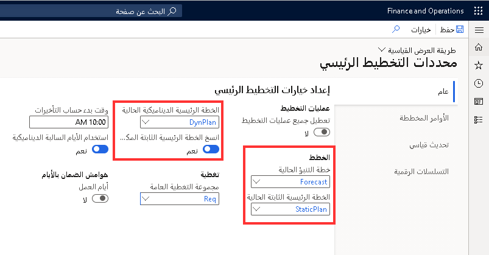
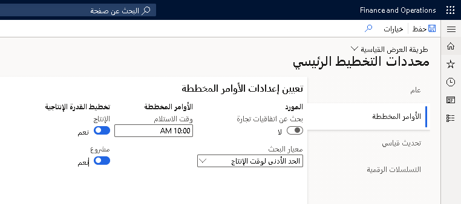

تُستخدم صفحة **معايير التخطيط الرئيسي** لتحديد المعلومات العامة مثل الخطط والإعدادات الافتراضية التي تتعلق بعملية التخطيط، مثل الخطط الرئيسية والتنبؤات والتغطية وهوامش الأمان، وما يلي:

-   الإعدادات التي تتعلق بالأوامر المخططة

-   إعدادات التحديث القياسية حول الثبات

-   التسلسل الرقمي للتخطيط الرئيسي

تُستخدم علامة التبويب **عام** في صفحة **معايير التخطيط الرئيسي** لتحديد معلومات عامة حول عملية التخطيط. يتضمن الحقول في مجموعة الحقول **خطط** التي تتعلق بالأنواع التالية من الخطط الرئيسية:

-   **تعطيل جميع عمليات التخطيط** - يأخذ التخطيط الرئيسي لقطة من صافي متطلبات الصنف قبل التخطيط. تتمثل الخطوة الأخيرة في عملية التخطيط في مراعاة أي تغييرات قد تكون حدثت في صافي المتطلبات منذ التقاط اللقطة.

    -   يتم تسجيل جميع التغييرات التي تم إجراؤها على صافي متطلبات الصنف، مثل زيادة كمية بند أمر المبيعات أو تقليل كمية بند أمر النقل، في جدول يسمى **InventSumLogTTS**. يستخدم الجدول للحفاظ على حالة الخطة الديناميكية من خلال تتبع جميع التغييرات في العرض والطلب التي حدثت منذ آخر تجديد للتخطيط الرئيسي. يتم تنظيف هذا الجدول فقط من خلال تجديد التخطيط الرئيسي.

    -   إذا لم يتم تنظيفه مطلقاً، فإن الجدول يستمر في النمو ويسد أداء النظام. إذا كنت لا تنوي تشغيل التخطيط الرئيسي أو أي عمليات تخطيط أخرى (التفجير، جدولة أمر الإنتاج باستخدام مادة محددة، التحكم في تاريخ تسليم CTP) **التخطيط الرئيسي> Setup > معايير التخطيط الرئيسي > تعطيل جميع عمليات التخطيط** معيار إلى **نعم**. سيؤدي هذا إلى منع تسجيل السجلات في جدول InventSumLogTTS. عند إنشاء شركة جديدة، يتم تعيين هذا المعيار افتراضياً على **نعم**. هذا يعني أنك إذا كنت تنوي تنفيذ عمليات التخطيط في شركة ما، فأنت بحاجة إلى تعيين **التخطيط الرئيسي > الإعداد > معايير التخطيط الرئيسي > تعطيل جميع عمليات التخطيط** معيار واحد من أجل **لا**.

-   **خطة التنبؤ الحالية** - إذا كانت الشركة تستخدم التنبؤ، يتم تحديد خطة التنبؤ في هذا الحقل. تعتبر الخطة التي تم إدخالها في هذا الحقل بمثابة خطة التنبؤ الافتراضية ويتم استخدامها في صفحة إجمالي المتطلبات.

-   **المخطط الرئيسي الثابت الحالي** - يُستخدم هذا الحقل لتحديد المخطط الرئيسي الذي سيتم استخدامه عند تحديد مبدأ التجديد، بغض النظر عما إذا كانت الشركة تستخدم مخططاً رئيسياً واحداً أو اثنين استراتيجية الخطة. عادة ما تكون هذه هي الخطة التي تحتوي على نتائج تشغيل التخطيط من الليلة السابقة، ويتم استخدامها كخطة افتراضية.

-   **المخطط الرئيسي الديناميكي الحالي** - يُستخدم هذا الحقل لتحديد المخطط الرئيسي المستخدم أثناء عمليات المحاكاة / الانفجارات (أو الانفجارات من **الأصناف** ) عند استخدام استراتيجية خطة رئيسية ثنائية. في حالة استخدام إستراتيجية خطة رئيسية واحدة، يتم تحديد نفس الخطة في كل من المجالين **الخطة الرئيسية الثابتة الحالية** و **الخطة الرئيسية الديناميكية الحالية**.

**التخطيط الرئيسي > الإعداد > معايير التخطيط الرئيسي**

يمكنك أيضاً تعيين الخيار **نسخ الخطة الرئيسية الثابتة الكاملة والمحدثة إلى الخطة الرئيسية الديناميكية** على **نعم**. عند تحديد هذا الخيار، يتم نسخ المخطط الرئيسي الثابت إلى المخطط الرئيسي الديناميكي عند تشغيل التخطيط الرئيسي التجديدي.

استخدم المعايير في مجموعة الحقول **تغطية** لتحديد معايير عامة إضافية في علامة التبويب **عام** في مجموعة **تغطية**:

-   **مجموعة تغطية عامة** - حدد مجموعة التغطية التي ستكون المجموعة الافتراضية عند إنشاء صنف جديد. تُستخدم مجموعة التغطية أيضاً تلقائياً إذا لم تحدد أي قيمة أخرى في صفحات **المنتجات الصادرة** و **تغطية الصنف**.

-   **وقت البدء لحساب التأخيرات** - وقت البدء لحساب التأخيرات **التأخيرات المحسوبة** وإعادة جدولة الطلبات المخططة. إذا كان وقت الاستلام المخطط بعد وقت العقود الآجلة المحدد، فسيتم إضافة يوم واحد إلى تاريخ العقود الآجلة. هذا يجعل الأصناف متاحة بعد يوم واحد.

-   **استخدام الأيام السلبية الديناميكية** - حدد هذا الخيار لاستخدام الأيام السلبية الديناميكية في حسابات التخطيط الرئيسي. يتحكم هذا الخيار والحقل **أيام سلبية** عندما يمكنك استخدام إيصال مجدول لاستيفاء أحد المتطلبات، أو وقت إنشاء أمر مخطط بدلاً من ذلك.
    باستخدام الأيام السالبة الديناميكية، يمكنك تضمين عامل مهلة الصنف المتبقية في الحساب. يزيد من دقة نتائج التخطيط الرئيسي. معادلة حساب الأيام السالبة الديناميكية هي: *أيام سلبية = مهلة زمنية + أيام سلبية - الحد الأدنى {، تاريخ استحقاق المتطلبات - تاريخ اليوم}*.
    الحقل **أيام سلبية** موجود في **تغطية الصنف** وصفحات **مجموعات التغطية**.

مجموعة الحقول **هامش الأمان** و **التحديث** مجموعة الحقول في علامة التبويب **عام** تشمل الحقول التالية:

-   **أيام عمل** - حدد هذا الخيار إذا كنت تريد حساب هوامش الأمان كأيام عمل في التقويم. أيام العمل مصنفة على أنها مفتوحة. إذا تم مسح الخيار، يتم حساب أيام هامش الأمان كأيام تقويمية؛ يمكن تصنيفها على أنها مفتوحة أو مقفلة.

-   **تقويم تاريخ اليوم** - حدد التقويم الذي تريد استخدامه عند تشغيل التخطيط الرئيسي. يحسب البرنامج تاريخ اليوم من خلال البحث إلى الأمام في التقويم من تاريخ النظام ووقته حتى يتم العثور على يوم مفتوح. إذا كان هذا الحقل فارغاً، فسيستخدم التخطيط الرئيسي تاريخ النظام الحالي كتاريخ اليوم.

فيما يلي المعايير علامة التبويب **الطلبات المخططة** :

-   **البحث عن اتفاقيات التجارة** - حدد هذا الخيار إذا كنت تريد أن يبحث البرنامج عن مورد توجد معه اتفاقية تجارية عند تشغيل التخطيط الرئيسي. إذا كان باستطاعة العديد من الموردين توفير الصنف، فاستخدم الحقل **معيار البحث** لمعرفة معايير اختيار المورد. إذا تم تحديد مورد افتراضي للصنف، فسيتجاوز هذا المورد التحديد الذي تم إجراؤه في هذا الحقل.

-   **معيار البحث** - حدد الخيار **البحث عن اتفاقيات التجارة** قبل تحديد معيار البحث. يمكنك البحث عن الموردين بالحد الأدنى من المهلة أو بأقل تكلفة للوحدة.

-   **وقت الاستلام** - أدخل الوقت المخصص تلقائياً لجميع الأوامر المخططة التي تم إنشاؤها. يحسب التخطيط الرئيسي أوامر الإنتاج المخططة للخلف من وقت الاستلام. الوقت مهم أيضاً لحساب التواريخ والرسائل المستقبلية للأوامر المخططة.

-   **الإنتاج** - حدد هذا الخيار لتضمين القدرة الإنتاجية المحجوزة بالفعل لأوامر الإنتاج. يستخدم البرنامج هذا الحقل عندما يقوم بجدولة القدرة الإنتاجية للأوامر المخططة.

-   **المشروع** - حدد هذا الخيار لتضمين القدرة الإنتاجية المحجوزة بالفعل للمشاريع. يستخدم البرنامج هذا الحقل عندما يقوم بجدولة القدرة الإنتاجية للأوامر المخططة.

 

فيما يلي المعايير اختر علامة التبويب **تحديث قياسي** :

-   **علامة التحديث** - حدد سياسة تمييز المخزون لاستخدامها عند تأكيد الأوامر المخططة: 
    -   **لا** (لا يتم وضع علامات على المخزون).
    -   **قياسي** (يتم تحديث علامات المخزون وفقاً لتثبيت السعر. يتم تمييز أمر المتطلبات مقابل أمر التنفيذ.     إذا بقيت بعض الكمية في أمر الاستيفاء، فلن يتم تمييزها).
    -   **موسع** (يتم تمييز كل من أمر المتطلبات وأمر التنفيذ، بغض النظر عما إذا كانت أي كمية لا تزال موجودة في أمر التنفيذ).

-   **إيقاف التوكيد في حالة حدوث خطأ** - حدد هذا الخيار إذا كنت تريد إيقاف تأكيد جميع الأوامر المخططة في حالة حدوث خطأ في أمر مخطط واحد.

-   **تجميع المورد** - حدد هذا الخيار لتجميع أوامر الشراء المخططة معاً لإنشاء أمر شراء واحد لكل مورد عند التأكيد. بدلاً من ذلك، يمكنك إنشاء أمر شراء واحد ببند واحد لكل أمر مخطط.

-   **تجميع حسب مجموعة المشترين** - حدد هذا الخيار لتجميع أوامر الشراء المخططة معاً لإنشاء أمر شراء واحد يضم مجموعة المورد والمشتري. لاستخدام هذا الخيار، يجب عليك أيضاً تحديد الخيار **تجميع المورد**.

-   **التجميع حسب اتفاقية الشراء** - حدد هذا الخيار لدمج أوامر الشراء المخططة وإنشاء أمر شراء واحد لكل اتفاقية شراء. إذا حددت هذا الخيار، فسيتم تحديد الخيار **البحث عن اتفاقيات الشراء** تلقائياً.

-   **تجميع حسب الفترة** - حدد الفترة التي تريد خلالها تجميع أوامر التحويل المخططة.

-   **البحث عن اتفاقيات الشراء** - حدد هذا الخيار لتمكين البحث التلقائي عن اتفاقيات الشراء أثناء تأكيد الطلبات المخططة. إذا تم العثور على اتفاقية شراء مطابقة، سيتم تطبيق معلومات، مثل السعر والخصم، على بنود أمر الشراء.
