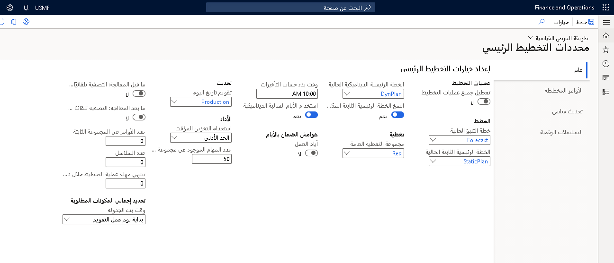
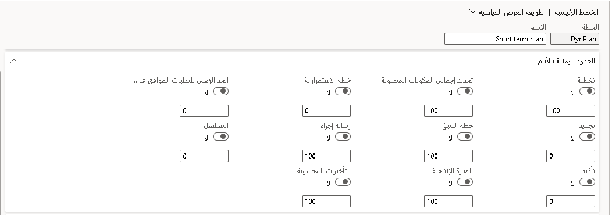

نوعا الخطط هما:

-   **الخطة الثابتة** - يستخدم حساب التخطيط الرئيسي البيانات الحالية لإنشاء خطة صافي المتطلبات. هذا هو المكان الذي تتم فيه عادةً الموافقة على الأوامر المخططة وتأكيدها لإنشاء أوامر التوريد. تظل هذه الخطة دون تغيير إلى المرة التالية التي تقوم فيها بتشغيل "التخطيط الرئيسي".

-   **الخطة الديناميكية** - تبدأ هذه الخطة بنفس خطة صافي المتطلبات التي تم إنشاؤها بواسطة التخطيط الرئيسي. ومع ذلك، يمكنك تحديث الخطة الديناميكية في كل مرة تتغير فيها بيانات المعاملات. على سبيل المثال، قد يحدث هذا عند إنشاء أمر مبيعات جديد. تمكّنك الخطة الديناميكية من مراقبة شبكة الطلبات المتغيرة وتوافر الأصناف دون الإخلال بالخطة الثابتة التي يستخدمها الآخرون لعمليات العمل الخاصة بهم.

قد تختار إحدى الشركات العمل باستخدام خطة ديناميكية فقط، أو يمكن استخدام كل من الخطط الثابتة والديناميكية. بالإضافة إلى ذلك، يمكنك تكوين إيه خطة رئيسيه لإظهار استراتيجية أو معالجة مشكلة.

### مثال

-   للتخطيط قصير الأجل، سواء كان ذلك على أساس يومي أو أسبوعي أو حتى شهري، ضع في اعتبارك استخدام خطة ديناميكية للبقاء على اطلاع دائم بالتغييرات في العمليات اليومية، مثل متطلبات الحد الأدنى / الأقصى، لضمان أن دفاتر يومية المخزون الآمن التي تم إنشاؤها سيغطي متطلبات الأصناف المتاحة في متناول اليد. 

-   بالنسبة للخطط طويلة الأجل، والتي تحدث عادةً سنوياً، تحتاج إلى تعيين هوامش أمان أطول للحماية من الظروف غير المتوقعة، مثل التعامل مع الموردين الذين لا يقومون بتسليم البضائع كما وعدت.

في كل مرة تقوم فيها بتشغيل التخطيط الرئيسي، يجب عليك إعداد الخطة الديناميكية بحيث يتم تحديثها بخطة المتطلبات الجديدة. يمكنك تحديد هذه الإعدادات في صفحة **معايير التخطيط الرئيسي**.

استناداً إلى المعايير التي قمت بتعيينها، يتحقق التخطيط الرئيسي من المخزون الفعلي والعوامل الموجودة في جميع أوامر المبيعات (بما في ذلك عروض أسعار المبيعات، إذا تم تضمينها في إعداد الخطط الرئيسية)، وحركات المخزون، وأوامر الشراء، وأوامر الإنتاج المخطط لها مسبقاً.

بعد ذلك، يُنشئ التخطيط الرئيسي أوامر مخططة جديدة، إذا حددت إعادة إنشاء عند تشغيل خطة. كما يمكنه أيضاً تحديث الخطة الموجودة مع **الإجراءات** و **التأخيرات المحسوبة**.

## الاحتفاظ بالأوامر المخططة

يمكنك إدارة الأوامر المخططة من مساحة عمل **التخطيط الرئيسي** أو قائمة **الأمر المخطط** أو **أوامر الإنتاج المخططة** أو **أوامر الشراء المخططة** و **قوائم التحويل المخططة**. يمكنك استخدام حقل **الحالة** للمساعدة على تتبع تقدمك. استخدم القيم التالية عند إدارة الطلبات المخططة:

-   عندما يقوم التخطيط الرئيسي بإنشاء أوامر مخططة، تكون حالة الأوامر المخططة هي حالة **غير معالجة**.

-   إذا قررت عدم تأكيد أمر مخطط، يمكنك منحه حالة **مكتملة**.

-   وإذا قررت تأكيد أمر مخطط، يمكنك منحه حالة **معتمدة**. تشير هذه الحالة إلى أنك تعتمد تأكيد الأمر المخطط، ولكنه لم يتم تأكيده بعد.

> [!NOTE] 
> يتم تحويل الأمر المخطط المعتمد، في حالته الحالية، إلى حساب التخطيط الرئيسي التالي.

يمكنك تأكيد الطلبات المخططة عن طريق تحديد **تأكيد** للأوامر المخططة التالية:

-   الأمر المخطط الذي تم تحديده

-   أوامر متعددة مخططة

-   الأوامر المخططة التي تم إنشاؤها بواسطة عملية تحديد جمالي المكونات المطلوبة من صفحة **تحديد إجمالي المكونات المطلوبة**. حدد **الأوامر المخططة**، واختر الأمر المخطط، ثم قم بتحديد **مؤكد**.

عند تأكيد الأمر المخطط، يتم إنشاء الأوامر استناداً إلى نوع المرجع لكل أمر، مثل الشراء والإنتاج والكانبان والتحويل.

## التأخيرات المحسوبة

يمكن أن يحسب التخطيط الرئيسي أقرب تاريخ لتنفيذ حركة ما، استناداً إلى المهل الزمنية وتوافر المواد وتوافر القدرة الإنتاجية ومعلمات التخطيط المتنوعة.

التأخير المحسوب هو أمر ينشئه النظام بتاريخ استحقاق يعتمد على فترات التسليم لكافة مستويات الأصناف. يتم إنشاء تاريخ تأخير محسوب إذا قام التخطيط الرئيسي بحساب تاريخ طلب، ربما لصنف مستوى أدنى، والذي يسبق تاريخ اليوم. ثم يقوم التخطيط الرئيسي بجدولة الطلب من تاريخ اليوم إلى الأمام ويتضمن فترات زمنية تبدأ بأي عناصر مكون ذات مستوى أدنى. تاريخ التأخير المحسوب هو تاريخ استحقاق واقعي يعتمد على البيانات الحالية.

إذا قام التخطيط الرئيسي بحساب تاريخ أمر يسبق التاريخ الحالي، فلا يمكن تنفيذ الأمر في الوقت المحدد. وبالتالي، يتم تأجيل الأمر. في هذه الحالة، يقوم التخطيط الرئيسي بالتخطيط المسبق للأمر من التاريخ الحالي ويتضمن أوقات التسليم. تبدأ هذه المهل الزمنية بأي أصناف مكونة ذات مستوى أدنى. ثم يتلقى الطلب تاريخاً متأخراً. التاريخ المتأخر هو تاريخ استحقاق واقعي، بناءً على البيانات الحالية. يحسب التخطيط الرئيسي أيضاً عدد أيام التأخير.

في بعض الحالات، قد تختار عدم حساب التأخيرات، على سبيل المثال عندما يعلم المستخدمون أنه يمكنهم تسريع المدد الزمنية عن طريق تحديد أوضاع بديلة للتسليم.

يمكنك تكوين كيفية حساب التأخيرات لمجموعة التغطية. يمكنك بعد ذلك إرفاق مجموعة التغطية بأحد الأصناف في وقت لاحق.

في صفحة **معايير التخطيط الرئيسي** ،يمكنك تعيين وقت البدء لحساب التأخيرات. إذا تم تنفيذ الأمر بعد هذا الوقت، تتم إضافة تأخير ليوم واحد إلى تاريخ تأخير الأمر.

## صفحة الخطط الرئيسية

تحتوي صفحة **الخطط الرئيسية** على إعدادات المعلمات التي توجه كيفية قيام التطبيق بحساب المتطلبات لكل خطة.

انتقل إلى **الخطط الرئيسية > الإعداد > الخطط > التخطيط الرئيسي** لإنشاء الخطط الرئيسية والمحافظة عليها.

فيما يلي معايير في علامة التبويب السريعة **عام** في إعدادات خطة رئيسية.

-   **تضمين المخزون الفعلي** - حدد هذا الخيار إذا كان يجب أن يتضمن حساب التخطيط الرئيسي مستويات المخزون الفعلي للصنف. إذا لم يتم تضمين مستويات أصناف المخزون الفعلي، فقد يتم إنشاء الأوامر المخططة للأصناف الموجودة بالفعل في المخزون.

-   **تضمين حركات المخزون** - حدد هذا الخيار إذا كان يجب أن يتضمن حساب التخطيط الرئيسي جميع الحركات المتوقعة. وتشمل هذه أوامر المبيعات وأوامر الشراء ودفاتر يومية المخزون وأوامر الإنتاج التي لم يتم تسجيلها بعد كإيصالات فعلية وإصدارات من المخزون.

-   **احتمال %** - إذا حددت الخيار **تضمين عروض أسعار المبيعات** يمكنك تحديد نسبة احتمال. يتضمن حساب التخطيط الرئيسي جميع أوامر المشروع أو المبيعات من نوع عرض الأسعار التي لها نفس نسبة الاحتمال أو أعلى.

-   **تضمين طلبات عروض الأسعار** - حدد هذا الخيار لتضمين طلبات عروض الأسعار. يتم تضمين الحركات التي لها حالة استلام **إيصال عرض الأسعار** في حساب التخطيط الرئيسي.

-   **تضمين الطلبات** - حدد هذا الخيار لتضمين الطلب من الطلبات التي لها غرض التزويد في حساب التخطيط الرئيسي. يتم تضمين الطلبات التي لها غرض التزويد وحالة الموافقة.

-   **طريقة الجدولة** - حدد طريقة الجدولة لأوامر الإنتاج المخططة التي تم إنشاؤها أثناء التخطيط الرئيسي.
    توفر جدولة العمليات جدولاً تقريباً لا يتطلب منك تحديد المورد المحدد الذي ينفذ كل عملية. هذه الطريقة هي أيضاً أقل طلباً على موارد النظام.
    إذا حددت جدولة الوظيفة، فستتم جدولة أمر الإنتاج المخطط بالتفصيل، وتتم جدولة مهمة تلقائياً لأمر الإنتاج المخطط عند تأكيدها.

-   **خاصية محدودة** - حدد هذا الخيار للإشارة إلى أن تخطيط القدرة الإنتاجية لأمر الإنتاج المخطَط له يجب أن يأخذ في الاعتبار أن معرّف الخاصية المطلوب متاح. يمكنك إنشاء وتحديث الخصائص في صفحة **خصائص**.

-   **الحد الزمني القدرة الإنتاجية الجدولة العكسية** - أدخل فترة بالأيام، بدءاً من تاريخ طلب الطلب والعودة للخلف، وخلالها يبحث التخطيط الرئيسي لتحديد القدرة الإنتاجية المتاحة. في حالة عدم توفر القدرة الإنتاجية، يتم المضي قدماً في الجدولة من تاريخ طلب الأمر.

-   **القدرة الإنتاجية محدودة** - حدد هذا الخيار للإشارة إلى أن جدولة أوامر الإنتاج المخططة ستأخذ في الاعتبار القدرة الإنتاجية التي تم حجزها بالفعل. أوامر الإنتاج المخططة مجدولة للخلف من تاريخ المتطلبات. في حالة عدم توفر القدرة الإنتاجية، يتم البحث عن متطلبات عناصر المكون في تاريخ أقدم مما يمكن أن ينفذه تسلسل الإنتاج الأمثل. إذا كان من الممكن تغيير القدرة الإنتاجية مع تغير المتطلبات، مثل عندما تعمل مع نوبات، فلا يجب عليك تحديد هذا الخيار لأن أوقات المعالجة المحسوبة ستكون غير صحيحة. تأخذ الجدولة في الاعتبار القدرة الإنتاجية المحجوزة بالفعل، فقط إذا حددت الخيار **القدرة الإنتاجية المحدودة** صفحة **الموارد**. تحديد هذا الخيار يجعل الحقل **الحد الزمني القدرة الإنتاجية المحدودة** متاحاً للتعديل.

-   **الحد الزمني للقدرة الإنتاجية المحدودة** - أدخل فترة بالأيام، بدءاً من التاريخ الحالي، والتي تتم خلالها جدولة أوامر الإنتاج المخططة باستخدام **قدرة إنتاجية محدودة**. لا يمكنك ترك هذا الحقل فارغا. يعمل هذا الحقل مع الحد الزمني القدرة الإنتاجية التي يمكنك إعدادها في علامة التبويب السريعة **السياج الزمني** FastTab أو في صفحة **مجموعات التغطية**. يتوفر هذا الحقل فقط عند تحديد الخيار **قدرة إنتاجية محدودة**. لتضمين مورد في جدولة القدرة الإنتاجية المحدودة، يجب عليك تحديد الحقل **القدرة الإنتاجية محدودة** في المورد الفردي أو مجموعة الموارد.

    -   **مثال 1** - أدخل **15** في هذا المجال واضبط الحد الزمني القدرة الإنتاجية على **100**. يستخدم التخطيط الرئيسي قدرة إنتاجية محدودة لأول 15 يوماً والقدرة الإنتاجية غير محدودة للأيام المتبقية من السياج الزمني.

    -   **مثال 2** - أدخل **25** في هذا الحقل، وينتمي الصنف إلى مجموعة تغطية تحدد القدرة الإنتاجية الحد الزمني **10**.
        يستخدم التخطيط الرئيسي قدرة إنتاجية محدودة لمدة 10 أيام.

    -   **مثال 3** - أدخل **0** (صفر) في هذا الحقل. لا يستخدم التخطيط الرئيسي قدرة إنتاجية محدودة.

-   **قدرة إنتاجية محدودة لموارد الاختناق** - حدد هذا الخيار لحساب التخطيط الرئيسي باستخدام القدرة الإنتاجية المحدودة لتلك الموارد التي تم تعريفها على أنها موارد الاختناق. يمكنك استخدام جدولة عنق الزجاجة لتمديد الحد الزمني القدرة الإنتاجية المحدودة لعدد محدود من الموارد. يمكن جدولة موارد الاختناق باستخدام قدرة إنتاجية محدودة لفترة أطول من الموارد غير المختنق. يتوفر هذا الحقل فقط عند تحديد الخيار **قدرة إنتاجية محدودة**.

-   **الحد الزمني القدرة الإنتاجية لموارد الاختناق** - أدخل الفترة بالأيام، بدءاً من التاريخ الحالي، والتي تتم خلالها جدولة الموارد التي تم تحديدها على أنها موارد الاختناق باستخدام قدرة إنتاجية محدودة. يجب أن يكون الحد الزمني لقدرة عنق الزجاجة أكبر من السياج الزمني ذي القدرة الإنتاجية المحدودة. يتم استخدام القيمة الأكبر. يتوفر هذا الحقل فقط عند تحديد الخيار **القدرة الإنتاجية المحدودة** والخيار **جدولة عنق الزجاجة**.

-   **قم بتضمين التنبؤ بالتوريد** - بعد تحديد نموذج توقع، حدد هذا الخيار لتضمين التنبؤ بالتوريد في الخطة الرئيسية الحالية. إذا لم تحدد هذا الخيار، فلن يتم تضمين حركات التنبؤ بالتوريد في الخطة الرئيسية.

-   **تضمين التنبؤ بالطلب** - بعد تحديد نموذج توقع، حدد هذا الخيار لتضمين توقع الطلب في الخطة الرئيسية الحالية. إذا لم تحدد هذا الخيار، فلن يتم تضمين حركات التنبؤ بالطلب في الخطة الرئيسية.

-   **طريقة مستخدمة لتقليل متطلبات التنبؤ** - حدد طريقة لاستخدامها لتقليل متطلبات التنبؤ أثناء التخطيط الرئيسي.

    -   **لا شيء** - لا يتم تقليل متطلبات التنبؤ أثناء التخطيط الرئيسي.

    -   **بالمائة - طريقة الخفض** - يتم تقليل متطلبات التنبؤ وفقاً للنسب المئوية والفترات الزمنية المحددة بواسطة طريقة الخفض.

    -   **المعاملات - طريقة الخفض** - يتم تقليل متطلبات التنبؤ من خلال الحركات التي تحدث خلال الفترات الزمنية المحددة بواسطة طريقة الخفض.

    -   **الحركات - الفترة الديناميكية** - يتم تقليل متطلبات التنبؤ بحركات الأمر الفعلية التي تحدث خلال الفترة الديناميكية، والتي تغطي تواريخ التنبؤ الحالية وتنتهي مع بداية التنبؤ التالي. لا تستخدم هذه الطريقة أو تتطلب طريقة خفض، وعند تحديد هذا الخيار:

        -   إذا تم تقليل التنبؤ بالكامل، فإن متطلبات التنبؤ للتنبؤ الحالي تصبح 0 (صفر).

        -   في حالة عدم وجود توقعات مستقبلية، يتم تقليل متطلبات التنبؤ من آخر توقع تم إدخاله. يتم تضمين السياج الزمني والأيام الموجبة في حساب التخفيض المتوقع.

        -   إذا كانت حركات الأمر الفعلية أكبر من المتطلبات المتوقعة، فلن يتم إعادة توجيه المعاملات المتبقية إلى فترة التنبؤ التالية.

-   **الأوامر المخططة** - حدد التسلسل الرقمي لاستخدامه في انتقاء الأوامر المخططة. في كل مرة يتم فيها إنشاء أمر مخطط، يتم تعيين رقم تسلسلي له من التسلسل الرقمي هذا. نوصي بإعطاء الأوامر المخططة تسلسلها الرقمي الخاص بها بحيث يمكنك تمييزها عن المتطلبات الأخرى.

فيما يلي معايير في علامة التبويب السريعة **الوقت المحدد بالأيام** :

-   **التغطية** - حدد هذا الخيار لتجاوز الحد الزمني للتغطية للصنف أثناء التخطيط الرئيسي. إذا حددت هذا الخيار، فأدخل عدد الأيام التي يجب أن يغطي حساب التخطيط الرئيسي المتطلبات. يتم احتساب الحد الزمني للتغطية مقدماً من التاريخ الحالي. دائماً ما تتم معالجة المتطلبات التي تحدث قبل التاريخ الحالي.

-   **تجميد** - حدد هذا الخيار لتجاوز الحد الزمني لتجميد الصنف أثناء التخطيط الرئيسي. إذا حددت هذا الخيار، فأدخل عدد الأيام التي تم فيها تجميد نشاط التخطيط. لم يتم إنشاء أوامر مخططة جديدة، ولا يمكن تغيير الأوامر المخططة الحالية.

-   **التأكيد** - حدد هذا الخيار لتجاوز الحد الزمني للتأكيد للصنف أثناء التخطيط الرئيسي. إذا حددت هذا الخيار، فأدخل عدد الأيام التي يتم فيها تأكيد أوامر الشراء وأوامر الإنتاج المخططة تلقائياً. يتم حساب الحد الزمني مقدماً من تاريخ التخطيط الرئيسي. يجب إقران الصنف بمورد حتى يتم التثبت التلقائي لأمر الشراء المخطط له.

-   **انفجار** - حدد هذا الخيار لتجاوز الحد الزمني للانفجار للصنف أثناء التخطيط الرئيسي. إذا قمت بتحديد هذا الخيار، فأدخل عدد الأيام التي يتم فيها تفصيل قائمة مكونات الصنف (BOMs) لحساب المتطلبات الخاصة بأصناف المكونات. يتم احتساب الحد الزمني للأمام من التاريخ الحالي.

-   **خطة التنبؤ** - حدد هذا الخيار لتجاوز وقت خطة التنبؤ للصنف أثناء التخطيط الرئيسي. إذا قمت بتحديد هذا الخيار، فأدخل عدد الأيام التي يتم فيها تضمين توقعات المبيعات، من خطة التنبؤ، في التخطيط الرئيسي.

-   **القدرة الإنتاجية** - حدد هذا الخيار لتجاوز الحد الزمني القدرة الإنتاجية للصنف أثناء التخطيط الرئيسي. إذا حددت هذا الخيار، فأدخل عدد الأيام المخطط لها القدرة الإنتاجية لأوامر الإنتاج المخططة. يستخدم التخطيط الرئيسي مسار الإنتاج النشط للصنف والجداول إلى الخلف من تاريخ المتطلبات. إذا كان تاريخ المتطلب لأمر الإنتاج المخطط خارج الحد الزمني القدرة الإنتاجية، يتم تحديد وقت التسليم حسب وقت التسليم الخاص بالصنف. يتم احتساب الحد الزمني للأمام من التاريخ الحالي.

-   **رسالة الإجراء** - حدد هذا الخيار لتجاوز الحد الزمني لرسالة الإجراء للصنف أثناء التخطيط الرئيسي. إذا حددت هذا الخيار، فأدخل عدد الأيام التي ينشئ فيها التخطيط الرئيسي رسائل إجراءات للمتطلبات. يتم احتساب الحد الزمني للأمام من التاريخ الحالي.

-   **الحد الزمني للطلبات المعتمدة (أيام)** - حدد هذا الخيار لتجاوز إعدادات الحد الزمني المحددة للصنف. في الحقل، أدخل عدد الأيام في الماضي التي يتم خلالها تضمين الطلب من الطلبات المعتمدة التي لها غرض التزويد في التخطيط الرئيسي.

-   **التسلسل** - قم بتعيين الحد الزمني للتسلسل للصنف أثناء التخطيط الرئيسي. إذا حددت هذا الخيار، فأدخل عدد الأيام التي يتم فيها تنفيذ التسلسل.

فيما يلي معايير في علامة التبويب السريعة **التأخيرات المحسوبة**.

يحتوي كل نوع من أنواع الأوامر الأربعة المخططة على خيار **ضافة التأخير المحسوب إلى تاريخ المتطلبات**. لذلك، من خلال تعيين كل خيار، يمكنك تحديد كيفية تفسير التأخير في إصدار الخطة:

-   **نعم** - يتم إضافة التأخير إلى تاريخ المتطلبات. بمعنى آخر، يتم قبول التأخير ويتم حساب تاريخ أساسي جديد للطلب المخطط. نظراً لأن هذا السلوك ينطبق عادةً عند استخدام CTP في عملية إنشاء الطلب، يجب تعيين الخيار على **نعم**. في هذه الحالة، لن يكون للأمر المخطط أي إجراءات لأنه، وفقاً للخطة الجديدة، يفي بطلبه في التاريخ الصحيح.
    بالإضافة إلى ذلك، بالنسبة لأوامر الإنتاج وأوامر التحويل ووظائف كانبان، سيتم الآن احتساب زيادة الطلب التابع بناءً على الطلب المؤجل، وليس تاريخ الأمر الأصلي. إذا تم حساب خطة أوامر الإنتاج على أساس القدرة الإنتاجية المحدودة، فإننا نوصي بتعيين هذا الخيار على **Yes** لأوامر الإنتاج المخططة للتأكد من أن المواد وما قبل الإنتاج ليست كذلك أمرت أو نظمت قبل أن تتوفر الموارد.

-   **لا** - سيبقى تاريخ الطلب الأصلي كما هو. إذا كانت الإجراءات نشطة، فسيتلقى الأمر المخطط إجراءً للإشارة إلى المخطط أنه لا ينبغي قبول التأخير. بدلاً من ذلك، يجب أن يتفاوض المخطط على توريد سابق مع المورد.
    قد يكون التأخير في الخطة ناتجاً عن مهلة زمنية أو سمة أخرى في سياسات التوريد التي يمكن التفاوض بشأنها لحالة معينة. بالنسبة لبرامج التحويلات النقدية CTP، نادراً ما يتعين على المخطط إعادة التفاوض بشأن الخطة بعد إدخال أمر المبيعات إذا قبل مقدم الطلب التاريخ الذي اقترحه برنامج التحويلات النقدية CTP. بالنسبة لأوامر الشراء المخططة وعمليات النقل المخططة، عادةً ما يتم إنشاء التأخيرات بناءً على المهل الزمنية.
    لذلك، يمكنك تعيين هذا الخيار على **لا** إذا أراد المخطط اتخاذ إجراء بناءً على رسائل الإجراء ذات الصلة.

ضمن علامة التبويب السريعة **رسالة الإجراء**، حدد الخيار **تحديث التاريخ المؤجل كتاريخ المتطلبات** تحديث أوامر الشراء المخططة تلقائياً باستخدام تاريخ الإجراء المقترح. لا يمكن أن يتجاوز تاريخ الإجراء تاريخ المتطلبات.

فيما يلي معايير في **هوامش الأمان في الأيام** علامة التبويب السريعة:

-   **تمت إضافة هامش الاستلام إلى تاريخ المتطلبات** - أدخل عدد الأيام التي تمت إضافتها إلى تاريخ طلب الاستلام أثناء التخطيط الرئيسي. يتم تلخيص هوامش الأمان لمجموعة التغطية وهوامش الأمان للخطة الرئيسية أثناء التخطيط الرئيسي. على سبيل المثال، إذا تم تعيين هامش الاستلام على أربعة أيام وتمت جدولة بند أمر الشراء للاستلام في اليوم 15 من الشهر، يحسب التخطيط الرئيسي تاريخ الاستلام المعدل باعتباره 19 من الشهر.

-   **هامش الإصدار المخصوم من تاريخ المتطلبات** - أدخل عدد الأيام التي يتم خصمها من تاريخ متطلبات الإصدار أثناء التخطيط الرئيسي. يتم تلخيص هوامش الأمان لمجموعة التغطية وهوامش الأمان للخطة الرئيسية أثناء التخطيط الرئيسي. على سبيل المثال، إذا تم تعيين هامش الأمان على أربعة أيام وتمت جدولة بند أمر المبيعات للتسليم في 15 من الشهر، يحسب التخطيط الرئيسي تاريخ التسليم المعدل باعتباره 11 من الشهر.

-   **إعادة ترتيب الهامش المضاف إلى مهلة الصنف** - أدخل عدد الأيام التي تمت إضافتها إلى مهلة الصنف لجميع الأوامر المخططة أثناء التخطيط الرئيسي. يتم تلخيص هوامش الأمان لمجموعة التغطية وهوامش الأمان للخطة الرئيسية أثناء التخطيط الرئيسي.
