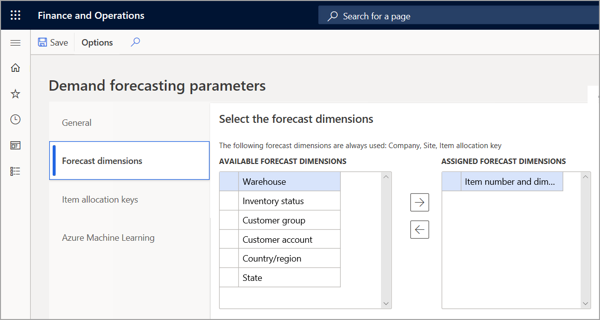
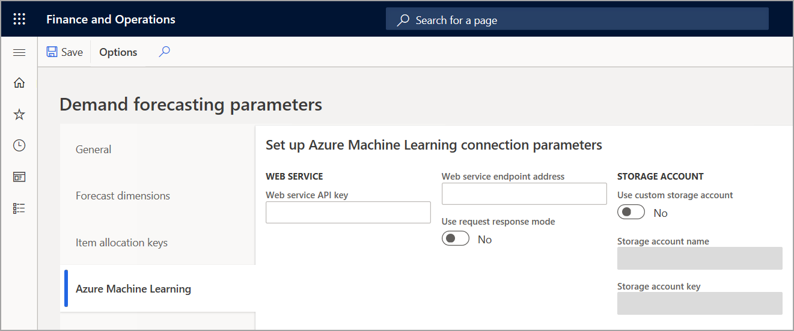

يتم استخدام التنبؤ بالطلب للتنبؤ بالطلب المستقل من أوامر المبيعات والطلب المعال في أي نقطة فصل لأوامر العملاء.
توفر قواعد خفض التنبؤ بالطلب المحسّنة حلاً مثالياً للتخصيص الشامل.

لإنشاء التنبؤ الأساسي، يتم تمرير ملخص للحركات السابقة إلى خدمة التعلّم الآلي من Microsoft Azure. نظراً لأن هذه الخدمة غير مشتركة بين المستخدمين، يمكن تخصيصها لتلبية المتطلبات الخاصة بالصناعة. يمكنك استخدام Supply Chain Management لتصور التنبؤ وضبط التنبؤ وعرض مؤشرات الأداء الأساسية (KPIs) حول دقة التنبؤ.

تشمل الميزات الرئيسية للتنبؤ بالطلب ما يلي:

-   إنشاء التنبؤ الأساسي الإحصائي الذي يعتمد على البيانات السابقة.

-   استخدام مجموعة ديناميكية من أبعاد التنبؤ.

-   تصور اتجاهات الطلب وفترات الدقة وتسويات التنبؤ.

-   التصريح باستخدام التنبؤ المعدل في عمليات التخطيط.

-   إزالة القيم المتطرفة.

-   إنشاء قياسات لدقة التنبؤ.

تتضمن مهام الإعداد إعداد البيانات والمعلمات التالية.

## مفتاح توزيع الصنف

يتم حساب التنبؤ بالطلب للصنف وأبعاده فقط إذا كان الصنف جزءاً من مفتاح توزيع الصنف. يتم فرض هذه القاعدة لتجميع أعداد كبيرة من الأصناف بحيث يمكن إنشاء تنبؤات بالطلبات بشكل أسرع. يتم تجاهل النسبة المئوية لمفتاح توزيع الصنف عند إنشاء تنبؤات بالطلبات. يتم إنشاء التنبؤات على أساس البيانات السابقة فقط.

يجب أن يكون الصنف وأبعاده جزءاً من مفتاح توزيع صنف واحد فقط إذا تم استخدام مفتاح توزيع الصنف أثناء إنشاء التنبؤ.

لإضافة وحدة حفظ المخزون (SKU) إلى مفتاح توزيع الصنف، انتقل إلى **التخطيط الرئيسي > الإعداد > التنبؤ بالطلب > مفاتيح توزيع الصنف**. استخدم صفحة **تعيين الأصناف** لتعيين صنف إلى مفتاح توزيع.

## مجموعات التخطيط بين شركات شقيقة

يعمل التنبؤ بالطلب على إنشاء تنبؤات عبر الشركة. في Supply Chain Management، يتم تجميع الشركات المخططة معاً في مجموعة تخطيط واحدة بين شركات شقيقة. لتحديد مفاتيح توزيع الصنف التي يجب أخذها في الاعتبار للتنبؤ بالطلب، لكل شركة، قم بإقران مفتاح توزيع الصنف بعضو مجموعة التخطيط بين الشركات الشقيقة من خلال الانتقال إلى‫ **التخطيط الرئيسي > الإعداد‬ > التنبؤ بالطلب > مجموعات التخطيط بين شركات شقيقة**.

بشكل افتراضي، إذا لم يتم تعيين مفاتيح توزيع الصنف لأعضاء مجموعة التخطيط بين شركات شقيقة، يتم حساب التنبؤ بالطلب لكافة الأصناف التي يتم تعيينها لجميع مفاتيح توزيع الصنف من جميع شركات Supply Chain Management. تتوفر خيارات تصفية إضافية للشركات ومفاتيح توزيع الصنف في صفحة **إنشاء التنبؤ الأساسي الإحصائي** .

احرص على مراجعة عدد الأصناف التي يتم التنبؤ بها. قد تتسبب الأصناف غير الضرورية في زيادة التكاليف عند استخدام التعلّم الآلي من Azure.

## معلمات التنبؤ بالطلب

لإعداد معلمات التنبؤ بالطلب، انتقل إلى **التخطيط الرئيسي > الإعداد > التنبؤ بالطلب > معلمات التنبؤ بالطلب**. نظراً لأن التنبؤ بالطلب يعمل عبر الشركات، فإن الإعداد عمومي. وبمعني آخر، يتم تطبيق الإعداد على كافة الشركات.

يقوم التنبؤ بالطلب بإنشاء التنبؤ بالكميات. لذلك، يجب تحديد وحدة القياس التي يجب التعبير عن الكمية بها في الحقل **وحدة التنبؤ بالطلب** .

يجب أن تكون وحدة القياس فريدة للمساعدة في ضمان أن يكون التجميع وتوزيع النسبة المئوية منطقياً. لمزيد من المعلومات حول توزيع النسبة المئوية والتجميع، راجع [‏‫إجراء تسوية يدوية في التنبؤ الأساسي‬](/dynamics365/supply-chain/master-planning/manual-adjustments-baseline-forecast/?azure-portal=true).

بالنسبة لكل وحدة قياس يتم استخدامها لوحدات SKU المضمنة في التنبؤ بالطلب، تأكد من وجود قاعدة تحويل لوحدة القياس ووحدة القياس العامة للتنبؤ. عند تشغيل إنشاء التنبؤ، يتم تسجيل قائمة الأصناف التي لا تحتوي على ‏‫تحويل وحدة القياس بحيث يمكنك تصحيح الإعداد.

يمكن استخدام التنبؤ بالطلب للتنبؤ بكل من الطلبات المعالة والمستقلة.

على سبيل المثال، إذا تم تحديد خانة الاختيار **أمر المبيعات** فقط، وإذا كانت جميع الأصناف التي يتم أخذها في الاعتبار عند التنبؤ بالطلب عبارة عن أصناف يتم بيعها، يحسب النظام الطلب المستقل. ومع ذلك، يمكن إضافة المكونات الفرعية الهامة إلى مفاتيح توزيع الأصناف وتضمينها في التنبؤ بالطلب. في هذه الحالة، إذا كانت خانة الاختيار **خط الإنتاج** محددة، يتم حساب تنبؤ معال.

توفر Supply Chain Management طريقتين لإنشاء تنبؤ أساسي‬. يمكنك استخدام نماذج التنبؤ إلى جانب البيانات السابقة، أو يمكنك نسخ البيانات السابقة إلى التنبؤ.
يتيح لك الحقل **إستراتيجية إنشاء التنبؤ** إمكانية الاختيار بين هاتين الطريقتين. لاستخدام نماذج التنبؤ، حدد **‏‫التعلّم الآلي من Azure‬**.

ومن خلال تحديد **أبعاد التنبؤ** في الجزء الأيمن من صفحة **معلمات التنبؤ بالطلب،** يمكنك أيضاً تحديد مجموعة أبعاد التنبؤ لاستخدامها عند إنشاء التنبؤ بالطلب. يشير بُعد التنبؤ إلى مستوى التفاصيل الذي تم تحديد التنبؤ له. تُعد مفاتيح توزيع الشركة والموقع والصنف بمثابة أبعاد تنبؤ إلزامية، ولكن يمكنك أيضاً إنشاء تنبؤات عن المستودع وحالة المخزون ومجموعة العملاء وحساب العميل والبلد و/أو المنطقة والحالة والصنف بالإضافة إلى جميع مستويات أبعاد الصنف.

 

في أي وقت، يمكنك إضافة أبعاد التنبؤ إلى قائمة الأبعاد المستخدمة للتنبؤ بالطلب. يمكنك أيضاً إزالة أبعاد التنبؤ من القائمة. ومع ذلك، تُفقد التسويات اليدوية إذا أضفت بُعداً للتنبؤ أو أزلته.

لا تعمل جميع الأصناف بنفس الطريقة من منظور التنبؤ بالطلب. يمكن تجميع الأصناف المماثلة في مفتاح توزيع صنف واحد، ويمكن تعيين معلمات مثل أنواع الحركات وإعدادات طريقة التنبؤ لكل مفتاح توزيع صنف.

## خدمة التعلّم الآلي من Azure

لإنشاء التنبؤ، تستخدم Supply Chain Management خدمة ويب التعلّم الآلي. للاتصال بالخدمة، يجب عليك تقديم المعلومات التالية إذا قمت بتسجيل الدخول إلى معرض التعلّم الآلي من Azure‬:

-   مفتاح واجهة برمجة تطبيقات خدمة الويب (API)

-   عنوان URL نقطة نهاية خدمة الويب

-   اسم حساب تخزين Azure

-   مفتاح حساب تخزين Azure

> [!NOTE]
> يجب توفر اسم ومفتاح حساب تخزين Azure فقط إذا كنت تستخدم حساب تخزين مخصص. في حالة نشر الإصدار المحلي، يجب أن يكون لديك حساب تخزين مخصص على Azure حتى تتمكن خدمة التعلّم الآلي من الوصول إلى البيانات السابقة.

لإنشاء نماذج التنبؤ بالطلب، يمكنك نشر الخدمة الخاصة بك باستخدام معرض التعلّم الآلي أو تجارب التنبؤ بالطلب في Supply Chain Management.

تتوفر تعليمات نشر تجارب التنبؤ بالطلب في Supply Chain Management كخدمة ويب في Supply Chain Management. للوصول إلى هذه الإرشادات، في صفحة **‏‫معلمات التنبؤ بالطلب‬** ، حدد علامة التبويب **‏‫التعلّم الآلي من Azure‬** .

 

### إعدادات خدمة التعلّم الآلي للتنبؤ بالطلب

لعرض المعلمات التي يمكن تكوينها لخدمة التنبؤ بالطلب، انتقل إلى **التخطيط الرئيسي > الإعداد > التنبؤ بالطلب > معلمات خوارزمية التنبؤ**. تعرض صفحة **معلمات خوارزمية التنبؤ** القيم الافتراضية للمعلمات.

يمكنك استبدال هذه المعلمات في صفحة **معلمات خوارزمية التنبؤ بالطلب** . استخدم علامة التبويب **عام** لاستبدال المعلمات بشكل عمومي أو استخدم علامة التبويب **مفاتيح توزيع الأصناف** لاستبدال المعلمات لكل مفتاح توزيع صنف. تؤثر المعلمات التي يتم استبدالها لمفتاح توزيع الصنف فقط على توقع العناصر المرتبطة بمفتاح توزيع الصنف هذا.
