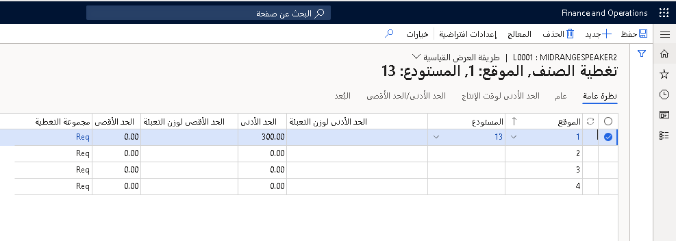

يستخدم التخطيط الرئيسي إعدادات التغطية لحساب متطلبات الصنف.

يمكنك تحديد إعدادات التغطية لمجموعة تغطية وإنشاء مجموعة تغطية تحتوي على إعدادات لجميع المنتجات المرتبطة بمجموعة التغطية. حدد **التخطيط الرئيسي > الإعداد > التغطية > إعداد التغطية** لإنشاء مجموعة تغطية.

فيما يلي معلمات مجموعة تغطية مهمة ضمن علامة التبويب **عام**.

## الأيام السالبة

بالنسبة إلى المعلمة **الأيام السالبة**، ادخل الأيام التي تمت إضافتها إلى تاريخ استحقاق الأمر. يحدد هذا الرقم الفاصل الزمني الذي يمكن خلاله استخدام إيصال مخطط مستحق لتنفيذ الأمر. 

لا يمكن استخدام إيصال مخطط يقع خارج الفاصل الزمني المحدد لتنفيذ الأمر. في هذه الحالة، سيقوم التخطيط الرئيسي بإنشاء أمر مخطط جديد. يمكنك مساواة الأيام السالبة بعدد أيام التسليم التي فات عليها موعد الاستحقاق، وخلال هذه الفترة، سيكون للصنف مستوى مخزون بالسالب. اقبل مستوى المخزون السالب قبل إنشاء أمر تنفيذ جديد. تعتمد القيمة التي تدخلها على عوامل مثل الحد الأدنى لوقت إنتاج الصنف وسياسة المؤسسة حول المخزون. 

إذا كان لأحد الأصناف وقت إنتاج طويل، يمكنك تحديد الحد الأدنى النموذجي لوقت الإنتاج كأيام سالبة. يمكنك تحديد الأيام السالبة في صفحة **تغطية الصنف** أو **مجموعات التغطية**. يعتمد السلوك الكامل للأيام السالبة على ما إذا قمت بتحديد الخيار **استخدام الأيام السالبة الديناميكية** في صفحة **معلمات التخطيط الرئيسي**.  

### مثال

بالنسبة إلى أحد الأصناف، تمت جدولة أمر الشراء للاستلام في 20 سبتمبر، كما تمت جدولة أمر المبيعات للتسليم في 19 سبتمبر. يتعين عليك تحديد ما إذا كنت تريد إنشاء أمر شراء مخطط جديد لتغطية المتطلبات، أو قبول التسليم المتأخر لأمر المبيعات في 20 سبتمبر. في حالة تعيين **الأيام السالبة** إلى **0** (صفر)، يتم إنشاء أمر شراء مخطط جديد. في حالة تعيين **الأيام السالبة** إلى رقم أكبر من صفر، فلن يتم إنشاء أمر شراء مخطط. 

بدلاً من ذلك، يتم إنشاء رسالة إجراء لأمر الشراء، ويتم إنشاء رسالة مستقبلية لأمر المبيعات.

## أيام موجبة

بالنسبة إلى المعلمة **الأيام الموجبة**، ادخل الأيام التي تم طرحها من تاريخ استحقاق الأمر. يحدد هذا الرقم الفاصل الزمني الذي يمكن خلاله استخدام إيصال مخطط مستحق لتنفيذ الأمر.

لا يمكن استخدام إيصال مخطط يقع خارج الفاصل الزمني المحدد لتنفيذ الأمر. يقوم التخطيط الرئيسي بإنشاء أمر مخطط جديد. قبل إنشاء أمر تنفيذ جديد، يمكنك مساواة الأيام الموجبة بعدد الأيام التي يمكنك فيها استخدام المخزون الحالي.

بالنسبة للأصناف التي تطلبها وتشتريها بانتظام، حدد فترة تغطية الصنف كأيام إيجابية. بالنسبة للأصناف التي تحتوي على عدد قليل من الحركات، حدد فترة تغطية مجموعة التغطية على أنها أيام موجبة. يمكنك تحديد الأيام الموجبة في صفحة **تغطية الصنف** أو **مجموعات التغطية**. 

### مثال

يحتوي أحد الأصناف على مخزون، وتمت جدولة أمر مبيعات للتسليم في غضون 90 يوماً. في حالة تعيين **الأيام الموجبة** إلى رقم أقل من 90، فسوف يتم إنشاء أمر شراء مخطط جديد. في حالة تعيين **الأيام الموجبة** إلى رقم أكثر من 90، فلن يتم إنشاء أمر شراء مخطط. ومع ذلك، لم تعد مستويات المخزون الحالية للصنف متاحة لأوامر المبيعات الجديدة.

## استخدم BOM المحدد أو متطلبات إصدار المعادلة

في حالة تحديد المعلمة **استخدم BOM المحدد أو متطلبات إصدار المعادلة**، يؤثر إصدار قائمة مكونات الصنف (BOM) على تخطيط التغطية. على سبيل المثال، بالنسبة لأمر المبيعات، يمكنك الإشارة في الحقل **رقم الصنف** أنه يجب إنتاج الأصناف المطلوبة بواسطة إصدار BOM. إذا لم يكن هذا الإصدار هو إصدار BOM النشط للصنف، فسيتم إنشاء أمر إنتاج مخطط جديد. يتم استخدام المتطلبات المشتقة من إصدار BOM المحدد، بغض النظر عن المخزون الحالي المتاح.

## علامة تبويب الاجراء

المعلمات المهمة التالية ضمن علامة التبويب **إجراء**:

-   **رسالة الإجراء** - في حالة تحديد هذا الحقل، فسيتم إعداد الأصناف لرسائل الإجراء. تقترح رسائل الإجراءات طرقاً يمكنك من خلالها تجنب المواقف غير المرغوب فيها وطرق تغيير أوامر الشراء وأوامر الإنتاج الحالية.

-   **‬‏‫الهامش المقدم‬‏‫** - في حالة تحديد هذا الحقل، يمكن أن يقترح التخطيط الرئيسي تقديم وقت الأوامر المخططة الحالية. استخدم حقل **‎‬‏‫الهامش المقدم** لتحديد الحد الأقصى لعدد الأيام بين الأوامر المتقدمة.
    على سبيل المثال، من المقرر أن يصل أمر الشراء الذي يستغرق وقت تسليم مدته خمسة أيام في 10 أغسطس. من المقرر تسليم أمر مبيعات في 6 أغسطس. يقترح التخطيط الرئيسي أن يتم تسليم أمر الشراء في 6 أغسطس بدلاً من 10 أغسطس.

-   **‬‏‫هامش التأجيل‬‏‫** - في حالة تحديد هذا الحقل، يمكن أن يقترح التخطيط الرئيسي تأجيل الأوامر المخططة الحالية. استخدم الحقل **هامش التأجيل** للحد الأقصى لعدد الأيام المسموح بتأجيلها بين المبيعات.
    على سبيل المثال، من المقرر وصول أمر الشراء في 10 أغسطس، ومن المقرر إرسال أمر المبيعات في 13 أغسطس. يقترح التخطيط الرئيسي أن يصل أمر الشراء في 13 أغسطس بدلاً من 10 أغسطس.

-   **تخفيض** - حدد هذا الحقل لتحديد ما إذا كان التخطيط الرئيسي يمكنه اقتراح تخفيض أوامر الإنتاج وأوامر الشراء وحركات الاستلام الأخرى لمنع مستويات المخزون الزائدة.

-   **زيادة** - حدد هذا الحقل لتحديد أن التخطيط الرئيسي يمكن أن يقترح زيادة أوامر الإنتاج وأوامر الشراء وحركات الاستلام الأخرى لمنع حدوث نقص في المخزون.

## ربط مجموعة تغطية بمنتج

يمكنك ربط مجموعة تغطية بمنتج. إذا كان الارتباط خاصاً بموقع أو مستودع أو بُعد منتج، فاستخدم حقل **مجموعة التغطية** في صفحة **تغطية الصنف‏‎** .

إذا كان الرابط عاماً، بغض النظر عن أبعاد المنتج، فاستخدم **مجموعة التغطية** في علامة التبويب السريعة **الخطة‬** من صفحة **تفاصيل المنتج** . إذا لم تقم بربط مجموعة تغطية بمنتج، فإن التخطيط الرئيسي يستخدم **مجموعة ‎التغطية العامة** المحددة في صفحة **معلمات التخطيط الرئيسي** بشكل افتراضي.

## تحديد إعدادات التغطية للمنتج

يمكنك إنشاء إعدادات تغطية لمنتج معين من خلال الانتقال إلى صفحة **إدارة معلومات المنتج > المنتجات > المنتجات الصادرة**. حدد المنتج ثم، في **جزء الإجراءات**، في علامة التبويب **الخطة** ، في **مجموعة التغطية**، حدد **تغطية الصنف** لفتح صفحة **تغطية الصنف** .

إذا كان المنتج مرتبطاً بالفعل بمجموعة تغطية، فيمكنك تجاوز إعدادات مجموعة التغطية باستخدام الحقل **تجاوز** . إعدادات التغطية في صفحة **تغطية الصنف** لها الأسبقية على الإعدادات في صفحة **مجموعة التغطية‏‎** .

## تحديد إعدادات التغطية للمنتج باستخدام المعالج‬

المعالج عبارة عن دليل مفصل خطوة بخطوة لمساعدتك على إعداد معلمات تغطية الصنف الأساسية. في صفحة **تغطية الصنف** ، حدد **المعالج** لفتح **معالج تغطية الصنف**.

استخدم المعالج لإنشاء إعدادات تغطية صنف جديدة أو حذف إعدادات تغطية الصنف غير الصالحة. بعد استخدام المعالج، يمكنك عرض إعدادات التغطية في صفحة **تغطية الصنف**.

## تحديد إعدادات التغطية لمجموعة أبعاد

1.  حدد **إدارة معلومات المنتجات > عام‬ > المنتجات الصادرة**.

2.  في صفحة **تفاصيل المنتج الصادر** في علامة التبويب **عام** ، في مجموعة **الإدارة‬** ، حدد الرابط **مجموعة أبعاد التخزين** .

3.  في صفحة **مجموعة أبعاد التخزين** ، حدد الحقل **‏‫خطة التغطية حسب البُعد‬** لإنشاء إعدادات التغطية لأحد الأبعاد في مجموعة أبعاد التخزين‬.
    يجب أن يتم تحديد الحقل **‏‫خطة التغطية حسب البُعد‬** لجميع أبعاد المنتج، مثل التكوين واللون والحجم والنمط.
