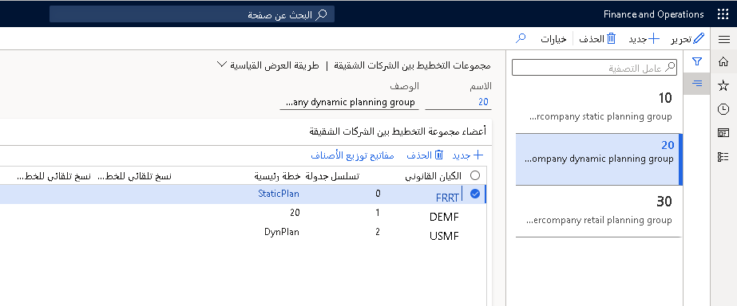

تعتمد العمليات اللوجستية لبعض الشركات على كيانات قانونية أخرى داخل المؤسسة. ويتم التعامل مع مثل هذه العمليات باستخدام المبيعات والمشتريات بين الشركات الشقيقة لأن هذه الكيانات القانونية تحتوي على مخطط حسابات منفصل.

تراجع هذه الوحدة التخطيط بين الشركات الشقيقة وتوضح كيفية تكوين التخطيط بين الشركات الشقيقة في Supply Chain Management.

## مجموعات التخطيط بين شركات شقيقة

انتقل إلى **التخطيط الرئيسي > الإعداد > مجموعات التخطيط بين الشركات الشقيقة** لتكوين تسلسل تشغيل الخطط بين الشركات الشقيقة.

 

## الخطط الرئيسية بين الشركات الشقيقة

عند إنشاء أمر مبيعات مشترك بين الشركات الشقيقة، يقوم Supply Chain Management تلقائياً بإنشاء أمر شراء مقابل. وبالمثل، يؤدي إنشاء أمر شراء مشترك بين الشركات الشقيقة إلى الإنشاء التلقائي لأمر مبيعات مشترك بين الشركات الشقيقة مقابل.

لمعرفة المزيد من المعلومات بخصوص التجارة بين الشركات الشقيقة، راجع [تكوين التجارة بين الشركات الشقيقة واستخدامها في Dynamics 365 Supply Chain Management](/training/modules/configure-use-intercompany-trade-dyn365-supply-chain-mgmt/?azure-portal=true).

تقوم الخطط بين الشركات الشقيقة بتنفيذ ما يلي:

-   عرض صافي المتطلبات عبر الكيانات القانونية.

-   الربط بين الطلب والتوريد قصير الأمد.

-   الربط بين التنبؤات وعمليات الإسقاط طويلة الأجل بين الشركات.

الخياران الخاصان بإعداد الطلب خلال السلسلة بين الشركات الشقيقة هما:

-   يمكن أن يكون لديك مطلب مخطط بين الشركات الشقيقة حيث لا يتم تلقائياً تأكيد الأوامر التي تم إنشاؤها - يتمتع هذا الخيار بميزة طلب المشروع، ولكن لا يلزم تخصيص الموارد. يمكنك استخدام هذا الخيار كأداة تخطيط لعمليات الإسقاط للشركات أو العقود المحتملة أو النفقات الرأسمالية لتوسيع القدرة الإنتاجية.

-   يمكنك تأكيد الأوامر عند إنشائها - ويتمتع هذا الخيار بميزة المساعدة في تقليل التدخل وزيادة التشغيل التلقائي. إذا رغبت في الانتقال من الحالة **مخطط** إلى الحالة **مؤكد**، يجب إعداد المعلمات لضمان تأكيد أوامر الشراء المخططة تلقائياً. لا يمكن تغيير الأوامر فيما يتعلق بالوقت أو الكمية.
    لتمكين هذه الميزة، قم بإعداد **الحد الزمني للتأكيد** في مجموعة التغطية، أو قم بإعداد **الحد الزمني للتأكيد** في الخطة الرئيسية. في حالة عدم إعداد **الحد الزمني للتأكيد**، لا يتم إنشاء أوامر شراء مشتركة بين الشركات الشقيقة تلقائياً.

## المصطلحات بين الشركات الشقيقة

تتضمن المصطلحات الهامة بين الشركات الشقيقة التي يجب عليك معرفتها ما يلي:

-   **المراحل التمهيدية** - تستخدم كمرجع نسبي في شركة أو سلسلة توريد ما للإشارة إلى الحركة في اتجاه مورد المواد الخام.

-   **المراحل النهائية** - تستخدم كمرجع نسبي في شركة أو سلسلة توريد ما للإشارة إلى الحركة في اتجاه العميل.

-   **مطلب مخطط بين الشركات الشقيقة** - مطلب مخطط لمنتج ما في إحدى الشركات بناءً على مطلب مخطط للمنتج من شركة خاصة بالمراحل النهائية.

-   **مجموعه التخطيط بين الشركات الشقيقة** - مجموعة من الكيانات القانونية التي يتم تخطيطها معاً في التخطيط الرئيسي بين الشركات الشقيقة.

يتم استخدام أوامر الشراء المخططة للأصناف التي يتم الحصول عليها من شركات أخرى داخل سلسلة التوريد بين الشركات الشقيقة لإنشاء تمثيلات للطلب في شركات المورد الخاص بالمراحل التمهيدية.

عند إنشاء طلب في المرحلة التمهيدية، يتم تحديد ما يلي باستخدام تعريف المنتج العام.

-   يتم استخدام البيانات الافتراضية للمنتج في شركة المورد الخاص بالمراحل التمهيدية.

-   تحويل الكمية من وحدة القياس المستخدمة في شركة العميل الخاص بالمراحل النهائية إلى وحدة القياس المستخدمة في شركة المراحل التمهيدية.

-   ستؤخذ في الاعتبار أبعاد التخزين لكل من شركتي المراحل التمهيدية والمراحل النهائية.

-   حساب تاريخ الطلب وفقاً لأوقات الإنتاج الخاصة بالمنتج في شركة المورد الخاص بالمراحل التمهيدية، بما في ذلك أوقات النقل.

تبحث شركة المورد الخاص بالمراحل التمهيدية دائماً في البيانات الحالية لعميل المراحل النهائية. الطلب هو الطلب المجمع من جميع الشركات التي توردها شركة المورد الخاص بالمراحل التمهيدية. الطلب الإجمالي لإحدى الشركات هو مجموع الطلب التابع والطلب المستقل الذي قد يكون موجوداً للشركة الفعلية. يتم تحديد إجمالي المكونات المطلوبة للطلب ويتم إنشاء الأوامر المخططة كالمعتاد.

للشروع في العمل في التخطيط الرئيسي بين الشركات الشقيقة، يجب أولا إعداد العلاقات التجارية بين الكيانين.

## إجراء - تشغيل التخطيط الرئيسي بين الشركات الشقيقة

لإنشاء خطة رئيسية بين الشركات الشقيقة، اتبع الخطوات التالية.

1.  افتح **التخطيط الرئيسي > تشغيل > التخطيط الرئيسي بين الشركات الشقيقة**.

2.  حدد اسم مجموعة التخطيط بين الشركات الشقيقة.

3.  ضمن **أسلوب التخطيط**، حدد الحقل **عدد تكرارات التخطيط بين الشركات الشقيقة** وحدد إحدى القيم. اكتب عدد تكرارات التخطيط الرئيسي لكل عملية تشغيل للتخطيط الرئيسي. بالنسبة للتكرارات، يتم تخطيط الشركة بين الشركات الشقيقة وفقاً للتسلسل المحدد في الحقل **تسلسل الجدولة**. من الممكن وجود 30 تكراراً بحد أقصي.

4.  حدد الخيارات المناسبة من أجل **التكرار الأول** و **التكرارات اللاحقة**.

5.  ضمن **محددات أخرى**، حدد مربع الاختيار **تعقب مدة مهمة المعالجة** بشكل اختياري لتسجيل وقت المعالجة لكل مهمة تخطيط رئيسي.

6.  حدد **عدد السلاسل** لإدخال الحد الأقصى لعدد سلاسل الجدولة المطلوب استخدامها. يعتمد الرقم الفعلي المستخدم على عدد سلاسل الدُفعات المتوفرة بين خوادم الدُفعات.

7.  حدد علامة التبويب السريعة **تشغيل في الخلفية**.

حدد خيارات الوظيفة الدفعية المناسبة. يعمل هذا التحديد على تشغيل التخطيط الرئيسي بين الشركات الشقيقة على خادم الدُفعة. لمعرفة المزيد من المعلومات حول معالجة الدُفعات، راجع [إعداد وظائف الدفعات في تطبيقات التمويل والعمليات](/training/modules/setup-batch-jobs-finance-operations/?azure-portal=true).

## تكرارات التخطيط الرئيسي بين الشركات الشقيقة

تتوفر الخيارات التالية للتكرارات عندما تقوم بإعداد التخطيط الرئيسي بين الشركات الشقيقة.

-   **عدد تكرارات التخطيط بين الشركات الشقيقة** - عدد مرات تكرار حساب التخطيط الرئيسي بين الشركات الشقيقة خلال الكيانات القانونية المضمنة في مجموعة التخطيط بين الشركات الشقيقة.

-   **التكرار الأول** - تحديد أسلوب التخطيط الرئيسي المطلوب استخدامه للتكرار الأول. الخيارات هي:

    -   **إعادة إنشاء** - لحذف الأوامر المخططة الموجودة وإنشاء أوامر مخططة جديدة استناداً إلى جميع المتطلبات المعروفة.

    -   **صافي التغيير** - لإنشاء أوامر مخططة لتغطية المتطلبات الجديدة أو المتغيرة التي حدثت منذ آخر تشغيل للتخطيط الرئيسي فقط. ولكن يتم تحديث الإجراء والتواريخ المستقبلية لجميع المتطلبات. لا يكون هذا الخيار متاحاً إلا إذا قمت بحساب الخطة الرئيسية الديناميكية.

    -   **صافي التغيير المخفض** - لإنشاء أوامر مخططة، جنباً إلى جنب مع الإجراء والتواريخ المستقبلية، لتغطية المتطلبات الجديدة أو المتغيرة التي حدثت منذ آخر تشغيل للتخطيط الرئيسي فقط. لا يكون هذا الخيار متاحاً إلا إذا قمت بحساب الخطة الرئيسية الديناميكية.

-   **التكرارات اللاحقة** - تحديد أسلوب التخطيط الرئيسي المطلوب استخدامه للتكرارات اللاحقة. الخيارات هي:

    -   **إعادة إنشاء** - لحذف الأوامر المخططة الموجودة وإنشاء أوامر مخططة جديدة استناداً إلى جميع المتطلبات المعروفة.

    -   **صافي التغيير** - لإنشاء أوامر مخططة لتغطية المتطلبات الجديدة أو المتغيرة التي حدثت منذ آخر تشغيل للتخطيط الرئيسي فقط. ولكن يتم تحديث الإجراء والتواريخ المستقبلية لجميع المتطلبات. لا يكون هذا الخيار متاحاً إلا إذا قمت بحساب الخطة الرئيسية الديناميكية.

    -   **صافي التغيير المخفض** - لإنشاء أوامر مخططة، جنباً إلى جنب مع الإجراء والتواريخ المستقبلية، لتغطية المتطلبات الجديدة أو المتغيرة التي حدثت منذ آخر تشغيل للتخطيط الرئيسي فقط. لا يكون هذا الخيار متاحاً إلا إذا قمت بحساب الخطة الرئيسية الديناميكية.

يمكنك الوصول إلى نظرة عامة حول جميع التوريدات والطلبات بين الشركات الشقيقة في خطة رئيسية محددة لكيان قانوني محدد من خلال الانتقال إلى **التخطيط الرئيسي > الاستعلامات والتقارير > التخطيط الرئيسي بين الشركات الشقيقة > العرض والطلب بين الشركات الشقيقة**. تعرض هذه الصفحة جميع الأوامر، المخططة والمؤكدة، التي تتمتع بها الشركة، إلى أو من شركات المراحل النهائية أو المراحل التمهيدية.
