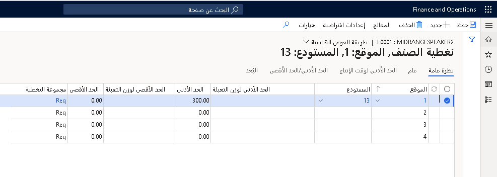
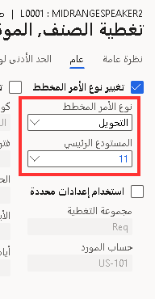

توضح هذه الوحدة كيفية إدارة الأوامر المخططة. بالإضافة إلى ذلك، فإنها تصف كيفية تحديث حالة الأوامر المخططة وتأكيدها وتصفية الأوامر المخططة التي لها الحالة نفسها مثل الأمر المخطط المحدد.

يقوم التخطيط الرئيسي بإنشاء أوامر شراء مخططة وأوامر تحويل مخططة وأوامر إنتاج مخططة (منفصلة ودُفعة) وأوامر كانبان مخططة.

## أوامر شراء مخططة

يتم استخدام أوامر الشراء لإدارة طلب البضائع والخدمات من الموردين واستلامها. قبل متابعة الإنتاج، تقوم معظم الشركات بالتخطيط لتقديم التوريد، ويكون ذلك عادة مرة واحدة أسبوعياً على الأقل، لحساب عدد أوامر الإنتاج وأوامر الشراء المطلوب تشغيلها لاستيفاء طلب المبيعات لهذا الأسبوع.

تقوم أوامر الشراء بتوفير المكونات المطلوبة، وفقاً لقائمة BOM للإنتاج، وذلك لإنتاج الأصناف النهائية. في سيناريوهات التوزيع المباشر، يتم شحن مواد الشراء إلى العملاء أو متاجر البيع بالتجزئة. في بعض الحالات، قد يتم توزيع المنتجات كبضائع في أثناء عملية الاستلام للمساعدة في تقليل معالجة المنتجات داخل المستودع.

تكون أوامر الشراء المخططة فريدة استناداً إلى خصائص متعددة:

-   يمكنك تلقائياً إنشاء أمر شراء من أمر مبيعات، أو يمكن إنشاء أوامر شراء تلقائياً بواسطة التخطيط الرئيسي.

-   ينتج عن إنشاء أوامر شراء مخططة أمر شراء مخطط مقترح يتضمن معلومات الكمية المشتقة من المتطلبات والحد الأدنى والأقصى والمضاعف وكميات الأمر القياسية.

-   يتم حساب تاريخ الأمر وتواريخ التسليم. تضع الخطة الرئيسية في الاعتبار أوقات الإنتاج اللازمة للموردين لشحن الأصناف إلى العملاء والوقت المطلوب لعملية الإنتاج وأوقات النقل من المستودع.

-   يمكن إدارة الأوامر المخططة من الصفحة **أوامر الشراء المخططة** .

يتم تحويل الأمر المخطط المعتمد في حالته الحالية إلى حساب التخطيط الرئيسي التالي. يمكنك النقر بزر الماوس الأيمن فوق الأمر المخطط الذي له حالة ما والتصفية للحصول على الأوامر المخططة الأخرى التي لها الحالة نفسها. ويعد ذلك مفيداً، على سبيل المثال، إذا كنت ترغب في التصفية للحصول على جميع الأوامر المخططة التي تكون لها الحاصة **معتمد** ثم تأكيدها.

**لإنشاء أوامر شراء مخططة، اتبع الخطوات التالية:**

1.  افتح **التخطيط الرئيسي > التخطيط الرئيسي > الأوامر المخططة > جديد**.
2.  حدد **نوع الأمر المخطط**.
3.  حدد **خطة**.
4.  حدد **رقم الصنف**.
5.  حدد **إنشاء**.
6.  افتح **التدبير وتحديد الموارد > أوامر الشراء > أوامر الشراء المخططة > أوامر الشراء المخططة**.
7.  قم بتعيين **أمر شراء** من أجل **نوع الأمر المخطط**.
8.  حدد **خطة**.
9.  حدد **رقم الصنف**.
10. حدد **إنشاء**.
11. افتح **التدبير وتحديد الموارد > أوامر الشراء > أوامر الشراء المخططة > أوامر الشراء المخططة**.
12. حدد سطور الأمر المخطط التي ترغب في تجميعها في أمر مخطط واحد.
13. حدد الزر **تجميع** في **الأمر المخطط**.
14. حدد **موافق** في **تجميع الأوامر المخططة المحددة**. يتم تجميع سطور الأمر المخطط المحددة في أمر مخطط واحد. يأخذ هذا الأمر المخطط تاريخ التسليم من سطر الأمر المخطط الذي تم تحديده عند تشغيل الوظيفة.

**لتقسيم كمية الأمر المخطط، استخدم الإجراء التالي:**

1.  حدد **التخطيط الرئيسي > عام > الأوامر المخططة**.
2.  حدد سطر الأمر المخطط الذي ترغب في تقسيمه.
3.  حدد الزر **تقسيم** في علامة التبويب **الأمر المخطط** .
4.  أدخل الكمية التي ترغب في نقلها إلى أمر مخطط ثانٍ، ثم حدد تاريخ تسليم باستخدام التقويم المنسدل.
5.  حدد **موافق**.
6.  يقوم البرنامج بإنشاء أمرين مخططين: أمر مخطط بالكمية وتاريخ التسليم اللذين حددتهما، وأمر مخطط آخر بالكمية المتبقية وتاريخ التسليم الأصلي. يمكنك استخدام هذه الوظيفة للسماح بالتسليم الجزئي من أحد الموردين.

يمكنك التحديد من بين مجموعة متنوعة من المعلمات للتحكم في كيفية تجميع أوامر الشراء المخططة وتأكيدها.

-   **تجميع المورد** - حدد هذا الخيار لتجميع أوامر الشراء المخططة معاً لإنشاء أمر شراء واحد لكل مورد عند التأكيد. بدلاً من ذلك، يمكنك إنشاء أمر شراء واحد ببند واحد لكل أمر مخطط.

-   **تجميع حسب مجموعة المشترين** - حدد هذا الخيار لتجميع أوامر الشراء المخططة معاً لإنشاء أمر شراء واحد يضم مجموعة المورد والمشتري. لاستخدام هذا الخيار، يجب عليك أيضاً تحديد الخيار **تجميع المورد**.

-   **التجميع حسب اتفاقية الشراء** - حدد هذا الخيار لدمج أوامر الشراء المخططة وإنشاء أمر شراء واحد لكل اتفاقية شراء. إذا حددت هذا الخيار، فسيتم تحديد الخيار **البحث عن اتفاقيات الشراء** تلقائياً.

-   **تجميع حسب الفترة** - حدد الفترة التي تريد خلالها تجميع أوامر التحويل المخططة.

-   **البحث عن اتفاقيات الشراء** - حدد هذا الخيار لتمكين البحث التلقائي عن اتفاقيات الشراء أثناء تأكيد الطلبات المخططة. إذا تم العثور على اتفاقية شراء مطابقة، سيتم تطبيق معلومات مثل السعر والخصم على بنود أمر الشراء.

يمكنك تأكيد الطلبات المخططة عن طريق تحديد **تأكيد**. يمكنك تأكيد الأوامر المخططة التالية:

-   من وحدة التخطيط الرئيسي في الصفحة **الأمر المخطط**. تعرض هذه الصفحة جميع الأوامر المخططة، بغض النظر عن نوعها.

-   من وحدة التدبير وتحديد الموارد في الصفحة **الأمر المخطط**. تتم تصفية هذه الصفحات لإظهار أوامر الشراء المخططة فقط.

يجب عليك تأكيد الأمر المخطط قبل أن تتمكن من معالجته.

1.  افتح **التخطيط الرئيسي > عام > الأوامر المخططة**.
2.  حدد الأوامر المخططة لتأكيدها.
3.  في جزء الإجراء، حدد علامة التبويب **الأمر المخطط**.
4.  في المجموعة  **معالجة** ، حدد الزر **تأكيد**.
5.  حدد **موافق**.
6.  يمكنك عرض الأوامر المخططة المؤكدة في الوحدات الخاصة بها.
حدد **التدبير وتحديد الموارد > أوامر الشراء > أوامر الشراء المخططة > أوامر الشراء المخططة**.

في بعض الحالات، قد تحتاج إلى تغيير نوع الأمر المخطط.

على سبيل المثال، اقترح التخطيط الرئيسي أن تقوم بشراء 100 قطعة جديدة من صنف معين للمستودع 20. يحتوي المستودع 10 حالياً على بعض هذه الأصناف في المخزون، ولن تكون هناك حاجة لشرائها في الأسابيع القليلة المقبلة. لذلك، يمكنك تغيير أمر الشراء المخطط ليكون أمر تحويل مخططاً.

تقترح رسائل الإجراءات طرقاً يمكنك من خلالها تجنب المواقف غير المرغوب فيها وطرق تغيير أوامر الشراء وأوامر الإنتاج الحالية.

1.  افتح **التدبير وتحديد الموارد > أوامر الشراء > أوامر الشراء المخططة > أوامر الشراء المخططة**.
2.  ابحث عن صنف مخطط.
3.  قم بالتمرير لرؤية رسائل الإجراءات.

يمكنك استخدام عدة طرق عرض لإدارة أوامر الشراء المخططة:

-   افتح **التخطيط الرئيسي> التخطيط الرئيسي> الأوامر المخططة**

-   افتح **التدبير وتحديد الموارد > أوامر الشراء > أوامر الشراء المخططة > أوامر الشراء المخططة**

-   افتح **التدبير وتحديد الموارد > أوامر الشراء > أوامر الشراء المخططة > أوامر الشراء المخططة** مع تاريخ الأمر اليوم أو متأخر.

## أوامر التحويل المخططة

تُستخدم أوامر التحويل للتعامل مع الأصناف التي يتم نقلها بين المستودعات داخل أو عبر مواقع جغرافية مختلفة في الشركة نفسها.

على سبيل المثال، لزيادة المساحة والكفاءة في طابق الإنتاج، يتم تخزين المواد الخام في مستودع منفصل ويتم نقلها إلى مستودع طابق الإنتاج بناءً على متطلبات الإنتاج. يساعد ذلك في التخلص من الحاجة إلى وجود موظفين في طابق الإنتاج لعد الأصناف والعثور عليها في المستودع ويسمح لهم بالتركيز على عملية التصنيع.

باستخدام مجموعة تغطية الصنف، يمكنك تجاوز المعلمات أو تعيينها لجعل التخطيط الرئيسي ينشئ أوامر تحويل مخططة استناداً إلى إعدادات التغطية.

على سبيل المثال، في الصورة التالية، تخطط **USMF** للحصول على 300 كمية كحد أدنى من الصنف L0001 لتكون متاحة في المستودع 13 للموقع 1.

 

ومع ذلك، تتطلب **USMF** أن يتم تخطيط L0001 للتحويل من المستودع 11 للموقع 1. لذلك، تحتاج إلى تجاوز تغطية الصنف.
في مجموعة **تغيير نوع الأمر المخطط**، قم بتحديث الحقل **نوع الأمر المخطط** إلى **تحويل** والحقل **المستودع الرئيسي** إلى 11 للتحويل المخطط الذي سيتم إنشاؤه عند تشغيل التخطيط الرئيسي.

 

عند تأكيد أوامر التحويل المخططة، فإنها تصبح أوامر تحويل. عند تأكيد أكثر من أمر تحويل مخطط واحد بين المستودع ذاته، يتم أخذ تاريخ الشحن وتاريخ الاستلام من تاريخ أول أمر وآخر تاريخ تسليم لجميع أوامر التحويل المخططة.
بالإضافة إلى ذلك، يمكنك تعيين أمر تحويل مخطط لأمر تحويل قبل تأكيد أمر التحويل المخطط.

في الصفحة **محددات التخطيط الرئيسي**، يمكنك تحديد ما إذا كنت ترغب في تجميع أوامر التحويل. استخدم الحقل **تجميع حسب الفترة** لتحديد الفترة التي ترغب في تجميع أوامر التحويل المخططة خلالها.

في بعض الحالات، قد تحتاج إلى تغيير نوع الأمر المخطط. علي سبيل المثال، يقترح التخطيط الرئيسي أن تقوم بتحويل 100 قطعة جديدة من صنف ما من المستودع 20. ومع ذلك، يحتاج المستودع 20 إلى استخدام تلك الأصناف وتقرر أنه سيكون من الأفضل شراء المزيد من هذا الصنف للمستودع الخاص بك. يمكنك تغيير نوع الأمر المخطط إلى **أمر شراء مخطط** لإنشاء أمر شراء بدلاً من أمر تحويل.

## أوامر الإنتاج المخططة

تُستخدم أوامر الإنتاج لإدارة تحويل المواد المشتراة إلى أصناف مصنّعة. توجه أوامر الإنتاج (وظيفة أو أوامر عمل) العمل عبر مرافق مختلفة (مراكز العمل أو الأجهزة) في صالة الإنتاج.

تُعد أوامر الإنتاج هي المكونات المركزية لوظيفة التصنيع الخاصة بالبرنامج وتحتوي على المعلومات التالية:

-   المنتجات المخططة للتصنيع

-   المواد المطلوبة لأوامر الإنتاج المخططة

-   المنتجات التي تم تصنيعها للتو

-   المواد التي تم تحديدها بالفعل

-   المنتجات التي تم تصنيعها في الماضي

-   المواد التي تم استخدامها في عمليات التصنيع السابقة

تكون أوامر الإنتاج المخططة فريدة بسبب الخصائص التالية:

-   يمكنك تلقائياً إنشاء أمر إنتاج مخطط من أمر مبيعات، أو يمكن إنشاؤه بواسطة التخطيط الرئيسي.

-   تشبه أوامر الإنتاج المخططة أوامر الإنتاج الصادرة وتوفر مدخلات لتخطيط متطلبات القدرة الإنتاجية من خلال إظهار متطلبات السعة الإجمالية حسب مركز العمل أو مركز الأجهزة.

-   يمثل أمر الإنتاج المخطط أفضل تقدير لحمل العمل المستقبلي لمركز العمل أو حمل مركز الأجهزة استناداً إلى المعلومات المتاحة. عادةً ما يتم إنشاء أوامر الإنتاج المخططة من التخطيط، ولكن يمكن أيضاً إنشاؤها يدوياً. نظراً لأن أوامر الإنتاج المخططة يتم محوها أثناء أجيال التخطيط اللاحقة، فإن الإنشاء اليدوي ليس عملياً.

