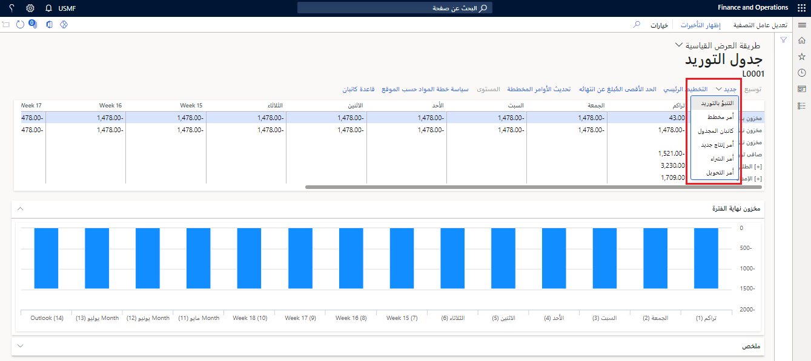

تعرض صفحة **جدول التوريد** نظرة عامة شاملة على العرض والطلب لمنتج أو مجموعة منتجات. تتم تصفية المعلومات حسب الموقع والمخطط الرئيسي والفترات. يمكنك أيضاً استخدام الصفحة لإنشاء أوامر جديدة وتعديل الأوامر المخططة الحالية وتشغيل التخطيط الرئيسي.

يمكنك فتح صفحة **جدول التوريد** بأي من الطرق التالية:

- انتقل إلى **التخطيط الرئيسي > التخطيط الرئيسي > جدول التوريد**. في مربع الحوار **تعديل** عامل التصفية، حدد الخطة والمنتج الذي تبحث عنه عن طريق إدخال قيم عامل التصفية في الحقول المتوفرة. (في بقية هذه الوحدة، يُشار إلى مجموعة قيم التصفية التي تدخلها باسم "عامل التصفية" أو "عامل التصفية الحالي".) عند الانتهاء، حدد **موافق**.
- انتقل إلى **إدارة معلومات المنتج > المنتجات > المنتجات الصادرة**. حدد منتجاً أو افتحه. بعد ذلك، في جزء الإجراءات، في علامة التبويب **الخطة**، في مجموعة **عرض**، حدد **جدول التوريد**.
- انتقل إلى **التخطيط الرئيسي > الإعداد > التنبؤ بالطلب > مفاتيح توزيع الصنف**. حدد مفتاح توزيع الصنف الذي يتم استخدامه كمجموعة منتجات. ثم، في جزء الإجراءات، حدد **جدول التوريد**.
- افتح **التخطيط الرئيسي > التخطيط الرئيسي > الأوامر المخططة**. حدد أو افتح أمراً مخططاً. بعد ذلك، في جزء الإجراءات، في علامة التبويب **عرض**، في مجموعة **عرض**، حدد **جدول التوريد**.

> [!NOTE]
> عندما تفتح صفحة **جدول التوريد** من منتج أو مجموعة منتجات أو أمر مخطط، لن تضطر إلى إدخال قيم التصفية. سيستخدم النظام نموذج الفترة الافتراضي.

## استخدم صفحة جدولة التوريد

تتكون صفحة **جدول التوريد** من قسم علوي، وعلامة التبويب السريعة **مخزون نهاية الفترة**، وعلامة تبويب سريعة إضافية تصبح مرئية، استناداً إلى السطر المحدد في القسم العلوي وجزء مربع الحقائق. (لفتح جزء مربع الحقائق وعرض مربع الحقائق، حدد **معلومات ذات صلة** على الحافة اليمنى من الصفحة.)

### القسم العلوي
يحتوي القسم العلوي من صفحة **جدول التوريد** على شبكة تعرض البيانات التالية لمنتج أو مجموعة منتجات. يتم تقسيم هذه البيانات حسب الفترات المحددة بواسطة قيمة **قالب الفترة** من عامل التصفية.

- **مخزون بدء الفترة** – يعرض هذا السطر رصيد المخزون المتوقع في بداية الفترة في حالة حدوث جميع الطلبات في النظام.
- **مخزون نهاية الفترة**– يعرض هذا السطر رصيد المخزون المتوقع في نهاية الفترة في حالة حدوث جميع الطلبات في النظام.
- **المخزون المربوط بنهاية الفترة** – يعرض هذا السطر مقدار المخزون في نهاية الفترة المرتبط بالطلب المستقبلي.
- **صافي العرض للفترة** – يوضح هذا الخط الفرق بين العرض والطلب في الفترة.
- **الحد الأدنى للمخزون** – تعرض هذه العقدة مخزوناً آمناً لمنتج أو مجموعة منتجات. لتوسيع هذه العقدة أو طيها، حددها، ثم حدد **توسيع** أو **طي** على شريط الأدوات. تظهر هذه العقدة فقط عندما يكون هناك مخزون أمان للمنتج أو مجموعة المنتجات.
- **الطلب‎** – تُظهر هذه العقدة الطلب على منتج أو مجموعة منتجات. يتم تجميع الطلب حسب نوع الحركة. لتوسيع هذه العقدة أو طيها، حددها، ثم حدد **توسيع** أو **طي** على شريط الأدوات. تتضمن أنواع حركة الطلب المبيعات والتحويلات ودفاتر يومية المخزون. تظهر هذه العقدة فقط عندما يكون هناك طلب على المنتج أو مجموعة المنتج.
- **التوريد** – تعرض هذه العقدة العرض لمنتج أو مجموعة منتجات. يتم تجميع التوريد حسب نوع الحركة. لتوسيع هذه العقدة أو طيها، حددها، ثم حدد **توسيع** أو **طي** على شريط الأدوات. تشمل أنواع حركات التوريد الإنتاج والشراء والتحويلات. تظهر هذه العقدة فقط عندما يكون هناك توريد للمنتج أو مجموعة المنتج.

تعتمد العديد من أزرار شريط الأدوات المتاحة، وعرض مربع الحقائق، وعرض علامات تبويب سريعة على اختياراتك في القسم العلوي. عادة، ستختار نوع الحركة عن طريق تحديد أحد الصفوف ضمن عقدة **التوريد** أو **الطلب**. ستختار بعد ذلك فترة عن طريق تحديد عمود معين للصف المحدد.

يوفر شريط الأدوات أعلى الشبكة في القسم العلوي من صفحة **جدول التوريد** الأزرار التالية:

- **توسيع/طي** – توسيع أو تصغير العقدة المحددة، مثل عقدة **الطلب** وعقدة **التوريد** وعقدها الفرعية. (تُظهر العقد البادئة [+] أو [-] للإشارة إلى ما إذا كانت مطوية أو موسعة حالياً.)
- **جديد** – افتح قائمة حيث يفتح كل أمر بدوره مربع حوار أو صفحة تتيح لك إضافة نوع معين من الأصناف للاختيار. تشمل الأوامر المتاحة **تنبؤ التوريد**، **الأمر المخطط**، **كانبان المجدول**، **أمر الإنتاج الجديد**، **أمر الشراء**، و **أمر التحويل**.
- **التخطيط الرئيسي** – تشغيل التخطيط الرئيسي. يظهر مربع حوار، حيث يمكنك تحديد الخطة للتشغيل. بشكل افتراضي، يتم تعيين حقل **الخطة الرئيسية** لمطابقة عامل التصفية الحالي.
- **‏‫‏‫الحد الأقصى‬. التقرير كمنتهى** – افتح **‏‫‏‫الحد الأقصى‬. التقرير كمنتهى** منتهية للمنتج المحدد في عامل التصفية الحالي.
- **تحديث الأوامر المخططة** - افتح صفحة **الأوامر المخططة**، التي تعرض الأوامر المخططة للمنتج أو مجموعة المنتجات المحددة في عامل التصفية الحالي.
- **المستوى** – توزيع الأوامر المخططة وفقاً للإعدادات من مربع الحوار الذي يظهر.
- **سياسة خطة المواد حسب الموقع** – افتح صفحة **تغطية الصنف** للمنتج المحدد في الفلتر الحالي.
- **قاعدة كانبان** – افتح صفحة **قواعد كانبان** للمنتج المحدد في الفلتر الحالي.

### علامات تبويب سريعة

يمكن أن تحتوي صفحة **جدول التوريد** على علامات التبويب السريعة التالية:

- **مخزون نهاية الفترة** – تعرض علامة التبويب السريعة هذه بيانات مخزون نهاية الفترة بتنسيق رسومي.
- **ملف تعريف التوريد** – تعرض علامة التبويب السريعة هذه بيانات التوريد بتنسيق رسومي. يصبح مرئياً عند تحديد عقدة **التوريد** أو خطاً أسفلها في القسم العلوي.
- **الملخص** – تعرض علامة التبويب السريعة تفاصيل موجزة تتعلق بنوع الحركة التي حددتها في القسم العلوي. على سبيل المثال، إذا حددت المبيعات ضمن عقدة **الطلب**، فستعرض علامة التبويب السريعة هذه الحقول المتعلقة بأوامر المبيعات، مثل **بنود أوامر المبيعات المطلوبة** أو **المبلغ الإجمالي**. إذا حددت أوامر الإنتاج ضمن العقدة الفرعية **الإنتاج** لعقدة **التوريد** فستعرض علامة التبويب السريعة الحقول المرتبطة بأوامر الإنتاج، مثل **أوامر الإنتاج المجدولة** أو **إجمالي المقرر**. تعتمد قيم الحقل على الفترة التي حددتها في القسم العلوي.
- **[نوع الحركة] [الفترة]** – تعرض علامة التبويب السريعة هذه أوامر لنوع الحركة والمدة التي حددتها في القسم العلوي. يعكس اسم علامة التبويب السريعة هذه التحديدات. على سبيل المثال، يمكن تسميته **تراكم أوامر المبيعات** أو **أوامر الإنتاج - الأسبوع 37**.

### جزء الإجراءات
الأزرار التالية متوفرة في جزء الإجراءات:

- **تعديل عامل التصفية** – افتح مربع الحوار **تعديل عامل التصفية**، حيث يمكنك تحديث قيم التصفية ثم إعادة فتح صفحة **جدول التوريد**، والتي تعكس إعدادات التصفية المحدثة.
- **عرض التأخيرات** – قم بتمييز الأسطر ذات الصلة في القسم العلوي إذا كان هناك طلب متأخر لنوع الحركة هذا.

### جزء مربع الحقائق
لفتح جزء مربع الحقائق وعرض مربع الحقائق، حدد **معلومات ذات صلة** على الحافة اليمنى من الصفحة. تتوفر مربعات الحقائق التالية في صفحة **جدول التوريد**:

- **تفاصيل الصنف** – يعرض مربع الحقائق هذا المعلومات الأساسية حول المنتج المحدد في عامل التصفية الحالي. يكون فارغاً إذا حددت مجموعة منتجات في التصفية.
- **الإجراءات** – يعرض مربع الحقائق هذا إجراءات لأوامر نوع الحركة التي حددتها في القسم العلوي.
- **التأخيرات** – يعرض مربع الحقائق هذا التأخيرات لأوامر نوع الحركة التي حددتها في القسم العلوي.

## قم بتنفيذ الإجراءات من صفحة جدول التوريد
يوفر الزر **جديد** الإمكانات التالية:

- **التنبؤ بالتوريد**- يفتح نموذج توقعات التوريد القياسي. يستخدم هذا النموذج لإنشاء وتزويد بنود التنبؤ للأصناف ومجموعات الأصناف وحسابات الموردين ومجموعات الموردين.
- **أمر مخطط** - أنشئ أمراً مخططاً جديداً.
- **كانبان المجدول** - أنشئ كانبان مجدولاً جديداً. 
- **أمر الإنتاج** - إنشاء أمر إنتاج جديد. سيتم فتح صفحة **أمر الإنتاج** القياسية.
- **أمر الشراء**  - إنشاء أمر شراء جديد. سيتم فتح صفحة **أمر الشراء** القياسية.
- **أمر التحويل** - أنشئ أمر تحويل جديد. سيتم فتح صفحة **أمر النقل** القياسية.

> [!div class="mx-imgBorder"]
> 
