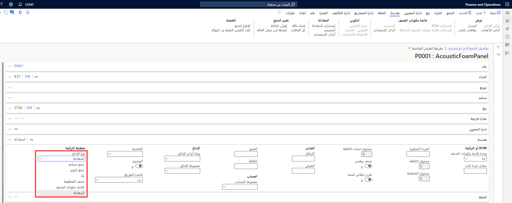

يجب تحديد أنواع الإنتاج ذات الصلة في حقل **نوع الإنتاج** في قسم **الهندسة** صفحة **تفاصيل المنتج الصادر**.

تصف القائمة التالية أنواع الإنتاج المختلفة:

-   **المعادلة** - توضح المواد والمكونات ونتائج عملية محددة في عملية التصنيع. توضح المعادلة عملية المعالجة بشكل كامل بالإضافة إلى المسار المتطابق لعملية التصنيع. تستخدم المعادلات لتخطيط وإنتاج المنتجات في عملية التصنيع.

    تتألف المعادلة من المكونات والكميات اللازمة لإنتاج كمية محددة من صنف مركب بناءً على المهمة التي تقوم بتنفيذها، يمكنك الوصول إلى وظائف المعادلة من إدارة المستودعات والمخزون أو إدارة معلومات المنتج.

-   **BOM** - توضح المكونات المطلوبة لإنتاج منتج. قد تكون المكونات الأساسية مواد خام، منتجات نصف مصنعة أو مقادير. يمكن الرجوع إلى الخدمات في BOM، في بعض الحالات. مع ذلك، تصف BOMs عادةً الموارد المادية المطلوبة.

-   **المنتج المساعد** - العناصر التي يتم إنتاجها مع صنف مركب أو غيرها من المنتجات المشتركة الأخرى. تُنتج هذه المنتجات متلازمةً في عملية تصنيع الصنف الآخر. يمكن تخزين أنواع من المنتج المساعد واستخدامها في عملية إنتاج لاحقة أو بيعها من أجل الربح.

-   **منتج ثانوي** - أصناف تنتج أثناء عملية إنتاج صنف مركب أو المنتجات المساعدة. وتكون هذه المنتجات مضمنة في عملية التصنيع ولا يمكن تجنبها. يتم تخزين المنتجات الثانوية في المخزون ولكن عادةً لا تكون لها قيمة مخزون. وعادةً ما يتم التخلص منها في عملية الإنتاج أو بيعها بخسارة

-   **صنف التخطيط** المنتجات التي لا تُخزن ولكنها تستخدم كحاوية لإيواء المنتجات المساعدة التي تُنتج دائماً معاً.

-   **غير** - إذا كان المنتج لا ينتمي إلى أي من الأنواع الأخرى.

**إدارة معلومات المنتج > المنتجات> المنتجات الصادرة > الهندسة** علامة التبويب السريعة. 

