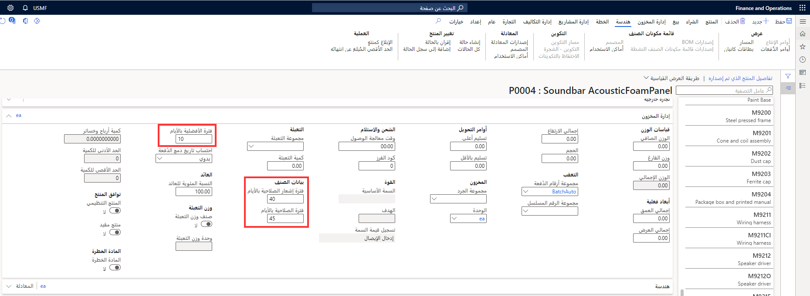

يمكنك إدخال الإعداد المتعلق بفترة الصلاحية التي يمكن تحديدها ضمن مجموعة الحقول **بيانات الصنف** في قسم **إدارة المخزون** الخاص بالمنتج. يتضمن الإعداد المرتبط بفترة الصلاحية إعداد المعلمات التالية:

-   **فترة إشعار الصلاحية بالأيام** - تعيين فترة إعادة الاختبار من تاريخ تصنيع الصنف.

-   **فترة الصلاحية بالأيام** - تعيين تاريخ انتهاء الصلاحية للدفعات. تحدد هذه المعلمة عدد الأيام التي يجب أن تمر من تاريخ التصنيع قبل انتهاء صلاحية دُفعة من المنتجات.

-   **فترة الأفضلية بالأيام** - تعيين تاريخ قبل تاريخ انتهاء الصلاحية حيث يجب استهلاك المنتج للحصول على أفضل جودة.

الغرض من الإعداد المرتبط بفترة الصلاحية هو حساب تاريخ انتهاء فترة الصلاحية للدفعات. يتم اعتبار تاريخ انتهاء الصلاحية في سيناريوهات الحجز والتخطيط الرئيسية ويتم استخدامه أيضا للإبلاغ عن المجموعات التي توشك صلاحيتها على الانتهاء.

**إدارة معلومات المنتج > المنتجات > المنتجات الصادرة > إدارة المخزون** 

