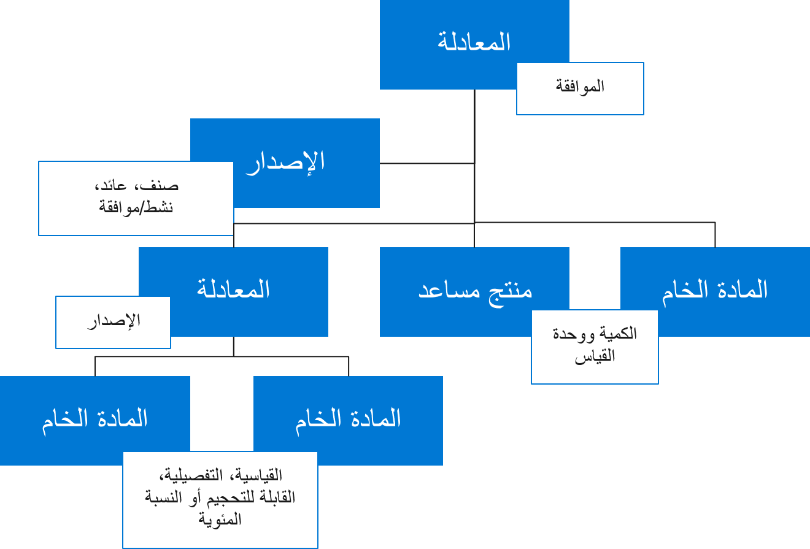
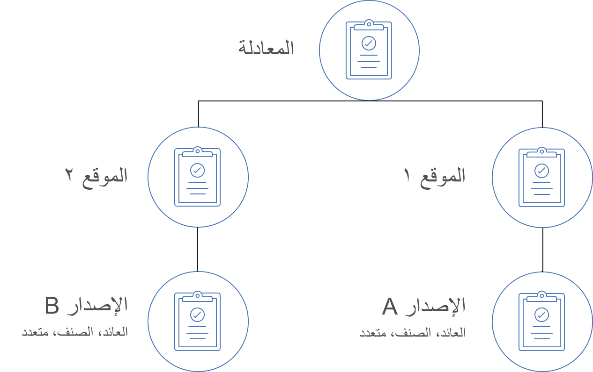

تحدد المعادلة المواد والمكونات والنتائج الخاصة بعملية معينة في التصنيع التحويلي. وإلى جانب المسار المقابل، تحدد المعادلة العملية بأكملها ويتم استخدامها لتخطيط المنتجات وإنتاجها في التصنيع التحويلي. 

لأضافه سطور إلى إحدى المعادلات، يجب تعيين المعادلة إلى إصدار معادلة واحد على الأقل. يمثل إصدار المعادلة الارتباط الموجود بين المنتج الذي يتم إصداره والمعادلة. ولا يكون إصدار المعادلة صالحاً للإنتاج إلا إذا وافق عليه موظف مخول. لاستخدام معادلة للتخطيط الرئيسي، يجب ربطها بإصدار معادلة نشط ومعتمد. يمكن أن تحتوي المعادلة الواحدة على عدة إصدارات للمعادلة، ومع ذلك، فإن أي تغيير يتم في سطور المعادلة سيؤثر في جميع إصدارات المعادلة.

ويمكن أن يكون لكل معادلة أو صنف تخطيط عدة معادلات وإصدارات معادلة معتمدة. يمكن أن تحتوي كل معادلة على سطور معادلة مختلفة، ومنتجات مساعدة ومنتجات ثانوية، وتعريفات التكاليف، وتعريفات حجم الدُفعة، وما إلى ذلك. من بين إصدارات المعادلة المعتمدة المتعددة هذه، يمكن أن يكون لديك العديد من إصدارات المعادلة النشطة إذا لم تتداخل الإصدارات المختلفة في التواريخ و/أو المواقع و/أو نطاقات الكمية الفعالة.

 

تتألف المعادلة من المكونات والكميات اللازمة لإنتاج كمية محددة من صنف مركب بناءً على المهمة التي تقوم بتنفيذها، يمكنك الوصول إلى وظائف المعادلة من إدارة المخزون والمستودعات أو وحدات إدارة معلومات المنتج في Supply Chain Management.

## المعادلات وسطور المعادلات

تتكون المعادلة من سطر واحد أو أكثر من سطور المعادلة التي تحدد المكونات أو الأصناف التي تشكل المعادلة. يمكن أن يحتوي سطر المعادلة على أصناف قائمة مكونات العنصر (BOM) أو أصناف مركبة أو أصناف وزن التعبئة أو المنتجات المساعدة أو المنتجات الثانوية. نظراً لاستخدام العديد من الأصناف في منتجات متعددة، يمكن استخدام أحد الأصناف في أكثر من معادلة واحدة.

وأحد الأمثلة على المعادلة هو معادلة البسكويت برقائق الشوكولاتة. تستخدم المكونات الخاصة بهذه المعادلة عدة أسطر، مثل الدقيق والسكر والبيض والزبد ورقائق الشوكولاتة. تحتوي معادلة البسكويت برقائق الشوكولاتة على المكونات التي يُرجح استخدامها في المعادلات الأخرى.
في أثناء صنع البسكويت برقائق الشوكولاتة، قد يكون لديك بقايا طعام، مثل الفتات، أو قد يتم خبز بعض البسكويت بدرجة مفرطة أو فير مخبوز بدرجة كافية. يمكن إعداد هذه الأصناف كمنتجات مساعدة أو منتجات ثانوية، بناءً على خصائص الإخراج. إذا كان من الممكن إعادة استخدام الصنف في عمليات أخرى أو بيعه (إذا كان يمثل قيمة)، يمكنك إعداد الصنف كمنتج مساعد.
وإذا كان الصنف لا يمثل قيمة أو إذا كانت هناك تكلفة مرتبطة بالتخلص من الإخراج (تكلفة غير محسوبة على العميل)، يمكنك إعداد الصنف كمنتج ثانوي.

عند إنشاء سطر معادلة، يمكنك استخدام نوع السطر للإشارة إلى كيفية تعامل النظام مع السطر عند تشغيل التخطيط الرئيسي وإنتاج أوامر الدُفعة. يعطي كل نوع من أنواع السطور نتيجة مختلفة. يصف الجدول التالي أنواع السطور التي يمكنك تحديدها.

  | نوع السطر     |  الوصف|
 | ------------- | ------------- |
 | الصنف            |   حدد **الصنف** عندما يكون الصنف مادة خام أو صنفاً شبه نهائي تم انتقاؤه من المخزون أو عندما يكون الصنف عبارة عن خدمة.|
 | صنف وهمي         | حدد **صنف وهمي** عندما ترغب في تحديد إجمالي المكونات المطلوبة للأصناف المركبة منخفضة المستوى الموجودة في سطر المعادلة. عندما تقوم بتقدير أمر الدُفعة وتم تحديد إجمالي المكونات المطلوبة للأصناف المركبة، يتم سرد أصناف المكونات كسطور معادلة في أمر الدُفعة. بالإضافة إلى ذلك، تتم إضافة المسارات المقابلة إلى مسار الإنتاج. يتم تحديد إجمالي المكونات المطلوبة للأصناف المركبة باستخدام التكوين الحالي. عند استخدام نوع السطر **صنف وهمي،** يمكنك التعامل مع تكوينات القياس والإنتاج التي تحدث في مستويات المعادلة المختلفة. إذا قمت بتحديد **صنف وهمي** لمنتج ما في علامة التبويب السريعة **مهندس** في الصفحة **تفاصيل المنتج الذي تم إصداره** ثم استخدمت هذا المنتج في إحدى المعادلات، يتم تغيير نوع السطر الخاص بسطر المعادلة إلى **صنف وهمي**. لا يمكنك تحديد **صنف وهمي** لصنف وزن التعبئة أو للأصناف التي يكون فيها نوع الإنتاج **منتج مساعد** أو **منتج ثانوي** أو **صنف تخطيط**.|
 | التوريد مثبت السعر | حدد **التوريد مثبت السعر** لإنشاء أمر دُفعة أو أمر إنتاج أو كانبان أو أمر نقل أو أمر شراء للمكون المشول في سطر المعادلة. يتم تحديد الأمر المرتبط استناداً إلى إعدادات الأمر الافتراضية ونوع الإنتاج الخاص بالمكون، ويتم إنشاؤه عند تقدير أمر الدُفعة. ويتم حجز كميات المكونات المطلوبة لأمر الدُفعة. غالبا ما يتم استخدام هذه الطريقة في سيناريوهات إدراج في الأمر.|
 |   المورّد    |  حدد **المورد** إذا كانت عملية الإنتاج تستخدم مقاولاً من الباطن وكنت ترغب في إنشاء عملية إنتاج فرعي أو أمر شراء للمقاول من الباطن. يجب إنشاء الخدمة أو العمل الذي يقوم به المقاول من الباطن باستخدام صنف مركب أو صنف خدمة. يمكنك إرفاق الصنف بالصنف الأصلي كسطر معادلة. ويجب أن يحتوي المسار أيضاً على عملية تم تعيينها إلى مورد عمليات المقاول من الباطن مثل النوع "المورد". يتم إرفاق هذه العملية بسطر المعادلة باستخدام الحقل **رقم العملية** .|

 

## إصدارات المعادلة

عند إنشاء معادلة جديدة، يجب أولاً إنشاء إصدار معادلة قبل إضافة أصناف سطر المعادلة وخصائصها المحددة. يجب أن يكون لكل معادلة إصدار واحد على الأقل.
لا يتوفر الزر **معتمد** في إصدار المعادلة إلا بعد أن يتم حفظ سجل الإصدار بنجاح.

يرتبط كل سجل إصدار معادلة بواحد أو أكثر من المنتجات المساعدة والمنتجات الثانوية التي يمكن إنتاجها في أثناء إنتاج المنتج النهائي. يمكن تصنيع العديد من المنتجات من المكونات ذاتها بأحجام دُفعات مختلفة أو مضاعفات أو باستخدام نتائج مختلفة. يمكنك إنشاء أي عدد تريده من إصدارات المعادلة.

 

الموقع عبارة عن مجموعة من موارد الأعمال، مثل المستودعات ومرافق الإنتاج، التي تشترك في الحركات وتقع في موقع جغرافي ما. يُعد كيان الموقع إلزامياً في Supply Chain Management كبُعد تخزين المخزون.

يمكنك تحديد إصدار معادلة دون موقع، وبعد ذلك، يمكن أن تعمل المعادلة ذات الصلة مع جميع المواقع وتعمل المعادلة المحددة أو المسار المحدد مع موقع فردي. في بيئة التشغيل متعددة المواقع، تضمن هذه الميزة إنشاء معادلة مناسبة وإنتاجها وتخزينها في الموقع نفسه.

يمكن أن يتضمن الإنتاج في مواقع متعددة معادلة تكون فيها سطور المعادلة متماثلة في كلا الموقعين. وسيكون لكل موقع إصدار معادلة لتلك المعادلة المشتركة حيث يمكن تحديد ناتج مختلف وصنف مركب (صنف تم إنتاجه) وتواريخ سريان ومضاعف معادلة.

عندما تقوم بتخطيط المواد والموارد في بيئة بها مواقع إنتاج متعددة، يتم تحديد المعادلة وإصدارات المسار وفقاً للموقع وتواريخ الصلاحية والكمية المحددة في الإصدارات المعنية من المعادلة والمسار.

لإدارة العديد من إصدارات المعادلة النشطة، استخدم نطاقات تاريخ السريان أو حقول **الكمية من**. لن توجد العديد من إصدارات المعادلة النشطة إلا في حالة عدم تداخل نطاق التاريخ و **الكمية من**.

على عكس قوائم BOM، حيث يتم ربط قائمة BOM واحدة غالباً بالعديد من إصدارات BOM، فان إصدار معادلة واحداً يكون عادة موجوداً لكل معادلة. يمكن تنشيط إصدار معادلة واحد فقط لأبعاد التغطية والكمية لمنتج معين. ومع ذلك، قد توجد العديد من إصدارات المعادلة لأسباب أخرى، ويمكنك تحديدها يدوياً عند إنشاء أمر دُفعة.
